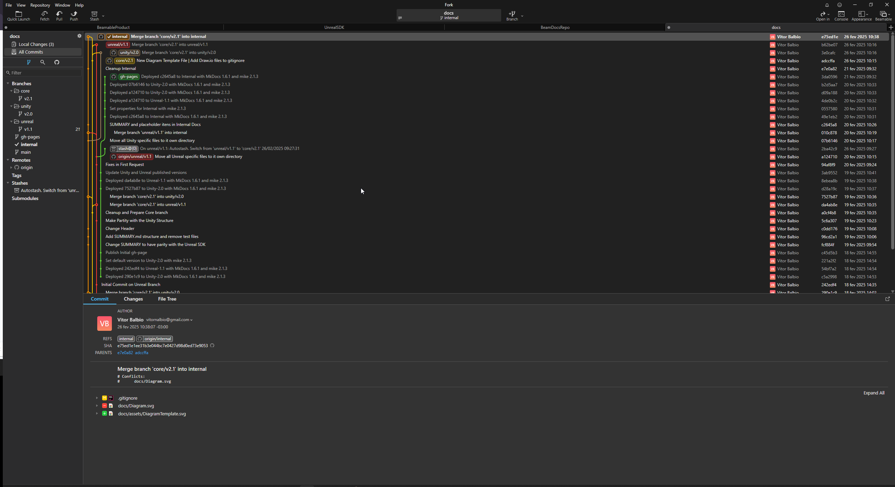

# Documentation Introduction

This documentation is intended to provide a comprehensive guide to the Beamable SDK Documents. It is intended for Beamable employees only. If you are a customer or partner, please refer to the [Public Documentation](https://beamable.github.io/docs/).

Beamable has a unique set of requirements for documentation. These requirements are intended to ensure that the documentation is clear, concise, and easy to understand :

| Requirement          | Description                                                                                                                                                                                               |
|----------------------|-----------------------------------------------------------------------------------------------------------------------------------------------------------------------------------------------------------|
| Integration          | All Information needed for a specific task should be in one place. This means that the documentation should be easy to navigate and search. The documentation should also be easy to read and understand. |
| Context Based        | Mitigate the noise by providing only the information that is needed. This means that the documentation should be concise and to the point. The documentation should also be easy to understand.           |
| Versionated          | We do provide continuous support to multiple versions of our products and each one has it own release cycle. So we need to provide the documentation for each version of the product.                     |
| Low Friction Editing | Documents are as good as we're willing to create/editing/updating those. We need to make sure that the process of creating and updating documents is as easy as possible.                                 |

# Repository Structure

All documentation is consolidated within a single repository and Each iteration of the documentation is preserved in a distinct branch. The repository is divided into three primary branches: Core, Unity, and Unreal. Here is a brief overview of the repository structure:

- The **"Core"** branch encompasses common information, including Beamable concepts and the Command Line Interface (CLI).
- The **"Unity"** and **"Unreal"** branches are extensions of the **"Core"** branch and contain their respective sections.
- The majority of modifications will take place in the most recent branch of each Software Development Kit (SDK).
- Updates to the CLI or Beamable Concepts are incorporated into the Core branch and subsequently need to be merged into the correspondent SDK branches.
- The entire process is managed using Git, which offers a familiar working environment. Developers can efficiently backport or forward fixes, cherry-pick, or merge versions, as all documentation is formatted in Markdown.

# Notes and Standards

1. **Semantic Versioning**: We're using semantic version (X.Y.Z) for our versions but we're ignoring the patch (Z) version. This means that we will have a branch version of the documentation for each Major and Minor release. Any bug fix or patch will be added to the current version of the documentation. This is to avoid having too many branches and versions of the documentation.
2. **Aliases**: We're using the "Unity-Latest" and "Unreal-Latest" as static links to the most recent versions. Use those links when refeering the docs externally.