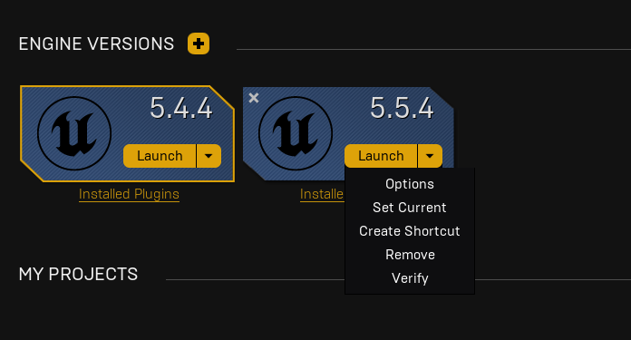
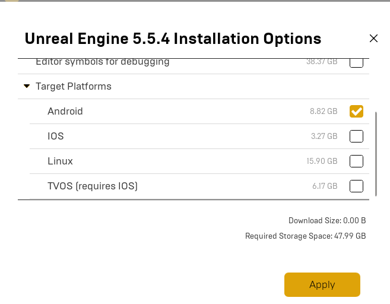
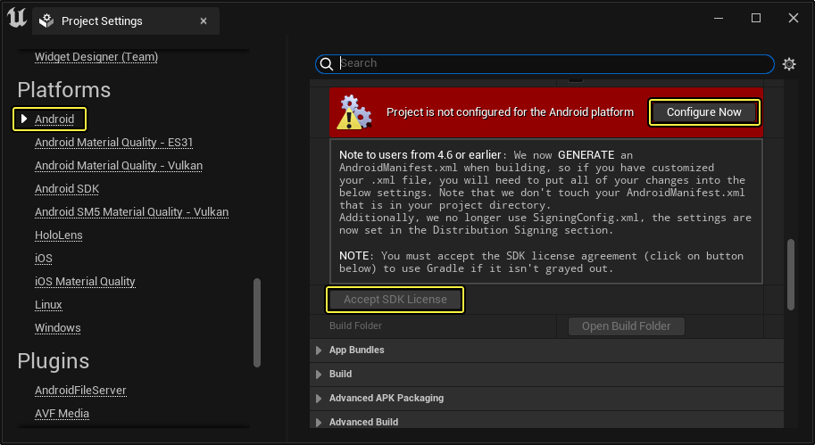
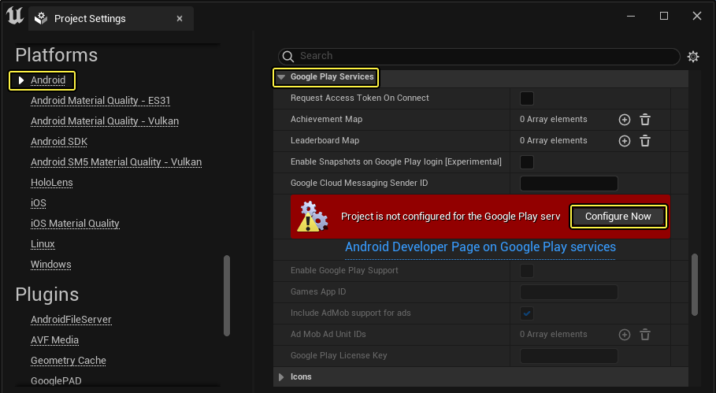
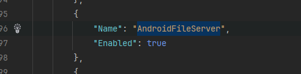

# How to work with Android in the Unreal

This is a guide about how to setup the android build to work with the samples.

## References

There's some complementary information you can find useful in the Unreal documentation.

 - [Android Quick Start](https://dev.epicgames.com/documentation/en-us/unreal-engine/setting-up-unreal-engine-projects-for-android-development)
 - [Setting Up Android SDK and NDK](https://dev.epicgames.com/documentation/en-us/unreal-engine/set-up-android-sdk-ndk-and-android-studio-using-turnkey-for-unreal-engine)
 - [Advanced Android SDK Setup](https://dev.epicgames.com/documentation/en-us/unreal-engine/advanced-setup-and-troubleshooting-guide-for-using-android-sdk)

## Setup Unreal Dependencies

 1. Open the Library in the Epic Launch.
 2. With the unreal installed, expand the menu in the side and open the options. 
 3. After this enable the Android option and wait until it installs.

The images below shows how to handle the steps above. 

|  | 
|:--:| 
| *Epic Unreal Library* |

|  | 
|:--:| 
| *Unreal Options* |

## Run the auto installer for unreal android sdk

 In order to facilitate the setup for Unreal-Android usage we added to the **prepare_repo.sh** a optional parameter that is **--install-mobile-sdk**.

!!! warning

    **You will need to run as a adminitrator in order to run all the processes required to install.**

!!! note

    The **--install-mobile-sdk** basically gets the version of your UProject and run the [Turnkey command](https://dev.epicgames.com/documentation/en-us/unreal-engine/set-up-android-sdk-ndk-and-android-studio-using-turnkey-for-unreal-engine#runturnkeyfromacommandline) from unreal to install everything.

    **Please follow the extra steps in the unreal documentation to have everything ready.**

## First Setup

 As metioned in the reference of the unreal, you will need to fix the issues and setup the information in the Project Settings / Platform / Android.

!!! note

    Make sure to setup your company info before built. 

|  | 
|:--:| 
| *Fix Android Errors* |

|  | 
|:--:| 
| *Fix Android Errors* |

## Unreal UProject plugin

 It will be required to have the **AndroidFileServer** enabled in the plugins in order to every thing to works after the built. This config can be found in the UProject file, or if you need, create it in the plugins zone.

|  | 
|:--:| 
| *File Server Enabled* |

## Build the project 

Once you setup every thing, you can follow the [**Android Development Prerequisites**](https://dev.epicgames.com/documentation/en-us/unreal-engine/setting-up-unreal-engine-projects-for-android-development#1-androiddevelopmentprerequisites) and run in your device.