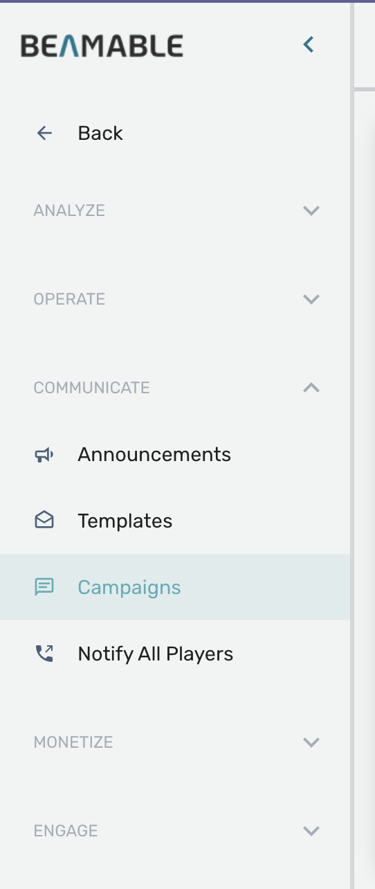
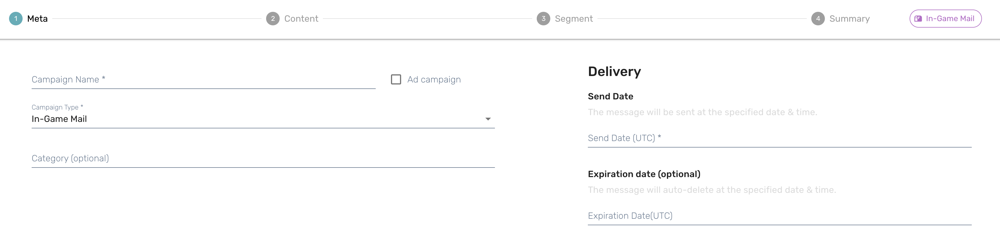
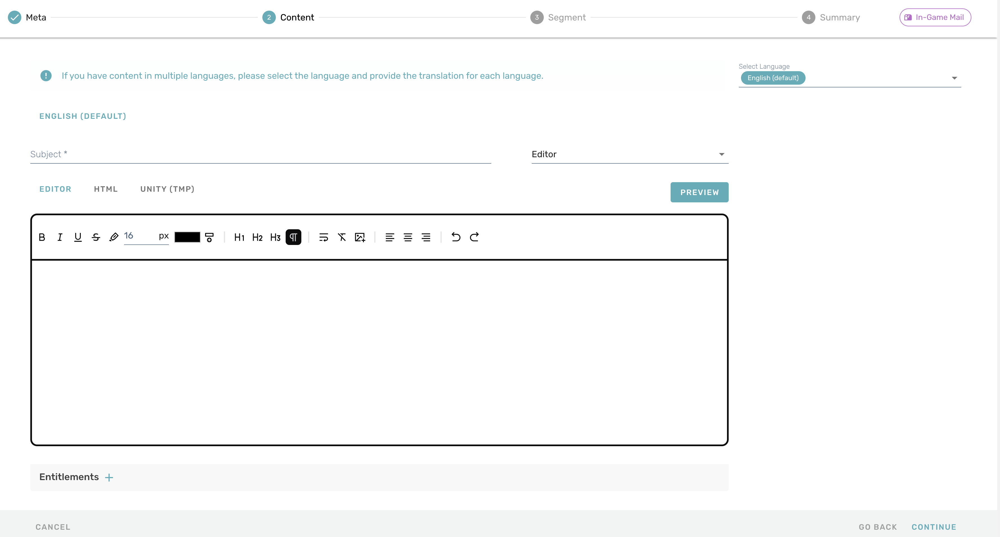
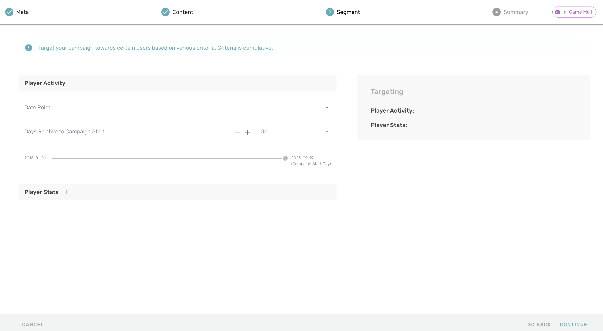

# Campaigns
Beamable's **Campaigns** feature encompasses several ways of sending mass communication to your players. This page aims to describe each of the available campaign types and give a basic understanding of how to send messages to players using each of them.

In brief, the campaign types available are:

- In-game Mail
- Email
- Push Notifications
- Announcements

These options are available when you create a new campaign via the  
Beamable Portal, under **Communicate > Campaigns > + Create Campaign.**

{width="200px"}

After that, you can create campaigns setting some information through a few steps:

- Meta information: This is going to be all the main information about your Campaign. You're going to select which Type the campaign will be, as well as it's name and date.

- Content: The information you want to send to your players, usually just a subject and a description. Depending on the campaing type, you can send this information using many formats, like HTML, Unity TMP, etc.

!!! info "Important"

    In case the campaign is of the In-game mail type, you will have the option to use Entitlements to grant rewards to players. However, Entitlements are a deprecated legacy system. We strongly recommend using Inventory instead, in conjunction with a different delivery mechanism such as Announcements or a custom C# Microservice.

- Segment: In this section you are going to set the conditions required from players to be able to receive your campaign. So if you want to target specific players, you can do it through the use of Players Activities and/or Player Stats.

- Summary: finally there will be a summary of your campaign so you can verify that every information is correct and ready to go.

## Client Implementation

For the client implementation, it's going to depend on which type your campaign is for. All of the following types have  their own implementation and can be triggered by campaigns as well as other means like custom C# microservices.

- **Email and In-game mail**: Follow the mail documentation for more information on how to implement this.
- **Push Notifications**: Follow the Push Notifications documentation for information on how to implement.
- **Announcements**: Follow the Announcements documentation for information on how to implement.
