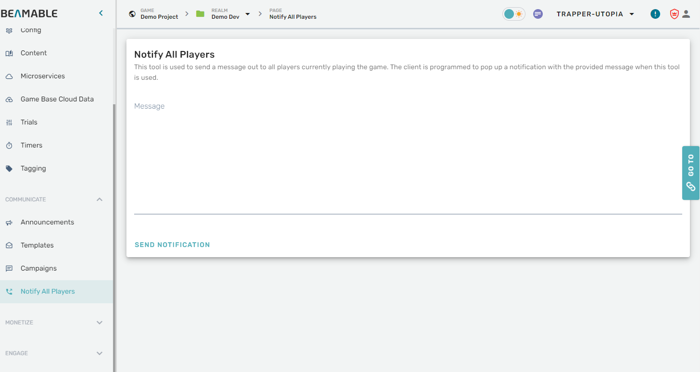

# Notify All Players
To access the Notify All Players feature, navigate to the Communicate section and select "Notify All Players"




Any text put into this field will be sent to the NotificationService and into the DBENGINE.SYSTEM.MSG channel. By subscribing to this channel using the NotificationService, you can receive this message at the game client and display it to players. 

To collect this message and display it in the game client using Unity, use the following code which should go inside a class that inherits from MonoBehavior:

```csharp
private async void Start()  
{  
    var ctx = await BeamContext.Default.Instance;  
    ctx.Api.NotificationService.Subscribe("DBENGINE.SYSTEM.MSG", OnGlobalNotification);  
}

private void OnGlobalNotification(object obj)  
{  
    switch (obj)  
    {  
        case string message:  
            Debug.Log($"Global notification received: {message}");  
            break;  
        default:  
            Debug.Log($"Unknown notification type received. type={obj.GetType()}");  
            break;  
    }  
}
```

For an Unreal code sample, please send your request to [support@beamable.com](mailto:support@beamable.com)

