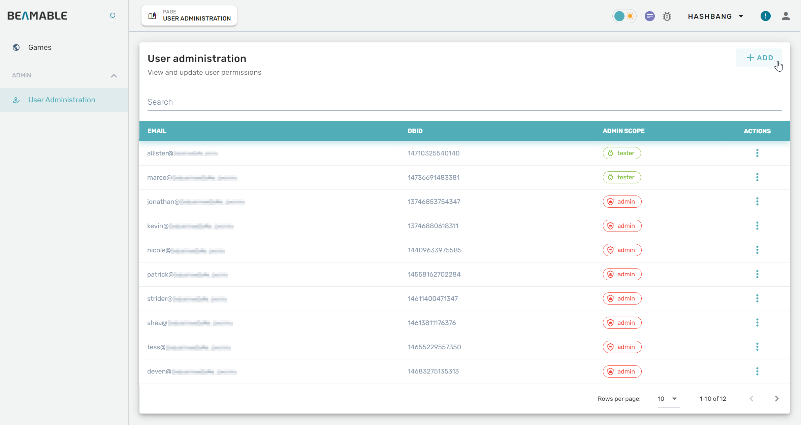
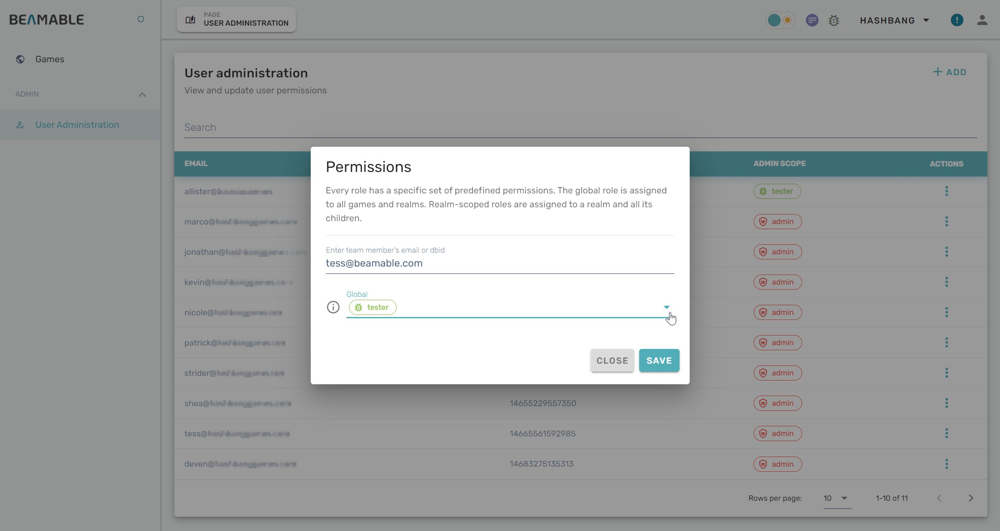
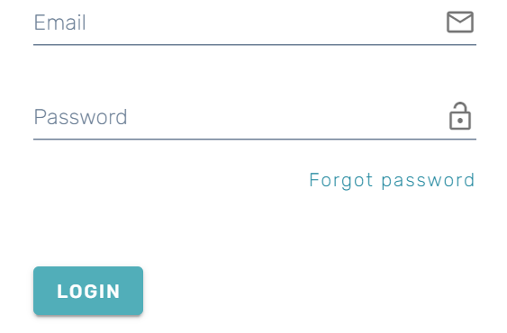
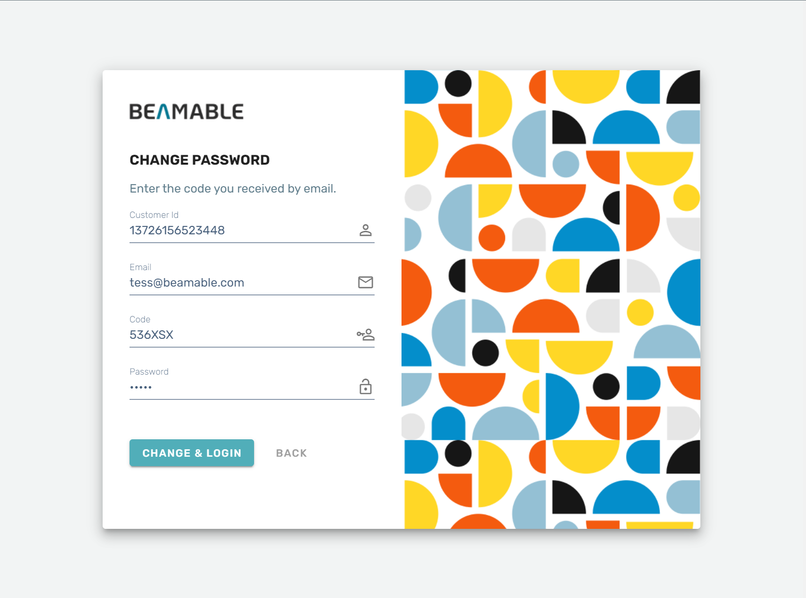

# Adding Developers
Congratulations! You have set up your Beamable account and you are ready for development, but you need to add your fellow developers and testers to the account so that they can make games faster, too! This article aims to walk you through the process of adding another person to your Beamable account.

## Getting Started

For purposes of privacy and security, when you add someone to your account through the Beamable Portal, their account is inaccessible until they choose a password. This happens through the same password reset flow as someone would use if they forgot their password.

### Creating the Account (Team Admin)

First, let's create your teammate's new account:

1. Navigate to [portal.beamable.com/login/](https://portal.beamable.com/login/) and login using the customer ID, email, and password with which you registered your project.


2. Click to expand the _Admin_ section in the navigation panel and click the _User Administration_ link.

The "User Administration" page features a list of all of the admins, developers, and testers on your project.



3. Click the _+ ADD_ link located at the top right of the user list.

4. In the "Permissions" menu that pops up, type in the email address of the teammate you intend to add.

5. Choose a role for from the drop down list to define the global permissions to grant to your teammate. 
   [User permissions can be changed](portal-granting-realm-scoped-developer-permissions.md) later.

6. Click _save_ to register an account for your teammate. They will receive an auto-generated email with login instructions.



### Setting Your Password (New Teammate)

Next, your teammate should follow these steps to proceed through the password reset process:

1. Navigate to [portal.beamable.com/login/](https://portal.beamable.com/login/) and enter your organization's CID. 
   1. _If you do not have your CID or forgotten it, please request your CID from [support@beamable.com](mailto:support@beamable.com)._

2. Click the _Forgot Password_ link at the bottom of the login screen.




3. Enter your email address and press _Send Code_. An email with a reset code will be sent to the address entered. Each reset code is valid for 1 hour. A fresh reset code will be required if the "Change Password" is closed. 

4. Retrieve the reset code from that email and navigate back to the "Change Password" page. 



5. Click _Change & Login_ to proceed to your organization's dashboard. The projects, page links, and other content that you will have access to are determined by the permissions your organization admin granted you.

6. Go forth and make great games, as a team!

### Finding your CID

To get your customer ID (CID), look for _config-defaults.txt_ in your project. The shell snippet below illustrates how to get it from the command line if you are on MacOS.

```text
   % find . -name config-defaults.txt
   ./Assets/Beamable/Resources/config-defaults.txt
   % grep cid ./Assets/Beamable/Resources/config-defaults.txt
       "cid": "1320644969098300",
   ```
You can also email us at [support@beamable.com](mailto:support@beamable.com) with the email you used to register and we can look it up for you.

