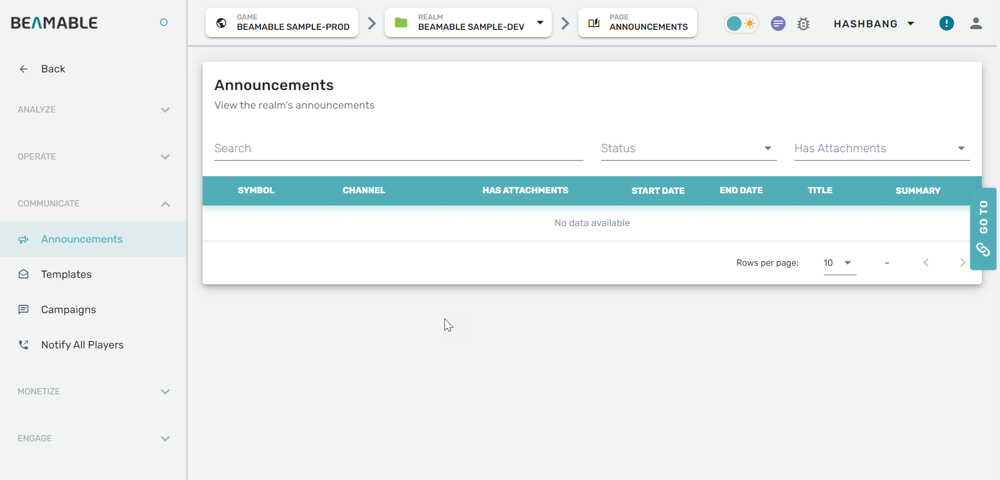

# Announcements

This page provides access to the Announcements Feature within the Portal Tool Window.

## Getting Started

Follow these steps to access and configure Announcements:

| Step                      | Detail                                   |
| :------------------------ | :--------------------------------------- |
| 1. Open the Portal        | • See Portal documentation for more info |
| 2. Navigate via sidebar   | • Click "Announcements"                  |
| 3. Configure the settings | • Enjoy!                                 |

## Game Maker User Experience

The Portal Announcements interface provides comprehensive management of in-game announcements.

