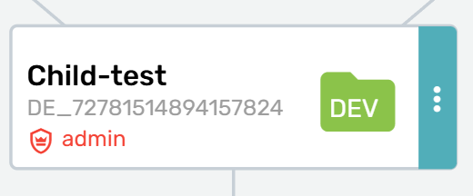
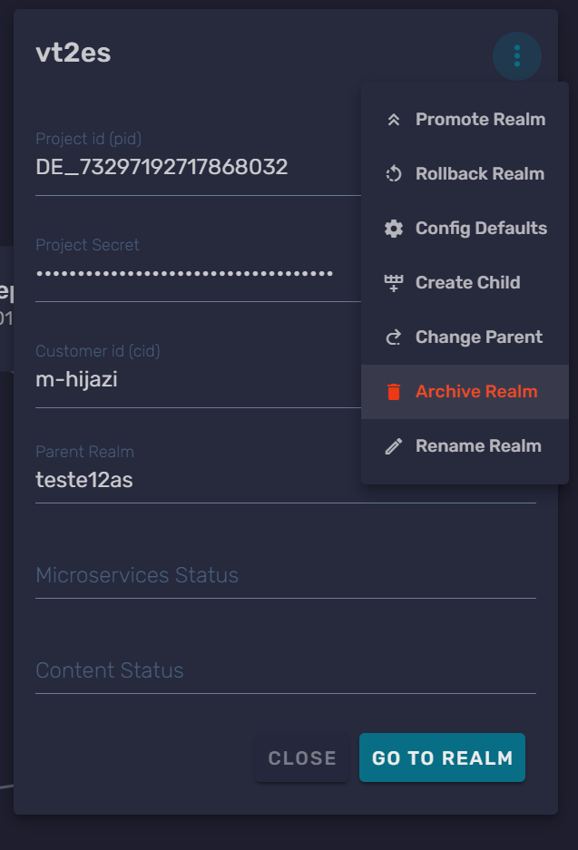
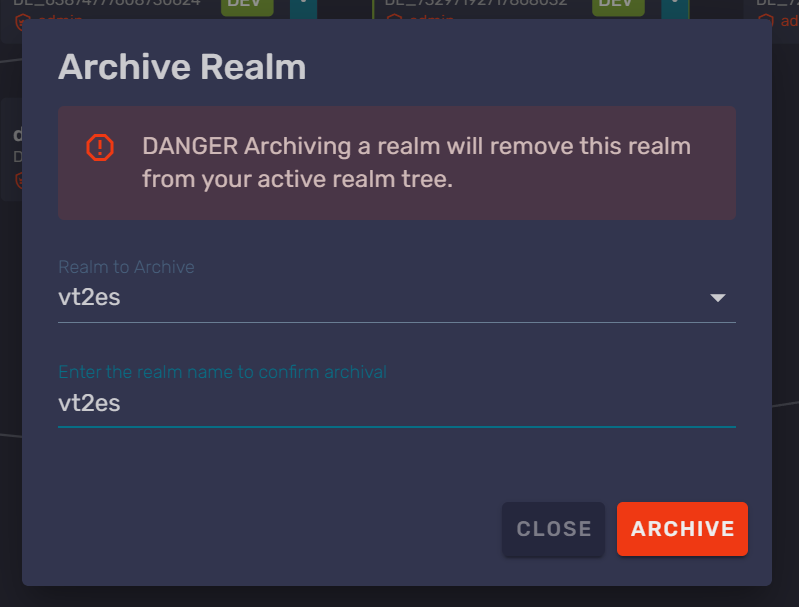
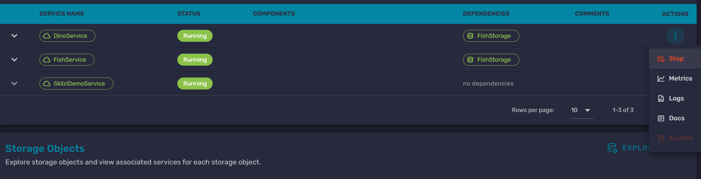

# Archiving realms

Archiving a realm removes it from the active realm hierarchy for a game in the Beamable Portal. Use this workflow when you need to retire a game environment that your team no longer uses

Only admins can archive realms. Developers and testers can log into Portal, but they cannot complete this action

**!!! warning "Archive child realms first"*

    Archive realms from the visual top of the hierarchy display down toward the production realm. This usually means starting with the `-dev` realm, unless your game has additional child realms above it in the hierarchy

## Archive a realm

1. Log into [Portal](https://portal.beamable.com/)

2. Open the _Games_ view

3. Find the realm you want to archive in the realm hierarchy

4. In the Cyan-Teal area of the realm card, click the Ellipsis (three-dot) menu

5. Open the realm card menu

6. In the upper-right corner of the realm card, click the three-dot menu

7. Select _Archive Realm_

8. Type the realm name exactly as Portal instructs

9. Click _Archive_

## Stop running Microservices

You cannot archive a realm while it has running Microservices. If _Archive Realm_ is disabled and Portal shows a message that the realm has Microservices running, stop those services before you archive the realm

1. Enter the realm you want to archive

2. Go to _Operate_ > _Microservices_

3. Find a running Microservice and click its three-dot menu

4. Select the stop option for that Microservice

5. Wait until Portal marks the Microservice as stopped

6. Repeat this process for each running Microservice in the realm

After all Microservices in the realm are stopped, return to the realm card and archive the realm

**!!! tip "Stop services one at a time"*

    Wait until each Microservice is marked as stopped before stopping the next one. This keeps the Portal state clear and makes the archive flow smoother

## Archive a game's realm hierarchy

To archive a full game hierarchy, repeat the archive workflow for each realm. Start at the visual top of the hierarchy display and move downward until you reach the production realm

Although Beamable teams often describe development realms as "lower" environments, the Portal hierarchy displays them visually above production. In practice, archive from the least important child realm toward the most important parent realm. The usual order is:

1. Development realm, such as `-dev`

2. Staging or QA realms

3. Production realm

The production realm's _Archive_ button may appear grayed out. You can still click it after the child realms have been archived

**!!! note "If you cannot archive a realm"*

    Confirm that your account has the admin role for the game. If you have a developer or tester role, Portal will not let you archive realms

