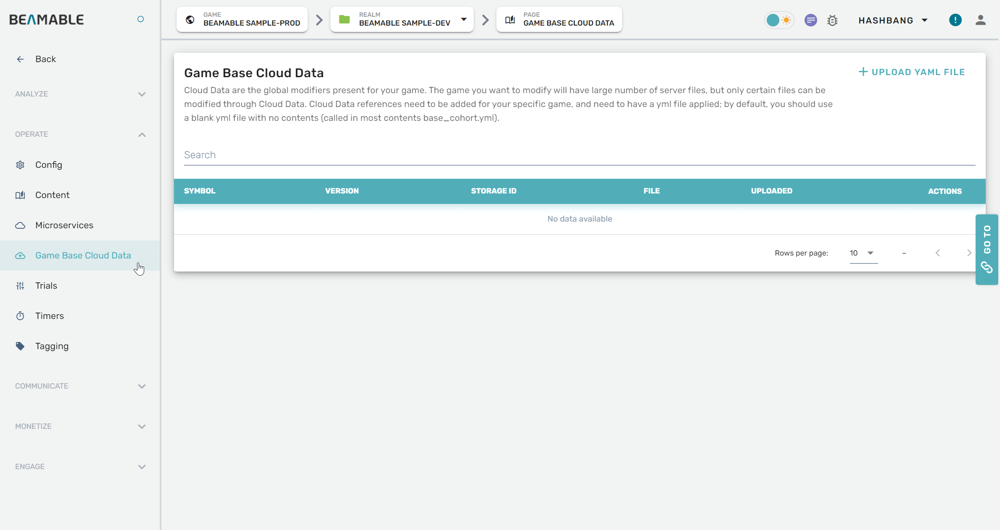
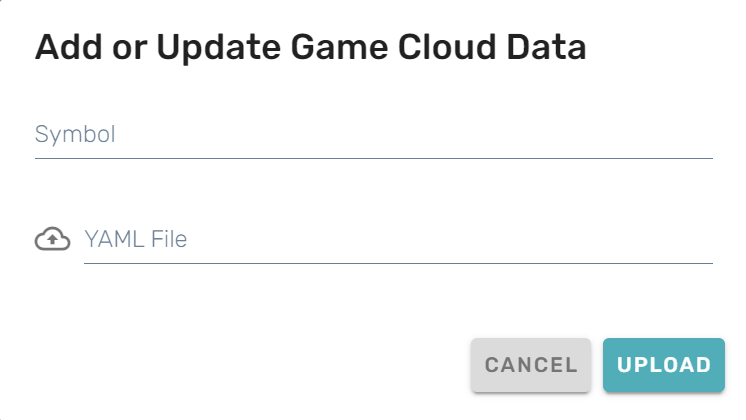

# Cloud Data

## Overview

The Cloud Save feature allows you to manage and configure cloud data storage for your game through the Portal.

## Steps

Follow these steps to configure cloud data settings:

| Step                                       | Detail                                   |
| :----------------------------------------- | :--------------------------------------- |
| 1. Open the Portal                         | • See Portal documentation for more info |
| 2. Expand "Operate" section on the sidebar | • Click "Game Base Cloud Data"           |
| 3. Configure the settings                  | • Enjoy!                                 |

## Game Maker User Experience

The following screenshots show the cloud data configuration interface: 

