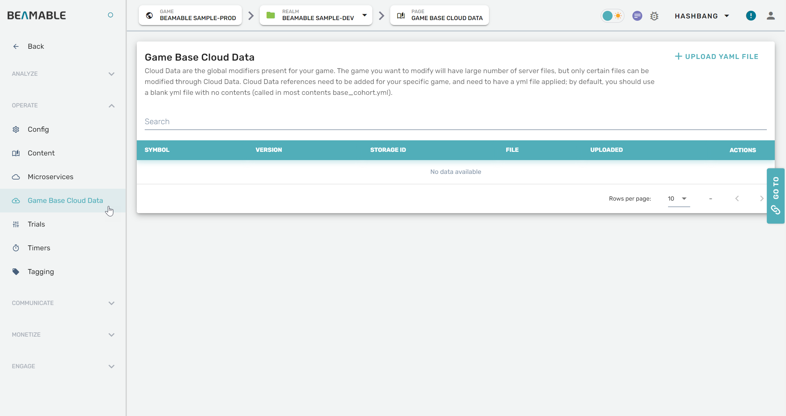
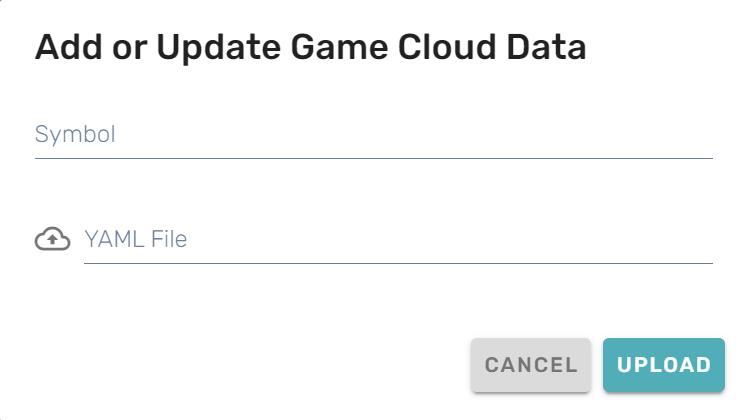

# Cloud data

The Cloud Save feature allows you to manage and configure cloud data storage for your game through the Portal.

## Getting started

Follow these steps to configure cloud data settings:

| Step                                       | Detail                                   |
| :----------------------------------------- | :--------------------------------------- |
| 1. Open the Portal                         | • See Portal documentation for more info |
| 2. Expand "Operate" section on the sidebar | • Click "Game Base Cloud Data"           |
| 3. Configure the settings                  | • Enjoy!                                 |

## Game Maker user experience

The following screenshots show the cloud data configuration interface:

{width="300px"}

