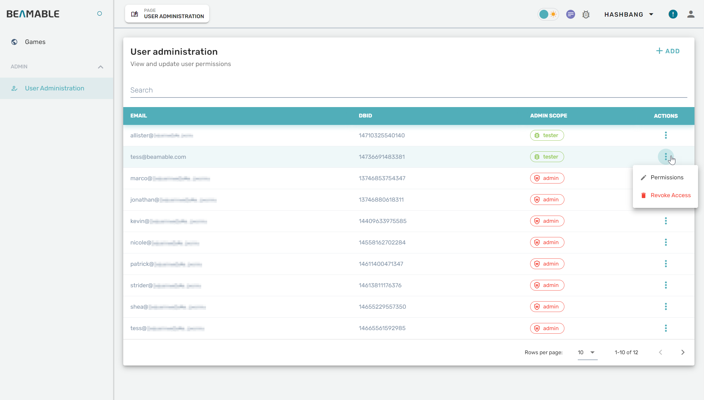
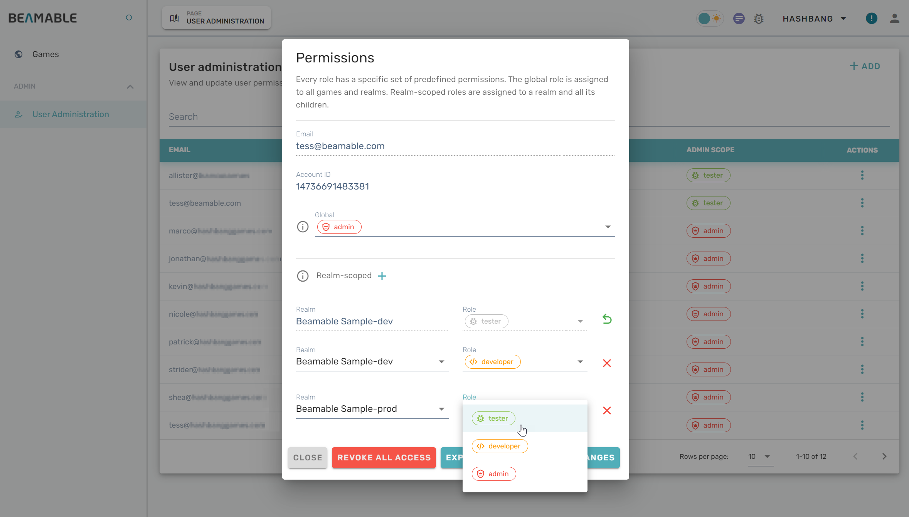

# Granting Developer Permissions
When your Beamable account contains multiple games, you may wish to allow different teammates different access levels depending on which game they are working on. This article shows how to set up realm-scoped permissions.

## Getting Started

This guide assumes there is already an account for the person whose access you are changing. If they need a new account, follow the instructions in [Portal / Adding Developers](portal-adding-beamable-developers.md) first. 

1. Navigate to [beta-portal.beamable.com/login/](https://beta-portal.beamable.com/login/) and login using the customer ID, email, and password with which you registered your project.


2. Click to expand the _Admin_ section in the navigation panel and click the _User Administration_ link.

3. Scroll through the list of team members or use the search field to find the teammate whose permissions you intend to change.



4. Press the vertical ellipsis at the end of the teammate's row in the table. This will open a dialog that allows you to edit account permissions.




5. Select a role to apply it and grant its permissions to the teammate's account.

6. To set up permissions specific to a game realm, click on _Realm-scoped +_ to open additional fields. Use them to grant a role within a specific realm.  
   (**NOTE:** Existing realm-scoped permissions cannot be changed; click the red X to remove a permission. Click the green arrow to undelete a realm-scoped role.)

!!! info "Basic Roles and Permissions"

    Beamable's API (and thus also the admin Portal) currently has 4 levels of privilege for any given account. Lowest to highest they are:

    0. no role     -  No permissions. Most players are at this level.
    1. `tester`    -  Mostly read-only permissions (with some exceptions).
    2. `developer` -  Mostly read-write but not able to manage users or team.
    3. `admin`     -  All access everywhere. Lots of power!

7. Click the _Preview Changes_ button on the bottom right of the menu. Review your changes and click _save_ to submit the updates. Changes will take effect only once the action indicators stop spinning and the "Permissions" menu is refreshed.

!!! info "Notes about Realm-Scoped Permissions"

    - If somebody's Global role is higher than their Realm-scoped role, the Global role will take precedence.
    - Realm-scoped roles propagate through the Realm hierarchy. Using a Prod→Staging→Dev setup as an example, if my Global role is "tester" and my team lead set me as a "developer" in staging and an "admin" in dev, then:
        - In `Example-prod`, I only have tester permissions, because of my Global role.
        - In `Example-staging`, I have developer permissions, because of my Realm-scoped role there.
        - In `Example-dev`, I have administrative permissions, because of my Realm-scoped role there.
        - Additionally, if any of my colleagues make a new child realm under `Example-dev`, I will be an admin there as well.
        - Likewise, if someone makes a child realm under `Example-staging` (that is, a sibling of dev), I will have developer permissions there.

!!! info "TIP: Finding your CID"

    To get your customer ID (CID), look for _config-defaults.txt_ in your project. The shell snippet below illustrates how to get it from the command line if you are on MacOS.

    ```text
    % find . -name config-defaults.txt
    ./Assets/Beamable/Resources/config-defaults.txt
    % grep cid ./Assets/Beamable/Resources/config-defaults.txt
        "cid": "1320644969098300",
    ```
