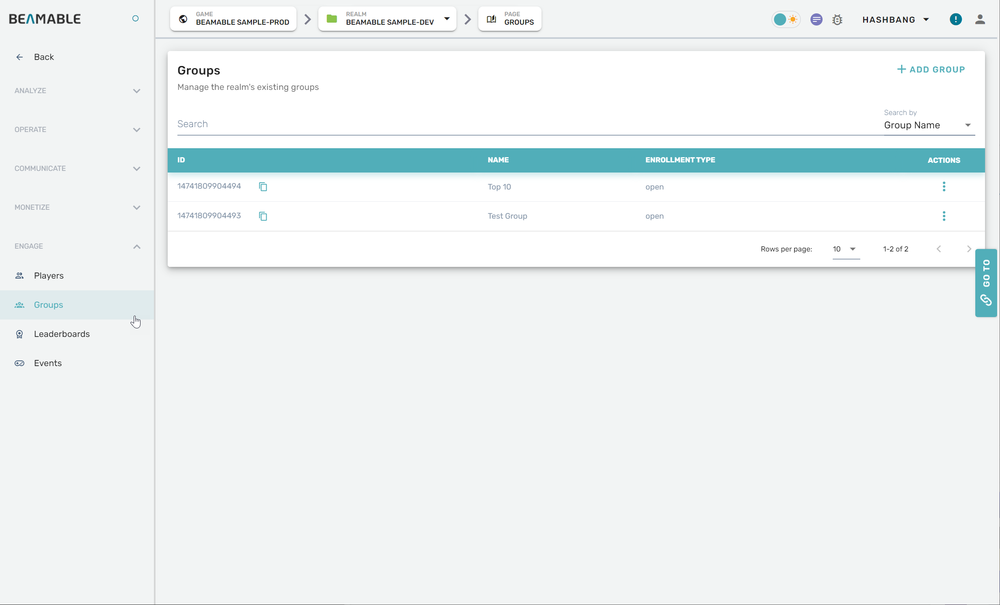

# Groups

## Overview

The Groups feature allows you to organize and manage player groups through the Portal.

## Steps

Follow these steps to configure Groups settings:

| Step                                      | Detail                                   |
| :---------------------------------------- | :--------------------------------------- |
| 1. Open the Portal                        | • See Portal documentation for more info |
| 2. Expand "Engage" section on the sidebar | • Click "Groups"                         |
| 3. Configure the settings                 | • Enjoy!                                 |

## Game Maker User Experience

The following screenshot shows the Groups management interface: 

