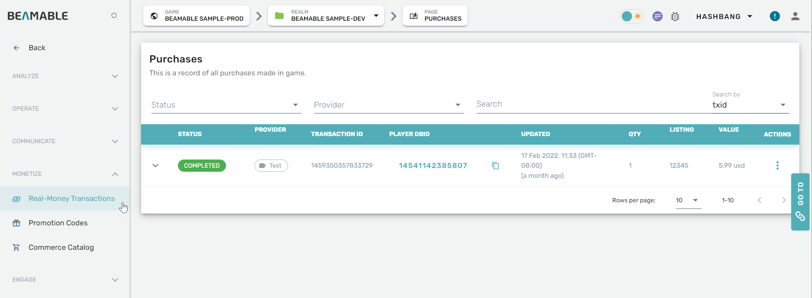

# In-App Purchases

## Overview

The Store feature's In-App Purchases can be managed and configured through the Portal.

## Steps

Follow these steps to configure In-App Purchases settings:

| Step                                        | Detail                                   |
| :------------------------------------------ | :--------------------------------------- |
| 1. Open the Portal                          | • See Portal documentation for more info |
| 2. Expand "Monetize" section on the sidebar | • Click "Real-Money Transactions"        |
| 3. Configure the settings                   | • Enjoy!                                 |

## Game Maker User Experience

The following screenshot shows the In-App Purchases management interface: 

