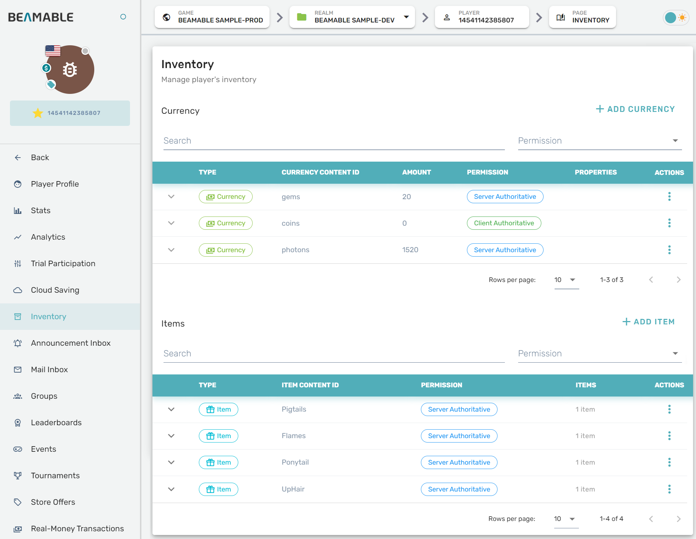
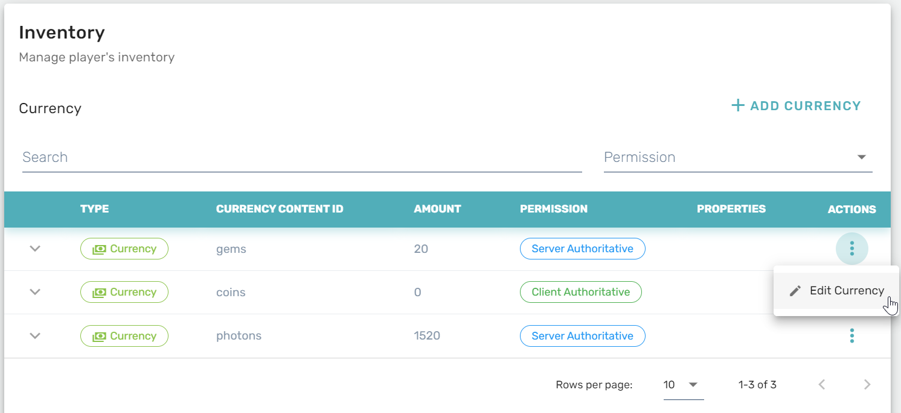
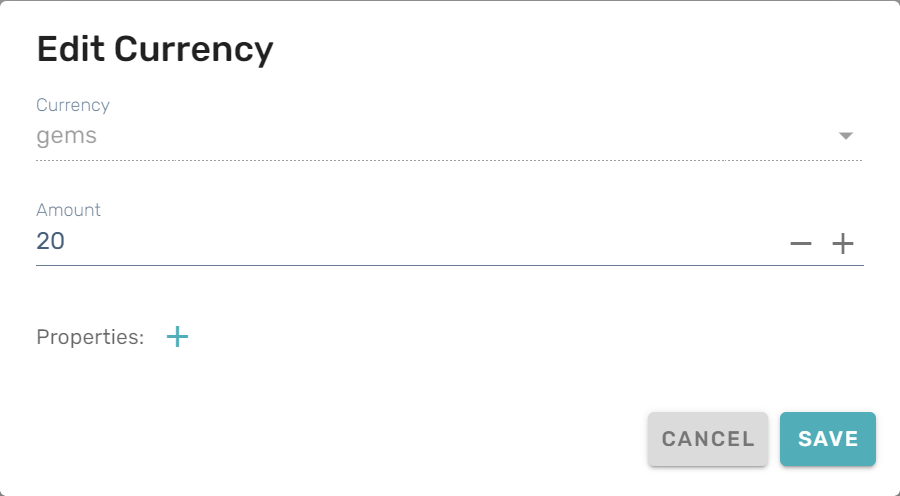
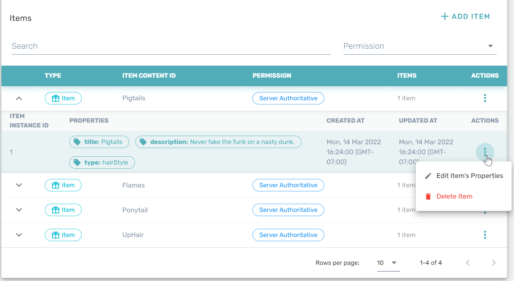
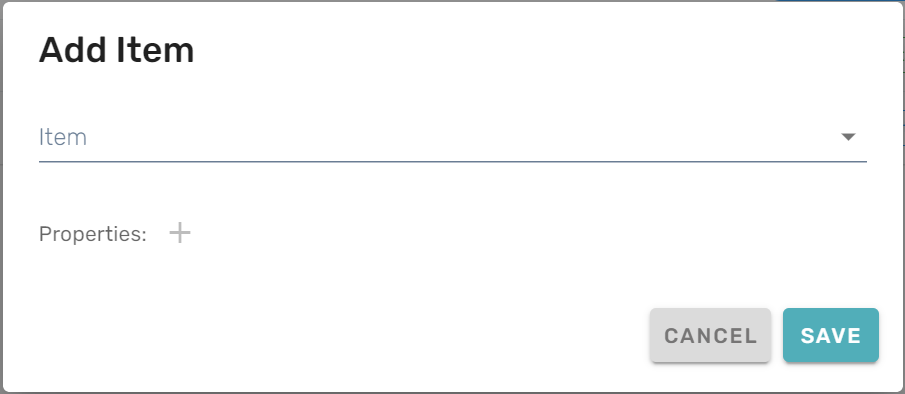

# Inventory

The Inventory feature can be managed from the Portal.

## Getting Started

Follow these steps to manage player inventory: 

| Step                                      | Detail                                                |
| :---------------------------------------- | :---------------------------------------------------- |
| 1. Open the Portal                        | • See [Portal](doc:portal) for more info              |
| 2. Expand "Engage" section on the sidebar | • Click "Players"                                     |
| 3. Navigate to a player's profile page    | • Scroll the list or search by playerId, device, etc. |
| 4. Open the player's Inventory page       | • Click "Inventory" on the navigation panel           |
| 5. Configure the settings                 | • Enjoy!                                              |

## Game Maker User Experience

The inventory management interface allows you to view and modify player inventories:

## Modifying User Currency

In the **Currency** section, you can configure how much currency a player has by using the _add currency_ button or by opening the "Edit Currency" menu from the vertical elipses at the end of a currency's row. 

{width="400px"}

## Modifying User Inventory

In the **Items** section, you manage the items in a player's inventory. Click the _add item_ button to grant an item by selecting it from the "Add Item" menu that will pop up. To remove items from a player's inventory, expand an item's details and click _Delete Item_ from the vertical elipses.

{width="400px"}
