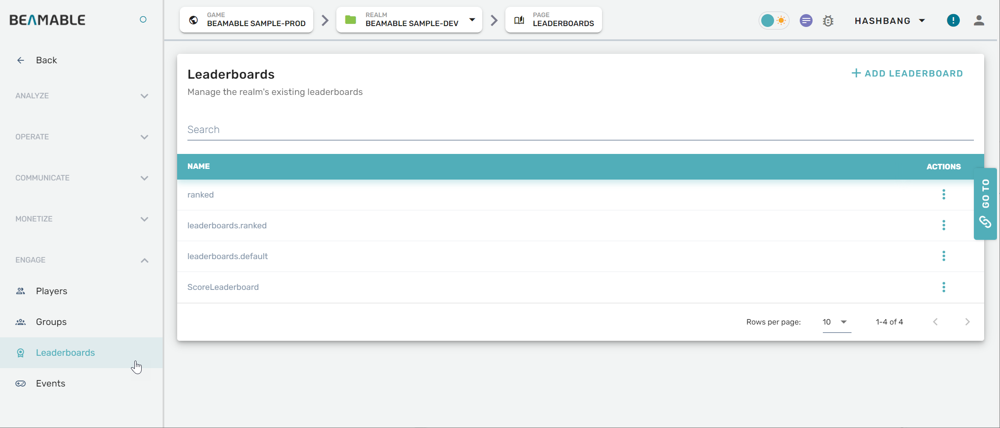
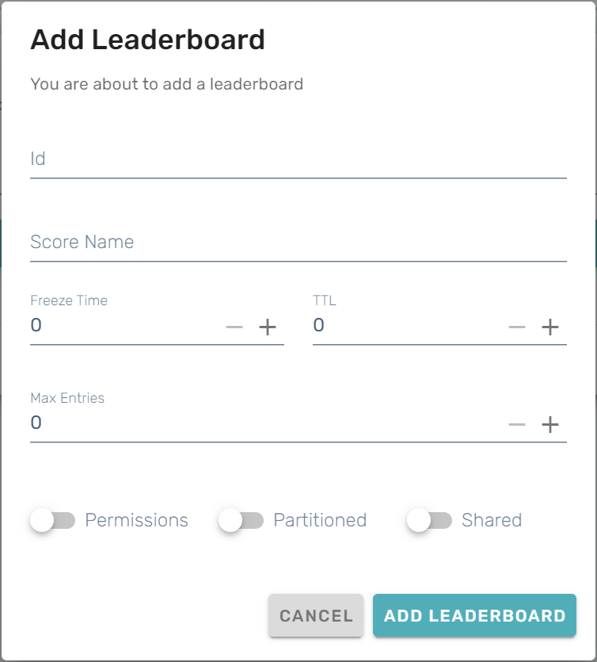

# Leaderboards

## Overview

The Leaderboards feature can be managed from the Portal.

## Steps

Follow these steps to manage leaderboards: 

| Step                                      | Detail                                   |
| :---------------------------------------- | :--------------------------------------- |
| 1. Open the Portal                        | • See [Portal](doc:portal) for more info |
| 2. Expand "Engage" section on the sidebar | • Click "Leaderboards"                   |
| 3. Configure the settings                 | • Enjoy!                                 |

## Game Maker User Experience

The leaderboards management interface allows you to view and configure leaderboard settings:

