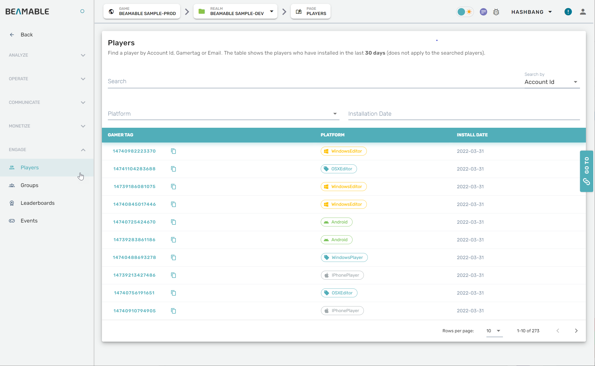
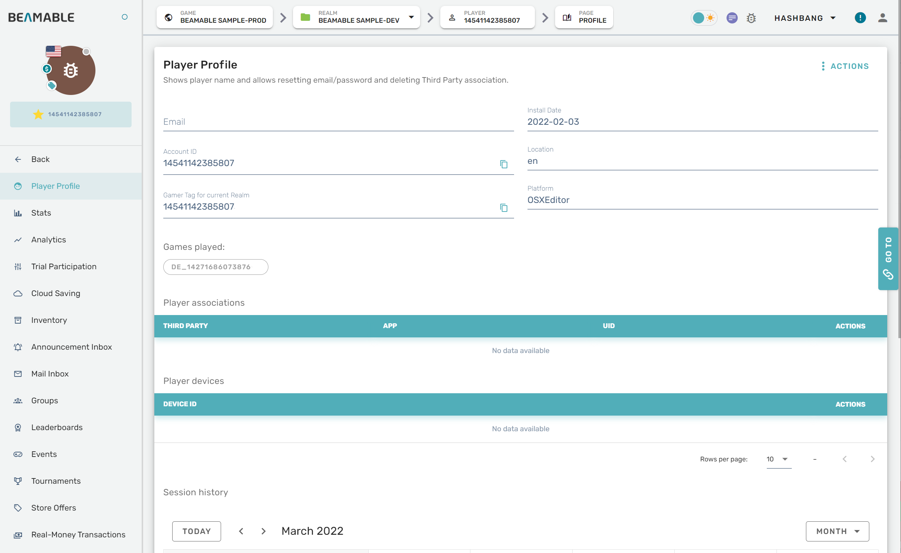
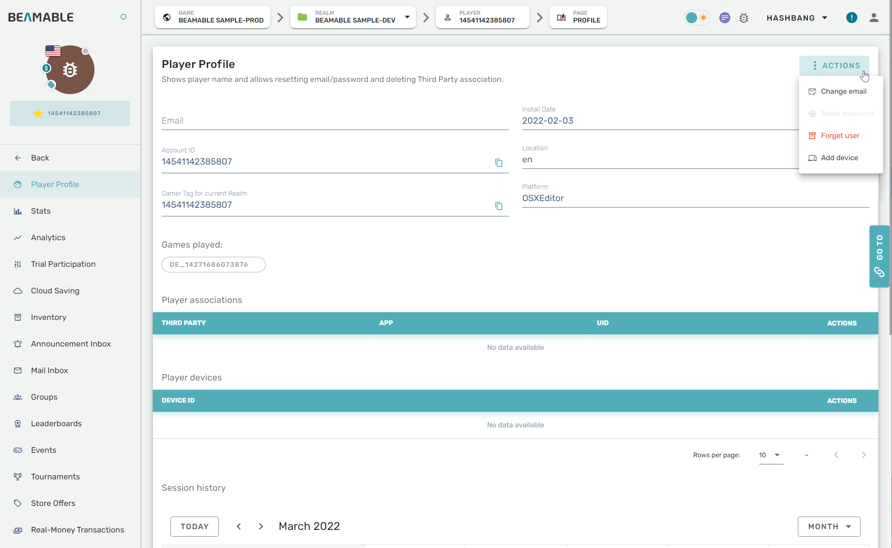

# Players

## Overview

The Admin feature's **Players** section can be managed from the Portal.

## Steps

Follow these steps to manage players: 

| Step                                          | Detail                                   |
| :-------------------------------------------- | :--------------------------------------- |
| 1. Open the Portal                            | • See [Portal](doc:portal) for more info |
| 2. Expand the "Engage" section on the sidebar | • Click "Players"                        |
| 3. Configure the settings                     | • Enjoy!                                 |

## Game Maker User Experience

The players management interface allows you to view and manage player accounts:

