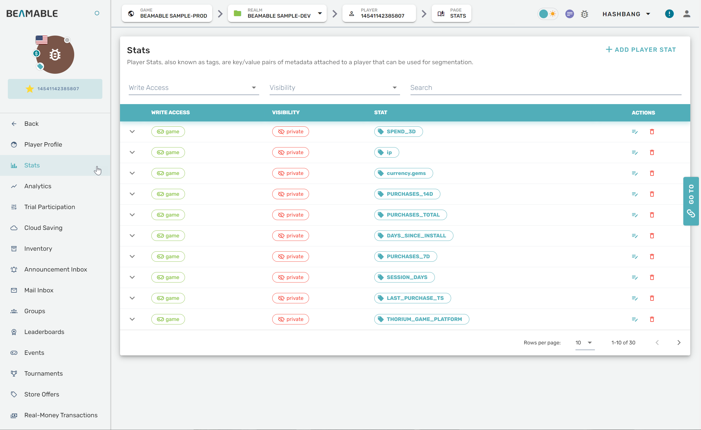
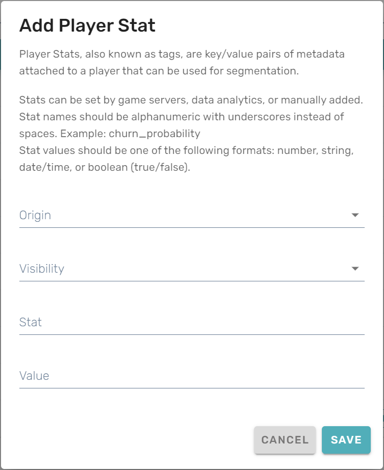

# Stats

## Overview

The Analytics feature's **Stats** section can be managed from the Portal.

## Steps

Follow these steps to manage player stats: 

| Step                                      | Detail                                                |
| :---------------------------------------- | :---------------------------------------------------- |
| 1. Open the Portal                        | • See [Portal](doc:portal) for more info              |
| 2. Expand "Engage" section on the sidebar | • Click "Players"                                     |
| 3. Navigate to a player's profile page    | • Scroll the list or search by playerId, device, etc. |
| 4. Open the player's "Stats" page         | • Click "Stats" on the navigation panel               |
| 3. Configure the settings                 | • Enjoy!                                              |

## Game Maker User Experience

The stats management interface allows you to view and modify player statistics:

