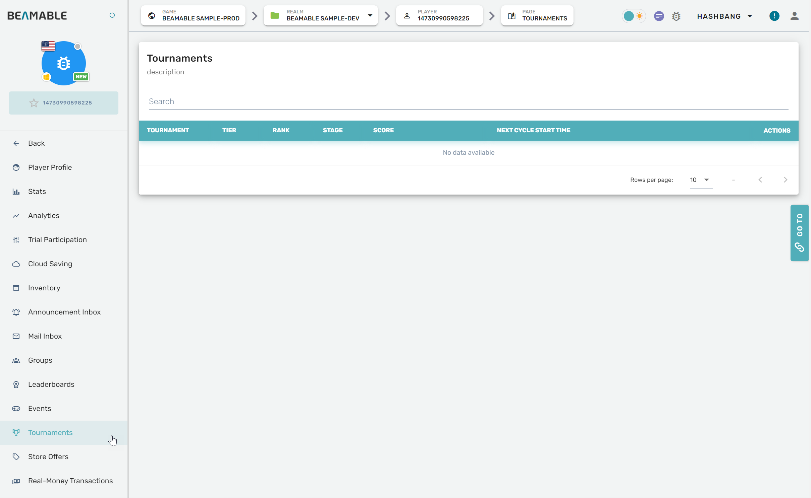

# Tournaments

## Overview

The Tournaments feature can be managed from the Portal.

## Steps

Follow these steps to manage player tournaments: 

| Step                                      | Detail                                                |
| :---------------------------------------- | :---------------------------------------------------- |
| 1. Open the Portal                        | • See [Portal](doc:portal) for more info              |
| 2. Expand "Engage" section on the sidebar | • Click "Players"                                     |
| 3. Navigate to a player's profile page    | • Scroll the list or search by playerId, device, etc. |
| 4. Open the player's Tournaments page     | • Click "Tournaments" on the navigation panel         |
| 5. Configure the settings                 | • Enjoy!                                              |

## Game Maker User Experience

The tournaments management interface allows you to view and manage player tournament participation:

