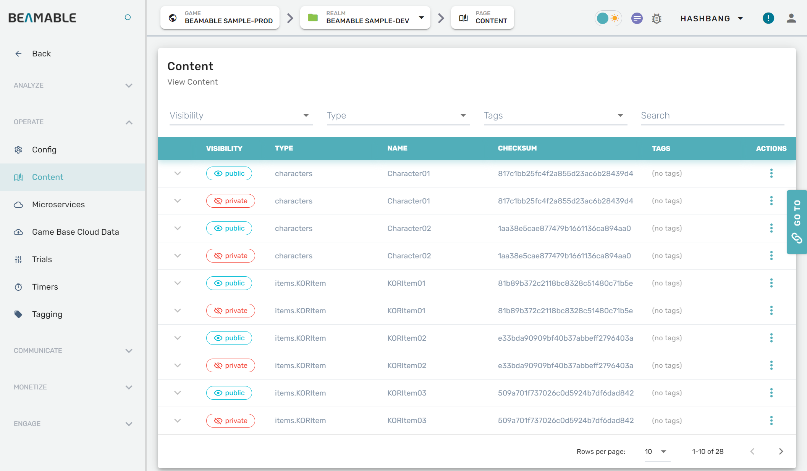
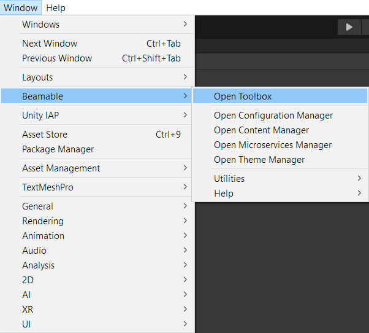
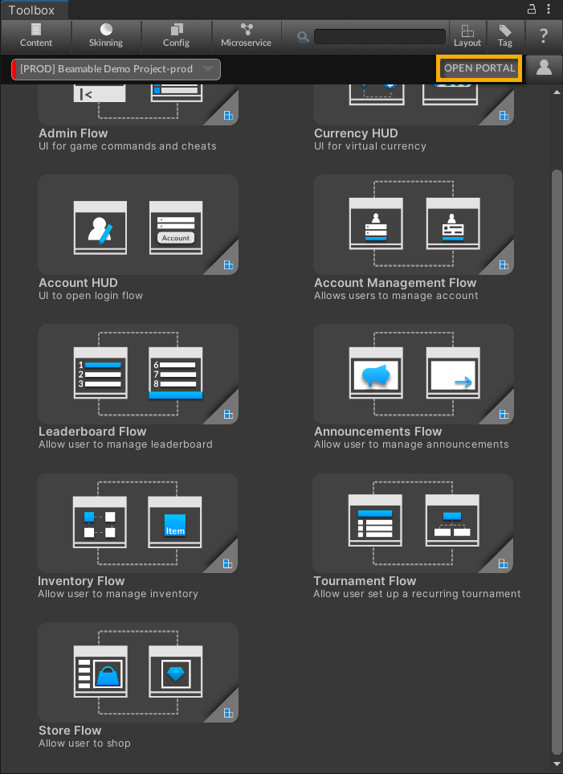

# Portal - Overview

The Beamable LiveOps Portal is where you conduct all tasks to orchestrate and operate your game, interact with game-level or player-level data, and perform DevOps tasks like content promotions, realm, and account creation. 

## The User Interface

Here is the user interface of the Beamable "Portal" tool window.

## Beamable High-Level Data Concepts

The Portal provides access to manage all aspects of your game's data architecture and player interactions.

## Steps

The Portal is available in your favorite web-browser at [https://beta-portal.beamable.com](https://beta-portal.beamable.com).

| Step                         | Detail                                              |
| :--------------------------- | :-------------------------------------------------- |
| 1. Open the "Toolbox" Window | •	Unity → Window → Beamable → Open Beamable Toolbox |
| 2. Open the "Portal" Window  | •	Click the "Open Portal" Button                    |

Here is the "Open Portal" Button.

