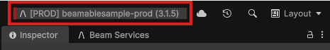
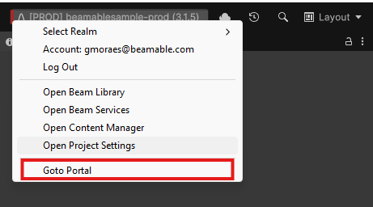

# Portal - Overview

The Beamable LiveOps Portal is where you conduct all tasks to orchestrate and operate your game, interact with game-level or player-level data, and perform DevOps tasks like content promotions, realm, and account creation. 

## The User Interface

Here is the user interface of the Beamable "Portal" tool window.

{width="800px"}

## Beamable High-Level Data Concepts

The Portal provides access to manage all aspects of your game's data architecture and player interactions.

## Steps

The Portal is available in your favorite web-browser at [https://portal.beamable.com/](https://portal.beamable.com/)

| Step                               | Screenshot                                        |
|:-----------------------------------|:--------------------------------------------------|
| 1. Click the "Toolbox" Widget      |  |
| 2. Click the "Goto Portal" Option  |        |

