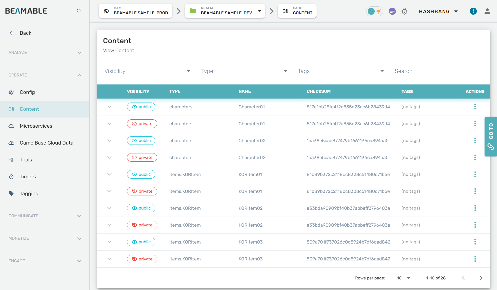
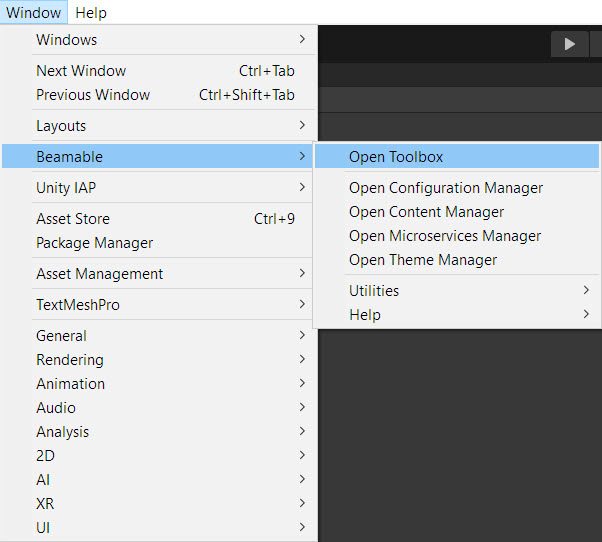
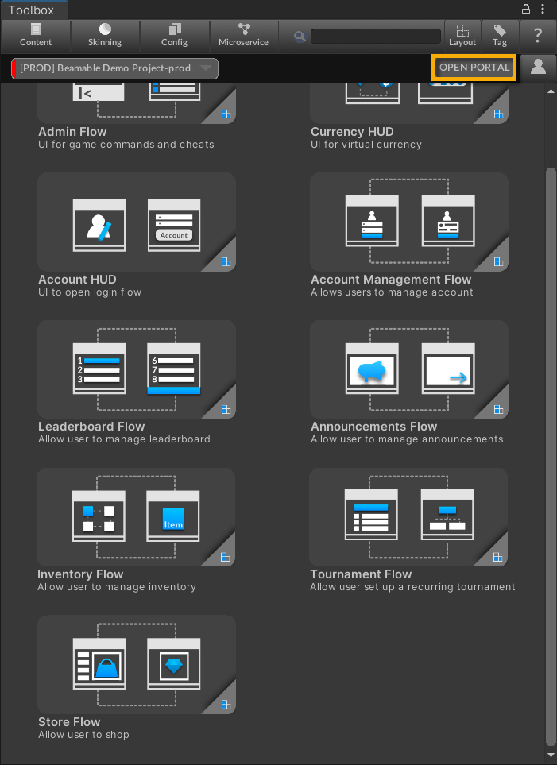

# Portal - overview

The Beamable LiveOps Portal is where you conduct all tasks to orchestrate and operate your game, interact with game-level or player-level data, and perform DevOps tasks like content promotions, realm, and account creation.

## The user interface

Here is the user interface of the Beamable "Portal" tool window.

{width="800px"}

## Beamable high-level data concepts

The Beamable Portal provides access to manage all aspects of your game's data architecture and player interactions.

## Steps

The Beamable Portal is available in your favorite web-browser at [https://portal.beamable.com/](https://portal.beamable.com/).{width="300px"}

| Step                         | Detail                                              |
| :--------------------------- | :-------------------------------------------------- |
| 1. Open the "Toolbox" Window | •	Unity → Window → Beamable → Open Beamable Toolbox |
| 2. Open the "Portal" Window  | •	Click the "Open Portal" Button                    |

{width="400px"}

Here is the "Open Portal" Button.

{width="600px"}

