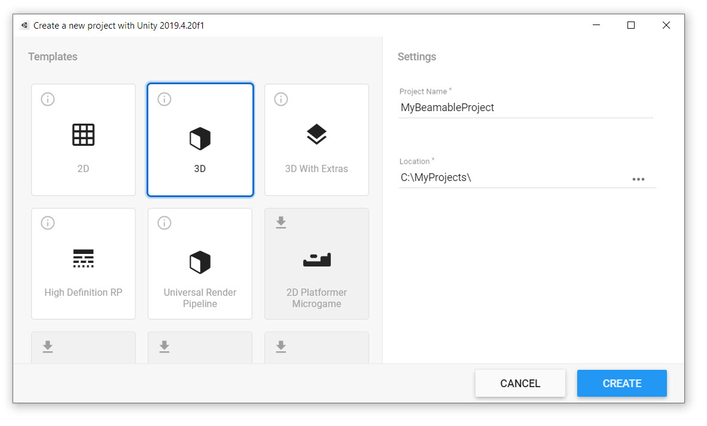

# Installing Beamable (Unity)

## 1. Setup Unity

Create or open a Unity Project. For new projects, populate the Project Name, Location, and Template in the Unity "Hub" Window. 

Press the "Create" button to continue.

!!! info "Compatibility"

    • Beamable supports Unity versions 2021.3 to 2023.3 and is compatible with all template types  
    • Beamable supports Windows, Mac, iOS, Android, and WebGL platforms

## 2. Setup Licensing

A Beamable license is required before completing the setup process below. Beamable cannot be downloaded, installed, or used without a license.

!!! warning "License Required"

    • Sign up for Beamable today by [choosing a plan](https://www.beamable.com/pricing)! You can also [contact us](https://www.beamable.com/contact-us) if you have any questions  
    • License confirmation includes the **[Beamable SDK Installer Package](https://packages.beamable.com/com.beamable/Beamable_SDK_Installer.unitypackage)** file required for Step 3 below

## 3. Setup Beamable

Now use the **[Beamable SDK Installer Package](https://packages.beamable.com/com.beamable/Beamable_SDK_Installer.unitypackage)** file to install the Beamable SDK.

| Step | Detail |
|------|--------|
| 1. Import the **Beamable SDK Installer Package** |  • Unity → Assets → Import Package → Custom Package |
| 2. Verify the import |  • Press the "Import" button |
| 3. Install the **Beamable SDK** |  • Click to continue |
| 4. Remove the **Beamable SDK Installer Package** |  • Click to continue *Note: Now that the installation process is complete, the installer package is no longer needed.* |

Congratulations the Beamable SDK is now installed!

!!! info "Dotnet Required"

    Starting with the Unity 2.1.0 SDK, Beamable requires that you have dotnet 8.0.302 installed on your machine. If you don't, the Beamable SDK will offer a download option for you, and once you've finished installing it, you can continue through the dialog.

## Usage

Open the Beamable Toolbox Window by clicking the Beamable button in the Unity toolbar.

Now see the Beamable Login Window prompts for user account registration.

| Field | Detail |
|-------|--------|
| Customer Alias | • Enter the name of your studio (e.g. "MyGameStudio")  *Note: This may contain spaces* |
| Game Name | • Enter the name of your game project. Use the real name of the game if possible (e.g. "My Game Name")  *Note: This may contain spaces* |
| Email | • Enter a valid email address. This is important for notifications about the service  *Note: This may contain numbers, letters, and symbols* |
| Password | • Enter a secure password |
| Confirm Password | • Confirm you typed it correctly |
| Agree To Terms | • Beamable is available free for development, but you agree to a commercial agreement when you ship your game  *Note: See [Pricing](https://www.beamable.com/pricing) and [FAQ](https://docs.beamable.com/docs/faq) for more info* |
| Create Customer | • Click to continue |
| Open The Library | • Click the "See Samples" button at the end of the login flow |

## Verify Success

To verify the installation was successful, display the current player's PlayerId on-screen and in the Unity Console Window.

| Step | Detail |
|------|--------|
| 1. Create a new Unity Scene | • Unity → File → New Scene |
| 2. Open the "Beam Library" Window | • Unity → Beam Button → Open Beam Library |
| 3. Add the "Admin Flow" Prefab | • Add this prefab to your scene |
| 4. Play the Scene | • Unity → Edit → Play |
| 5. Open the in-game console | • Press the "~" key |
| 6. Display the current player's **PlayerId** on-screen and in the Unity Console Window | • Type "dbid" into the in-game input field and submit |
| 7. Success! | |

!!! info "PlayerId"

    • Beamable will generate an anonymous account PlayerId for a player when the project is run. Stopping and restarting the project will persist the player account.

    • Want to track player accounts across multiple games? Easy. Add the Account Management Flow Prefab and Beamable will take care of the rest.

!!! warning "Gotchas"

    Here are some common issues and solutions:

    • Sometimes copy/paste operations into Beamable text fields can carry hidden characters. If you are getting an error with copy/paste, try to manually type the desired value  
    • If there are still any issues, restarting Unity may help. Otherwise, please [contact us](https://www.beamable.com/contact-us)

## CLI Dependency

As of 2.0+, the Beamable SDK will automatically install the Beam CLI into your Unity project. You should expect to see a `.beamable` folder and a `.config`folder in your Unity project's file structure. The `.beamable` folder contains Beamable specific information about your project, and the `.config` folder is a special `dotnet` folder that defines the version of the Beam CLI. If you are using source-control, both of these folders should be committed.

The `.config` folder has a file called `dotnet-tools.json` which specifies the version of the Beam CLI being used by the Beamable Unity SDK. By default, the Beamable SDK will maintain this number, and you should not edit it by hand.

!!! danger "User Beware: Changing the CLI version may cause issues"

    Starting in SDK 3.0, you _may_ disable the SDK's explicit control of the `dotnet-tools.json` by enabling the `Beamable/Editor/AdvancedCli/Disable Version Requirement` setting in Unity's Project Settings window. If you do this, please understand that the Beamable SDK may stop functioning, as it is trying to use an unplanned version.

## CLI Version History

As new versions of the Beamable SDK are released, they depend on different Beam CLI versions. This table shows which versions of the Beamable SDK depend on what CLI versions. 

| SDK Version | CLI Version |
| :---------- | :---------- |
| 3.1         | 5.4         |
| 3.0         | 5.3         |
| 2.4.3       | 4.3.4       |
