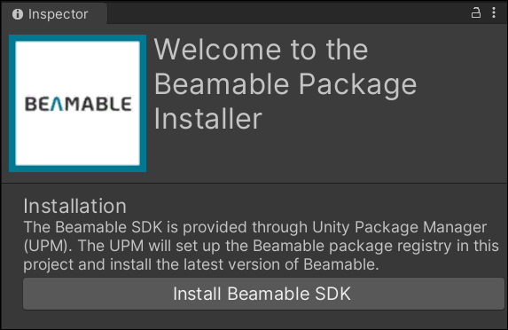
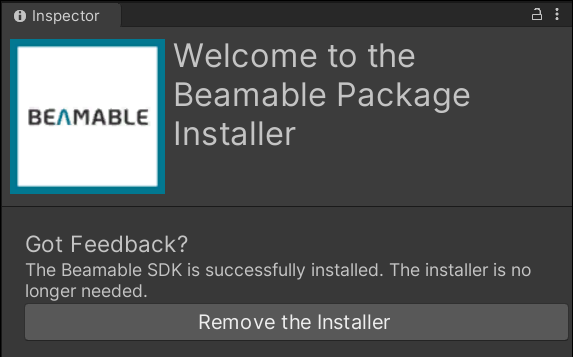
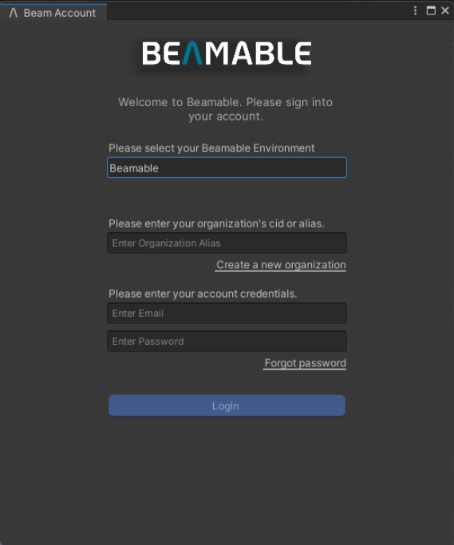

# Setup Unity SDK (Unity)

Welcome to Beamable! This guide will walk you through the steps required to install the Beamable SDK into a Unity project.

!!! info "Compatibility"

    • Beamable supports Unity versions 2021.3 to 6000 and is compatible with all template types  
    • Beamable supports Windows, Mac, iOS, Android, and WebGL platforms

## Signing Up Account in Beamable Portal

To start using Beamable in your project you need to have a valid Account in our Platform. Please do so via our [Portal](https://portal.beamable.com/signup/registration). Please remember your **Alias** as it'll be used to log into the SDK in your editor or via the Beamable CLI.

## Downloading and Installing the Beamable SDK

You can Download the Beamable SDK Installer Package [Here](https://packages.beamable.com/com.beamable/Beamable_SDK_Installer.unitypackage).

Once downloaded, follow these steps to install the Beamable SDK into your Unity project.

| Step | Detail |
|------|--------|
| 1. Import the **Beamable SDK Installer Package** |  • Unity → Assets → Import Package → Custom Package |
| 2. Verify the import |  • Press the "Import" button |
| 3. Install the **Beamable SDK** |  • Click to continue |
| 4. Remove the **Beamable SDK Installer Package** |  • Click to continue *Note: Now that the installation process is complete, the installer package is no longer needed.* |
| 5. **Install Dotnet (if required)** | Starting with the Unity 2.1.0 SDK, Beamable requires that you have dotnet 8.0.302 installed on your machine. If you don't, the Beamable SDK will offer a download option for you, and once you've finished installing it, you can continue through the dialog. |

Congratulations the Beamable SDK is now installed!

## Log into Beamable

Open the Beamable Login Window by clicking the Beamable button in the Unity toolbar.  Now see the Beamable Login Window prompts for user account credentials. Enter the Organization Alias and Password you created when you signed up for Beamable.

Now you're ready to start your first Beamable project!

## Verifying the Installation
To confirm that the Beamable SDK is properly installed and working, we'll create a simple test that displays your player's unique PlayerId both on-screen and in the Unity Console. This demonstrates that Beamable is successfully creating and managing player accounts.

| Step | Action | Expected Result |
|------|--------|----------------|
| 1. **Create a new Unity Scene** | • **File** → **New Scene** • Choose **Basic (Built-in)** or **Basic (URP/HDRP)** template • Save the scene with **Ctrl+S** (name it "BeamableTest") | A new empty scene appears in the Scene view |
| 2. **Open the Beamable Library** | • Click the **Beamable** button in the Unity toolbar • Select **Open Beam Library** from the dropdown menu | The Beamable Library window opens, showing available prefabs and samples |
| 3. **Add the Admin Flow Prefab** | • In the Beamable Library window, locate **"Admin Flow"** prefab • Drag and drop it into your scene hierarchy • Position it anywhere in the scene (position doesn't matter) | The Admin Flow prefab appears in your scene hierarchy and Scene view |
| 4. **Enter Play Mode** | • Click the **Play** button in Unity (or press **Ctrl+P**) • Wait for the scene to fully load | The scene starts playing, and Beamable initializes in the background |
| 5. **Open the In-Game Console** | • Press the **`~`** key (tilde, usually above Tab) • If that doesn't work, try **`** (backtick) or check the Admin Flow UI for a console button | A console overlay appears on your game screen |
| 6. **Request Your PlayerId** | • In the console input field, type: **`dbid`** • Press **Enter** to submit the command | Your unique PlayerId appears both: • On-screen in the console • In Unity's Console window |
| 7. **Verify Success** | • Check that you see a PlayerId like: `1234567890123456789` • Open Unity's Console window (**Window** → **General** → **Console**) • Confirm the same PlayerId appears there | ✅ **Success!** Beamable is working correctly |

## Beam CLI Dependency

The Beamable plugin will automatically install the Beam CLI into your Unity project. The Beam CLI is a developer tool for managing Beamable resources like Microservices, Content, and more. The Beamable Unity plugin relies on the CLI for interacting with Beamable. Your Unity project is a valid Beamable CLI project, which means you can also use the CLI directly if required.  

You should expect to see a `.beamable` folder and a `.config`folder in your Unity project's file structure. The `.beamable` folder contains Beamable specific information about your project, and the `.config` folder is a special `dotnet` folder that defines the version of the Beam CLI. If you are using source-control, both of these folders should be included in source-control.

The `.config` folder has a file called `dotnet-tools.json` which specifies the version of the Beam CLI being used by the Beamable Unity SDK. By default, the Beamable SDK will maintain this number, and you should not edit it by hand.

As new versions of the Beamable SDK are released, they depend on different Beam CLI versions. This table shows which versions of the Beamable SDK depend on what CLI versions. 

| SDK Version | CLI Version |
| :---------- | :---------- |
| 3.1.5       | 5.4.2 |
| 3.1.4       | 5.4.2 |
| 3.1.3       | 5.4.2 |
| 3.1.2       | 5.4.2 |
| 3.1.1       | 5.4.1 |
| 3.1.0       | 5.4.0 |
| 3.0.0       | 5.3.0 |
| 2.4.3       | 4.3.4       |

!!! danger "User Beware: Changing the CLI version may cause issues"

    Starting in SDK 3.0, you _may_ disable the SDK's explicit control of the `dotnet-tools.json` by enabling the `Beamable/Editor/AdvancedCli/Disable Version Requirement` setting in Unity's Project Settings window. If you do this, please understand that the Beamable SDK may stop functioning, as it is trying to use an unplanned version.

(goodbye!)