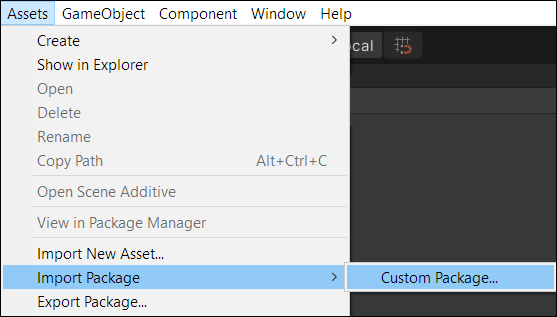
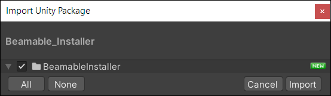
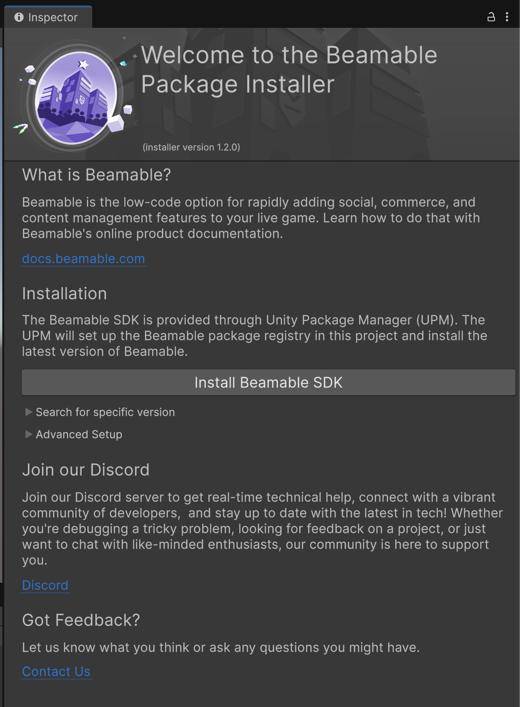
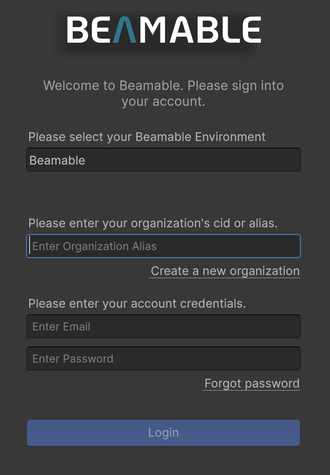
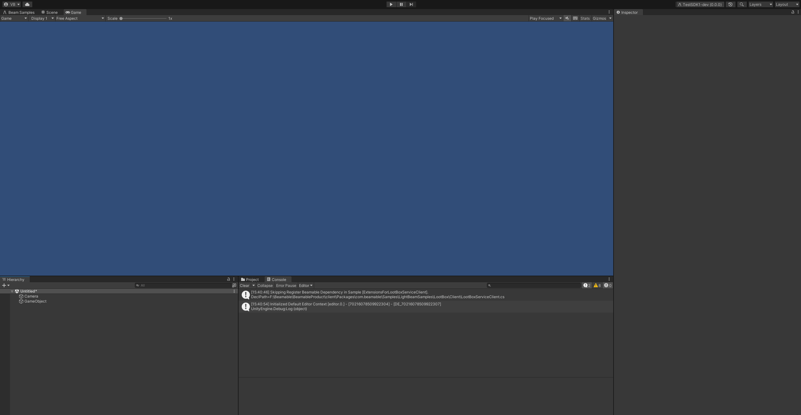
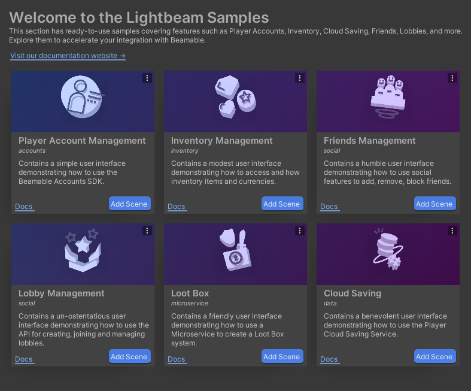

# Setup Unity SDK (Unity)

Welcome to Beamable! This guide will walk you through the steps required to install the Beamable SDK into a Unity project.

!!! info "Compatibility"

    • Beamable supports Unity versions 2021.3 to 6000.3 and is compatible with all template types
    • Beamable supports Windows, Mac, iOS, Android, and WebGL platforms

## Setting up an account in the Beamable Portal

To start using Beamable in your project, you need to have a valid Beamable account. Please create an account via our [Portal](https://portal.beamable.com/signup/registration). Please remember your **Alias** as it will be used to log into the SDK in your editor or via the Beamable CLI.

## Downloading and installing the Beamable SDK

You can download the [Beamable SDK Installer Package](https://packages.beamable.com/com.beamable/Beamable_SDK_Installer.unitypackage).

Once downloaded, follow these steps to install the Beamable SDK into your Unity project.

| Step | Detail                                                                                                                                                                                                                                                                   |
|------|--------------------------------------------------------------------------------------------------------------------------------------------------------------------------------------------------------------------------------------------------------------------------|
| 1. Import the **Beamable SDK Installer Package** |  • Unity → Assets → Import Package → Custom Package                                                                                                                                                      |
| 2. Verify the import |  • Press the "Import" button                                                                                                                                                                               |
| 3. Install the **Beamable SDK** | {width=400px} • Click to continue                                                                                                                                                                                                |
| 4. Remove the **Beamable SDK Installer Package** | • Now that the installation process is complete, the installer package is no longer needed. You can remove it.                                                                                                                                                           |
| 5. **Install .NET (if required)** | Starting with the Unity 5.0.0 SDK, Beamable requires that you have .NET 10.0.100 or 8.0.302 installed on your machine. If you do not, the Beamable SDK will offer a download option for you, and once you have finished installing it, you can continue through the dialog. |

Congratulations, the Beamable SDK is now installed!

!!! Note
    If you need to install a Release Candidate version of Beamable, use the _Search for specific version_ drop-down under the main _Install Beamable SDK_ button. You can also find nightly builds here.

## Log into Beamable

Open the Beamable Login Window by clicking the Beamable button in the Unity toolbar.  Now see the Beamable Login Window prompts for user account credentials. Enter the Organization Alias, Email, and Password with which you signed up for Beamable.

{: style="max-width: 400px;" }

Now you are ready to start your first Beamable project!

## Say _hello_ to Beamable!
To confirm that you have a working Beamable setup, we will pull in the `BeamableBehavior` component and make sure we can access a player account using the [Admin Console](../user-reference/runtime-systems/admin-console.md).

- Add the `BeamableBehaviour` component to any object of the scene
- Enter play-mode, and hit the `~` character (the same key as `` ` ``). This should open up the [Admin Console](../user-reference/runtime-systems/admin-console.md)
- You can type in a bunch of commands like `help` (list of commands), or `dbid` (current player's id)
- You are ready to start building!

## Beamable Samples

You can start exploring the Beamable SDK throuht the samples available in the Beam Samples Window. Also make sure to check out the [Samples Documentation](../samples/lightbeam.md) for more information.

{width=700px}

## Beam CLI dependency

The Beamable plugin will automatically install the Beam CLI into your Unity project. The Beam CLI is a developer tool for managing Beamable resources like Microservices, Content, and more. The Beamable Unity plugin relies on the CLI for interacting with Beamable. Your Unity project is a valid Beamable CLI project, which means you can also use the CLI directly if required.

You should expect to see a `.beamable/` folder and a `.config/` folder in your Unity project's file structure. The `.beamable/` folder contains Beamable-specific information about your project, and the `.config/` folder is a special `dotnet` folder that defines the version of the Beam CLI. If you are using source control, you should include both folders. The `.beamable/` folder includes its own `.gitignore` that excludes files containing individual authentication data, as well as temporary files and folders that only pertain to local state.

The `.config/` folder has a file called `dotnet-tools.json` that specifies the version of the Beam CLI being used by the Beamable Unity SDK. By default, the Beamable SDK will maintain this number, and you should not edit it by hand.

New versions of the Beamable SDK may depend on different versions of the Beam CLI. This table shows the latest version for each release line; for the complete patch-by-patch history, see [SDK/CLI Version History](./sdk-cli-version-history.md).

| SDK Version | CLI Version |
| :---------- | :---------- |
| 6.1.0 | 7.2.3 |
| 6.0.1 | 7.2.2 |
| 5.1.2 | 7.2.2 |
| 5.0.1 | 7.0.1 |
| 4.0.4 | 6.2.2 |
| 3.1.7 | 5.4.3 |
| 3.0.0 | 5.3.0 |
| 2.4.6 | 4.3.7 |
| 2.3.0 | 4.3.0 |
| 2.2.0 | 4.2.0 |
| 2.1.4 | 4.1.5 |
| 2.0.3 | 3.0.2 |

!!! danger "User Beware: Changing the CLI version may cause issues."

    Starting in SDK 3.0, you _may_ disable the SDK's explicit control of the `dotnet-tools.json` by enabling the `Beamable/Editor/AdvancedCli/Disable Version Requirement` setting in Unity's Project Settings window. If you do this, please understand that the Beamable SDK may stop functioning, as it would then be trying to use an unplanned version.
