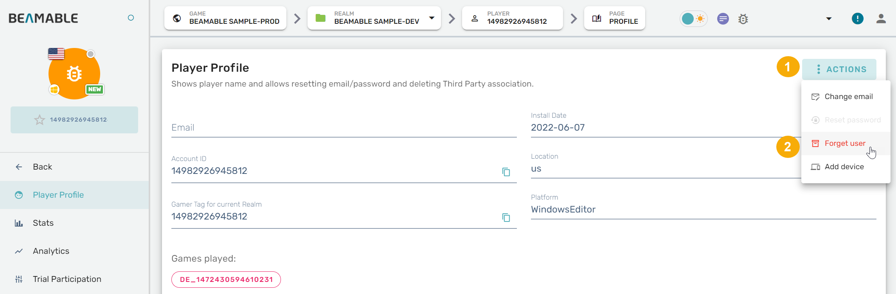

# Account Deletion

Allow players to remove personal info from your application

## Overview

As part of Beamable's efforts to maintain [GDPR compliance](https://en.wikipedia.org/wiki/General_Data_Protection_Regulation), a method to remove **Personally identifiable information (PII)** must be made available to users. This ensures that players still have control over their own personal information.

### Apple Requirements

As part of the App Store Review Guideline, Apple requires apps that support account creation to also allow users to delete their accounts, effectively removing any personal info from that platform. Their requirements are effective June 30, 2022. All of this information is available on Apple's documentation for [Offering account deletion in your app](https://developer.apple.com/support/offering-account-deletion-in-your-app).

For these reasons, Beamable provides the Forget User API. This document outlines the process for removing player info from an account.

!!! warning "Forgetting User Data"

    The Forget User function is intended to wipe the personal data from a Beamable account, not necessarily delete the account ID itself. However, although this numeric ID still exists in the system, it will be completely unidentifiable after the PII is deleted, which meets GDPR requirements.

## Methods

There are a couple different ways to forget user info:

• **Beamable Portal**: "Forget user" is available as an administrative option. This is useful in a scenario where a player requests deletion of their account info, and is followed up by a customer support member.

• **Self-Service**: The [`object/accounts/{objectId}/admin/forget`](https://docs.beamable.com/reference/delete_object-accounts-objectid-admin-forget) API can be called from a microservice to allow users to initiate their own account info deletion.

In addition to deleting PII, your app must meet certain requirements around the user interface and experience. Although Beamable provides an API, as well as a portal flow for deleting PII for a user, the game must still implement its own user flow that conforms to [Apple's Guidelines](https://developer.apple.com/support/offering-account-deletion-in-your-app).

Methods of account deletion are covered in more detail below.

## Option 1. Forget User via Portal

User deletion can be done from the Beamable portal by an admin. This can be found on a player's profile page, at the top right under the "Actions" dropdown. This calls the same admin/forget API as the code example in this guide.

Based on guidelines for user account deletion, this method should be paired with an easy-to-find option in your app that allows your user to submit a request for deletion.

{width="600px"}

## Option 2. Forget User via Code

**The script can be downloaded as a GitHub Gist here:** [DeletePlayerInfoService.cs](https://gist.github.com/beamable-gists/4ee1ecc72475eca5e6f63aecfdba762a)
_The full script can also be found at the bottom of this document._

The API is only callable from a privileged context such as a microservice. Therefore, you will need to follow the steps to create a microservice before this script can be called. See the [Microservice Framework](../user-reference/cloud-services/microservices/microservice-framework.md) for more info.

The API used here is [`object/accounts/{objectId}/admin/forget`](https://docs.beamable.com/reference/delete_object-accounts-objectid-admin-forget). The `objectId` is the player's account ID, **not** their realm ID. Typically, a user's realm ID is equal to the account ID+1 since both these values are created in rapid succession.

!!! danger "Destructive Action"

    Since account deletion is a destructive action, it is _highly recommended_ to prompt the user for confirmation before calling the microservice function. The API uses the player's account ID instead of their realm-specific ID, so their info will be deleted for every realm in your organization, not just one of them.

The player's account ID is not immediately accessible from the player Context, so first we need to run an account search to retrieve the expanded info about the player. An example result from an account search would look something like this:

```json
{"accounts":[{"id":1234,"gamerTags":[{"projectId":"DE_12345","gamerTag":1235}],"thirdParties":[],"createdTimeMillis":1654192216717,"updatedTimeMillis":1654192216717}]}
```

We only need the first ID from that result, so we can create a couple classes to handle the deserialization of the response:

```csharp
public class AccountSearchResponse
{
    public Account[] accounts;
}

public class Account
{
    public long id;
}
```

Now we can call the `basic/accounts/search` API. This requires a few query parameters, so we can build those into the URL of the call. Other notes are listed as code comments in the following example.

```csharp
private async Task<string> GetAccountId()
{
    //A search is run using the player's Realm ID (UserId)
    var path = $"/basic/accounts/search?query={Context.UserId}&page=1&pagesize=10";
    //The Requester class is used to make REST API calls
    var response = await Requester.Request<AccountSearchResponse>(Method.GET, path);
    //We only need the ID of the first account in the list, since that is the one we will be deleting.
    return response.accounts.First().id.ToString();
}
```

Now that we have the account ID, we can call the forget user API. This is fairly similar to the last API call.

It's worth noting that the example uses a custom parser for deserialization. This will effectively return the response string in its raw form, since it is only being returned to the client for logging purposes. If your game needs to make better use of this data, this can be accomplished by creating a class for the Requester to deserialize into, and changing the type parameter of Request (similar to how GetAccountId above).

```csharp
private async Task<string> ForgetUser(string accountId)
{
    var path = $"/object/accounts/{accountId}/admin/forget";
    var response = await Requester.Request<string>(Method.DELETE, path, parser:(s => s));
    return response;
}
```

With these helper functions created, we can now create the client callable method for the microservice. This method simply ties our other two methods together to create a single execution flow.

```csharp
[ClientCallable]
public async Task<string> DeleteAccount()
{
    var accountId = await GetAccountId();
    var response = await ForgetUser(accountId);
    return response;
}
```

After publishing the microservice, you can call the DeleteAccount method from the appropriate location in your C# client code. You should see a response similar to the one below, if the deletion was successful:

```json
{"createdTimeMillis":1654639620467,"id":1498288512206848,"gamerTags":[{"projectId":"DE_12345","gamerTag":1234}],"updatedTimeMillis":1654715866882,"thirdParties":[]}
```

## Unity Code

For additional thoroughness of erasure, it is recommended to also call `ClearAndStopAllContexts`, which is a static function from the Beamable SDK intended to clear all access tokens for logged in users, and clean up any subscriptions that were running.

```csharp
//C# client code

//Initialize BeamContext instance
_context = BeamContext.Default;
await _context.OnReady;

//Useful debug info
Debug.Log($"Current PlayerId: {_context.UserId}");
Debug.Log($"Token: {_context.AccessToken.Token}");

//Run the forget microservice
var client = new DeletePlayerAccountClient();
var response = await client.DeleteAccount();

//Log the response
//If the microservice throws an exception, that will show up in the logs as well.
Debug.Log(response);

//Clear out the users from the device.
await Beam.ClearAndStopAllContexts();
```

## Complete Script

Create a microservice via the [Microservice Unity Integration](../user-reference/cloud-services/microservices/microservice-unity-integration.md), then paste this script into the C# source file.

DeletePlayerAccount.cs
```csharp
using System.Linq;
using System.Threading.Tasks;
using Beamable.Common.Api;
using Beamable.Server;

namespace Beamable.Microservices
{
	[Microservice("DeletePlayerAccount")]
	public class DeletePlayerAccount : Microservice
	{
		[ClientCallable]
		public async Task<string> DeleteAccount()
		{
			var accountId = await GetAccountId();
			var response = await ForgetUser(accountId);
			return response;
		}

		private async Task<string> GetAccountId()
		{
			var path = $"/basic/accounts/search?query={Context.UserId}&page=1&pagesize=10";
			var response = await Requester.Request<AccountSearchResponse>(Method.GET, path);
			return response.accounts.First().id.ToString();
		}

		private async Task<string> ForgetUser(string accountId)
		{
			var path = $"/object/accounts/{accountId}/admin/forget";
			var response = await Requester.Request<string>(Method.DELETE, path, parser:(s => s));
			return response;
		}
	}

	public class AccountSearchResponse
	{
		public Account[] accounts;
	}

	public class Account
	{
		public long id;
	}
}
```
