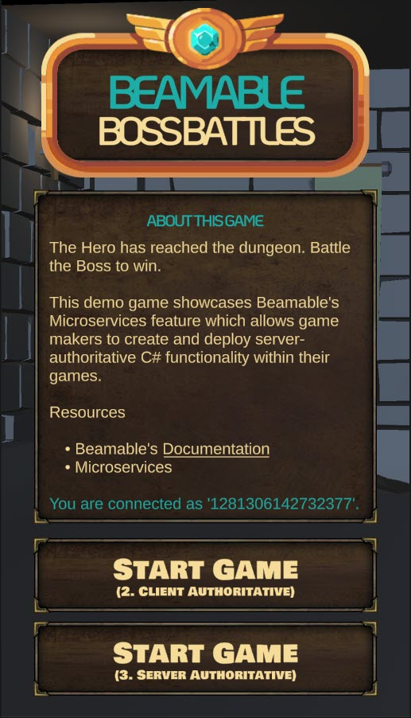
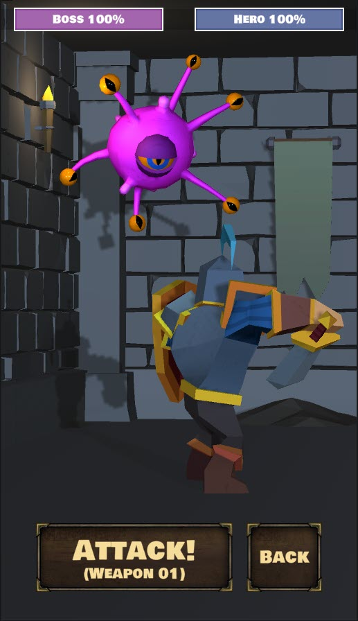
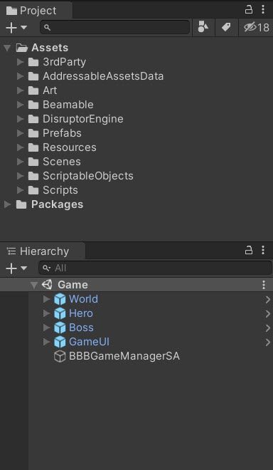
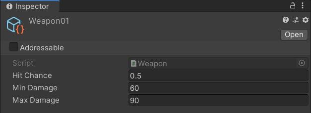
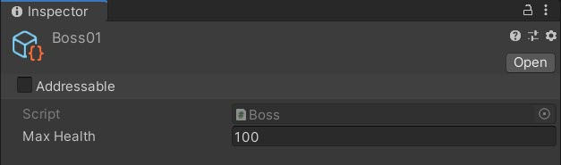
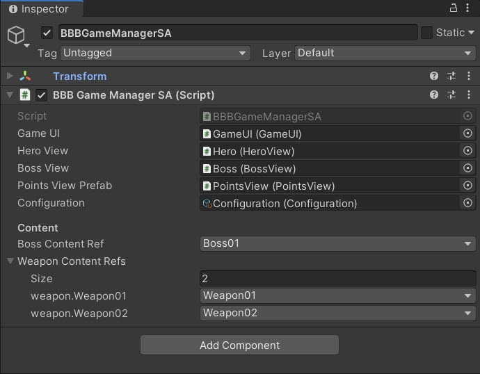
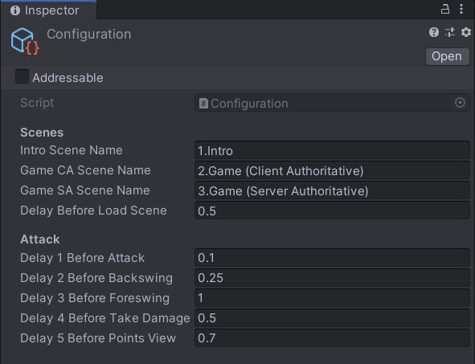
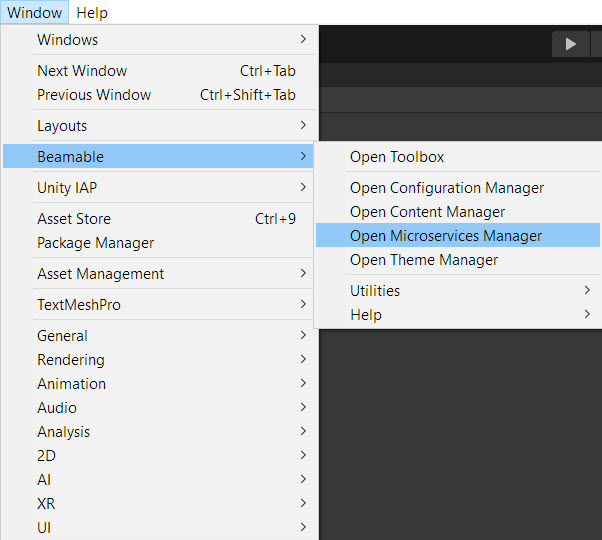
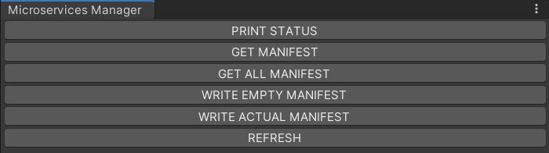

# Beamable Boss Battle - Microservices Sample

In the "Beamable Boss Battle" (BBB) sample game, **The Hero has reached the dungeon. Battle the Boss to win.** 

!!! info "Related Features"

    • [Microservices](microservices-feature-overview.md) - Server-side code that runs in the cloud to handle game logic, data validation, and real-time multiplayer functionality

### Screenshots

The player navigates from the Intro Scene to the Game Scene, where all the action takes place.

| Intro Scene | Game Scene | Project |
|:------------|:-----------|:--------|
| {width="300"} | {width="300"} | {width="300"} |

## Microservices (BBB) - Guide

This document and the sample project allow game makers to understand and apply the benefits of Microservices in game development. Or watch this video:

<div style="position: relative; padding-bottom: 56.25%; height: 0;">
  <iframe src="https://www.youtube.com/embed/NpEGdH7NvnQ?autoplay=0&fs=1" 
          style="position: absolute; top: 0; left: 0; width: 100%; height: 100%;" 
          allowfullscreen>
  </iframe>
</div>

## Download

Learning Resources:

| Source | Detail |
|--------|--------|
| {width="35"} | 1. **Download** the [Microservices BBB Sample Project](https://github.com/beamable/Microservices_BBB_Sample_Project)<br/>2. Open in Unity Editor (Version 2021.3 or later)<br/>3. Open the Beamable [Toolbox](toolbox.md)<br/>4. Sign-In / Register To Beamable. See [Installing Beamable](installing-beamable.md) for more info<br/>5. Complete the Docker setup. See [Microservices](microservices-feature-overview.md) for more info<br/>6. Click to "Start" the server. See [Microservices](microservices-feature-overview.md) for more info<br/>7. Publish the Beamable Content to your realm. See [Content Manager](content-manager-overview.md#publish) for more info<br/>8. Open the `1.Intro` Scene<br/>9. Play The Scene: Unity → Edit → Play<br/><br/>_Note: Sample projects are compatible with the latest supported Unity versions_ |

### Player Experience Flowchart

The player experience flowchart shows the game flow:

The player battles the boss and the workload is appropriately divided between the C# game client code and the C# Beamable Microservice code. Goals of using server-authoritative programming include to increase the game's security (against any malicious hackers in the game's community) and to improve live ops workflows.

- **StartTheBattle ()** - Public Microservice method to reset the `BossHealth` Stat and randomize `HeroWeaponIndex` Stat
- **AttackTheBoss ()** - Public Microservice method to reduce the `BossHealth` Stat based on `Weapon` Content

## Game Maker User Experience

The game maker user experience shows the development workflow. There are 3 major parts to this game creation process.

## Steps

Here are the steps to implement the sample:

!!! info "Related Features"

    Related Features:

    • [Microservices](microservices-feature-overview.md) - Server-side code that runs in the cloud to handle game logic, data validation, and real-time multiplayer functionality

### Step 1. Setup Beamable Content

This is a general overview of Beamable's Content flow. For more detailed instructions, see the [Content Manager](content-manager-overview.md) doc.

| Step | Detail |
|------|--------|
| 1. Setup Beamable Microservices | • See [Getting Started With Beamable Microservices](microservices-guide.md#getting-started-with-beamable-microservices) |
| 2. Create `Weapon` content class | `[ContentType("weapon")]`<br/>`public class Weapon : ContentObject`<br/>`{`<br/>&nbsp;&nbsp;&nbsp;`public float HitChance = 0.5f;`<br/>&nbsp;&nbsp;&nbsp;`public int MinDamage = 25;`<br/>&nbsp;&nbsp;&nbsp;`public int MaxDamage = 50;`<br/>`}` |
| 3. Create the "Weapon" content | {width="200" style="float: right; margin: 0px 0px 15px 15px;"}<br/>• Select the content type in the list<br/>• Press the "Create" button<br/>• Populate the content name |
| 4. Populate all data fields |  |
| 5. Create `Boss` content class | `[ContentType("boss")]`<br/>`public class Boss : ContentObject`<br/>`{`<br/>&nbsp;&nbsp;&nbsp;`public int MaxHealth = 100;`<br/>`}` |
| 6. Create "Boss" content | {width="200" style="float: right; margin: 0px 0px 15px 15px;"}<br/>• Select the content type in the list<br/>• Press the "Create" button<br/>• Populate the content name |
| 7. Populate all data fields |  |
| 8. Save the Unity Project | • Unity → File → Save Project<br/><br/>_Best Practice: If you are working on a team, commit to version control in this step._ |
| 9. Publish the content | • Press the "Publish" button in the Content Manager Window. See [Content Manager](content-manager-overview.md#publish) for more info. |

### Step 2. Create Game Client Code

This step includes the bulk of time and effort the project.

| Step | Detail |
|:-----|:-------|
| 1. Create C# Client Code (Basics) | • The details vary wildly depending on the needs of the project's game design. |
| 2. Create C# Client Code (To Call Microservices) | • See `BBBGameManagerSA.cs` below. |

**Inspector**

Here is the `BBBGameManagerSA.cs` main entry point for the Game Scene interactivity. The "SA" in the class name indicates server-authoritative.


*The "Content" references are easily configurable*

Here is the `Configuration.cs` holding high-level, easily-configurable values used by various areas on the game code.

!!! warning "Gotchas"

    Here are some common issues and solutions:

    • While the name is similar, this `Configuration.cs` is wholly unrelated to Beamable's [Configuration Manager](configuration-manager.md).


*The "Configuration" values are easily configurable*

_Optional: Game Makers may experiment with new **Delay** values in the **Attack** section and allow the player's turn to occur faster or slower._

**Code**

BBBGameManagerSA.cs
```csharp
namespace Beamable.Samples.BBB 
{
   public class BBBGameManagerSA : MonoBehaviour
   {
      //  Fields ---------------------------------------

      [SerializeField]
      private GameUI _gameUI = null;

      [SerializeField]
      private HeroView _heroView = null;

      [SerializeField]
      private BossView _bossView = null;

      [SerializeField]
      private PointsView _pointsViewPrefab = null;

      [SerializeField]
      private Configuration _configuration = null;

      [Header("Content")]
      [SerializeField]
      private BossContentRef _bossContentRef = null;

      [SerializeField]
      private List<WeaponContentRef> _weaponContentRefs = null;

      private PointsView _pointsViewInstance = null;
      private BBBGameMicroserviceClient _bbbGameMicroserviceClient = null;

      //  Unity Methods   ------------------------------
      protected void Start()
      {
         _gameUI.AttackButton.onClick.AddListener(AttackButton_OnClicked);

         // Block user interaction
         _gameUI.CanvasGroup.DOFade(0, 0);
         _gameUI.AttackButton.interactable = false;

         _bbbGameMicroserviceClient = new BBBGameMicroserviceClient();
         StartTheBattle();

      }

      //  Other Methods --------------------------------
      private void StartTheBattle ()
      {
         int heroWeaponIndexMax = _weaponContentRefs.Count;

         // ----------------------------
         // Call Microservice Method #1
         // ----------------------------
         _bbbGameMicroserviceClient.StartTheBattle(_bossContentRef, heroWeaponIndexMax)
            .Then((StartTheBattleResults results) =>
            {
               _gameUI.BossHealthBarView.Health = results.BossHealthRemaining;
               _gameUI.AttackButtonText.text = BBBHelper.GetAttackButtonText(results.HeroWeaponIndex);

               // Find the Weapon data from the Weapon content
               _weaponContentRefs[results.HeroWeaponIndex].Resolve()
                  .Then(content =>
                  {
                     //TODO; Fix fade in of models (Both scenes)
                     BBBHelper.RenderersDoFade(_bossView.Renderers, 0, 1, 0, 3);
                     BBBHelper.RenderersDoFade(_heroView.Renderers, 0, 1, 1, 3);

                     // Allow user interaction
                     _gameUI.AttackButton.interactable = true;
                     _gameUI.CanvasGroup.DOFade(1, 1).SetDelay(0.50f);

                  })
                  .Error((Exception exception) =>
                  {
                     System.Console.WriteLine("_bossContentRef.Resove() error: " + exception.Message);
                  });

            })
            .Error((Exception exception) =>
            {
               UnityEngine.Debug.Log($"StartTheBattle() error:{exception.Message}");
            });
      }


      private IEnumerator Attack()
      {
         _gameUI.AttackButton.interactable = false;

         // Wait - Click
         yield return new WaitForSeconds(_configuration.Delay1BeforeAttack);
         SoundManager.Instance.PlayAudioClip(SoundConstants.Click02);

         // Wait - Backswing
         yield return new WaitForSeconds(_configuration.Delay2BeforeBackswing);
         SoundManager.Instance.PlayAudioClip(SoundConstants.Unsheath01);
         _heroView.PrepareAttack();

         bool isDone = false;

         // ----------------------------
         // Call Microservice Method #2
         // ----------------------------
         AttackTheBossResults attackTheBossResults = null;
         _bbbGameMicroserviceClient.AttackTheBoss(_weaponContentRefs)
            .Then((AttackTheBossResults results) =>
            {
               isDone = true;
               attackTheBossResults = results;

            })
               .Error((Exception exception) =>
            {
               UnityEngine.Debug.Log($"AttackTheBoss() error:{exception.Message}");
            });

         while (!isDone)
         {
            yield return new WaitForEndOfFrame();
         }

         // Wait - Swing
         yield return new WaitForSeconds(_configuration.Delay3BeforeForeswing);
         SoundManager.Instance.PlayAudioClip(SoundConstants.Swing01);
         _heroView.Attack();

         // Show floating text, "-35" or "Missed!"
         if (_pointsViewInstance != null)
         {
            Destroy(_pointsViewInstance.gameObject);
         }
         _pointsViewInstance = Instantiate<PointsView>(_pointsViewPrefab);
         _pointsViewInstance.transform.position = _bossView.PointsViewTarget.transform.position;

         // Evaluate damage
         if (attackTheBossResults.DamageAmount > 0)
         {
            // Wait - Damage
            yield return new WaitForSeconds(_configuration.Delay4BeforeTakeDamage);
            SoundManager.Instance.PlayAudioClip(SoundConstants.TakeDamage01);
            BBBHelper.RenderersDoColorFlicker(_bossView.Renderers, Color.red, 0.1f);
            _bossView.TakeDamage();

            // Wait - Points
            yield return new WaitForSeconds(_configuration.Delay5BeforePointsView);
            SoundManager.Instance.PlayAudioClip(SoundConstants.Coin01);

            _pointsViewInstance.Points = -attackTheBossResults.DamageAmount;

         }
         else
         {
            // Wait - Points
            yield return new WaitForSeconds(_configuration.Delay5BeforePointsView);
            SoundManager.Instance.PlayAudioClip(SoundConstants.Coin01);

            _pointsViewInstance.Text = BBBHelper.GetAttackMissedText();
         }

         if (attackTheBossResults.BossHealthRemaining <= 0)
         {
            _bossView.Die();
            SoundManager.Instance.PlayAudioClip(SoundConstants.GameOverWin);
         }
         else
         {
            _gameUI.AttackButton.interactable = true;
         }

         _gameUI.BossHealthBarView.Health = attackTheBossResults.BossHealthRemaining;
      }

      //  Event Handlers -------------------------------
      public void AttackButton_OnClicked ()
      {
         StartCoroutine(Attack());
      }
   }
}
```

**Alternative API**

Beamable Microservices supports a `Promise`-based workflow. The availability of the result of the `Promise` may be handled using `.Then()` within synchronous scopes as shown above or handled with `.IsCompleted` within `Coroutines` as shown here.

Game makers may choose either syntax.

Snippet
```csharp
// ----------------------------
// Call Microservice Method #2
// ----------------------------
AttackTheBossResults attackTheBossResults = null;
_bbbGameMicroserviceClient.AttackTheBoss(_weaponContentRefs)
   .Then((AttackTheBossResults results) =>
   {
      isDone = true;
      attackTheBossResults = results;

   })
      .Error((Exception exception) =>
   {
      UnityEngine.Debug.Log($"AttackTheBoss() error:{exception.Message}");
   });

while (!isDone)
{
   yield return new WaitForEndOfFrame();
}
```

### Step 3. Create Game Server Code (Microservices)

Create the Microservice and the project-specific C# code to meet the game's needs.

| Name | Detail |
|------|--------|
| 1. Open the "Microservices Manager" Window | {width="400"}<br/><br/>• Unity → Window → Beamable → Open Microservices Manager |
| 2. Create a new Microservice | • Unity → Window → Beamable → Create New Microservice<br/><br/>• Populate all form fields |
| 3. Implement the Microservice method | See the `BBBGameMicroservice.cs` code snippet below the table |
| 4. Build the Microservice | {width="400"}<br/><br/>• See Beamable Microservice Manager Window |
| 5. Run the Microservice | • See Beamable Microservice Manager Window |
| 6. Play the Scene | • Unity → Edit → Play<br/><br/>_Note: Verify that the code properly functions. This varies depending on the specifics of the game logic_ |
| 7. Stop the Scene | • Unity → Edit → Stop |

**API**

Read these method diagrams along with the following code snippet for a full understanding of the client-server data exchange.

Call Microservice Method #1

The `Boss` data is passed along via `ContentRef` to set the initial `BossHealth` Stat value (e.g. 100). The `heroWeaponIndexMax` (e.g. 2) is passed and used as a random value is rolled (e.g. 1) for which weapon the Hero will use for the duration of the battle. This is stored in the `HeroWeaponIndex` Stat for subsequent use.

_Note: The use of randomization for the `HeroWeaponIndex` is a simplified solution fit for this sample project. However, its likely a production game would feature deeper game play and allow the player to select the Hero's weapon, instead of using a random._

Call Microservice Method #2

A list of `Weapon` data is passed along via `ContentRef`. The Microservice uses only one index in the list (via `HeroWeaponIndex` Stat), calculates the damage done to the Boss and returns data to the client used for rendering of animations and UI text.

**Code**

Here is the code for the steps above.

Beamable auto-generates this **original** version of the `BBBGameMicroservice` as the starting point.

```csharp
using Beamable.Server;

namespace Beamable.Server.BBBGameMicroservice
{
   [Microservice("BBBGameMicroservice")]
   public class BBBGameMicroservice : Microservice
   {
      [ClientCallable]
      public void ServerCall()
      {
         // This code executes on the server.
      }
   }
}
```

The game maker updates the code to meet the needs of the game project.

Here is **final** version of the `BBBGameMicroservice`.

BBBGameMicroservice.cs
```csharp
namespace Beamable.Server.BBBGameMicroservice
{
   [Microservice("BBBGameMicroservice")]
   public class BBBGameMicroservice : Microservice
   {
      [ClientCallable]
      public async Task<StartTheBattleResults> StartTheBattle(BossContentRef bossContentRef, int heroWeaponIndexMax)
      {
         // Find the Boss data from the Boss content
         var boss = await bossContentRef.Resolve();

         // Set boss health to 100
         await BBBHelper.SetProtectedPlayerStat(Services, Context.UserId,
                BBBConstants.StatKeyBossHealth,
                boss.MaxHealth.ToString());

         // Set hero weapon index to random (0,1)
         int heroWeaponIndex = new System.Random().Next(heroWeaponIndexMax);

         await BBBHelper.SetProtectedPlayerStat(Services, Context.UserId,
                BBBConstants.StatKeyHeroWeaponIndex,
                heroWeaponIndex.ToString());

         return new StartTheBattleResults
         {
            BossHealthRemaining = boss.MaxHealth,
            HeroWeaponIndex = heroWeaponIndex
         };
      }

      [ClientCallable]
      public async Task<AttackTheBossResults> AttackTheBoss(List<WeaponContentRef> weaponContentRefs)
      {
         // Get the weapon index
         string heroWeaponIndexString = await BBBHelper.GetProtectedPlayerStat(Services, Context.UserId,
            BBBConstants.StatKeyHeroWeaponIndex);

         // Get the weapon
         int heroWeaponIndex = int.Parse(heroWeaponIndexString);

         // Find the weapon data from the Weapon content
         var weapon = await weaponContentRefs[heroWeaponIndex].Resolve();

         // Calculate the damage
         Random random = new Random();
         int damageAmount = 0;
         double hitRandom = random.NextDouble();

         //Console.WriteLine($"weaponData.hitChance={weapon.HitChance}.");
         //Console.WriteLine($"hitRandom={hitRandom}.");

         if (hitRandom <= weapon.HitChance)
         {
            damageAmount = random.Next(weapon.MinDamage, weapon.MaxDamage);
         }

         // Get the boss health
         string bossHealthString = await BBBHelper.GetProtectedPlayerStat(Services, Context.UserId,
            BBBConstants.StatKeyBossHealth);

         // Apply the damage
         int bossHealthRemaining = int.Parse(bossHealthString) - damageAmount;

         await BBBHelper.SetProtectedPlayerStat(Services, Context.UserId,
                BBBConstants.StatKeyBossHealth,
                bossHealthRemaining.ToString());

         return new AttackTheBossResults
         {
            DamageAmount = damageAmount,
            BossHealthRemaining = bossHealthRemaining
         };
      }
   }
}
```
