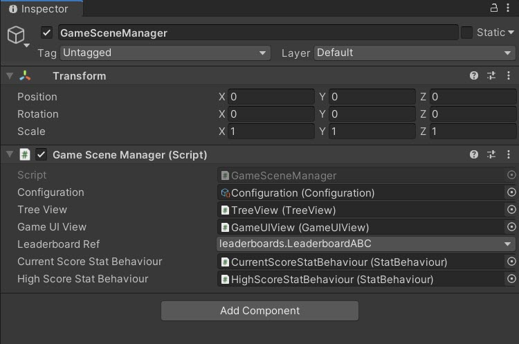
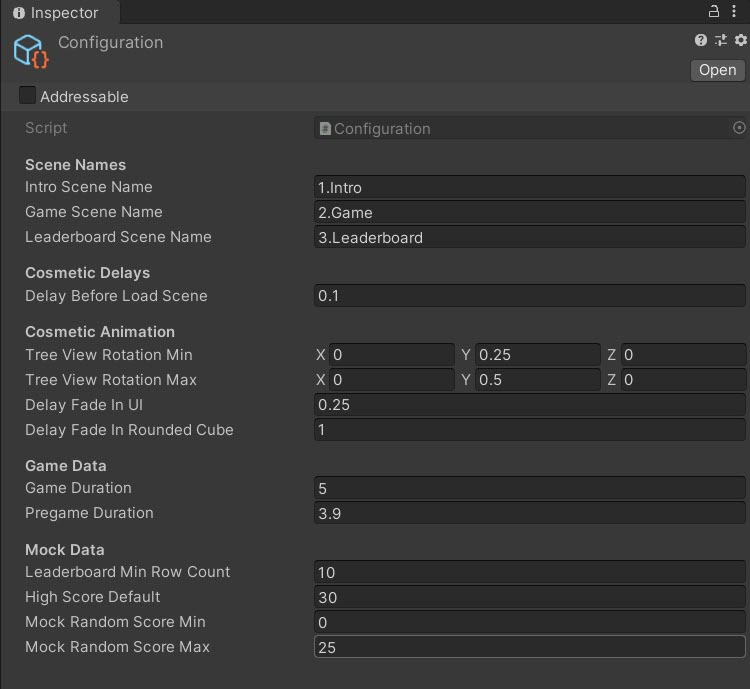
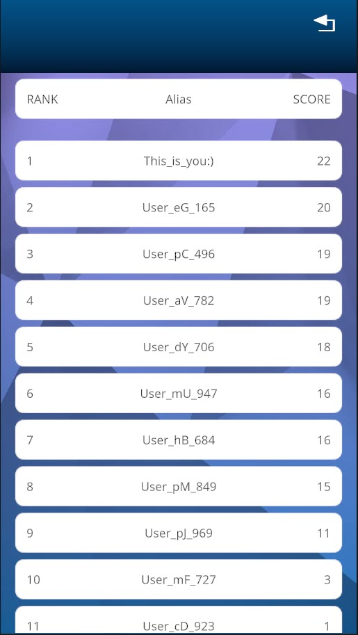
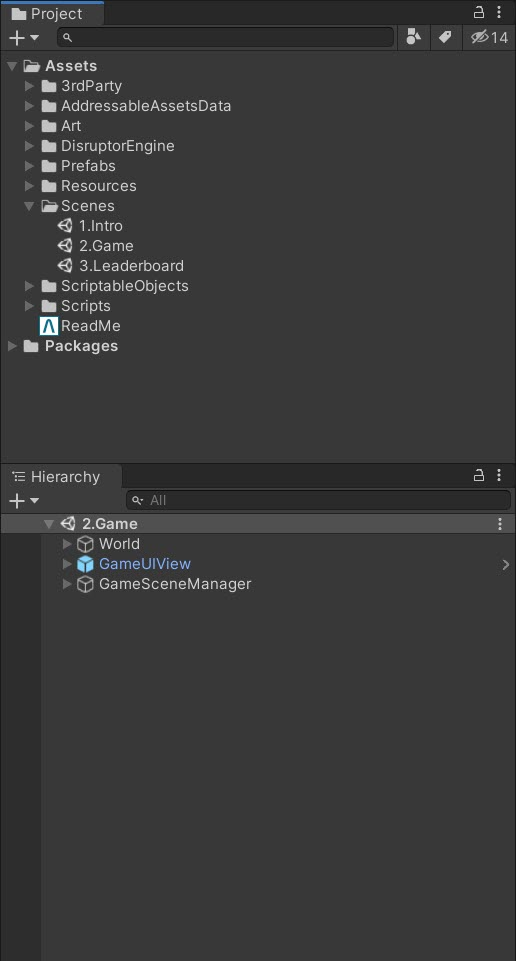

# Leaderboard Sample

A simple clicker game sample demonstrating Beamable's Leaderboard system. **In this game, button clicks grow trees. Click as many times as possible within the time limit.**

<div style="position: relative; padding-bottom: 56.25%;">
  <iframe 
    src="https://www.youtube.com/embed/z4SaSi0vzkw?autoplay=0&fs=1"
    style="position: absolute; top: 0; left: 0; width: 100%; height: 100%;"
    allowfullscreen>
  </iframe>
</div>

### Features

!!! info "Beamable Features Used"

    This sample demonstrates integration with Beamable services:

    - [Leaderboards](../user-reference/beamable-services/social-networking/leaderboards.md) - Player rankings and competitive scoring
    - [Stats](../user-reference/beamable-services/profile-storage/stats.md) - Player statistics tracking
    - [Connectivity](../user-reference/beamable-services/social-networking/connectivity.md) - Player connection management

### Game Rules

- Players have a limited time to click and grow their tree
- Each click increases the current score
- The goal is to achieve the highest score possible within the time limit
- Scores are submitted to a global leaderboard for competition
- The tree grows visually based on the player's performance relative to the global high score

## Project Repository

The code for the Leaderboard ABC Sample is available at [Leaderboard ABC Sample Project](https://github.com/beamable/Leaderboard_ABC_Sample_Project).

## Screenshots

| Intro Scene | Game Scene | Leaderboard Scene | Project Structure |
| :---------- | :--------- | :---------------- | :---------------- |
| {width="200"} | {width="200"} | {width="200"} | {width="200"} |

## Download

| Source | Detail |
|--------|--------|
| **Beamable** | 1. **Download** the [Leaderboard ABC Sample Project](https://github.com/beamable/Leaderboard_ABC_Sample_Project)<br>2. Open in Unity Editor (Version 2021.3 or later)<br>3. Open the Beamable [Toolbox](../user-reference/editor-systems/unity-editor-login.md)<br>4. Sign-In / Register To Beamable. See [Getting Started](../getting-started/installing-beamable.md) for more info<br>5. Open the Content Manager Window and click "Publish". See [Content Manager](../user-reference/beamable-services/profile-storage/content/content-overview.md) for more info<br>6. Open the `1.Intro` Scene<br>7. Play The Scene: Unity → Edit → Play<br>8. Enjoy!<br><br>_Note: Sample projects are compatible with supported Unity versions_ |

## Implementation Guide

This sample demonstrates key Beamable integration patterns for leaderboards and stats.

### Key Components

**IntroSceneManager.cs** - Handles Beamable SDK initialization and connectivity checks
```csharp
private async void SetupBeamable()
{
    _beamContext = BeamContext.Default;
    await _beamContext.OnReady;
    
    // Handle connectivity changes
    _beamContext.Api.ConnectivityService.OnConnectivityChanged += 
        ConnectivityService_OnConnectivityChanged;
}
```

**GameSceneManager.cs** - Manages game logic and leaderboard score submission
```csharp
private void SetLeaderboardScore(LeaderboardContent leaderboardContent, double score)
{
    _beamableAPI.LeaderboardService.SetScore(leaderboardContent.Id, score);
}
```

## Additional Experiments

Try these optional experiments to extend the sample:

| Difficulty | Experiment | Description |
|------------|------------|-------------|
| Beginner | Tweak Configuration | Modify timing and animation settings in `Configuration.asset` |
| Beginner | Add Input Methods | Add keyboard input alongside mouse clicks |
| Intermediate | Difficulty Levels | Implement multiple difficulty levels with varying time limits |
| Advanced | Tree Varieties | Create different tree types with unique growth animations |

## Advanced Topics

### Using Beamable Stats

This sample uses Beamable Stats to track player progress. While not strictly necessary for a simple clicker game, Stats demonstrate how to store and retrieve player-specific data.

### Managing Leaderboards via Portal

The Portal allows game makers to manage leaderboards, view player scores, and configure leaderboard settings.

!!! warning "Configuration Note"

    The `Configuration.cs` in this sample is unrelated to Beamable's [Configuration Manager](../user-reference/beamable-services/profile-storage/content/content-overview.md). It's a project-specific ScriptableObject for game settings.
