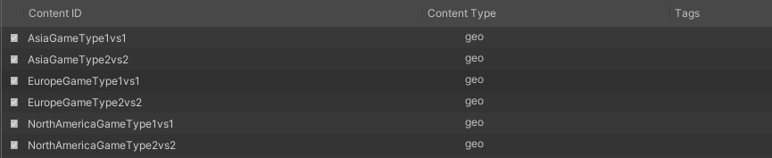
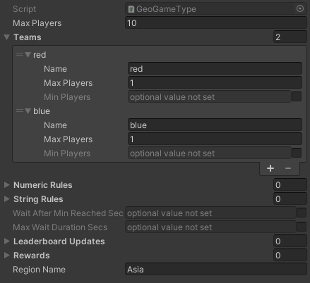
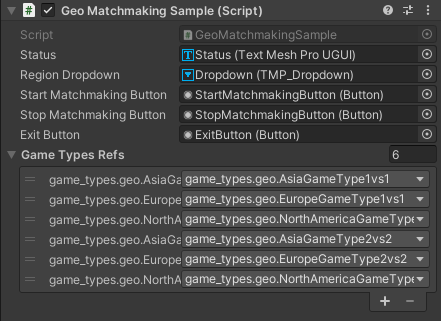
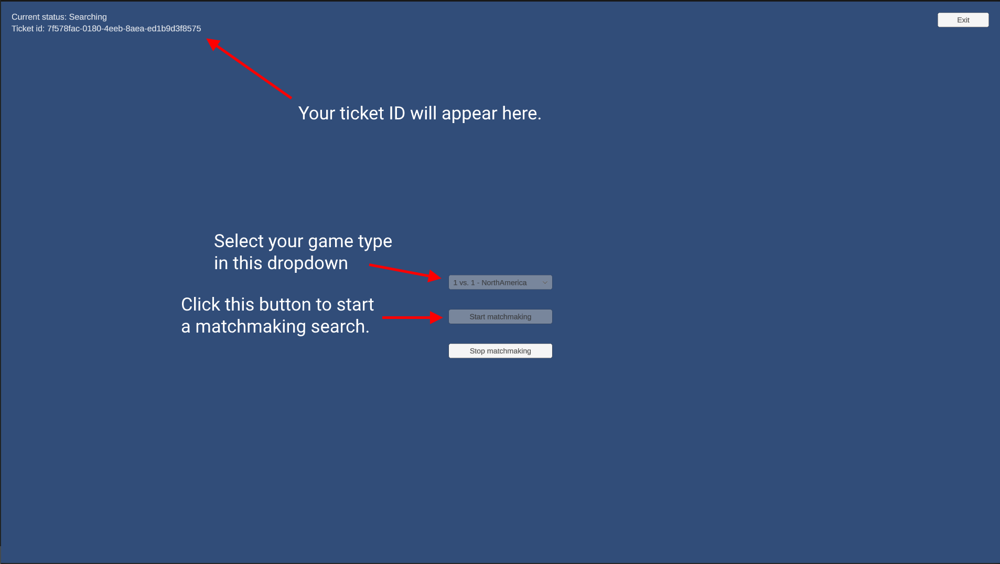

# Game Type Matchmaking

Match players together based on region of the world

## Overview

This is a **code-only** sample project demonstrating game type based matchmaking. A core concept of the matchmaking system is game types, and Game Makers have the option to silo matchmaking pools by game type. This can have multiple usages:

• Limiting matchmaking by the game rules (for example, King Of The Hill players shouldn't be matched with Capture The Flag players)  
• Grouping different competitive leagues to play together

In this example, game types are used to only match players in a specific region of the world. Matching players in different regions may not be a good fit for some games, such as competitive multiplayer games, or games featuring region-specific content. This is the primary use-case demonstrated in the sample project.

## Download

Learning Resources:

| Source | Detail |
|--------|--------|
| {width="35px"} | 1. **Download** the [Game Type Based Matchmaking Example](https://github.com/beamable/GameTypeBasedMatchmakingExample)<br>2. Open in Unity Editor (Version 2021.3 or later)<br>3. Open the Beamable [Toolbox](../../user-reference/toolbox.md)<br>4. Sign-In / Register To Beamable. See [Step 1 - Getting Started](../../getting-started/index.md) for more info<br>5. Install TextMeshPro in the project. This can be done through the prompt in the Beamable toolbox.<br><br>*Note: Beamable supports Unity versions 2021.3 to 2023.3* |

## Project Structure

In the project's content, you will see a custom content type underneath game_types: `geo`. This is a simple extension of the SimGameType class, adding in a `RegionName` string, with the appropriate ContentLink and ContentRef subclasses.

```csharp
using System;
using Beamable;
using Beamable.Common.Content;

namespace MatchmakingExample
{
    [Serializable]
    public class GeoGameTypeLink : ContentLink<GeoGameType>{}
    
    [Serializable]
    public class GeoGameTypeRef : ContentRef<GeoGameType> {}
    
    [ContentType("geo")]
    [Serializable]
    public class GeoGameType : SimGameType
    {
        public string RegionName;
    }
}
```

## Step 1. Create Content

For this example, we'll be creating a few game types for some different regions of the world: North America, Europe, and Asia.

!!! info "Game Content Designer"

    For more info on how to manage content in your project, check out the [Game Content Designer](../../user-reference/content-manager.md) documentation.



## Step 2. Configure Content

Configure the content on the game type with the appropriate region name. Of course, these values can be tweaked for your game's specifications.

{width="600px"}

*Game type for the Asia region, with a 1 vs 1 configuration.*

{width="600px"}

*Game type for the Europe region, with a 2 vs 2 configuration.*

## Step 3. Configure Sample Data

The "Geo" scene in the project is partially configured to test this functionality. The scene contains a dropdown that will be populated with game types at runtime, and buttons to start and stop the matchmaking search. On the MatchmakingSample object (under the Canvas), edit the Geo Matchmaking Sample component and add your matchmaking types to the Game Types Refs list.

{width="600px"}

## Step 4. Run & Test

You will need 2 instances of the project running in order to test. This can be accomplished in 2 ways:

• Create a build for your target platform, and run 2 instances of it, or  
• Run 2 instances of the project in the Unity Editor, which may require 2 machines

Once you have 2 games running, select the same game type on both instances and click the Start Matchmaking button and they will be matched. To validate the game type filtering, change the game type on one of the machines. This will create a mismatch, then start matchmaking again and observe that the two players are not matched up.


