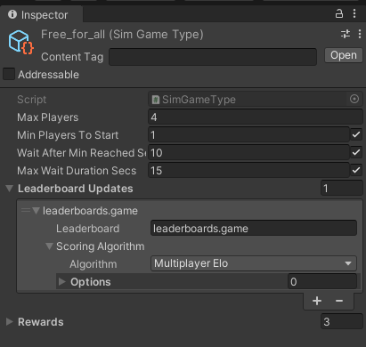
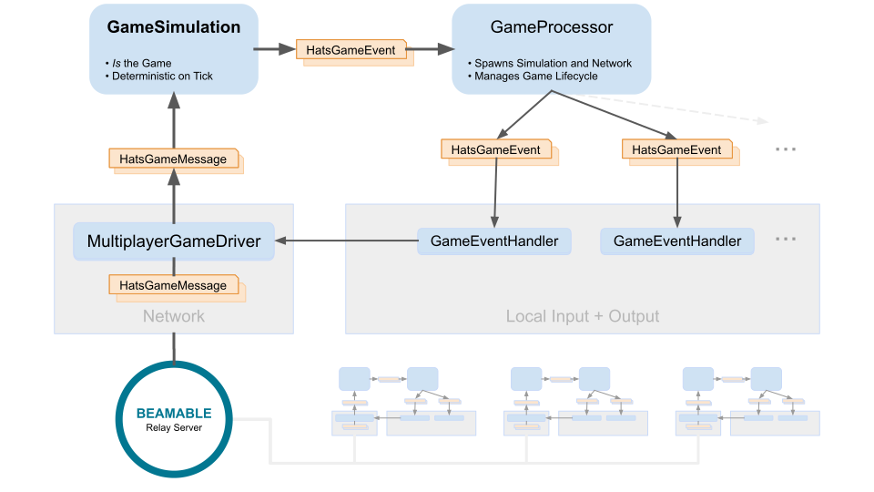
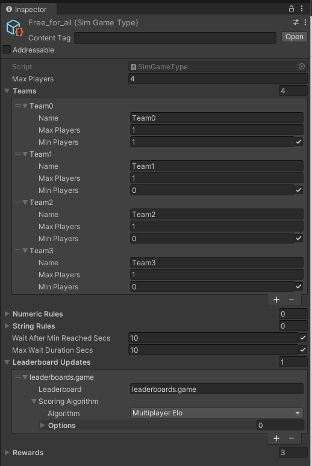

# Head Adornment Test Scenario - Multiplayer Sample

Welcome to "HATS" (Head Adornment Test Scenario). In this game, **Think ahead quickly, because there's absolutely no headroom here. The coolest head prevails.**

!!! info "Related Features"

    Related Features:

    • [Matchmaking](matchmaking-feature-overview.md) - Connect remote players in a room  
    • [Multiplayer](multiplayer-feature-overview.md) - Real-time multiplayer game functionality that enables multiple players to interact in shared game sessions

## Screenshots


## Multiplayer (HATS) - Guide

This downloadable sample game project showcases the Beamable [Multiplayer](multiplayer-feature-overview.md) Feature.

## Download

Learning Resources:

| Source | Detail |
|--------|--------|
| {width="35"} | 1. **Download** the [HATS Sample Game](https://github.com/beamable/Hats_Sample_Game)<br/>2. Open in Unity Editor (Version 2021.3 or later)<br/>3. Open the Beamable [Toolbox](toolbox.md)<br/>4. Sign-In / Register To Beamable. See [Step 1 - Getting Started](getting-started.md) for more info<br/>5. Open the `Scene01Intro` Scene<br/>6. Play The Scene: Unity → Edit → Play<br/>7. Click "Play" for an easy start. Or do a standalone build of the game and run the build. Then run the Unity Editor. In both running games, choose "Play" to play against yourself.<br/>_You need to rebuild [Addressable Asset Groups](https://docs.unity3d.com/Packages/com.unity.addressables@1.4/manual/AddressableAssetsGettingStarted.html) before doing a standalone build. To build content in the Editor, open the Addressables Groups window, then select Build > New Build > Default Build Script._<br/>8. Enjoy!<br/><br/>*Note: Sample projects are compatible with the latest supported Unity versions |

### Rules of the Game

- Up to four players enter the hexagonal grid and play one round in a series of turns
- In each turn, choose between four actions:

1. Move: Go to a free grid cell around you
2. Shield: Don't move, but be resistant to incoming fireballs or arrows
3. Fireball: Shoot a fireball across the grid
4. Arrow: Shoot an arrow

- Commit your turn before the turn times out!
- If you get hit by a fireball, an arrow or get in touch with lava, you die.
- Last player alive wins.

_Lava expands! Pay attention to grid cells that are starting to crumble._

## Game Maker User Experience

The game maker user experience shows the development workflow. There are several major parts to this game creation process.

## Steps

Here are the steps to implement the sample:

These steps are **already complete** in the sample project. The instructions here explain the process.

!!! info "Related Features"

    Related Features:

    • [Matchmaking](matchmaking-feature-overview.md) - Connect remote players in a room  
    • [Multiplayer](multiplayer-feature-overview.md) - Real-time multiplayer game functionality that enables multiple players to interact in shared game sessions

### Step 1. Setup Project

Here are instructions to setup the Beamable SDK and "GameType" content.

| Step | Detail |
|------|--------|
| 1. Install the Beamable SDK and Register/Login | • See [Step 1 - Getting Started](getting-started.md) for more info. |
| 2. Open the Content Manager Window | • Unity → Window → Beamable → Open Content Manager |
| 3. Create the "GameType" content | {width="200" style="float: right; margin: 0px 0px 15px 15px;"}<br/><br/><br/>• Select the content type in the list<br/>• Press the "Create" button<br/>• Populate the content name |
| 4. Configure "GameType" content | <br/>• Populate the `Max Players` field<br/>_Note: The other fields are optional and may be needed for advanced use cases like Matchmaking._ |
| 5. Save the Unity Project | • Unity → File → Save Project<br/>_Best Practice: If you are working on a team, commit to version control in this step_ |
| 6. Publish the content | • Press the "Publish" button in the Content Manager Window |

### Step 2. Plan the Multiplayer Game Design

See [Multiplayer (Plan the Multiplayer Game Design)](multiplayer-feature-overview.md#plan-the-multiplayer-game-design) for more info.

### Step 3. Create the Game Code

This step includes the bulk of time and effort in the project.

| Step | Detail |
|------|--------|
| 1. Create C# game-specific logic | • Implement game logic<br/>• Handle player input<br/>• Render graphics & sounds<br/><br/>_Note: This represents the bulk of the development effort. The details depend on the specifics of the game project._ |

### Step 4. Create the Multiplayer Code

_In this section you will find some partial code snippets. Download the project to see the complete code._

| Step | Detail |
|------|--------|
| 1. Create C# Multiplayer-specific logic | • Create event objects<br/>• Send outgoing event<br/>• Handle incoming events<br/><br/>_Note: Its likely that game makers will add multiplayer functionality **throughout** development including during step #3. For sake of clarity, it is described here as a separate, final step #4._ |
| 2. Play the `Scene01Intro` Scene | • Unity → Edit → Play |
| 3. Enjoy the game! | • Can you beat the opponents? |
| 4. Stop the Scene | • Unity → Edit → Stop |

**Multiplayer Game Simulation**

HATS uses a deterministic simulation networking model. All network messages (`HatsGameMessage`) are broadcast to every client and fed into a local per-client instance of `GameSimulation`. The simulation, in turn, locally generates a series of `HatsGameEvent` to be consumed by MonoBehaviours that manage graphics and audio per GameObjects,

`SpawnEventHandler`, for instance, instantiates a new player GameObject when receiving a `PlayerSpawnEvent`;

SpawnEventHandler.cs
```csharp
public override IEnumerator HandleSpawnEvent(PlayerSpawnEvent evt, Action callback)
{
	Debug.Log("Spawning player " + evt.Player.dbid);
	yield return null;
	var playerGob = Instantiate(playerPrefab, GameProcessor.BattleGridBehaviour.Grid.transform);
	playerGob.Setup(GameProcessor, evt.Player);
	var localPosition = GameProcessor.BattleGridBehaviour.Grid.CellToLocal(evt.Position);
	playerGob.transform.localPosition = localPosition;
	callback();
}
```

Local player input is captured and converted to network messages via `PlayerMoveBuilder`:

PlayerMoveBuilder.cs
```csharp
public void CommitMove()
{
	moveBuilderState = PlayerMoveBuilderState.COMMITTED;
	NetworkDriver.DeclareLocalPlayerAction(new HatsPlayerMove
	{
		Dbid = PlayerDbid,
		TurnNumber = GameProcessor.Simulation.CurrentTurn,
		Direction = MoveDirection,
		MoveType = MoveType
	});
}
```

_Keep in mind that **all** messages are broadcast to **every** client, including the one that sent the message in the first place._

The `GameProcessor` spins up the game simulation (`GameSimulation`) and the network layer (`MultiplayerGameDriver`), connecting both with each other:

GameProcessor.cs
```csharp
public void StartGame(List<long> dbids, BotProfileContent botProfileContent)
{
	var messageQueue = MultiplayerGameDriver.Init(roomId, framesPerSecond, new List<long>());

	var players = dbids.Select(dbid => new HatsPlayer
	{
		dbid = dbid
	}).ToList();

	Simulation = new GameSimulation(BattleGridBehaviour.BattleGrid, framesPerSecond, _configuration, players, botProfileContent, roomId.GetHashCode(), messageQueue);
	BattleGridBehaviour.SetupInitialTileChanges();
	StartCoroutine(PlayGame());
}
```

It continuously relays game events to local handlers:

GameProcessor.cs
```csharp
foreach (var evt in Simulation.PlayGame())
{
	currentTurn = Simulation.CurrentTurn;
	if (evt == null)
	{
		yield return null;
		continue;
	}

	switch (evt)
	{
		case PlayerSpawnEvent spawnEvt:
			yield return EventHandlers.Handle(this, spawnEvt, handler => handler.HandleSpawnEvent);
			break;
		case PlayerMoveEvent moveEvt:
			yield return EventHandlers.Handle(this, moveEvt, handler => handler.HandleMoveEvent);
			break;
...
```



**Leaderboard**

!!! info "Related Guides"

    Related Guides: It is recommended to read the guide before continuing with the sample steps below.

    • [Leaderboards](leaderboards-feature-overview.md) - Display and update per-game leaderboards

Leaderboard-related functionality is handled via `LeaderboardScreenController`. It retrieves the current leaderboard in one essential call to Beamable's leaderboard SDK:

LeaderboardScreenController.cs
```csharp
view = await beamable.LeaderboardService.GetBoard(LeaderboardRef, 0, 50, focus: beamable.User.id);
```

In `GameOverController`, the winning player updates the leaderboard when receiving a `GameOverEvent`:

GameOverController.cs
```csharp
if (isWinner)
	_beamableAPI.LeaderboardService.IncrementScore(_leaderboardRef.Id, 1);
```

**Inventory**

!!! info "Related Guides"

    Related Guides: It is recommended to read the guide before continuing with the sample steps below.

    • [Inventory](inventory-feature-overview.md) - Define player inventory and offer items in a store

HATS offers players to buy characters and hats, both being purely decorative items without any effect on gameplay. Players need to earn Gems to buy these items. All items are subtypes of Beamable's `ItemContent` and are managed by the [Beamable Content Manager](content-manager.md). Transactions and available shop listings are handled by `CharacterPanelController`, going hand in hand with `PlayerInventory`:

CharacterPanelController.cs
```csharp
public async Task PopulateCharacterShop()
{
	var beamable = await Beamable.API.Instance;
	var shop = await beamable.CommerceService.GetCurrent(CharacterShopRef.Id);
	var playerCharacters = await PlayerInventory.GetAvailableCharacters();
	foreach (var listing in shop.listings)
	{
		var itemContentId = listing.offer.obtainItems[0].contentId;
		var hasCharacterAlready = playerCharacters.Any(character => character.Id.Equals(itemContentId));
		if (hasCharacterAlready) continue; // skip this listing because the player already owns the take
		...
	}
}
```

PlayerInventory.cs
```csharp
public static async Task<List<CharacterContent>> GetAvailableCharacters()
{
	var beamable = await Beamable.API.Instance;
	var characters = await beamable.InventoryService.GetItems<CharacterContent>();
	...
}
```

## Additional Experiments

Here are some optional experiments game makers can complete in the sample project.

Did you complete all the experiments with success? We'd love to hear about it. [Contact us](https://www.beamable.com/contact-us).

| Difficulty | Scene | Name | Detail |
|------------|-------|------|--------|
| Beginner | - | Give yourself gems without winning even a single game | _Hint: There is one default [Currency](virtual-currency-feature-overview.md) type_ |
| Beginner | All Scenes | Change game asset to create a new theme (SciFi, Fantasy, ...) | • Replace (or add) all visible textures and sprites in UI and the game itself<br/>• If you add assets, update all image references accordingly |
| Intermediate | All Scenes | Add more characters, hats or tile types | • Find the birthday hat and offer a normal and a drunk version<br/>• To add a new character, both Prefab and Content need to be updated. Start with duplicating and adapting an existing character Prefab.<br/>• Tile types: Have a look at BattleGrid.<br/><br/>_Hint: All of that requires [Content](content-feature-overview.md) changes_ |
| Intermediate | Scene02Game | Make a surrendered player carry a white flag | • A player can be dead in two ways now<br/>• Adapt the way that players are rendered accordingly |
| Advanced | Scene02Game | Add arrow frenzy | • Add a powerup that shoots arrows in all directions at once. It should only last one turn.<br/>• Little Twist: Shoot arrows sequentially, in clockwise order |
| Advanced | All Scenes | Make the game 3D | • For starters, leave GameSimulation alone and work your way through BattleGrid first |

## Matchmaking

In multiplayer gaming, matchmaking is the process of choosing a room based on criteria (e.g. "Give me a room to play in with 2 total players of any skill level"). Beamable supports matchmaking through its matchmaking service.

See [Matchmaking](matchmaking-feature-overview.md) for more info.

For HATS, a single catch-all GameType is used, allowing the player to play against up to three bots **or** other human contenders, waiting 10 seconds until the match starts.



`MatchmakingBehaviour` handles all Matchmaking-related functionality. As soon as a match is found, the 'Scene02Game' scene is loaded:

MatchmakingBehaviour.cs
```csharp
MatchmakingHandle = await _api.Experimental.MatchmakingService.StartMatchmaking(
	GameTypeRef.Id,
	maxWait: TimeSpan.FromSeconds(_configuration.OverrideMaxMatchmakingTimeout),
	updateHandler: handle =>
	{
		// No updates available at the moment when searching a match.
	},
	readyHandler: handle =>
	{
		Debug.Assert(handle.State == MatchmakingState.Ready);

		var dbids = MatchmakingHandle.Status.Players;
		var gameId = MatchmakingHandle.Status.GameId;
		var matchId = handle.Match.matchId;

		Debug.Log($"Match is ready! Found matchID={matchId} gameId={gameId}");
		Debug.Log($"Starting match with DBIDs={string.Join(",", dbids.ToArray())}");

		List<long> dbidsAsLong = dbids.Select(i => long.Parse(i)).ToList();
		HatsScenes.LoadGameScene(gameId, dbidsAsLong);
	},
	timeoutHandler: handle =>
	{
		Debug.Log($"Matchmaking timed out! state={handle.State}");
		IsSearching = false;
		OnTimedOut?.Invoke();
	}
);
```

## Game Security

See [Multiplayer (Game Security)](multiplayer-feature-overview.md#game-security) for more info.

## Playing "Against Yourself"

See [Multiplayer (Playing Against Yourself)](multiplayer-feature-overview.md#playing-against-yourself) for more info.

## Randomization and Determinism

See [Multiplayer (Randomization and Determinism)](multiplayer-code.md#randomization-and-determinism) for more info.
