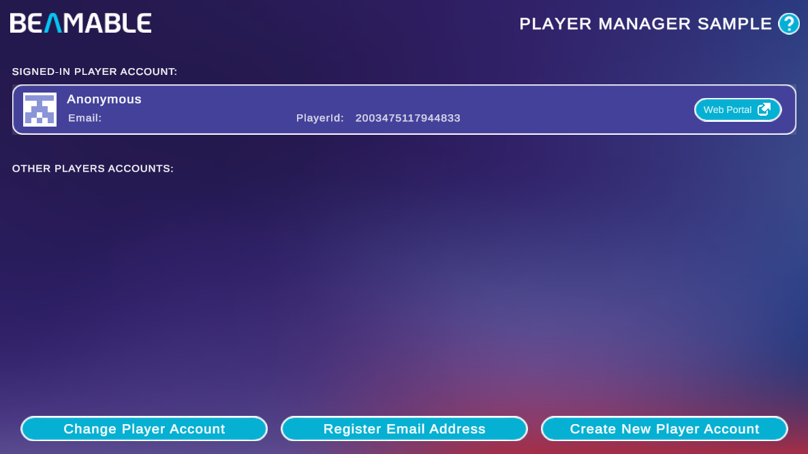

# Player Account Manager Sample

The Player Account Manager Sample demonstrates Beamable's identity system — a service that lets players create accounts, attach email and password credentials, and manage account aliases and avatars.

{width=800px}

There are no prerequisites for this sample. It shows you how to:

- View the currently signed-in player account, including name, email, and Player Id
- Register an email address and password for an anonymous account
- Create additional player accounts within the same session
- Switch between multiple player accounts

## Sample Overview

When you open the scene, the **Signed-In Player Account** section displays the active account card. Each card shows the player's avatar, display name, email (if registered), Player Id, and a **Web Portal** button that opens the player's record directly in [https://portal.beamable.com](https://portal.beamable.com).

The **Other Players Accounts** section lists any additional accounts created during the session. Click a card there to switch the active account.

Three actions are available at the bottom of the screen:

| Button | Description |
|---|---|
| **Change Player Account** | Switches the signed-in account to one of the other player accounts listed |
| **Register Email Address** | Attaches an email and password to the current anonymous account, converting it to a registered account |
| **Create New Player Account** | Creates a new anonymous player account and adds it to the **Other Players Accounts** list |

!!! tip "Read the SDK Docs"
    Learn about credential attachment, account switching, and alias management in the [Username / Password](../user-reference/beamable-services/identity/username-password.md) reference.

!!! tip "Visit Portal"
    Go to [https://portal.beamable.com](https://portal.beamable.com) to manage player accounts from the developer side. Use the **Web Portal** button on any account card to jump directly to that player's record.
