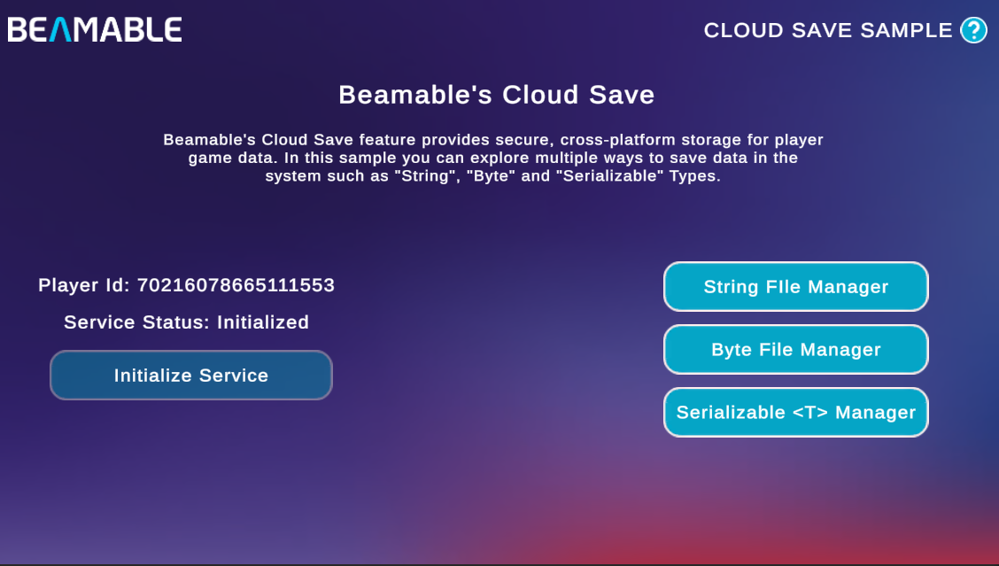

# Cloud Save Sample

The Cloud Save Sample demonstrates how to use Beamable's [Cloud Save](../user-reference/beamable-services/profile-storage/cloud-save.md) system to persist and sync player data across devices.

{width=800px}

This sample shows you how to:

- Initialize the `ICloudSavingService` and subscribe to its events
- Save and load data as strings, byte arrays, and serialized objects
- Force-upload local data or force-download cloud data
- Perform batched manifest updates using `CloudDataUpdateBuilder`
- Handle data conflicts between local and cloud saves

## Sample Overview

When you open the sample, the home screen displays your **Player Id** and the current **Service Status**. Before exploring any of the file managers, click **Initialize Service** to start the `ICloudSavingService`. The status updates to `Initialized` once the service is ready.

From the home screen you can navigate to three managers, each covering a different save format:

| Manager | Data Format | API Used |
|---|---|---|
| **String File Manager** | Plain text | `SaveData(string)` / `LoadDataString()` |
| **Byte File Manager** | Raw bytes | `SaveData(byte[])` / `LoadDataByte()` |
| **Serializable \<T\> Manager** | JSON-serialized objects | `SaveData<T>()` / `LoadData<T>()` |

Each manager lets you create, read, and update files so you can observe how the service syncs changes to the cloud.

!!! tip "Read the SDK Docs"
    Learn more about the Cloud Save API in the [Cloud Save](../user-reference/beamable-services/profile-storage/cloud-save.md) reference.

!!! tip "Visit Portal"
    Go to [https://portal.beamable.com](https://portal.beamable.com) to inspect and manage player cloud data from the developer side. Search for a player and open the **CloudData** tab.

