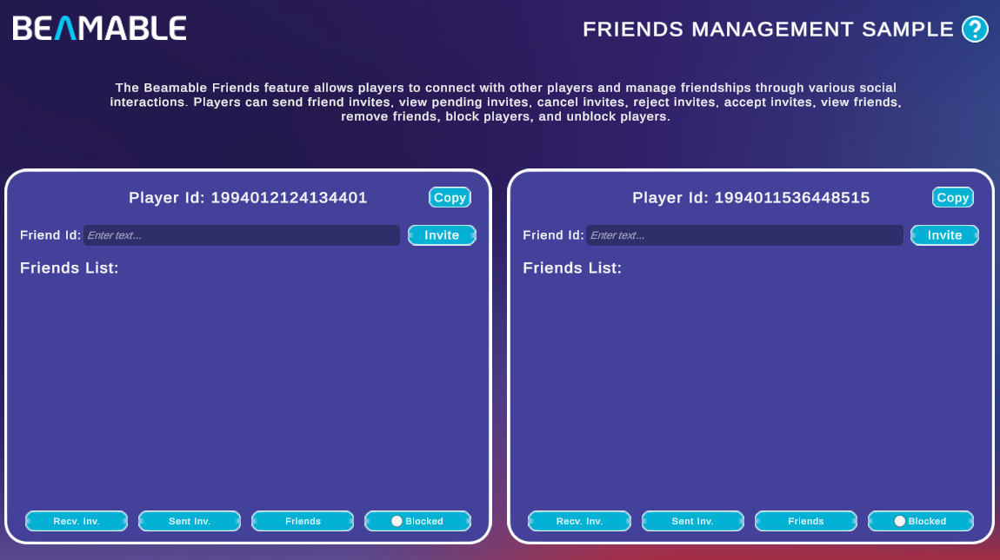

# Friends Management Sample

The Friends Management Sample demonstrates Beamable's [Friends](../user-reference/beamable-services/social-networking/friends.md) feature — a social system that lets players connect, manage invitations, and block other players.

{width=800px}

There are no prerequisites for this sample. It shows you how to:

- Send friend invites to another player by Player Id
- View received and sent invitations
- Accept or reject received invites and cancel sent invites
- View your confirmed friends list and remove friends
- Block and unblock players

## Sample Overview

The sample loads two independent **Player Contexts** side by side (P1 left, P2 right), each representing a separate player. Each panel displays the player's **Player Id** and a **Copy** button for sharing it with the other panel.

To send a friend invite, paste the target player's Id into the **Friend Id** field and click **Invite**. The bottom of each panel has four tabs that filter the list area:

| Tab | Description |
|---|---|
| **Recv. Inv.** | Lists invitations received from other players. Each entry has **Accept** and **Reject** actions |
| **Sent Inv.** | Lists invitations the current player has sent. Each entry has a **Cancel** action to withdraw the invite |
| **Friends** | Lists confirmed friends. Each entry has a **Remove** action to end the friendship |
| **Blocked** | Toggle that switches the list to show blocked players and lets you **Unblock** them |

A typical two-player flow looks like this:

1. Copy P1's **Player Id** using its **Copy** button
2. Paste the Id into the **Friend Id** field on P2's panel and click **Invite**
3. Switch to P1's **Recv. Inv.** tab — the incoming invite from P2 appears there
4. Click **Accept** on P1 to confirm the friendship
5. Both players now see each other under the **Friends** tab

!!! tip "Read the SDK Docs"
    Learn about all Friends API methods — sending, accepting, canceling, blocking, and presence — in the [Friends](../user-reference/beamable-services/social-networking/friends.md) reference.

!!! tip "Visit Portal"
    Go to [https://portal.beamable.com](https://portal.beamable.com) to inspect player social data from the developer side. Search for a player to view their friends and blocked-player lists.
