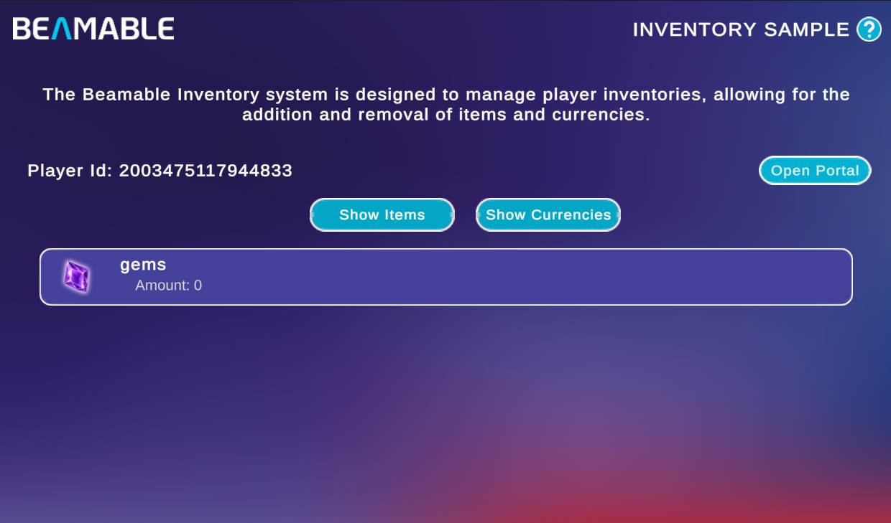
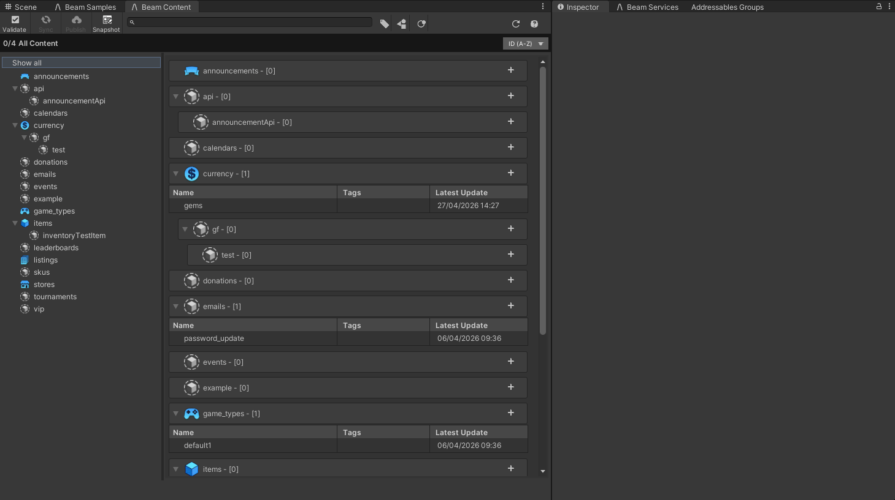
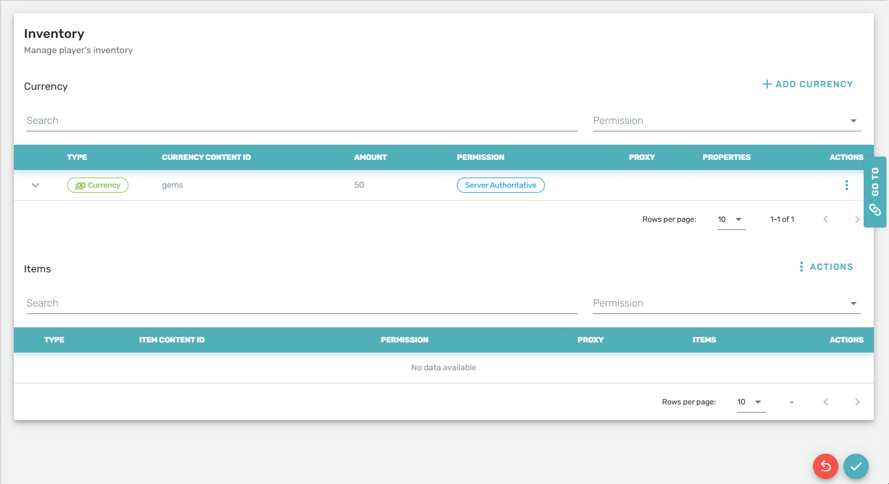

# Inventory Sample

The Inventory Sample demonstrates Beamable's [Inventory](../user-reference/beamable-services/game-economy/inventory-overview.md) system — a service that manages owned items and currencies per player.

{width=800px}

This sample shows you how to:

- Collect and display items and currencies from the player's inventory

## Prerequisites

The Inventory system is content-driven. Before entering Playmode, you must create at least one item in the Content Manager and grant it to the player in Portal.

### 1. Create an item in the Content Manager

{width=800px}

1. Open the Content Manager (**Beamable → Open Beam Content**).
3. Click the **+** button next to **inventoryTestItem** type to add a new entry of this type.
4. Give the item a name (for example, `MyItem`) — the full content Id is generated automatically as `items.inventoryTestItem.MyItem`.
5. Add a Icon if you wish. Icons are displayed in the inventory list.
6. Click **Publish** to push the new content to your realm.

!!! info "Pre-existing content type"
    The `inventoryTestItem` content group, based on the `InventoryTestItem` content type, is already included in the sample project. You only need to add entries within that group.

### 2. Grant the item to a player in Portal

{width=800px}

1. Enter Playmode and click **Open Portal** — this takes you directly to the player's Inventory page on the portal.
2. Click **Actions → Add Item** in the **Items** section.
3. Choose the content item you published in the previous step and confirm.

!!! warning "Publish before granting"
    The item must be published from the Content Manager before it appears in Portal's item picker. Unpublished content is unavailable on the server.

!!! info "Try it with currencies too"
    The sample includes a **gems** currency you can experiment with. On the player's Inventory page in Portal, click **+ Add Currency** in the **Currency** section, select `gems`, set an amount, and confirm. Switch to **Show Currencies** in the sample to see the balance reflected.

## Sample overview

When you open the scene, the home screen displays your **Player Id** and an **Open Portal** button that takes you directly to your player record on the Portal.

Use the two toggle buttons to switch the list view:

| Button | Description |
|---|---|
| **Show Items** | Lists all inventory items currently owned by the player, showing each item's display name and content Id |
| **Show Currencies** | Lists all currency balances currently held by the player |

After granting an item or currency through Portal, refresh the list changing the tab to see the updated inventory reflected in the sample.

!!! tip "Read the SDK Docs"
    Learn about the full Inventory API — fetching, updating, and transacting items and currencies — in the [Inventory Overview](../user-reference/beamable-services/game-economy/inventory-overview.md) reference.

!!! tip "Visit Portal"
    Go to [https://portal.beamable.com](https://portal.beamable.com) to view and edit player inventories from the developer side. Search for a player and open the **Inventory** tab.
