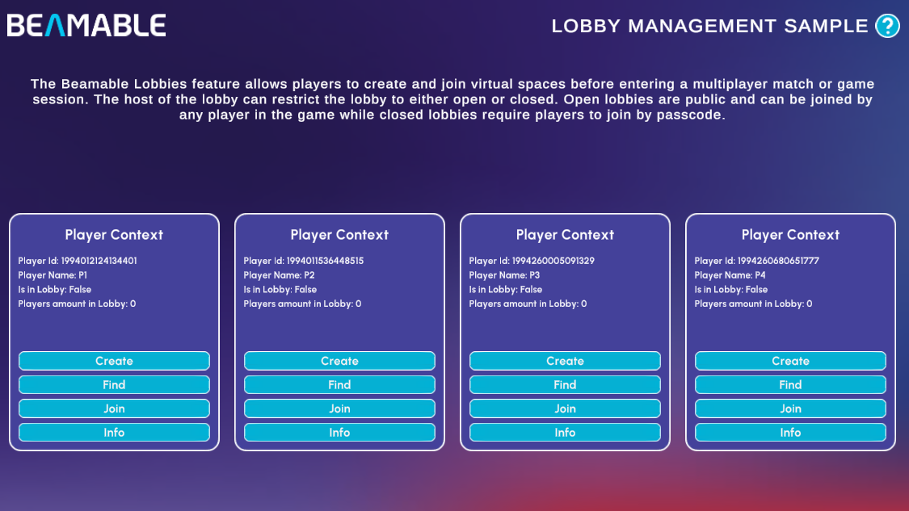

# Lobby Sample

The Lobby Sample demonstrates Beamable's [Lobbies](../user-reference/beamable-services/social-networking/lobbies.md) feature — virtual waiting spaces players join before entering a multiplayer match.

{width=800px}

There are no prerequisites for this sample. It shows you how to:

- Create open and closed lobbies identified by a custom name
- Find existing lobbies by name
- Join a lobby by name (open) or passcode (closed)
- Inspect live lobby state, including player count and lobby metadata

## Sample overview

The sample loads four independent **Player Contexts** side by side (P1–P4), each representing a separate player. Each context panel displays the player's ID, name, lobby membership status, and the current number of players in the lobby.

Every player context has four actions:

| Action | Description |
|---|---|
| **Create** | Opens the **Lobby Creation** form. Enter a **Lobby Name** and optional **Description**, then toggle **Closed Lobby** to choose the restriction type. Leaving the toggle off creates an **Open** lobby; enabling it creates a **Closed** lobby that generates a passcode automatically. Click **Create Lobby** to confirm |
| **Find** | Searches for available lobbies by name |
| **Join** | Joins an existing lobby by name (open) or passcode (closed) |
| **Info** | Displays the full lobby details: name, host, `lobbyId`, passcode (if closed), description, and the current player list. Use the **Copy** buttons next to the `lobbyId` and passcode to share them with other player panels |

A typical multi-player flow looks like this:

1. Click **Create** on P1's panel, fill in the form, and confirm
2. Click **Info** on P1 to reveal the lobby name (and passcode for closed lobbies) — use **Copy** to grab it
3. Click **Join** on P2, P3, or P4 and paste the copied value to join the same lobby

!!! tip "Read the SDK Docs"
    Learn about all Lobby API methods — creating, updating, finding, and joining lobbies — in the [Lobbies](../user-reference/beamable-services/social-networking/lobbies.md) reference.

!!! tip "Visit Portal"
    Go to [https://portal.beamable.com](https://portal.beamable.com) to view and manage lobby data from the developer side.
