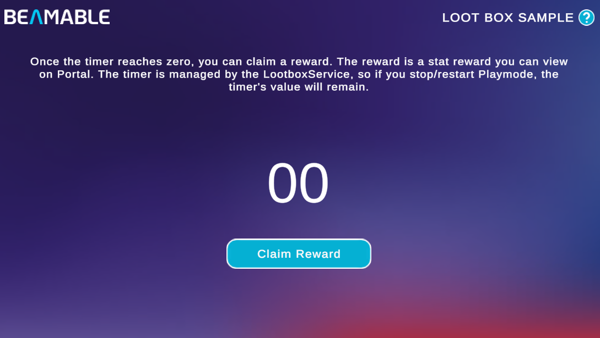

# Loot Box Sample

The Loot Box Sample demonstrates a timer-gated reward system backed by a Beamable Microservice.

{width=800px}

This sample shows you how to:

- Store a last-claim timestamp in Player Stats and read it from a Microservice
- Use a server-managed countdown to gate a reward claim
- Grant a gem currency reward via the Inventory system on a successful claim
- Persist the timer state across Playmode restarts using Player Stats

## Prerequisites

This sample requires the `LootboxService` Microservice to be running locally. Before entering Playmode:

1. Open the **Beam Services** window (**Beamable → Open Beam Services**).
2. Select **LootboxService** from the service dropdown.
3. Click the **Run** button and wait until the service status turns active.

!!! warning "Service must be running"
    Without the `LootboxService` running, the timer will not load and the **Claim Reward** button will not function.

## Sample overview

When you open the scene, the home screen shows a countdown timer. On startup, the sample reads the last-claim timestamp stored in the player's Stats. The `LootboxService` Microservice uses that timestamp to calculate how much time has elapsed and how long remains before the next claim.

Once the timer reaches zero, click **Claim Reward**. The Microservice validates the claim, adds a gem currency to the player's Inventory, and writes a new last-claim timestamp back to Stats — resetting the timer.

Because the timestamp lives in Player Stats rather than local Unity state, the timer persists correctly when you stop and restart Playmode.

!!! tip "Read the SDK Docs"
    Learn how to build and expose your own Microservice methods in the [Unity Microservices Integration](../user-reference/cloud-services/microservices/microservice-unity-integration.md) reference. See how timestamps are stored in the [Stats](../user-reference/beamable-services/profile-storage/stats.md) reference.

!!! tip "Visit Portal"
    Go to [https://portal.beamable.com](https://portal.beamable.com) to verify the gem currency reward after claiming. Search for a player and open the **Inventory** tab.
