# King of the Ring - Multiplayer Sample

Welcome to "King of the Ring" (KOR). You must **Attack with power & dodge with speed! Last player alive, wins.**

!!! info "Related Features"

    • [Matchmaking](../user-reference/beamable-services/social-networking/connectivity.md) - Connect remote players in a room  
    • [Multiplayer](../user-reference/beamable-services/social-networking/connectivity.md) - Real-time multiplayer game functionality that enables multiple players to interact in shared game sessions

## Screenshots

The player navigates from the Intro Scene to the Game Scene, where all the action takes place.

| Intro Scene | Lobby Scene |
|:------------|:------------|
| 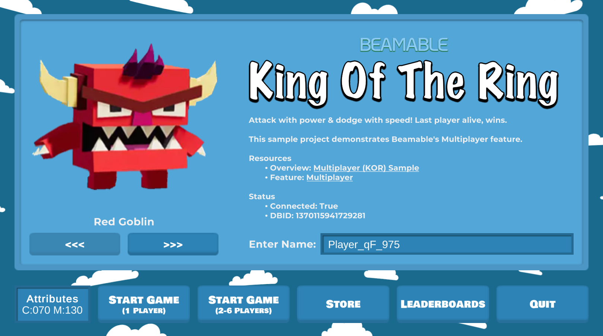{width="425"} | 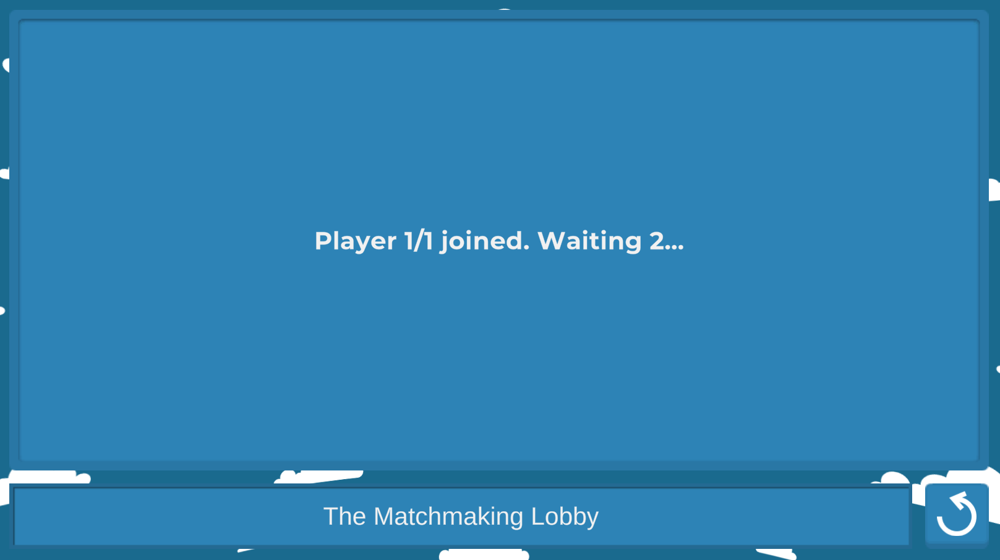{width="425"} |

| Game Scene | Store Scene |
|:-----------|:------------|
| 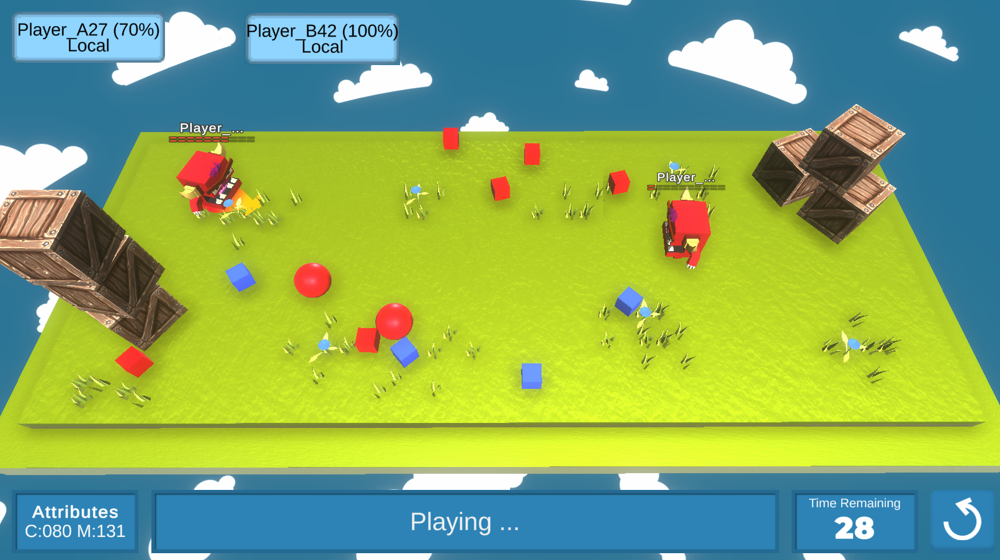{width="425"} | 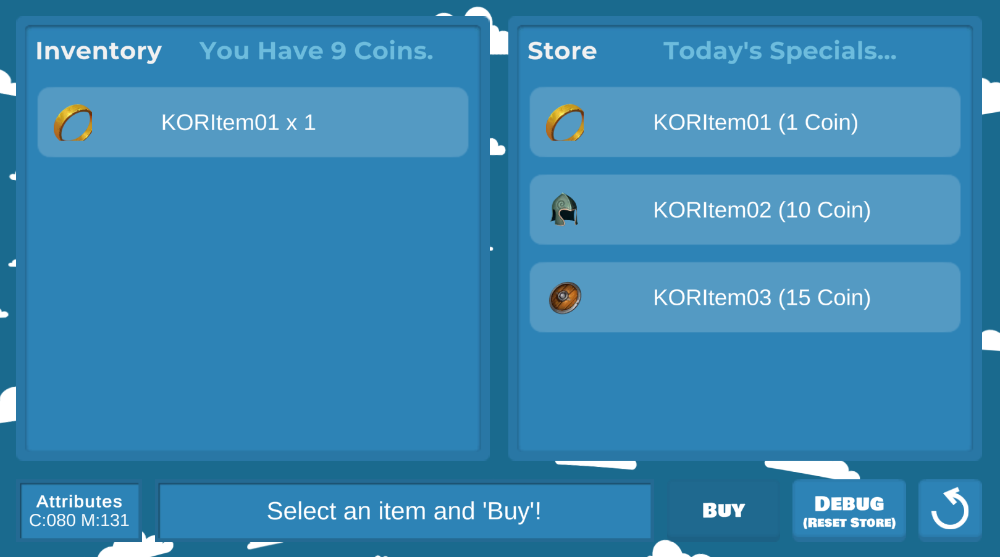{width="425"} |

| Leaderboard Scene | Project Window |
|:------------------|:---------------|
| 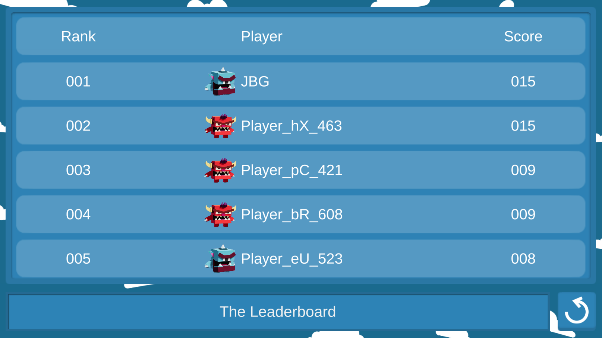{width="425"} | 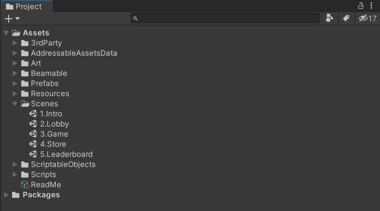{width="425"} |

## Multiplayer (KOR) - Guide

This downloadable sample game project showcases the [Multiplayer](../user-reference/beamable-services/social-networking/multiplayer.md) feature in game development. Or watch this video:

<div style="position: relative; padding-bottom: 56.25%; height: 0;">
  <iframe src="https://www.youtube.com/embed/UmtIWE01WXA?autoplay=0&fs=1" 
          style="position: absolute; top: 0; left: 0; width: 100%; height: 100%;" 
          allowfullscreen>
  </iframe>
</div>

## Download

Learning Resources:

| Source | Detail |
|--------|--------|
| {width="35"} | 1. **Download** the [Multiplayer KOR Sample Project](https://github.com/beamable/Multiplayer_KOR_Sample_Project)<br/>2. Open in Unity Editor (Version 2021.3 or later)<br/>3. Open the Beamable [Toolbox](../user-reference/editor-systems/unity-editor-login.md)<br/>4. Sign-In / Register To Beamable. See [Installing Beamable](../getting-started/installing-beamable.md) for more info<br/>5. Rebuild the Unity [Addressables](https://docs.unity3d.com/Packages/com.unity.addressables@1.3/manual/AddressableAssetsDevelopmentCycle.html): Unity → Window → Asset Management → Groups, then Build → Update a Previous Build<br/>6. Open the `1.Intro` Scene<br/>7. Play The Scene: Unity → Edit → Play<br/>8. Click "Start Game: Human vs Bot" for an easy start. Or do a standalone build of the game and run the build. Then run the Unity Editor. In both running games, choose "Start Game: Human vs Human" to play against yourself<br/>9. Enjoy!<br/><br/>*Note: Sample projects are compatible with the latest supported Unity versions* |

### Rules of the Game

- 2-6 players enter the battle "ring"
- Tap and hold anywhere in the ring to move your player
- Collide with other players to bump them
- An player who falls out of the ring, loses shield points and ranking.
- The last player alive, wins!

_Pro Tip: Earn coins by playing the game. Spend coins in the store to improve your avatar._

### Player Experience Flowchart

The player experience flowchart shows the game flow and interactions between different systems.
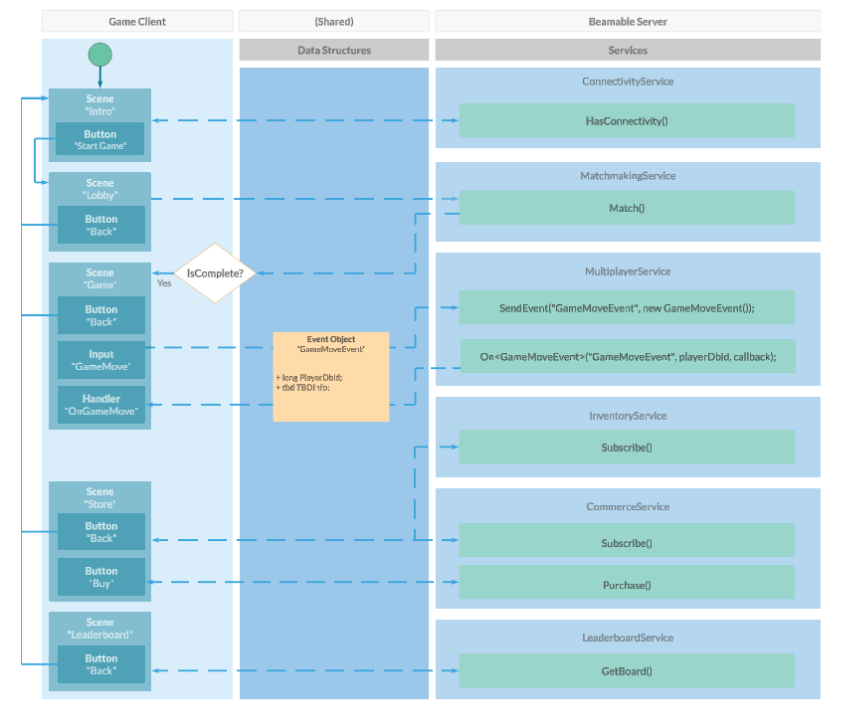{width="600px"}

## Game Maker User Experience

The game maker user experience shows the development workflow. There are several major parts to this game creation process.
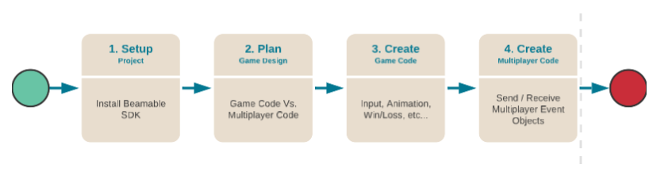{width="600px"}

## Steps

Here are the steps to implement the sample:

These steps are **already complete** in the sample project. The instructions here explain the process.

!!! info "Related Features"

    • [Matchmaking](../user-reference/beamable-services/social-networking/connectivity.md) - Connect remote players in a room  
    • [Multiplayer](../user-reference/beamable-services/social-networking/connectivity.md) - Real-time multiplayer game functionality that enables multiple players to interact in shared game sessions

### Step 1. Setup Project

Here are instructions to setup the Beamable SDK and "GameType" content.

| Step | Detail |
|------|--------|
| 1. Install the Beamable SDK and Register/Login | • See [Installing Beamable](../getting-started/installing-beamable.md) for more info. |
| 2. Open the Content Manager Window | • Unity → Window → Beamable → Open Content Manager |
| 3. Create the "GameType" content | {width="200" style="float: right; margin: 0px 0px 15px 15px;"}<br/><br/><br/>• Select the content type in the list<br/>• Press the "Create" button<br/>• Populate the content name |
| 4. Configure "GameType" content | 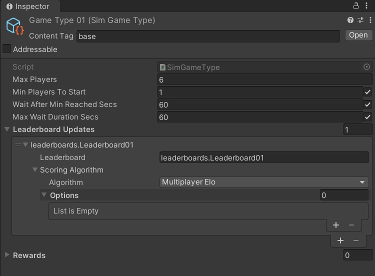<br/>• Populate the `Max Players` field<br/>_Note: The other fields are optional and may be needed for advanced use cases_ |
| 5. Save the Unity Project | • Unity → File → Save Project<br/>_Best Practice: If you are working on a team, commit to version control in this step_ |
| 6. Publish the content | • Press the "Publish" button in the Content Manager Window |

### Step 2. Plan the Multiplayer Game Design

See [Multiplayer](../user-reference/beamable-services/social-networking/multiplayer.md) for more info.

### Step 3. Create the Game Code

This step includes the bulk of time and effort the project.

| Step | Detail |
|------|--------|
| 1. Create C# game-specific logic | • Implement game logic<br/>• Handle player input<br/>• Render graphics & sounds<br/><br/>_Note: This represents the bulk of the development effort. The details depend on the specifics of the game project._ |

**Inspector**

Here is the `GameSceneManager.cs` main entry point for the Game Scene interactivity.

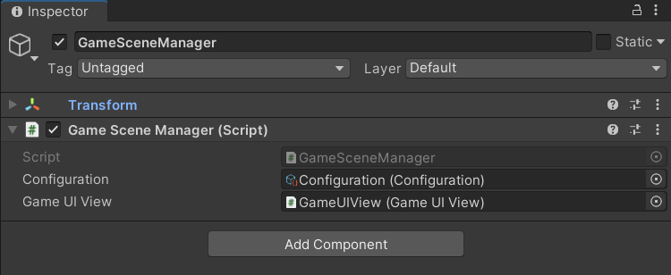{width="600"}
*The "Configuration" and "GameUIView" are passed as references*

Here is the `Configuration.cs` holding high-level, easily-configurable values used by various areas on the game code. Several game classes reference this data.

!!! warning "Gotchas"

    Here are some common issues and solutions:

    • While the name is similar, this `Configuration.cs` is wholly unrelated to Beamable's Configuration Manager.

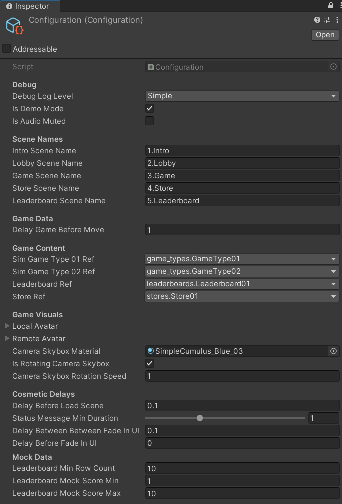{width="550"}
*The "Configuration" values are easily configurable*

_Optional: Game Makers may experiment with new **Delay** values here to allow animations to occur faster or slower._

**Code**

The `GameSceneManager` is the main entry point to the Game Scene logic.

Here a a few highlights.

**Send Game Event**

```csharp
NetworkController.Instance.SendNetworkMessage(new ReadyEvent(_ownAttributes, alias));
```

**Receive Game Event**

```csharp
private void OnPlayerReady (ReadyEvent readyEvent)
{
	// Handle consequences...
}
```

_In this section you will find some partial code snippets. Download the project to see the complete code._

GameSceneManager.cs
```csharp
using System;
using System.Collections.Generic;
using System.Linq;
using System.Threading.Tasks;
using Beamable.Examples.Features.Multiplayer.Core;
using Beamable.Samples.KOR.Behaviours;
using Beamable.Samples.KOR.Data;
using Beamable.Samples.KOR.Multiplayer;
using Beamable.Samples.KOR.Multiplayer.Events;
using Beamable.Samples.KOR.Views;
using UnityEngine;
using Beamable.Experimental.Api.Sim;
using Beamable.Samples.Core.Debugging;
using Beamable.Samples.Core.UI;
using Beamable.Samples.Core.UI.DialogSystem;
using Beamable.Samples.Core.Utilities;

namespace Beamable.Samples.KOR
{
    /// <summary>
    /// Handles the main scene logic: Game
    /// </summary>
    public class GameSceneManager : MonoBehaviour
    {
        //  Properties -----------------------------------
        public GameUIView GameUIView { get { return _gameUIView; } }
        public Configuration Configuration { get { return _configuration; } }
        public List<SpawnPointBehaviour> AvailableSpawnPoints;

        //  Fields ---------------------------------------
        private IBeamableAPI _beamableAPI = null;

        [SerializeField]
        private Configuration _configuration = null;

        [SerializeField]
        private GameUIView _gameUIView = null;

        private Attributes _ownAttributes = null;

        private List<SpawnablePlayer> _spawnablePlayers = new List<SpawnablePlayer>();
        private List<SpawnPointBehaviour> _unusedSpawnPoints = new List<SpawnPointBehaviour>();
        private HashSet<long> _dbidReadyReceived = new HashSet<long>();
        private bool _hasSpawned = false;

        //  Unity Methods   ------------------------------
        protected void Start()
        {
            for (int i = 0; i < 6; i++)
                _gameUIView.AvatarUIViews[i].GetComponent<CanvasGroup>().alpha = 0.0f;

            _gameUIView.BackButton.onClick.AddListener(BackButton_OnClicked);
            SetupBeamable();
        }

        //  Other Methods   ------------------------------
        private void DebugLog(string message)
        {
            // Respects Configuration.IsDebugLog Checkbox
            Configuration.Debugger.Log(message);
        }

        private async void SetupBeamable()
        {
            _beamableAPI = await Beamable.API.Instance;
            await RuntimeDataStorage.Instance.CharacterManager.Initialize();
            _ownAttributes = await RuntimeDataStorage.Instance.CharacterManager.GetChosenPlayerAttributes();

            // Do this after calling "Beamable.API.Instance" for smoother UI
            _gameUIView.CanvasGroupsDoFadeIn();

            // Set defaults if scene was loaded directly
            if (RuntimeDataStorage.Instance.TargetPlayerCount == KORConstants.UnsetValue)
            {
                DebugLog(KORHelper.GetSceneLoadingMessage(gameObject.scene.name, true));
                RuntimeDataStorage.Instance.TargetPlayerCount = 1;
                RuntimeDataStorage.Instance.CurrentPlayerCount = 1;
                RuntimeDataStorage.Instance.LocalPlayerDbid = _beamableAPI.User.id;
                RuntimeDataStorage.Instance.MatchId = KORMatchmaking.GetRandomMatchId();
            }
            else
            {
                DebugLog(KORHelper.GetSceneLoadingMessage(gameObject.scene.name, false));
            }

            // Set the ActiveSimGameType. This happens in 2+ spots to handle direct scene loading
            if (RuntimeDataStorage.Instance.IsSinglePlayerMode)
                RuntimeDataStorage.Instance.ActiveSimGameType = await _configuration.SimGameType01Ref.Resolve();
            else
                RuntimeDataStorage.Instance.ActiveSimGameType = await _configuration.SimGameType02Ref.Resolve();

            // Initialize ECS
            SystemManager.StartGameSystems();

            // Show the player's attributes in the UI of this scene

            _gameUIView.AttributesPanelUI.Attributes = _ownAttributes;

            // Initialize Networking
            await NetworkController.Instance.Init();

            // Set Available Spawns
            _unusedSpawnPoints = AvailableSpawnPoints.ToList();

            NetworkController.Instance.Log.CreateNewConsumer(HandleNetworkUpdate);
            // Optional: Stuff to use later when player moves are incoming
            long tbdIncomingPlayerDbid = _beamableAPI.User.id; // test value;
            DebugLog($"MinPlayerCount = {RuntimeDataStorage.Instance.MinPlayerCount}");
            DebugLog($"MaxPlayerCount = {RuntimeDataStorage.Instance.MaxPlayerCount}");
            DebugLog($"CurrentPlayerCount = {RuntimeDataStorage.Instance.CurrentPlayerCount}");
            DebugLog($"LocalPlayerDbid = {RuntimeDataStorage.Instance.LocalPlayerDbid}");
            DebugLog($"IsLocalPlayerDbid = {RuntimeDataStorage.Instance.IsLocalPlayerDbid(tbdIncomingPlayerDbid)}");
            DebugLog($"IsSinglePlayerMode = {RuntimeDataStorage.Instance.IsSinglePlayerMode}");

            // Optional: Show queueable status text onscreen
            SetStatusText(KORConstants.GameUIView_Playing, TMP_BufferedText.BufferedTextMode.Immediate);

            // Optional: Add easily configurable delays
            await Task.Delay(TimeSpan.FromSeconds(_configuration.DelayGameBeforeMove));

            // Optional: Play sound
            //SoundManager.Instance.PlayAudioClip(SoundConstants.Click01);

            // Optional: Render color and text of avatar ui
            _gameUIView.AvatarViews.Clear();
        }

        public async void OnPlayerJoined(PlayerJoinedEvent joinEvent)
        {
            if (_spawnablePlayers.Find(i => i.DBID == joinEvent.PlayerDbid) != null)
                return;

            var spawnIndex = NetworkController.Instance.rand.Next(0, _unusedSpawnPoints.Count);
            var spawnPoint = _unusedSpawnPoints[spawnIndex];
            _unusedSpawnPoints.Remove(spawnPoint);

            SpawnablePlayer newPlayer = new SpawnablePlayer(joinEvent.PlayerDbid, spawnPoint);
            _spawnablePlayers.Add(newPlayer);
            await RuntimeDataStorage.Instance.CharacterManager.Initialize();
            newPlayer.ChosenCharacter = await RuntimeDataStorage.Instance.CharacterManager.GetChosenCharacterByDBID(joinEvent.PlayerDbid);
            string alias = await RuntimeDataStorage.Instance.CharacterManager.GetPlayerAliasByDBID(joinEvent.PlayerDbid);

            DebugLog($"alias from joinEvent dbid={joinEvent.PlayerDbid} alias={alias}");

            if (joinEvent.PlayerDbid == NetworkController.Instance.LocalDbid)
                NetworkController.Instance.SendNetworkMessage(new ReadyEvent(_ownAttributes, alias));
        }

        private void OnPlayerReady(ReadyEvent readyEvt)
        {
            Configuration.Debugger.Log($"Getting ready for dbid={readyEvt.PlayerDbid}"
                                       + $" attributes move/charge={readyEvt.aggregateMovementSpeed}/{readyEvt.aggregateChargeSpeed}", DebugLogLevel.Verbose);

            _dbidReadyReceived.Add(readyEvt.PlayerDbid);

            SpawnablePlayer sp = _spawnablePlayers.Find(i => i.DBID == readyEvt.PlayerDbid);
            sp.Attributes = new Attributes(readyEvt.aggregateChargeSpeed, readyEvt.aggregateMovementSpeed);
            sp.PlayerAlias = readyEvt.playerAlias;

            Configuration.Debugger.Log($"alias from readyEvt dbid={readyEvt.PlayerDbid} alias={sp.PlayerAlias}");

            Configuration.Debugger.Log($"OnPlayerReady Players={_dbidReadyReceived.Count}/{RuntimeDataStorage.Instance.CurrentPlayerCount}", DebugLogLevel.Verbose);
            if (!_hasSpawned && _dbidReadyReceived.Count == RuntimeDataStorage.Instance.CurrentPlayerCount)
            {
                _hasSpawned = true;
                SpawnAllPlayersAtOnce();
                StartGameTimer();
            }
        }

        private void StartGameTimer()
        {
            GameUIView.GameTimerBehaviour.StartMatch();
            GameUIView.GameTimerBehaviour.OnGameOver += async () =>
            {
                // TODO: score the players, and end the game.
                Debug.Log("Game over!");

                var uis = FindObjectsOfType<AvatarUIView>();
                var validUis = uis.Where(ui => ui.Player).ToList();
                validUis.Sort((a, b) => a.SpawnablePlayer.DBID > b.SpawnablePlayer.DBID ? 1 : -1);
                validUis.Sort((a, b) => a.Player.HealthBehaviour.Health > b.Player.HealthBehaviour.Health ? -1 : 1);

                var scores = validUis.Select(ui => new PlayerResult
                {
                    playerId = ui.SpawnablePlayer.DBID,
                    score = ui.Player.HealthBehaviour.Health,
                }).ToArray();
                var selfRank = 0;
                var selfScore = scores[0];
                for (var i = 0; i < scores.Length; i++)
                {
                    scores[i].rank = i;
                    if (scores[i].playerId == NetworkController.Instance.LocalDbid)
                    {
                        selfRank = i;
                        selfScore = scores[i];
                    }
                }

                foreach (var motionBehaviour in FindObjectsOfType<AvatarMotionBehaviour>())
                {
                    motionBehaviour.Stop();
                    motionBehaviour.enabled = false;
                }

                foreach (var inputBehaviour in FindObjectsOfType<PlayerInputBehaviour>())
                {
                    inputBehaviour.enabled = false;
                }

                var results = await NetworkController.Instance.ReportResults(scores);

                var isWinner = selfRank == 0;
                var earnings = string.Join(",", results.currenciesGranted.Select(grant => $"{grant.amount}x{grant.symbol}"));
                var earningsBody = string.IsNullOrWhiteSpace(earnings)
                    ? "nothing"
                    : earnings;
                var body = "You came in place: " + (selfRank + 1) + ". You earned " + earningsBody;
                _gameUIView.DialogSystem.ShowDialogBox<DialogUI>(

                    // Renders this prefab. DUPLICATE this prefab and drag
                    // into _storeUIView to change layout
                    _gameUIView.DialogSystem.DialogUIPrefab,

                    // Set Text
                    isWinner
                        ? KORConstants.Dialog_GameOver_Victory
                        : KORConstants.Dialog_GameOver_Defeat,
                    body,

                    // Create zero or more buttons
                    new List<DialogButtonData>
                    {
                        new DialogButtonData(KORConstants.Dialog_Ok, () =>
                        {
                            KORHelper.PlayAudioForUIClickPrimary();
                            _gameUIView.DialogSystem.HideDialogBox();

                            // Clean up manager
                            _spawnablePlayers.Clear();
                            _unusedSpawnPoints.Clear();
                            _dbidReadyReceived.Clear();
                            _hasSpawned = false;
                            NetworkController.Instance.Cleanup();

                            // Destroy ECS
                            SystemManager.DestroyGameSystems();

                            // Change scenes
                            StartCoroutine(KORHelper.LoadScene_Coroutine(_configuration.IntroSceneName,
                                _configuration.DelayBeforeLoadScene));
                        })
                    });
            };
        }

        private void SpawnAllPlayersAtOnce()
        {
            List<CanvasGroup> avatarUiCanvasGroups = new List<CanvasGroup>();

            for (int p = 0; p < _spawnablePlayers.Count; p++)
            {
                SpawnablePlayer sp = _spawnablePlayers[p];

                Configuration.Debugger.Log($"DBID={sp.DBID} Spawning character={sp.ChosenCharacter.CharacterContentObject.ContentName}"
                                           + $" attributes move/charge={sp.Attributes.MovementSpeed}/{sp.Attributes.ChargeSpeed}", DebugLogLevel.Verbose);

                DebugLog($"playerAlias={sp.PlayerAlias}");

                AvatarView avatarView = GameObject.Instantiate<AvatarView>(sp.ChosenCharacter.AvatarViewPrefab);
                avatarView.transform.SetPhysicsPosition(sp.SpawnPointBehaviour.transform.position);

                Player player = avatarView.gameObject.GetComponent<Player>();
                player.SetAlias(sp.PlayerAlias);

                avatarView.SetForPlayer(sp.DBID);
                _gameUIView.AvatarViews.Add(avatarView);

                if (sp.DBID == NetworkController.Instance.LocalDbid)
                    avatarView.gameObject.GetComponent<AvatarMotionBehaviour>().PreviewBehaviour = null;
                else
                    avatarView.gameObject.GetComponent<PlayerInputBehaviour>().enabled = false;

                AvatarMotionBehaviour amb = avatarView.gameObject.GetComponent<AvatarMotionBehaviour>();
                amb.Attributes = sp.Attributes;

                _gameUIView.AvatarUIViews[p].Set(player, sp);
                _gameUIView.AvatarUIViews[p].Render();
                avatarUiCanvasGroups.Add(_gameUIView.AvatarUIViews[p].GetComponent<CanvasGroup>());
            }

            TweenHelper.CanvasGroupsDoFade(avatarUiCanvasGroups, 0.0f, 1.0f, 1.0f, 0.0f, 0.0f);
        }

        public void HandleNetworkUpdate(TimeUpdate update)
        {
            foreach (var evt in update.Events)
            {
                HandleNetworkEvent(evt);
            }
        }

        public void HandleNetworkEvent(KOREvent korEvent)
        {
            switch (korEvent)
            {
                case ReadyEvent readyEvt:
                    OnPlayerReady(readyEvt);
                    break;

                case PlayerJoinedEvent joinEvt:
                    OnPlayerJoined(joinEvt);
                    break;
            }
        }

        /// <summary>
        /// Render UI text
        /// </summary>
        /// <param name="message"></param>
        /// <param name="statusTextMode"></param>
        public void SetStatusText(string message, TMP_BufferedText.BufferedTextMode statusTextMode)
        {
            _gameUIView.BufferedText.SetText(message, statusTextMode);
        }

        //  Event Handlers -------------------------------
        private void BackButton_OnClicked()
        {
            KORHelper.PlayAudioForUIClickBack();

            _gameUIView.DialogSystem.ShowDialogBox<DialogUI>(

                // Renders this prefab. DUPLICATE this prefab and drag
                // into _storeUIView to change layout
                _gameUIView.DialogSystem.DialogUIPrefab,

                // Set Text
                KORConstants.Dialog_AreYouSure,
                "This will end your game.",

                // Create zero or more buttons
                new List<DialogButtonData>
                {
                    new DialogButtonData(KORConstants.Dialog_Ok, () =>
                    {
                        KORHelper.PlayAudioForUIClickPrimary();
                        _gameUIView.DialogSystem.HideDialogBox();

                        // Clean up manager
                        _spawnablePlayers.Clear();
                        _unusedSpawnPoints.Clear();
                        _dbidReadyReceived.Clear();
                        _hasSpawned = false;
                        NetworkController.Instance.Cleanup();

                        // Destroy ECS
                        SystemManager.DestroyGameSystems();

                        // Change scenes
                        StartCoroutine(KORHelper.LoadScene_Coroutine(_configuration.IntroSceneName,
                            _configuration.DelayBeforeLoadScene));
                    }),
                    new DialogButtonData(KORConstants.Dialog_Cancel, () =>
                    {
                        KORHelper.PlayAudioForUIClickSecondary();
                        _gameUIView.DialogSystem.HideDialogBox();
                    })
                });
        }
    }
}
```

### Step 4. Create the Multiplayer Code

Now that the core game logic is setup, use Beamable to connect 2 (or more) players together. Create the Multiplayer event objects, send outgoing events, and handle incoming events.

| Step | Detail |
|------|--------|
| 1. Create C# Multiplayer-specific logic | • Create event objects<br/>• Send outgoing event<br/>• Handle incoming events<br/><br/>_Note: Its likely that game makers will add multiplayer functionality **throughout** development including during step #3. For sake of clarity, it is described here as a separate, final step #4._ |
| 2. Play the `1.Intro` Scene | • Unity → Edit → Play |
| 3. Enjoy the game! | • Can you beat the opponents? |
| 4. Stop the Scene | • Unity → Edit → Stop |

## Additional Experiments

Here are some optional experiments game makers can complete in the sample project.

Did you complete all the experiments with success? we'd love to hear about it. [Contact us](https://www.beamable.com/contact-us).

| Difficulty | Scene | Name | Detail |
|------------|-------|------|--------|
| Beginner | Game | Tweak Configuration | • Update the Configuration.asset values in the Unity Inspector Window<br/><br/>_Note: Experiment and have fun!_ |
| Intermediate | Lobby | Add Lobby Graphics | • The lobby shows text indicating "Player 1/2 joined"<br/>• As each player joins the multiplayer matchmaking session, show the 2D asset onscreen and player's name |
| Intermediate | Game | Add a new character | • The game includes a character selector and several characters<br/>• Add 2D/3D assets for a new character<br/>• Update Beamable content to define the new character<br/><br/>_Note: No 3D skills? An alternative is to duplicate an existing 3D character prefab and recolor its texture_ |
| Intermediate | Game | Add "Jump" Input | • The game includes 'tap and hold' input to move the character<br/>• Add a 'Jump' button in the bottom menu<br/>• Apply a physics force upwards on the local player<br/><br/>_Note: Send a new multiplayer game event to all players to keep the game in sync_ |
| Advanced | Game | Add a collectible pickup | • Spawn an item in to the game world<br/>• A character collides with the item to collect the item<br/>• Collecting the item rewards the player (Shield, Speed, etc...) |
| Advanced | Game | Add a bomb | • Spawn a bomb in to the game world<br/>• After 3 seconds the bomb explodes and disappears<br/>• The explosion causes a physics force to push away players and items |


## Matchmaking

In multiplayer gaming, matchmaking is the process of choosing a room based on criteria (e.g. "Give me a room to play in with 2 total players of any skill level"). Beamable supports matchmaking through its matchmaking service.

See [Matchmaking](../user-reference/beamable-services/social-networking/matchmaking.md) for more info.

## Game Security

See [Multiplayer](../user-reference/beamable-services/social-networking/multiplayer.md) for more info.

## Playing "Against Yourself"

See [Multiplayer](../user-reference/beamable-services/social-networking/multiplayer.md) for more info.

## Randomization and Determinism

See [Multiplayer](../user-reference/beamable-services/social-networking/multiplayer.md) for more info.
