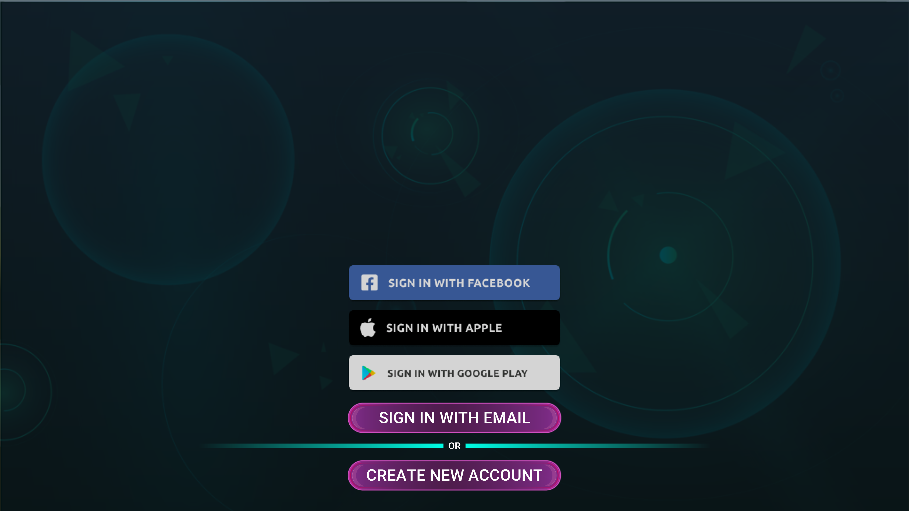
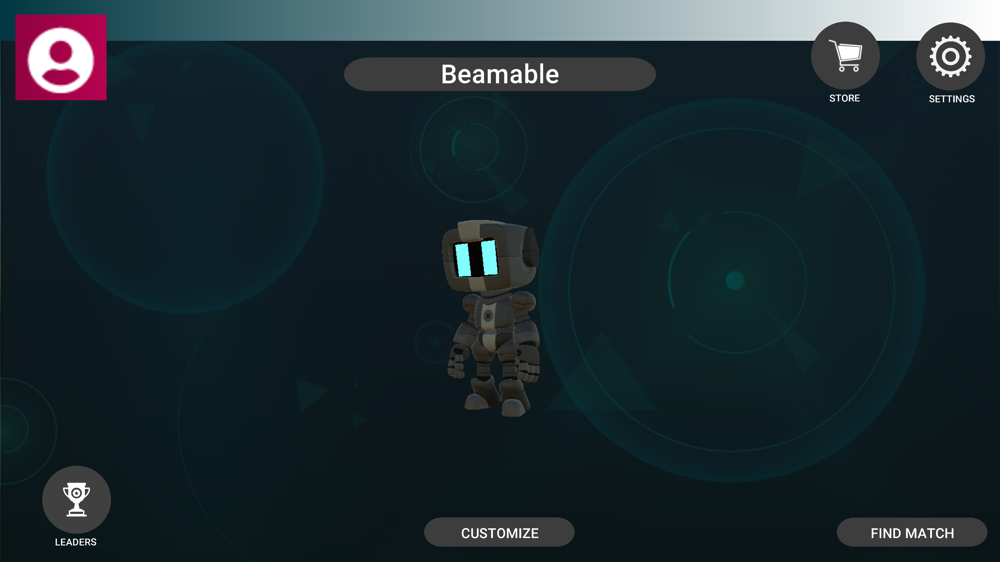
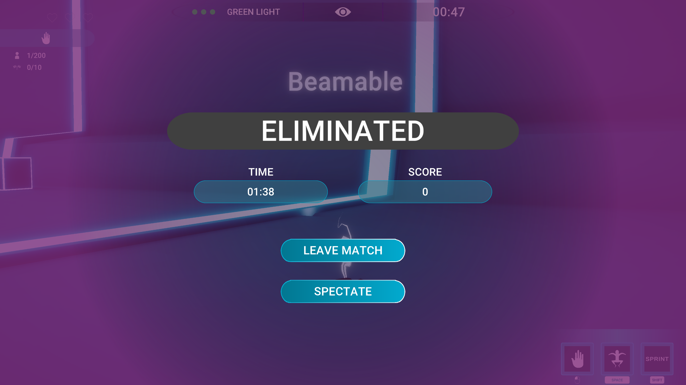
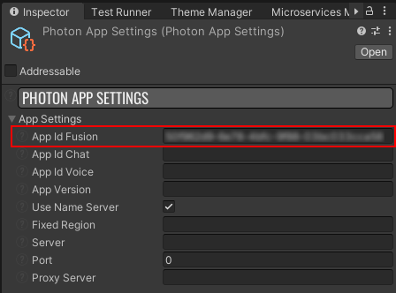
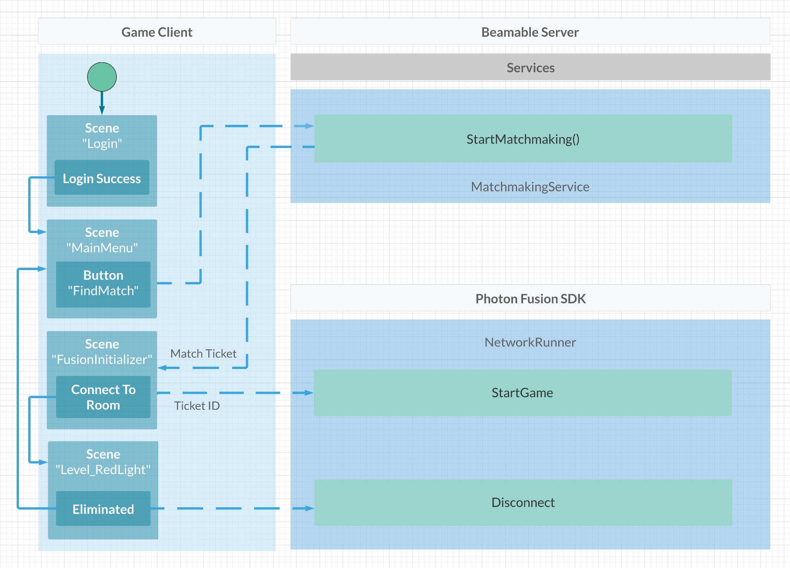
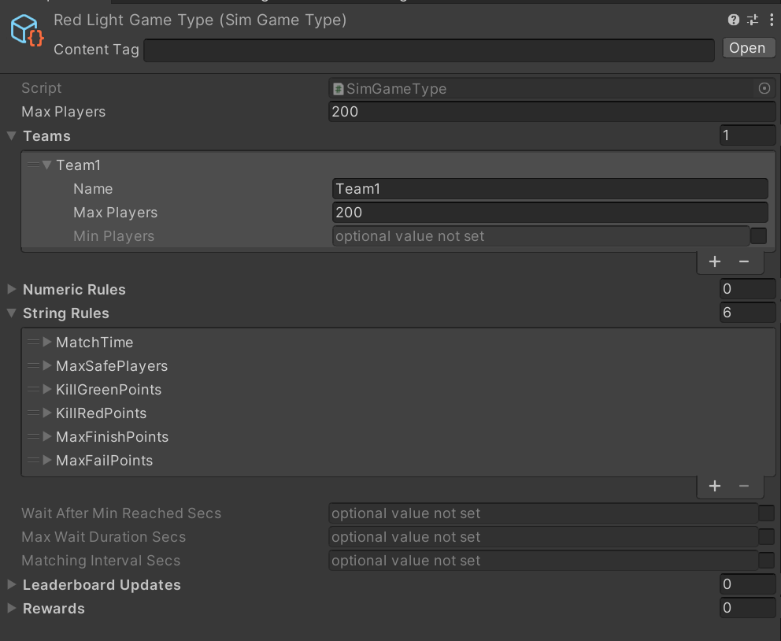
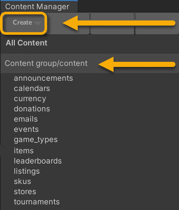
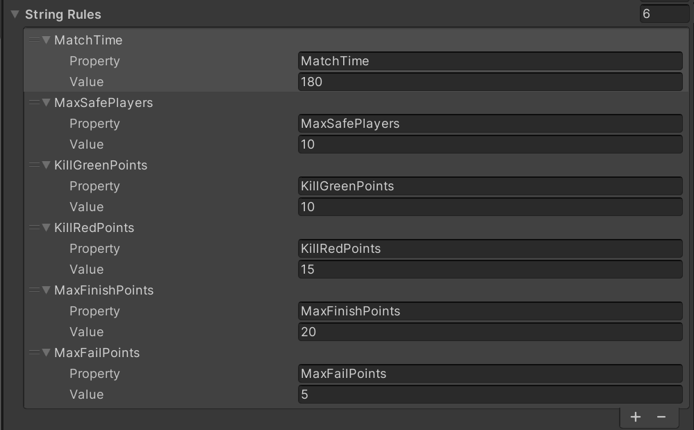

# Photon Multiplayer (RLGL) - Overview

Welcome to "Red Light, Green Light" (RLGL). In this game, **Race other players to the finish line, but don't get caught moving during a red light! This sample project utilizes several of Beamable's features.**

!!! info "Related Features"

    • [Matchmaking](../user-reference/beamable-services/social-networking/connectivity.md) - Connect remote players in a match (i.e. a multiplayer "room")  
    • [Leaderboards](../user-reference/beamable-services/live-ops/player-stats-and-activities.md) - Track and display player rankings and scores  
    • [Microservices](../user-reference/cloud-services/microservices/microservice-framework.md) - Custom server-side logic and game rules

## Screenshots

- The game is loaded from the Login scene, in which the player goes through the authentication flow, and logs into their account.
- The player is then loaded into the MainMenu scene, where they can customize their character, view their profile, and enter matchmaking.
- After finding a match, the player is loaded into the FusionInitializer scene, then Level_RedLight is loaded additively, where the gameplay takes place.
- After completing a match (either by winning or being eliminated), the player is returned to the MainMenu.

|   |   |
|---|---|
| **Login Scene**<br>{width="425px"} | **Lobby Scene**<br>{width="425px"} |
| **Game Scene**<br>{width="425px"} | **Eliminated**<br>{width="425px"} |

## Photon Multiplayer (RLGL) - Guide

This document and the sample project allow game makers to understand and apply the benefits of both Beamable and [Photon](https://www.photonengine.com/) Fusion to create a realtime multiplayer game.

## Photon Fusion Overview


_Fusion is a new high performance state synchronization networking library for Unity. With a single API, it supports many network architectures such as dedicated server, client hosted and shared/distributed authority._

This sample project showcases how Beamable and Photon can work together to provide a sophisticated networking solution. In general, Beamable handles the social and economy features, while Photon handles the gameplay. The Matchmaking feature bridges the gap between these two technologies.

To learn more about Photon Fusion, read more on the [official documentation](https://doc.photonengine.com/en-us/fusion/current/getting-started/fusion-intro).

## Project Setup (Required Steps)

### Beamable Setup

| Step | Detail |
|------|--------|
| 1. Download the sample project from GitHub | [Multiplayer RLGL Sample Project](https://github.com/beamable/Multiplayer_RLGL_Sample_Project/) |
| 2. Open in Unity Editor | Unity version 2020.3.22 |
| 3. Open the Beamable Toolbox | [Beamable Toolbox](../user-reference/editor-systems/unity-editor-login.md) |
| 4. Sign-In / Register To Beamable | See [Installing Beamable](../getting-started/installing-beamable.md) for more info |
| 5. Open the `Login` Scene | `Assets/_Game/Scenes/Login.unity` |

### Photon Setup

|   |   |
|---|---|
| 1. Create a Photon account | This can be done on [Photon's website](https://www.photonengine.com/). |
| 2. Create a Photon Fusion app | [Fusion Introduction](https://doc.photonengine.com/en-us/fusion/current/getting-started/fusion-intro) |
| 3. Copy and paste your Fusion App ID into the PhotonAppSettings | This is located in the project, in Assets/Photon/Fusion/Resources/PhotonAppSettings.<br> |

After these steps are complete, the game is ready to test. Open the Login scene, then click Play in the editor. Once you're in the main menu, either click "Find Match", or do a standalone build of the game and run the build. Then run the Unity Editor. In both running games, choose "Find Match" to play against yourself.

## Additional Project Setup (Optional)

The sample project includes additional features that are not required to run the game.

| Step | Detail |
|------|--------|
| Setup Facebook Sign-In | [Facebook Sign-In - Overview](../user-reference/beamable-services/identity/providers/facebook-sign-in.md) |
| Setup Google Sign-In | [Google Sign-In - Overview](../user-reference/beamable-services/identity/providers/google-sign-in.md) |
| Setup Steam Sign-In | [Steam Integration - Overview](../user-reference/beamable-services/identity/providers/steam-sign-in.md) |

## Installing Photon Fusion

In the _Red Light, Green Light_ sample project, the Photon Fusion SDK is already installed in the Unity project. However, installing the SDK into your own Unity project is simple. A full guide for installing the Photon Fusion SDK can be found here: [Fusion 101 - Getting Started](https://doc.photonengine.com/en-us/fusion/current/fusion-100/fusion-101). The basic steps include:

• Create a PhotonEngine account  
• Download and Install the Fusion SDK in your Unity project  
• Configure your Unity project and connect it to your Photon App ID

You will need a unique Photon App ID for each of your Beamable games.

### Rules of the Game

The game starts with the players in a waiting area, with a wall blocking them from proceeding until all players are ready. After all players ready up, the wall will disappear and the players can proceed.

Throughout the match, the ball of light at the end will change colors from green, to yellow, then red (like a traffic light). While the light is green, players are free to move around. While the light is red, the players cannot move if they are able to be seen by the ball of light. Doing so will result in the players being zapped by the light.

Players can pick up various weapons on the field and deal damage to other players. Unarmed players can shove other players, potentially causing them to be seen moving while the light is red and getting zapped.

The goal of the game is to make it all the way to the other side of the map without being seen moving by the red light, or being killed by another player. After the round is over, the player will earn currency that can be used to purchase items in the store, and they will earn a spot on the leaderboard based on their performance.

### Player Experience Flowchart

The following flowchart shows the player experience through the game:



The main link here is the connection between Beamable's Matchmaking and Photon's NetworkRunner. StartMatchmaking will initiate a search for other players to join into a match. Information about that search is stored in the MatchmakingHandle, provided by the MatchmakingService. When the search is complete, the ID of the match ticket can be retrieved. The following code is paraphrased from `MatchmakingHandler.cs` in the sample:

MatchmakingHandler.cs
```csharp
public async void StartMatchmaking()
{
    var handle = await _beamableAPI.Experimental.MatchmakingService.StartMatchmaking(gameTypeRef, UpdateHandler, ReadyHandler, TimeoutHandler);
}

private void ReadyHandler(MatchmakingHandle handle)
{
    //Store this match ID somewhere, since we will need it later.
    //In the sample project, it is stored in a ScriptableObject.
    var matchId = handle.Match.matchId;
}
```

Once we have the match ID, we can use it as the ID of the Photon room to join. This way, we can ensure all the other players that have been matched together will join the same room at the same time. Here is a snippet from `FusionLauncher.cs`:

FusionLauncher.cs
```csharp
//_runner is a NetworkRunner, a Photon class representing a simulation.
await _runner.StartGame(new StartGameArgs()
{
    GameMode = mode, 
    SessionName = matchId,
    SceneObjectProvider = sceneLoader,
    PlayerCount = playerCount
});
```

## Additional Steps

Here are the key steps to implement this multiplayer setup:

!!! warning "Note"

    These steps are **already complete** in the sample project. The instructions here explain the process for setting up your own project with these same tools.

### Setup Project

Here are instructions to setup the Game Type content.



*Note that since there are no "team" divisions, all the players are placed on the same team. Additionally, the maximum player count (200) is derived from Photon Fusion's maximum supported players.*

| Step | Detail |
|------|--------|
| 1. Install the Beamable SDK and Register/Login | • See [Installing Beamable](../getting-started/installing-beamable.md) for more info. |
| 2. Open the Content Manager Window | • Unity → Window → Beamable → Open Content Manager |
| 3. Create the "GameType" content | {width="50%" style="float: right; margin: 0px 0px 15px 15px;"}<br><br>• Select the content type in the list<br>• Press the "Create" button<br>• Populate the content name |
| 4. Configure "GameType" content | <br>• Populate the `Max Players` and `Teams`<br>*Note: The other fields are optional and may be needed for advanced use cases* |
| 5. Configure "GameType" content (continued) | <br>• Populate the String Rules pictured here.<br><br>*These are necessary in order for the Red Light, Green Light game to function properly. In your own implementation, these may not be necessary.* |
| 6. Save the Unity Project | • Unity → File → Save Project<br>*Best Practice: If you are working on a team, commit to version control in this step* |
| 7. Publish the content | • Press the "Publish" button in the Content Manager Window |
