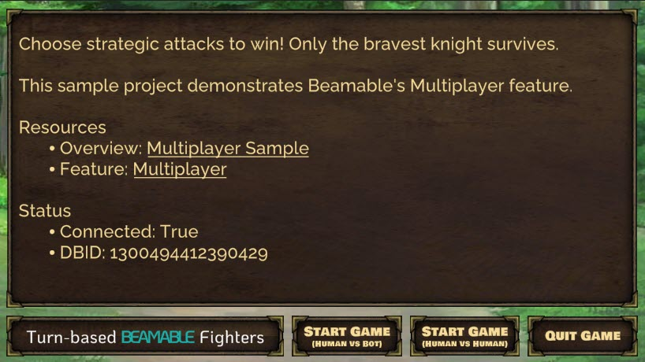
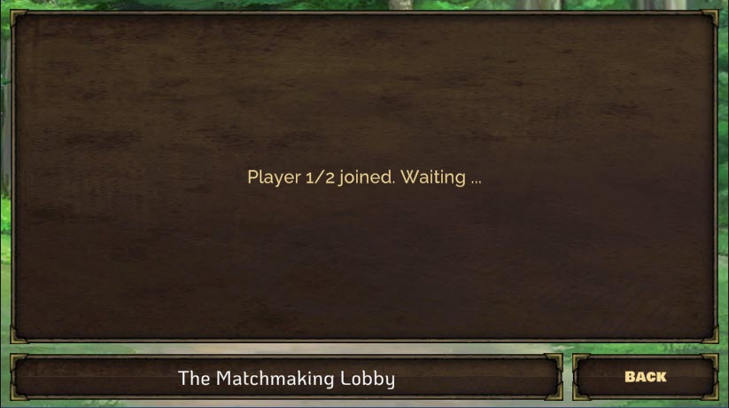
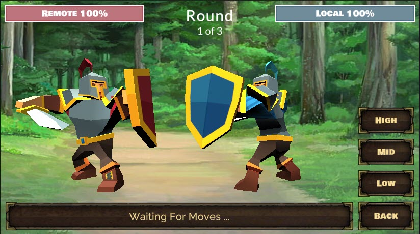
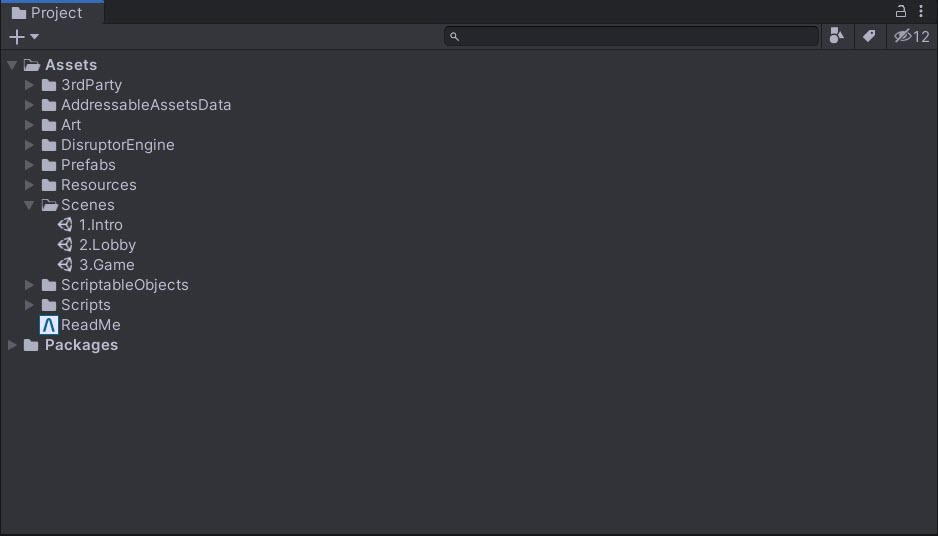
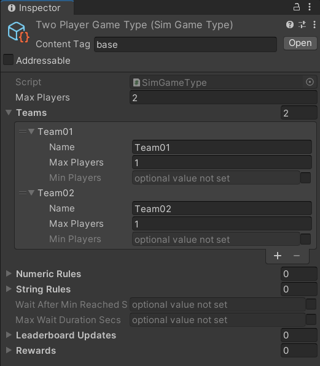
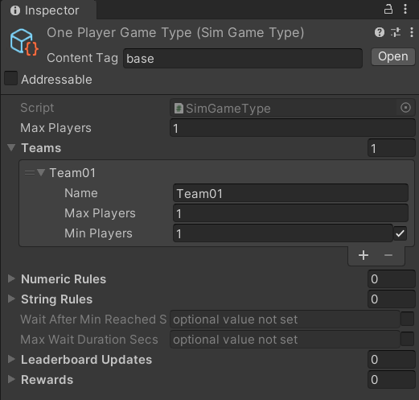
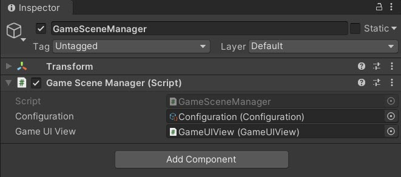
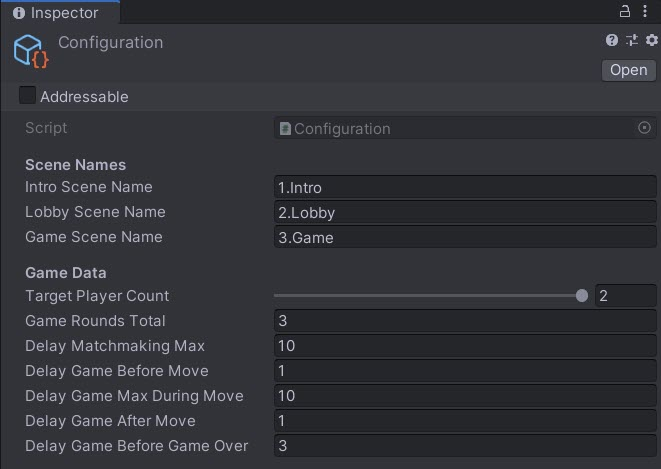

# Turn-based Beamable Fighters - Multiplayer Sample

Welcome to "Turn-based Beamable Fighters" (TBF). In this game, **Choose strategic attacks to win! Only the bravest knight survives.**

!!! info "Related Features"

    • [Matchmaking](../../../concepts/services/matchmaking.md) - Connect remote players in a match (i.e. a multiplayer "room")  
    • [Multiplayer](../../../concepts/services/multiplayer.md) - Enable real-time multiplayer gameplay experiences

## Screenshots

The player navigates from the Intro Scene to the Game Scene, where all the action takes place.

|   |   |
|---|---|
| **Intro Scene**<br>{width="425px"} | **Lobby Scene**<br>{width="425px"} |
| **Game Scene**<br>{width="425px"} | **Project Window**<br>{width="425px"} |

## Multiplayer (TBF) - Guide

This document and the sample project allow game makers to understand and apply the benefits of Beamable [Multiplayer](../../../concepts/services/multiplayer.md) in game development. Or watch this video:

<iframe width="560" height="315" src="https://www.youtube.com/embed/3m55jsjfXUc" title="YouTube video player" frameborder="0" allow="accelerometer; autoplay; clipboard-write; encrypted-media; gyroscope; picture-in-picture" allowfullscreen></iframe>

## Download

Learning Resources:

| Source | Detail |
|--------|--------|
| {width="35px"} | 1. **Download** the [Multiplayer TBF Sample Project](https://github.com/beamable/Multiplayer_TBF_Sample_Project/)<br>2. Open in Unity Editor (Version 2021.3 or later)<br>3. Open the Beamable [Toolbox](../../user-reference/toolbox.md)<br>4. Sign-In / Register To Beamable. See [Step 1 - Getting Started](../../getting-started/index.md) for more info<br>5. Open the `1.Intro` Scene<br>6. Play The Scene: Unity → Edit → Play<br>7. Click "Start Game: Human vs Bot" for an easy start. Or do a standalone build of the game and run the build. Then run the Unity Editor. In both running games, choose "Start Game: Human vs Human" to play against yourself<br>8. Enjoy!<br><br>*Note: Beamable supports Unity versions 2021.3 to 2023.3* |

### Rules of the Game

The game has 3 rounds. The player to win the most rounds, wins the game.

In each round, each player makes one attack move. After each round the moves are evaluated and a winner is declared.

The attack moves are evaluated with criteria similar to Rock, Paper, Scissors. See Wikipedia's [Rock, Paper, Scissors](https://en.wikipedia.org/wiki/Rock_paper_scissors) for more info.

In the sample game, there are 3 possible attack moves with the following results;

- _High_ beats _Mid_
- _Mid_ beats _Low_
- _Low_ beats _High_

If both players choose the same attack move, there is a tie with no consequences — the round simply repeats.

### Screenshots

The player navigates from the Intro Scene to the Game Scene, where all the action takes place.

|   |   |
|---|---|
| **Intro Scene**<br>{width="425px"} | **Lobby Scene**<br>{width="425px"} |
| **Game Scene**<br>{width="425px"} | **Project Window**<br>{width="425px"} |

### Player Experience Flowchart

The following flowchart shows the player experience through the game:

*Note: Interactive flowchart content from LucidChart is not directly convertible to static markdown. Please refer to the original documentation or recreate as a static diagram.*

## Game Maker User Experience

Game makers follow a structured process to create multiplayer experiences. There are several major parts to this game creation process.

*Note: Interactive flowchart content from LucidChart is not directly convertible to static markdown. Please refer to the original documentation or recreate as a static diagram.*

## Steps

Here are the key steps to implement multiplayer functionality:

These steps are **already complete** in the sample project. The instructions here explain the process.

!!! info "Related Features"

    • [Matchmaking](../../user-reference/multiplayer/matchmaking.md) - Connect remote players in a match (i.e. a multiplayer "room")  
    • [Multiplayer](../../../concepts/services/multiplayer.md) - Enable real-time multiplayer gameplay experiences

### Step 1. Setup Project

Here are instructions to setup the Beamable SDK and "GameType" content.



| Step | Detail |
|------|--------|
| 1. Install the Beamable SDK and Register/Login | • See [Step 1 - Getting Started](https://docs.beamable.com/docs/getting-started) for more info. |
| 2. Open the Content Manager Window | • Unity → Window → Beamable → Open Content Manager |
| 3. Create the "GameType" content | {width="50%" style="float: right; margin: 0px 0px 15px 15px;"}<br><br>• Select the content type in the list<br>• Press the "Create" button<br>• Populate the content name |
| 4. Configure "GameType" content | <br>• Populate the `Max Players` and `Teams` for a **One Player Game**<br>*Note: The other fields are optional and may be needed for advanced use cases* |
| 5. Repeat Steps 3 & 4 | <br>• Populate the `Max Players` and `Teams` for a **Two Player Game**<br>*Note: The other fields are optional and may be needed for advanced use cases* |
| 6. Save the Unity Project | • Unity → File → Save Project<br>*Best Practice: If you are working on a team, commit to version control in this step* |
| 7. Publish the content | • Press the "Publish" button in the Content Manager Window |

### Step 2. Plan the Game Design

Multiplayer game development offers additional challenges beyond those of a typical single player game.

When designing a game with Beamable's Multiplayer feature, it is important to plan which user interactions will be sent to the servers.

| Step | Detail |
|------|--------|
| 1. Define the game's high level goals | • What are player motivations?<br>• How is the 'story' of the player told through audio, graphics, animations, etc ... ?<br><br>*Note: If you are new to Multiplayer game design, this is a good place to start. Think about the game as if it was indeed a single-player experience. Then iterate on the design in the following steps* |
| 2. Consider game input from the users | • What is each user input gesture?<br>• What are all possible choices the player may make at that moment? |
| 3. Consider game input from other sources | • What else impacts the user experience?<br>• Are any elements 'random'? How will that be determined, sent, received, and processed by each client?<br>• Where will delays be required? The game need to wait at key moments for animations to finish, sounds to finish, etc ... |
| 4. Design the structure of the Multiplayer event objects | • How many event objects are needed?<br>• What info is needed in each object?<br><br>*Note: A solid, purposeful design in this step is important to create a pleasing multiplayer game experience. See **The Balancing Act** below for more info* |

These user interactions are relayed as event objects to all connected clients. Each client will deterministically simulate those events to ensure a consistent user experience for all players.

**-->Designing an event-driven, deterministic simulation is vital. <--**

**The Balancing Act**

Deciding which user interactions require events and how to design the event payloads, striking a balance is recommended.

- **Too Few Events**: Each game requires a certain amount of events to faithfully and deterministically keep all players in sync. Sending too few will cause the game to fall out of sync or lack the polish expected by the game community. The same is true if each event contain too little data to represent the needs of the game design.
- **Too Many Events**: Each event requires reasonable overhead for serializing, sending, receiving, and processing data. Sending too many can cause latency and the players will notice lag in the user experience. The same is true if the events contain unnecessarily heavy data within each event.

!!! info "Expert Advice"

    "Determinism of the game simulation is important due to the nature of our server implementation. Because Beamable's relay servers are game state agnostic, any sort of state checkpointing or CPU architectural differences are not corrected on the server side so in order to keep the game state in sync on all clients, it is imperative that the game be made deterministic."

    • See Ruoyu Sun's [Game Networking Article](https://ruoyusun.com/2019/03/29/game-networking-2.html) for more info

### Step 3. Create the Game Code

This step includes the bulk of time and effort the project.

| Step | Detail |
|------|--------|
| 1. Create C# game-specific logic | • Implement game logic<br>• Handle player input<br>• Render graphics & sounds<br><br>*Note: This represents the bulk of the development effort. The details depend on the specifics of the game project.* |

**Inspector**

Here is the `GameSceneManager.cs` main entry point for the Game Scene interactivity.

{width="80%"}

*The "Configuration" and "GameUIView" are passed as references*

Here is the `Configuration.cs` holding high-level, easily-configurable values used by various areas on the game code. Several game classes reference this data.

!!! warning "Gotchas"

    Here are some common issues and solutions:

    • While the name is similar, this `Configuration.cs` is wholly unrelated to Beamable's [Configuration Manager](../../user-reference/configuration-manager.md).

{width="80%"}

*The "Configuration" values are easily configurable*

_Optional: Game Makers may experiment with new **Delay** values here to allow the players' turns to occur faster or slower._

**Code**

The `GameSceneManager` is the main entry point to the Game Scene logic.

This is a partial code snippet showing the structure:

GameSceneManager.cs
```csharp
using Beamable.Samples.TBF.Data;
using Beamable.Samples.TBF.Multiplayer;
using Beamable.Samples.TBF.Multiplayer.Events;
using Beamable.Samples.TBF.Views;
using System;
using Beamable.Samples.Core.Audio;
using Beamable.Samples.Core.UI;
using UnityEngine;

namespace Beamable.Samples.TBF
{

   /// <summary>
   /// List of all users' moves
   /// </summary>
   public enum GameMoveType
   {
      Null,
      High,  // Like "Rock"
      Mid,   // Like "Paper"
      Low    // Like "Scissors"
   }

   /// <summary>
   /// Handles the main scene logic: Game
   /// </summary>
   public class GameSceneManager : MonoBehaviour
   {
      //  Properties -----------------------------------
      public GameUIView GameUIView { get { return _gameUIView; } }
      public GameProgressData GameProgressData { get { return _gameProgressData; } set { _gameProgressData = value; } }
      public Configuration Configuration { get { return _configuration; } }
      public TBFMultiplayerSession MultiplayerSession { get { return _multiplayerSession; } }
      public RemotePlayerAI RemotePlayerAI { get { return _remotePlayerAI; } set { _remotePlayerAI = value; } }

      //  Fields ---------------------------------------

      [SerializeField]
      private Configuration _configuration = null;

      [SerializeField]
      private GameUIView _gameUIView = null;

      private IBeamableAPI _beamableAPI = null;
      private TBFMultiplayerSession _multiplayerSession;
      private GameProgressData _gameProgressData;
      private RemotePlayerAI _remotePlayerAI;
      private GameStateHandler _gameStateHandler;


      //  Unity Methods   ------------------------------
      protected void Start()
      {
         _gameUIView.BackButton.onClick.AddListener(BackButton_OnClicked);
         _gameUIView.MoveButton_01.onClick.AddListener(MoveButton_01_OnClicked);
         _gameUIView.MoveButton_02.onClick.AddListener(MoveButton_02_OnClicked);
         _gameUIView.MoveButton_03.onClick.AddListener(MoveButton_03_OnClicked);

         foreach (AvatarUIView avatarUIView in _gameUIView.AvatarUIViews)
         {
            avatarUIView.HealthBarView.OnValueChanged += HealthBarView_OnValueChanged;
         }

         _gameUIView.AvatarUIViews[TBFConstants.PlayerIndexLocal].HealthBarView.Value = 100;
         _gameUIView.AvatarUIViews[TBFConstants.PlayerIndexRemote].HealthBarView.Value = 100;

         //
         _gameStateHandler = new GameStateHandler(this);
         SetupBeamable();
      }


      protected void Update()
      {
         _multiplayerSession?.Update();
      }

      //  Other Methods  -----------------------------
      private void DebugLog(string message)
      {
         if (TBFConstants.IsDebugLogging)
         {
            Debug.Log(message);
         }
      }


      private async void SetupBeamable()
      {
         await _gameStateHandler.SetGameState(GameState.Loading);

         await Beamable.API.Instance.Then(async de =>
         {
            await _gameStateHandler.SetGameState (GameState.Loaded);

            try
            {
               _beamableAPI = de;

               if (!RuntimeDataStorage.Instance.IsMatchmakingComplete)
               {
                  DebugLog($"Scene '{gameObject.scene.name}' was loaded directly. That is ok. Setting defaults.");
                  RuntimeDataStorage.Instance.LocalPlayerDbid = _beamableAPI.User.id;
                  RuntimeDataStorage.Instance.TargetPlayerCount = 1;
                  RuntimeDataStorage.Instance.MatchId = TBFMatchmaking.GetRandomMatchId();
               }

               _multiplayerSession = new TBFMultiplayerSession(
                  RuntimeDataStorage.Instance.LocalPlayerDbid,
                  RuntimeDataStorage.Instance.TargetPlayerCount,
                  RuntimeDataStorage.Instance.MatchId) ;

               await _gameStateHandler.SetGameState(GameState.Initializing);

               _multiplayerSession.OnInit += MultiplayerSession_OnInit;
               _multiplayerSession.OnConnect += MultiplayerSession_OnConnect;
               _multiplayerSession.OnDisconnect += MultiplayerSession_OnDisconnect;
               _multiplayerSession.Initialize();

            }
            catch (Exception)
            {
               SetStatusText(TBFHelper.InternetOfflineInstructionsText, TMP_BufferedText.BufferedTextMode.Immediate);
            }
         });
      }

      /// <summary>
      /// Render UI text
      /// </summary>
      /// <param name="message"></param>
      /// <param name="statusTextMode"></param>
      public void SetStatusText(string message, TMP_BufferedText.BufferedTextMode statusTextMode)
      {
         _gameUIView.BufferedText.SetText(message, statusTextMode);
      }

      /// <summary>
      /// Render UI text
      /// </summary>
      /// <param name="message"></param>
      public void SetRoundText(int roundNumber)
      {
         _gameUIView.RoundText.text = string.Format(TBFConstants.RoundText, roundNumber, _configuration.GameRoundsTotal);
      }


      private void BindPlayerDbidToEvents(long playerDbid, bool isBinding)
      {
         if (isBinding)
         {
            string origin = playerDbid.ToString();
            _multiplayerSession.On<GameStartEvent>(origin, MultiplayerSession_OnGameStartEvent);
            _multiplayerSession.On<GameMoveEvent>(origin, MultiplayerSession_OnGameMoveEvent);
         }
         else
         {
            _multiplayerSession.Remove<GameStartEvent>(MultiplayerSession_OnGameStartEvent);
            _multiplayerSession.Remove<GameMoveEvent>(MultiplayerSession_OnGameMoveEvent);
         }
      }

      private void SendGameMoveEventSave(GameMoveType gameMoveType)
      {
         if (_gameStateHandler.GameState == GameState.RoundPlayerMoving)
         {
            _gameUIView.MoveButtonsCanvasGroup.interactable = false;
            SoundManager.Instance.PlayAudioClip(SoundConstants.Click02);

            _multiplayerSession.SendEvent<GameMoveEvent>(
               new GameMoveEvent(gameMoveType));
         }
      }

      //  Event Handlers -------------------------------
      private void HealthBarView_OnValueChanged(int oldValue, int newValue)
      {
         if (newValue < oldValue)
         {
            // Play "damage" sound
            SoundManager.Instance.PlayAudioClip(SoundConstants.HealthBarDecrement);
         }
      }

      private void BackButton_OnClicked()
      {
         //Change scenes
         StartCoroutine(TBFHelper.LoadScene_Coroutine(_configuration.IntroSceneName,
            _configuration.DelayBeforeLoadScene));
      }


      private void MoveButton_01_OnClicked()
      {
         SendGameMoveEventSave(GameMoveType.High);
      }


      private void MoveButton_02_OnClicked()
      {
         SendGameMoveEventSave(GameMoveType.Mid);
      }


      private void MoveButton_03_OnClicked()
      {
         SendGameMoveEventSave(GameMoveType.Low);
      }


      private async void MultiplayerSession_OnInit(System.Random random)
      {
         await _gameStateHandler.SetGameState(GameState.Initialized);
      }


      private async void MultiplayerSession_OnConnect(long playerDbid)
      {
         BindPlayerDbidToEvents(playerDbid, true);

         Debug.Log($"CHECK {_multiplayerSession.PlayerDbidsCount} < {_multiplayerSession.TargetPlayerCount}");
         if (_multiplayerSession.PlayerDbidsCount < _multiplayerSession.TargetPlayerCount)
         {
            await _gameStateHandler.SetGameState (GameState.Connecting);

         }
         else
         {
            await _gameStateHandler.SetGameState (GameState.Connected);

            _multiplayerSession.SendEvent<GameStartEvent>(new GameStartEvent());
         }
      }


      private async void MultiplayerSession_OnDisconnect(long playerDbid)
      {
         BindPlayerDbidToEvents(playerDbid, false);

         SetStatusText(string.Format(TBFConstants.StatusText_Multiplayer_OnDisconnect,
            _multiplayerSession.PlayerDbidsCount.ToString(),
            _multiplayerSession.TargetPlayerCount), TMP_BufferedText.BufferedTextMode.Immediate);

         await _gameStateHandler.SetGameState(GameState.GameEnded);
      }


      private async void MultiplayerSession_OnGameStartEvent(GameStartEvent gameStartEvent)
      {
         DebugLog($"OnGameStartEvent() by {gameStartEvent.PlayerDbid}");

         if (_gameStateHandler.GameState == GameState.GameStarting)
         {
            _gameProgressData.GameStartEventsBucket.Add(gameStartEvent);

            DebugLog($"GameStartEventBucket.Count = {_gameProgressData.GameStartEventsBucket.Count}");

            if (_gameProgressData.GameStartEventsBucket.Count == _multiplayerSession.TargetPlayerCount)
            {
               await _gameStateHandler.SetGameState(GameState.GameStarted);
            }
         }
      }


      private async void MultiplayerSession_OnGameMoveEvent(GameMoveEvent gameMoveEvent)
      {
         DebugLog($"OnGameMoveEvent() of {gameMoveEvent.GameMoveType} by {gameMoveEvent.PlayerDbid}");

         if (_gameStateHandler.GameState == GameState.RoundPlayerMoving)
         {
            _gameProgressData.GameMoveEventsThisRoundBucket.Add(gameMoveEvent);

            DebugLog($"GameMoveEventsThisRoundBucket.Count = {_gameProgressData.GameMoveEventsThisRoundBucket.Count}");

            if (_gameProgressData.GameMoveEventsThisRoundBucket.Count == _multiplayerSession.TargetPlayerCount)
            {
               await _gameStateHandler.SetGameState(GameState.RoundPlayerMoved);
            }
         }
      }
   }
}
```

GameStateHandler.cs
```csharp
using Beamable.Samples.TBF.Data;
using Beamable.Samples.TBF.Multiplayer;
using Beamable.Samples.TBF.Multiplayer.Events;
using Beamable.Samples.TBF.Views;
using System;
using System.Threading.Tasks;
using Beamable.Samples.Core.Audio;
using Beamable.Samples.Core.Exceptions;
using Beamable.Samples.Core.UI;
using Beamable.Samples.Core.Utilities;
using UnityAsync;
using UnityEngine;
using static Beamable.Samples.TBF.Data.GameProgressData;

namespace Beamable.Samples.TBF
{
   /// <summary>
   /// List of all phases of the gameplay.
   /// There are arguably more states here than are needed, 
   /// however all are indeed used, in the order shown, for deliberate separation.
   /// </summary>
   public enum GameState
   {
      //Game loads within here
      Null,
      Loading,
      Loaded,
      Initializing,
      Initialized,
      Connecting,
      Connected,
      GameStarting,
      GameStarted,

      //Game repeats within here
      RoundStarting,
      RoundStarted,
      RoundPlayerMoving,
      RoundPlayerMoved,
      RoundEvaluating,
      RoundEvaluated,

      //Game ends here
      GameEvaluating,
      GameEnding,
      GameEnded
   }

   /// <summary>
   /// Handles the <see cref="GameState"/> for the <see cref="GameSceneManager"/>.
   /// </summary>
   public class GameStateHandler
   {
      //  Properties -----------------------------------
      public GameState GameState { get { return _gameState; } }

      //  Fields ---------------------------------------
      private GameState _gameState = GameState.Null;
      private GameSceneManager _gameSceneManager;

      //  Other Methods  -----------------------------
      public GameStateHandler(GameSceneManager gameSceneManager)
      {
         _gameSceneManager = gameSceneManager;
      }


      /// <summary>
      /// Store and handle changes to the <see cref="GameState"/>.
      /// </summary>
      /// <param name="gameState"></param>
      /// <returns></returns>
      public async Task SetGameState(GameState gameState)
      {
         DebugLog($"SetGameState() from {_gameState} to {gameState}");

         //NOTE: Do not set "_gameState" directly anywhere, except here.
         _gameState = gameState;

         // SetGameState() is async...
         //    Pros: We can use operations like "Task.Delay" to slow down execution
         //    Cons: Error handling is tricky. 
         //    Workaround: AsyncUtility helps with its try/catch.
         await AsyncUtility.AsyncSafe(async () =>
         {
            switch (_gameState)
            {
               case GameState.Null:
                  break;

               case GameState.Loading:
                  // **************************************
                  // Render the scene before any latency 
                  // of multiplayer begins
                  // **************************************

                  _gameSceneManager.SetStatusText("", TMP_BufferedText.BufferedTextMode.Immediate);
                  _gameSceneManager.SetRoundText(1);

                  _gameSceneManager.GameUIView.AvatarViews[TBFConstants.PlayerIndexLocal].PlayAnimationIdle();
                  _gameSceneManager.GameUIView.AvatarViews[TBFConstants.PlayerIndexRemote].PlayAnimationIdle();

                  _gameSceneManager.GameProgressData = new GameProgressData(_gameSceneManager.Configuration);
                  _gameSceneManager.GameUIView.MoveButtonsCanvasGroup.interactable = false;
                  _gameSceneManager.SetStatusText(TBFConstants.StatusText_GameState_Loading, TMP_BufferedText.BufferedTextMode.Queue);

                  break;

               case GameState.Loaded:
                  // **************************************
                  //  Update UI
                  //  
                  // **************************************

                  _gameSceneManager.SetStatusText(TBFConstants.StatusText_GameState_Loaded, TMP_BufferedText.BufferedTextMode.Queue);
                  break;

               case GameState.Initializing:
                  // **************************************
                  //  Update UI
                  //  
                  // **************************************

                  _gameSceneManager.SetStatusText(TBFConstants.StatusText_GameState_Initializing, TMP_BufferedText.BufferedTextMode.Queue);
                  break;

               case GameState.Initialized:
                  // **************************************
                  //  Update UI
                  //  
                  // **************************************

                  _gameSceneManager.SetStatusText(TBFConstants.StatusText_GameState_Initialized, TMP_BufferedText.BufferedTextMode.Queue);
                  break;

               case GameState.Connecting:
                  // **************************************
                  //  Update UI
                  //  
                  // **************************************

                  _gameSceneManager.SetStatusText(string.Format(TBFConstants.StatusText_GameState_Connecting,
                     _gameSceneManager.MultiplayerSession.PlayerDbidsCount.ToString(),
                     _gameSceneManager.MultiplayerSession.TargetPlayerCount), TMP_BufferedText.BufferedTextMode.Queue);
                  break;

               case GameState.Connected:
                  // **************************************
                  //  Advanced the state 
                  //  
                  // **************************************

                  await SetGameState(GameState.GameStarting);
                  break;

               case GameState.GameStarting:
                  // **************************************
                  //  Reset the game-specific data
                  //  
                  // **************************************

                  _gameSceneManager.GameProgressData.StartGame();
                  break;

               case GameState.GameStarted:
                  // **************************************
                  //  Now that all players have connected, setup AI
                  //  
                  // **************************************

                  // RemotePlayerAI is always created, but enabled only sometimes
                  bool isEnabledRemotePlayerAI = _gameSceneManager.MultiplayerSession.IsHumanVsBotMode;
                  System.Random random = _gameSceneManager.MultiplayerSession.Random;

                  DebugLog($"[Debug] isEnabledRemotePlayerAI={isEnabledRemotePlayerAI}");

                  _gameSceneManager.RemotePlayerAI = new RemotePlayerAI(random, isEnabledRemotePlayerAI);

                  await SetGameState(GameState.RoundStarting);
                  break;

               case GameState.RoundStarting:
                  // **************************************
                  //  Reste the round-specific data.
                  //  Advance the state. 
                  //  This happens before EACH round during a game
                  // **************************************

                  _gameSceneManager.GameProgressData.StartNextRound();

                  _gameSceneManager.SetRoundText(_gameSceneManager.GameProgressData.CurrentRoundNumber);

                  await SetGameState(GameState.RoundStarted);
                  break;

               case GameState.RoundStarted:
                  // **************************************
                  //  Advance the state
                  //  
                  // **************************************

                  while (_gameSceneManager.GameUIView.BufferedText.HasRemainingQueueText)
                  {
                     // Wait for old messages to pass before allowing button clicks
                     await Await.NextUpdate();
                  }
                  _gameSceneManager.GameUIView.MoveButtonsCanvasGroup.interactable = true;

                  await SetGameState(GameState.RoundPlayerMoving);
                  break;

               case GameState.RoundPlayerMoving:
                  // **************************************
                  //  Update UI
                  //  
                  // **************************************

                  _gameSceneManager.SetStatusText(string.Format(TBFConstants.StatusText_GameState_PlayerMoving), 
                     TMP_BufferedText.BufferedTextMode.Queue);

                  break;

               case GameState.RoundPlayerMoved:
                  // **************************************
                  //  
                  //  
                  // **************************************

                  long localPlayerDbid = _gameSceneManager.MultiplayerSession.GetPlayerDbidForIndex(TBFConstants.PlayerIndexLocal);
                  GameMoveEvent localGameMoveEvent = _gameSceneManager.GameProgressData.GameMoveEventsThisRoundBucket.GetByPlayerDbid(localPlayerDbid);

                  GameMoveType localGameMoveType = localGameMoveEvent.GameMoveType;
                  
                  long remotePlayerDbid;

                  if (_gameSceneManager.RemotePlayerAI.IsEnabled)
                  {
                     // HumanVSBot: Create an AI movement here...
                     remotePlayerDbid = _gameSceneManager.RemotePlayerAI.RemotePlayerDbid;
                     GameMoveEvent gameMoveEvent = _gameSceneManager.RemotePlayerAI.GetNextRemoteGameMoveEvent(localGameMoveType);
                     _gameSceneManager.GameProgressData.GameMoveEventsThisRoundBucket.Add(gameMoveEvent);
                  }
                  else
                  {
                     remotePlayerDbid = _gameSceneManager.MultiplayerSession.GetPlayerDbidForIndex(TBFConstants.PlayerIndexRemote);
                  }

                  GameMoveEvent remoteGameEvent = _gameSceneManager.GameProgressData.GameMoveEventsThisRoundBucket.GetByPlayerDbid(remotePlayerDbid);
                  GameMoveType remoteGameMoveType = remoteGameEvent.GameMoveType;

                  // 1 LOCAL
                  await RenderPlayerMove(TBFConstants.PlayerIndexLocal, localGameMoveType);

                  // 2 REMOTE - Always show this second, it builds drama
                  await RenderPlayerMove(TBFConstants.PlayerIndexRemote, remoteGameMoveType);

                  // All players have moved
                  _gameSceneManager.SetStatusText(string.Format(TBFConstants.StatusText_GameState_PlayersAllMoved), 
                     TMP_BufferedText.BufferedTextMode.Queue);

                  if (_gameSceneManager.RemotePlayerAI.IsEnabled)
                  {
                     // HumanVSBot: The human move is done. Don't wait for other moves.
                     await SetGameState(GameState.RoundEvaluating);
                  }
                  else if  (_gameSceneManager.GameProgressData.GameMoveEventsThisRoundBucket.Count ==
                     _gameSceneManager.MultiplayerSession.TargetPlayerCount)
                  {
                     // HumanVSHuman: All moves are complete, so evaluate
                     await SetGameState(GameState.RoundEvaluating);
                  }
                  else
                  {
                     // HumanVSHuman: NOT all moves are complete, so wait...
                     await SetGameState(GameState.RoundPlayerMoving);
                  }
                  break;

               case GameState.RoundEvaluating:

                  // **************************************
                  //  Evalute all the player moves and store result.
                  //  Advance the state
                  //  
                  // **************************************

                  _gameSceneManager.GameProgressData.EvaluateGameMoveEventsThisRound();
                  await SetGameState(GameState.RoundEvaluated);

                  break;

               case GameState.RoundEvaluated:
                  // **************************************
                  // Render results onscreen (animation, sounds).
                  // Decide: Advance round or end game
                  //  
                  // **************************************

                  RoundResult currentRoundResult = _gameSceneManager.GameProgressData.CurrentRoundResult;

                  switch (currentRoundResult)
                  {
                     case RoundResult.Tie:
                        _gameSceneManager.SetStatusText(string.Format(TBFConstants.StatusText_GameState_EvaluatedTie,
                           _gameSceneManager.GameProgressData.CurrentRoundNumber), TMP_BufferedText.BufferedTextMode.Queue);

                        while (_gameSceneManager.GameUIView.BufferedText.HasRemainingQueueText)
                        {
                           // Wait for old messages to pass before allowing button clicks
                           await Await.NextUpdate();
                        }

                        await SetGameState(GameState.RoundStarting);
                        return;
                     case RoundResult.Winner:
                        //pass through to code below
                        break;
                     default:
                        SwitchDefaultException.Throw(currentRoundResult);
                        break;
                  }

                  bool currentRoundHasWinnerPlayerDbid = _gameSceneManager.GameProgressData.CurrentRoundHasWinnerPlayerDbid;

                  if (!currentRoundHasWinnerPlayerDbid)
                  {
                     throw new InvalidOperationException("This is never expected. #2");
                  }

                  long currentRoundWinnerPlayerDbid = _gameSceneManager.GameProgressData.CurrentRoundWinnerPlayerDbid;
                  string roundWinnerName = GetPlayerNameByPlayerDbid(currentRoundWinnerPlayerDbid);

                  _gameSceneManager.SetStatusText(string.Format(TBFConstants.StatusText_GameState_EvaluatedWinner,
                     _gameSceneManager.GameProgressData.CurrentRoundNumber, roundWinnerName), TMP_BufferedText.BufferedTextMode.Queue);

                  while (_gameSceneManager.GameUIView.BufferedText.HasRemainingQueueText)
                  {
                     // Wait for old messages to pass before allowing button clicks
                     await Await.NextUpdate();
                  }

                  // Ex. Do 34 damage for each round of 3 rounds so that 3 hits = total death
                  int deltaHealth = -(1 + HealthBarView.MaxValue / _gameSceneManager.Configuration.GameRoundsTotal);
                  UpdateHealth(currentRoundWinnerPlayerDbid, deltaHealth);

                  //Wait for animations to finish
                  await AsyncUtility.TaskDelaySeconds(_gameSceneManager.Configuration.DelayGameBeforeGameOver);
                  await SetGameState(GameState.GameEvaluating);
                  break;

               case GameState.GameEvaluating:
                  // **************************************
                  //  Advance the state 
                  //  
                  // **************************************

                  if (_gameSceneManager.GameProgressData.GameHasWinnerPlayerDbid)
                  {
                     await SetGameState(GameState.GameEnding);
                  }
                  else
                  {
                     await SetGameState(GameState.RoundStarting);
                  }

                  break;
               case GameState.GameEnding:
                  // **************************************
                  //  Render loss (animation and sound)
                  //  Game stays here. 
                  // **************************************

                  // if the game loser does not have 0 health, move to 0 health
                  long gameWinnerDbid = _gameSceneManager.GameProgressData.GameWinnerPlayerDbid;
                  UpdateHealth(gameWinnerDbid, -HealthBarView.MaxValue);

                  string gameWinnerName;
                  if (_gameSceneManager.MultiplayerSession.IsLocalPlayerDbid(gameWinnerDbid))
                  {
                     gameWinnerName = GetPlayerNameByIndex(TBFConstants.PlayerIndexLocal);

                     //Local winner
                     SoundManager.Instance.PlayAudioClip(SoundConstants.GameOverWin);
                     _gameSceneManager.GameUIView.AvatarViews[TBFConstants.PlayerIndexLocal].PlayAnimationWin();
                     _gameSceneManager.GameUIView.AvatarViews[TBFConstants.PlayerIndexRemote].PlayAnimationLoss();
                  }
                  else
                  {
                     gameWinnerName = GetPlayerNameByIndex(TBFConstants.PlayerIndexRemote);   

                     //Remote winner
                     SoundManager.Instance.PlayAudioClip(SoundConstants.GameOverLoss);
                     _gameSceneManager.GameUIView.AvatarViews[TBFConstants.PlayerIndexLocal].PlayAnimationLoss();
                     _gameSceneManager.GameUIView.AvatarViews[TBFConstants.PlayerIndexRemote].PlayAnimationWin();
                  }

                  _gameSceneManager.SetStatusText(string.Format(TBFConstants.StatusText_GameState_Ending,
                    _gameSceneManager.GameProgressData.CurrentRoundNumber, gameWinnerName), TMP_BufferedText.BufferedTextMode.Queue);

                  await SetGameState(GameState.GameEnded);

                  break;
               case GameState.GameEnded:
                  // **************************************
                  //  Game stays here. 
                  //  User must click "Back" buton
                  //
                  // NOTE: We come here from GameState.GameEnding and/or when a player disconnects
                  //
                  // **************************************

                  //Turn off buttons. We may come here from any state, if a player disconnects
                  _gameSceneManager.GameUIView.MoveButtonsCanvasGroup.interactable = false;
                  break;
               default:
                  SwitchDefaultException.Throw(_gameState);
                  break;
            }
         }, new System.Diagnostics.StackTrace(true));
      }


      /// <summary>
      /// Decrements the LOSERS health
      /// </summary>
      /// <param name="currentRoundWinnerPlayerDbid"></param>
      /// <param name="deltaHealth"></param>
      private void UpdateHealth(long currentRoundWinnerPlayerDbid, int deltaHealth)
      {
         if (_gameSceneManager.MultiplayerSession.IsLocalPlayerDbid(currentRoundWinnerPlayerDbid))
         {
            _gameSceneManager.GameUIView.AvatarUIViews[TBFConstants.PlayerIndexRemote].HealthBarView.Value += deltaHealth;
         }
         else
         {
            _gameSceneManager.GameUIView.AvatarUIViews[TBFConstants.PlayerIndexLocal].HealthBarView.Value += deltaHealth;
         }
      }


      private async Task RenderPlayerMove(int playerIndex, GameMoveType gameMoveType)
      {
         string playerName = GetPlayerNameByIndex(playerIndex);
         _gameSceneManager.SetStatusText(string.Format(TBFConstants.StatusText_GameState_PlayerMoved,
            playerName, gameMoveType), TMP_BufferedText.BufferedTextMode.Queue);

         AvatarView avatarView = _gameSceneManager.GameUIView.AvatarViews[playerIndex];
         avatarView.PlayAnimationByGameMoveType(gameMoveType);

         // 1 Unity needs time to START non-IDLE animation ...
         await Await.While(() =>
         {
            return avatarView.IsIdleAnimation;
         });

         // 2 Unity needs time to RETURN to the IDLE animation ...
         await Await.While(() =>
         {
            return !avatarView.IsIdleAnimation;
         });
      }


      private string GetPlayerNameByPlayerDbid(long currentRoundWinnerPlayerDbid)
      {
         if (_gameSceneManager.MultiplayerSession.IsLocalPlayerDbid(currentRoundWinnerPlayerDbid))
         {
            return GetPlayerNameByIndex(TBFConstants.PlayerIndexLocal);
         }
         else
         {
            return GetPlayerNameByIndex(TBFConstants.PlayerIndexRemote);
         }
      }


      private string GetPlayerNameByIndex(int playerIndex)
      {
         return _gameSceneManager.Configuration.AvatarDatas[playerIndex].Location;
      }


      private void DebugLog(string message)
      {
         if (TBFConstants.IsDebugLogging)
         {
            Debug.Log(message);
         }
      }
   }
}
```

### Step 4. Create the Multiplayer Code

Now that the core game logic is setup, use Beamable to connect 2 (or more) players together. Create the Multiplayer event objects, send outgoing events, and handle incoming events.

| Step | Detail |
|------|--------|
| 1. Create C# Multiplayer-specific logic | • Create event objects<br>• Send outgoing event<br>• Handle incoming events<br><br>*Note: Its likely that game makers will add multiplayer functionality **throughout** development including during step #3. For sake of clarity, it is described here as a separate, final step #4.* |
| 2. Play the `1.Intro` Scene | • Unity → Edit → Play |
| 3. Enjoy the game! | • Can you beat the enemy? |
| 4. Stop the Scene | • Unity → Edit → Stop |

**Code**

Here are a few highlights from the project's major calls to Beamable's Multiplayer <<glossary:Feature>>.

<<TXT_PARTIAL_SAMPLE_CODE_SNIPPET>>

**Create Connection**

Here the `TBFMultiplayerSession.cs` class creates a new connection with Beamable's Multiplayer back-end.

```csharp
public void Initialize()
{
   // Create Multiplayer Session
   _simClient = new SimClient(new SimNetworkEventStream(_matchId),
      FramesPerSecond, TargetNetworkLead);

   // Handle Common Events
   _simClient.OnInit(SimClient_OnInit);
   _simClient.OnConnect(SimClient_OnConnect);
   _simClient.OnDisconnect(SimClient_OnDisconnect);
   _simClient.OnTick(SimClient_OnTick);
}
```

**Send Event Object**

Here the `GameSceneManager.cs` class sends a multiplayer event object to Beamable's Multiplayer back-end.

```csharp
private void SendGameMoveEventSave(GameMoveType gameMoveType)
{
   if (_gameStateHandler.GameState == GameState.RoundPlayerMoving)
   {
      _gameUIView.MoveButtonsCanvasGroup.interactable = false;
      SoundManager.Instance.PlayAudioClip(SoundConstants.Click02);

      _multiplayerSession.SendEvent<GameMoveEvent>(
         new GameMoveEvent(gameMoveType));
   }
}
```

**Receive Event Object**

Here the `GameSceneManager.cs` class receives a multiplayer event object from Beamable's Multiplayer back-end.

```csharp
private async void MultiplayerSession_OnGameMoveEvent(GameMoveEvent gameMoveEvent)
{
   if (_gameStateHandler.GameState == GameState.RoundPlayerMoving)
   {
      //Add each player event to a list
      _gameProgressData.GameMoveEventsThisRoundByPlayerDbid[gameMoveEvent.PlayerDbid] = gameMoveEvent;

      await _gameStateHandler.SetGameState(GameState.RoundPlayerMoved);
   }
}
```

## Additional Experiments

Here are some optional experiments game makers can complete in the sample project.

Did you complete all the experiments with success? We'd love to hear about it. <a href="https://www.beamable.com/contact-us" class="aInCallout" target="_blank" >Contact us</a>.

| Difficulty | Scene | Name | Detail |
|------------|-------|------|--------|
| Beginner | Game | Tweak `Configuration` | • Select the `Configuration` asset in the Unity Project Window<br>• View the serialized fields in the Unity Inspector<br>• Can you make the game play faster? Slower? Other results?<br><br>*Note: Most changes can be done while the game is running. However, if a change does not appear to work, stop and play Unity.* |
| Intermediate | Game | Add State Design Pattern | • Create a new `GameStateMachine.cs` class<br>• Remove `GameStateHandler` references from `GameSceneManager.cs`<br>• Integrate 'GameStateMachine.cs' within 'GameSceneManager.cs\\`<br><br>*Note: For ease of understandability and readability, the sample project uses a very light version of the State Pattern. See <a target="_blank" href="https://www.dofactory.com/net/state-design-pattern">State Design Pattern</a> for more info.* |
| Advanced | Game | Add a "Dodge" move type | • Offer this as a 4th button to the user during game play<br>• Limit it to 1 time per game<br>• Represent it visually (create a new animation or move the avatar model in the X direction in space to mimic a side-step<br>• Update the evaluation logic so this does no damage to either player and simply 'skips' the turn<br><br>*Note: Use this as inspiration, or create your own new move type with other results. Have fun!* |
