# Stores - In-App Purchasing (Android)

## Overview

This document will outline an example of how to allow players to purchase in-app items (IAP) with **real money** on the Google Play Store. The sample project associated with this guide is the [Purchasing Sample Project](https://github.com/beamable/Beamable_Purchasing_Sample). While the steps in this repo assume you are implementing in-app purchasing for the first time in your own project, the sample project demonstrates a "complete" implementation for reference.

## Step 1. Download & Setup Project

Learning Resources:

| Source | Detail |
|--------|--------|
|  | 1. **Download** the [Purchasing Sample Project](https://github.com/beamable/Beamable_Purchasing_Sample)<br/>2. Open in Unity Editor (Version 2021.3 or later)<br/>3. Open the Beamable [Toolbox](doc:toolbox)<br/>4. Sign-In / Register To Beamable. See [Installing Beamable](doc:installing-beamable) for more info<br/>5. Switch Target Platform to Android<br/><br/>_Note: This sample project is compatible with Unity 2021.3 and later versions_ |

## Step 2. Enable Unity In-App Purchasing

Ensure your target platform is Android before beginning setup. In your Unity project, navigate to Project Settings→Services→In-App Purchasing. Ensure it is enabled with the toggle in the screenshot below. After this is done, you should notice that `BEAMABLE_PURCHASING` has been added to your Scripting Define Symbols.

!!! info "BILLING Permission"

    Attempting to set up in-app products with an existing APK may throw an error in the Google Play Console that reads "To add in-app products, you need to add the BILLING permission to your APK." Enabling Unity purchasing fixes this problem automatically. However, if you're using a custom purchaser, you can enable this flag via your Android manifest or gradle file, and ensuring the `com.android.vending.BILLING` dependency exists.

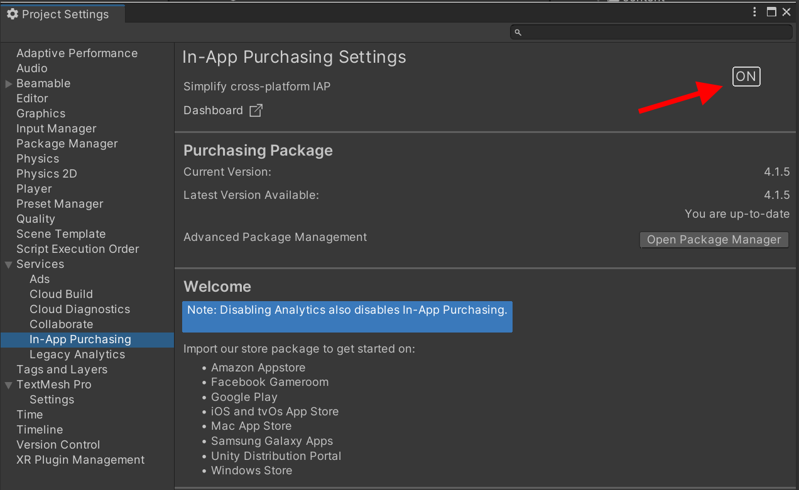{: style="height:auto;width:500px"}

## Step 3. Setup Google App

On Android, in-app purchasable items are stored in Google Play, in your app's configuration, meaning you will need to create and configure basic information about your game in the [Google Play Console](https://play.google.com/console/).

You will also need to upload a build of your game to the console, but you do not need to publish it. It will only be used for testing.

| Step | Notes |
|------|-------|
| 1. Select a developer account, or set up a new one if it's your first time. | |
| 2. Select (or create) your app from the available list. | If you are setting up an app for the first time, follow the steps to upload a build. If your app already has a build uploaded with in-app purchasing enabled, skip to [Step 4](#step-4-setup-products-google-play-console). |
| 3. From your dashboard, complete the prerequisites for uploading your build. | This includes various metadata about your game, including content ratings, promotional images, etc. |
| 4. Enable the checkbox for "Build App Bundle", then create a Unity build, targeting Android, signed with your organization's keystore. | |
| 5. Upload the .aab file to your Google Play app in a Closed Testing track. | |

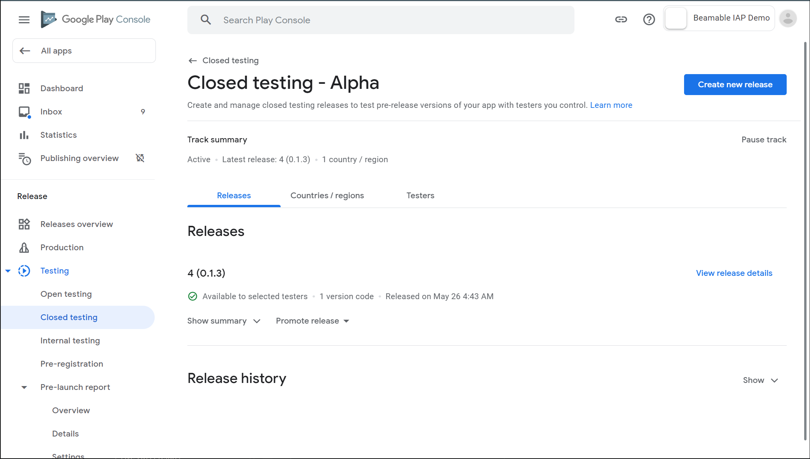{: style="height:auto;width:500px"}

## Step 4. Setup Products (Google Play Console)

Once you have a build uploaded to a closed testing track, navigate to Monetize→Products→In-app products. This will display a list of all items available to purchase in your app. First, we can create a new product with the "Create product" button. Then we can fill out various fields on the item. The only one Beamable will utilize is the Product ID, explained below.

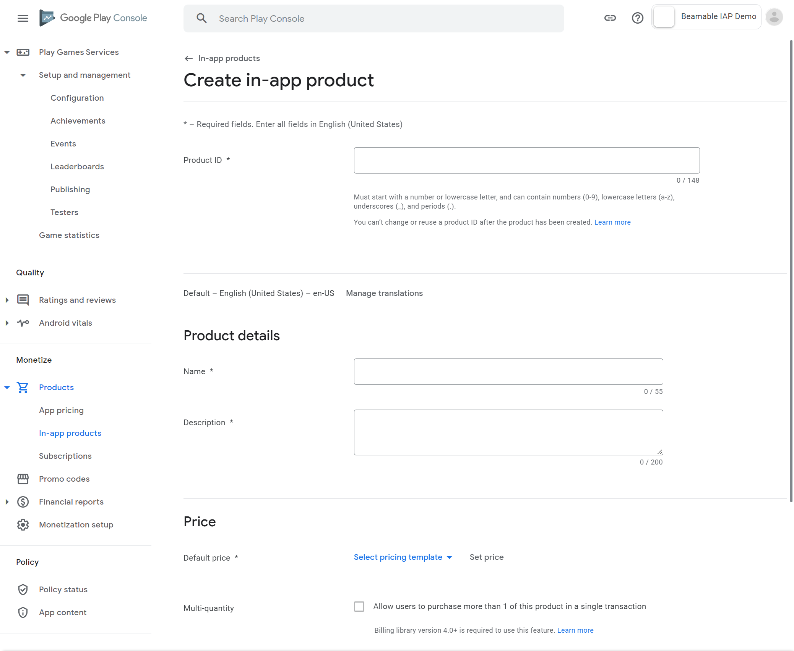{: style="height:auto;width:500px"}

For the purposes of the sample, 2 products are created: `small_gem_bundle` and `large_gem_bundle`. Take note of the Product IDs, as they will be entered into the Content Manager when we configure the items in the Unity editor.

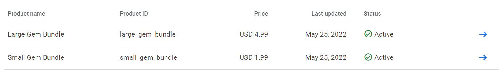{: style="height:auto;width:500px"}

## Step 5. Retrieving Your License Key

Before going back to Unity, take note of your Google Play Billing license key. You will need to enter this key into Unity's purchasing configuration in order for it to function properly, as well as your realm configuration. This can be found under Monetize→Monetization setup on the side menu.

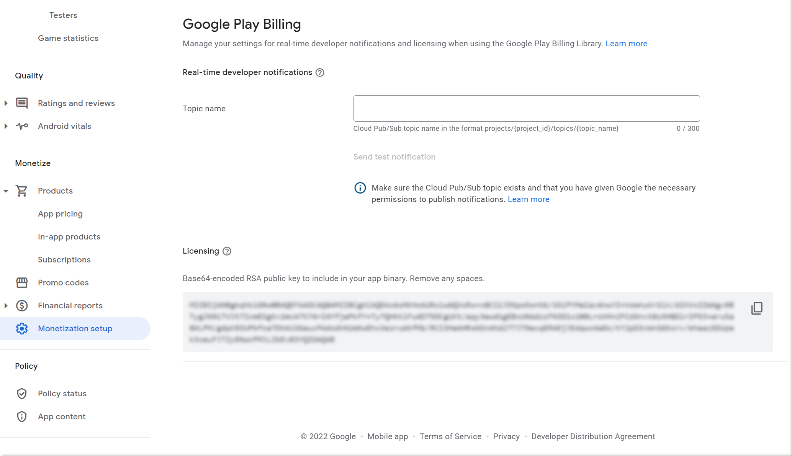{: style="height:auto;width:500px"}

Add the license key from the Google Play Console into the project settings. If your license key is recognized, you should see the success message under the textbox input.

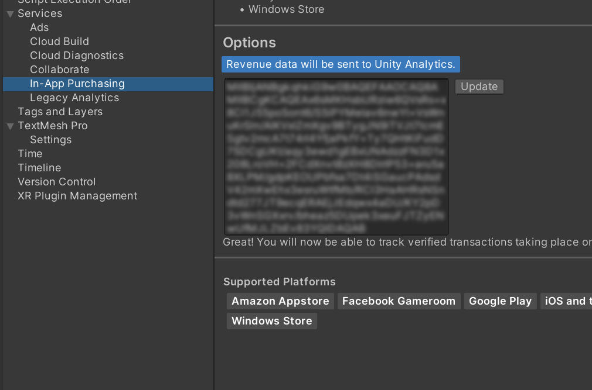{: style="height:auto;width:500px"}

Finally, add your license key to your realm configuration. Under the `payments` namespace, create a new key called `googleplay.key`, with the value being your license key.

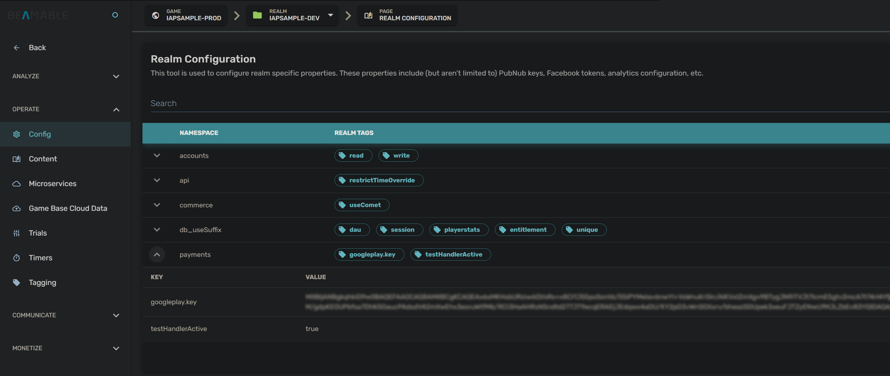{: style="height:auto;width:500px"}

## Step 6. Setup Products (Unity)

Back in Unity, we'll need to set up a store and create listings for the purchasable items. Unlike items that are purchased with virtual currency, real money items use SKUs as the price for the listing. Otherwise, the setup is mostly identical. For more info on virtual currency purchases or basic store setup, see [Stores - Guide](doc:stores-guide).

!!! warning "Note"

    The listings _must_ be added to a store in your game's content. Otherwise, the IAP system will not be able to find the items.

| Step | Detail |
|------|--------|
| 1. Create item content | 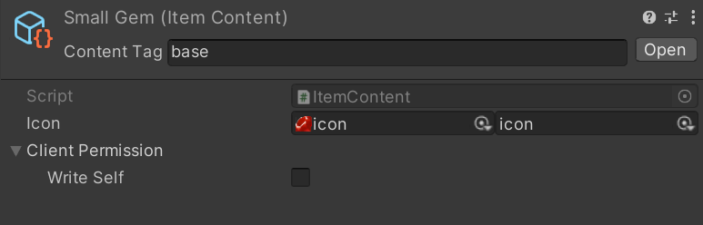 |
| 2. Create SKU content (ensure its Google Play ID matches the Product ID configured in the Google Play Console) | 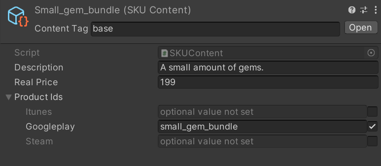 |
| 3. Create listing content | 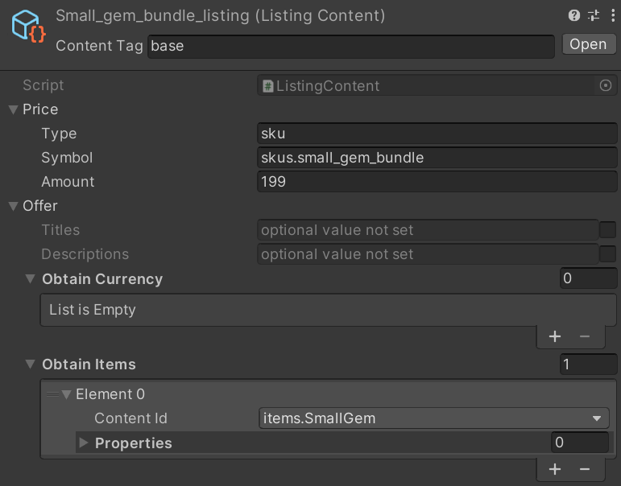 |
| 4. Create store content | 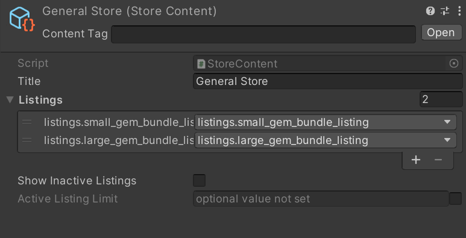 |

## Step 7. Scripting

Now that our content is setup and our Google Play app is configured properly, we are ready to attempt a purchase. The code below is a snippet from the Purchasing sample.

```csharp
using Beamable;
using Beamable.Common.Shop;
using UnityEngine;

public class IAPExample : MonoBehaviour
{
    private BeamContext _context;

    private async void Start()
    {
        _context = BeamContext.Default;
        await _context.OnReady;
        Debug.Log($"Beamable finished initialization, PlayerId: {_context.PlayerId}");
    }

    public async void MakePurchase(string listingId)
    {
        // We're creating a new ListingRef and resolving it just so we can continue
        // using this function with a string parameter from the Unity inspector.
        // This could just as easily work passing in a ListingRef as well, and
        // skipping the construction of a new one.
        var listing = await new ListingRef {Id = listingId}.Resolve();
        var skuId = listing.price.symbol;

        // This validates the existence of the SKU. Since the content service won't allow you to assign an
        // invalid SKU to a Listing, this shouldn't really be necessary, but you can at least validate
        // that your content is set up properly.
        var skusResponse = await _context.Api.PaymentService.GetSKUs();
        var sku = skusResponse.skus.definitions.Find(i => i.name == skuId);
        if (sku == null)
        {
            Debug.LogError("Sku not found.");
            return;
        }

        // These are the two parameters necessary for purchasing using Beamable IAP.
        Debug.Log($"listingSymbol {listing.Id}, skuSymbol: {sku.name}");

        // In editor, BeamableIAP will be a test purchaser. On device, this will defer to whichever purchasing
        // service your platform uses (Android -> Google Play, Apple -> iTunes Store, etc)
        var purchaser = await _context.Api.BeamableIAP;
        var purchaseResult = await purchaser.StartPurchase(listing.Id, sku.name)
            .Error(Debug.LogError);
        
        if (string.IsNullOrEmpty(purchaseResult.Receipt)) return;
        Debug.Log(purchaseResult.Receipt);
        Debug.Log("Purchase successful!");
    }
}
```

## Step 8. Run & Test

This project can be run in either the Unity editor, or built to an Android device and tested there. Simply press one of the two buttons to initiate a purchase.

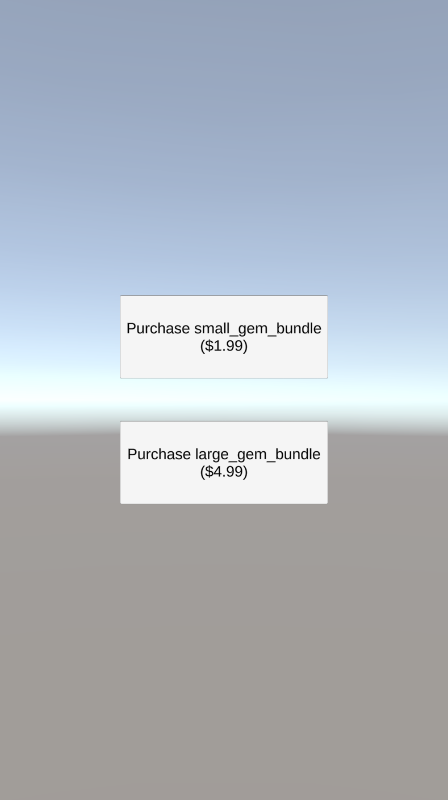{: style="height:auto;width:200px"}

The editor will use a fake purchaser, and give a receipt, demonstrating successful communication with Google Play:

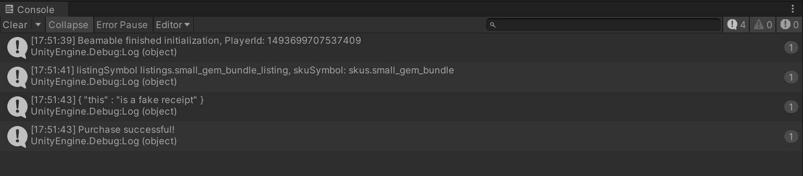{: style="height:auto;width:500px"}

If you're testing on an Android device, the purchasing service will be Google Play, however it will use a fake credit card that always works until your app is out of its testing phases.

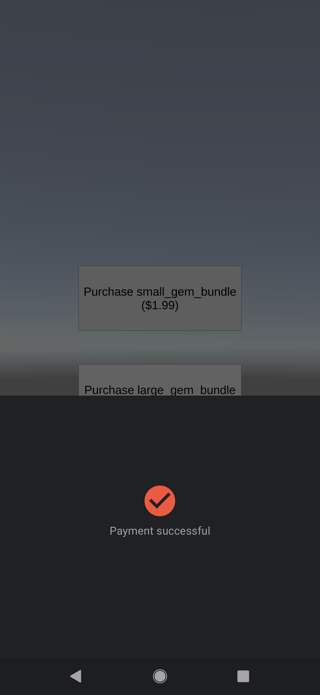{: style="height:auto;width:200px"}
