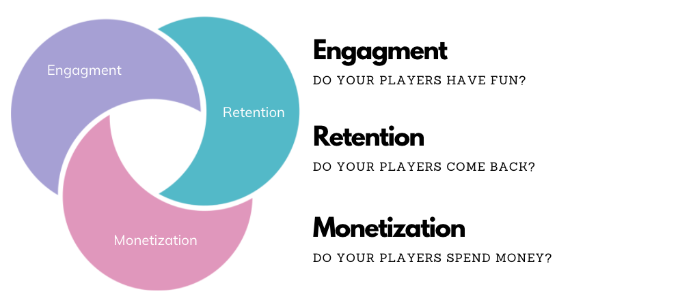
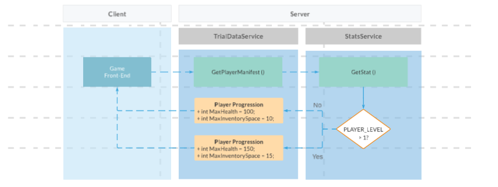
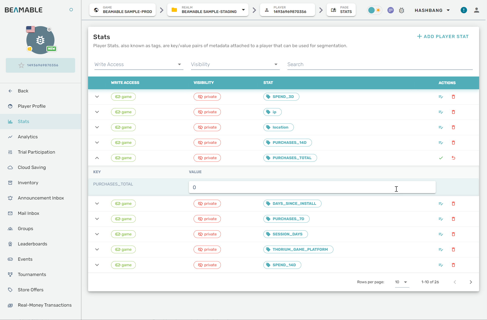

# A/B Testing

A/B Testing can be a great tool to help improve how your users interact with your game. And it can be used across the three main metric pillars: Engagement, Retention & Monetization.

The concept of A/B Testing is to run experiments across a cohort, segmented set, of players and compare feedback. You can measure the results of these tests to create opportunities for improved engagement, retention and monetization.

{width="600px"}

#### Benefits of A/B Testing

- **Increase KPIs** - Key performance indicators, including retention, can be isolated and improved through testing
- **Increase Revenue** - By improving KPIs, improve revenue
- **Decrease Costs** - Game makers can focus on a leaner feature-set which is proven to matter to players
- **Decrease Risks** - Roll out new gameplay features more frequently to a subset of the players. Ensure its ready before releasing to everyone

Generally you will want to follow a process:

- Write Telemetry in your game so you have metrics you can measure against
- Run analytics and create reports that allow you to visualize your players behaviors
- Create one or more Cohorts of players from the analytic
- Then **A/B Test**, Run experiments to test your theories of how to improve the specific metric pillar.

#### Flowchart

Here is a flowchart demonstrating an example of one A/B Testing Trial.

{width="600px"}

The game front-end loads the player manifest from the `TrialDataService`. The `PlayerProgression` data returned depends on a player-specific Stat value.

#### Glossary

| Name | Detail |
|------|--------|
| Acceptance Strategy | Determines how players qualify for a trial. Values:<br>• **GLOBALLY_OPEN** - Indicates that once a player qualifies for this trial, they will be part of it until the trial is (even if ejected they cease to meet the qualifying criteria in the future)<br>• **GLOBALLY_OPEN_WITH_FLOW** - Behaves like a GLOBALLY_OPEN trial, except that a player will be removed from the Trial if they no longer qualify for it<br>• **MUTUAL_EXCLUSIVE** - Indicates that even if a player qualifies for this trial, they will only join it if they are not already part of another trial that is `MUTUAL_EXCLUSIVE` or `MUTUAL_EXCLUSIVE_WITH_FLOW`. Once a player joins this trial, they are a part of it until it is (even if they ejected cease to meet the qualifying criteria in the future)<br>• **MUTUAL_EXCLUSIVE_WITH_FLOW** - Behaves like a MUTUAL_EXCLUSIVE trial, except that a player will be removed from the Trial if they no longer qualify for it |
| Allocation | Determines how players qualify for a specific cohort within a trial. Values:<br>• **% Distribution** - Specify a percentage of the total player population for each cohort<br>• **Custom** - Specify any player stat and a relational operator. This determines the cohort (e.g. stat of `PLAYER_LEVEL` > 1) |
| Cohorts | A grouping of members |
| Cohort Data Overrides | Specifies the Game Base Cloud Data references that is overridden (i.e. changed) for a given cohort<br>_Note: Any text/binary format is compatible with Game Base Cloud Data. Many game makers choose YAML. See Wikipedia's [YAML](https://en.wikipedia.org/wiki/YAML) for more info_ |
| Lifecycle | Determines the current lifecycle status of the trial. Values:<br>• **Running** - Members receive data overrides. Players can join/leave the trial<br>• **Paused** - Members receive data overrides. Players **cannot** join/leave the trial<br>• **Ejected** - Members receive **no** data overrides. Players **cannot** join/leave the trial |
| Member | Refers to a player _within_ a trial |
| Member Count | How many members are in a given cohort |

## A/B Testing API

Unlike many Beamable Features, A/B Testing does not require a specific Beamable Feature Prefab to be used. The main entry point to this feature is C# programming.

The main API is [`beamableAPI.TrialDataService`](https://csharp.cdocs.beamable.com/latest/interfaceBeamable_1_1Common_1_1Api_1_1CloudData_1_1ICloudDataApi.html#details).

| Method Name | Detail |
|-------------|---------|
| GetGameManifest | Loads the generic game dataset excluding any player-specific overrides |
| GetPlayerManifest | Loads the specific game dataset including any player-specific overrides |

!!! warning "Gotchas"

    • The downloaded manifest is compressed in [Gzip](https://www.gnu.org/software/gzip/) format. Be sure to account for that
    • The url of the cloud data leaves the protocol unspecified. Be sure to prepend either "http://" or "https://"

Example Game Manifest
```json
{
   "result":"ok",
   "meta":[
      {
         "sid":1335576733310978,
         "version":1,
         "ref":"game_world_config",
         "uri":"dev-trials.beamable.com/1208935505932288/DE_1208935505932289/1335576733310978/1",
         "cohort":{
            "trial":"",
            "cohort":""
         }
      }
   ]
}
```

Example Player Manifest
```json
{
   "result":"ok",
   "meta":[
      {
         "sid":1335576733310978,
         "version":1,
         "ref":"game_world_config",
         "uri":"dev-trials.beamable.com/1208935505932288/DE_1208935505932289/1335576733310978/1",
         "cohort":{
            "trial":"",
            "cohort":""
         }
      }
   ]
}
```

### Stats

The [Stats](../profile-storage/stats.md) feature is related to A/B Testing in a couple of ways.

**1. Automatic Stats**

Each player **who is a member** of an A/B Testing Trial automatically has these populated Stats.

These values can be accessed programmatically via **set** as `game.private.player` or set in the Beamable Portal.

| Name | Detail |
|------|--------|
| `TRIALS` | This one stat contains a list of all trials. The stat value is dynamically built<br>_Ex. value `[New Trial.Group 2]`_ |
| _Ex. `trialmember:New Trial`_ | There is an additional stat **per** trial. The stat name is dynamically built as well as the stat value<br>_Ex. value `Group 2`_ |

**2. Criteria Stats**

For any A/B Testing Trial with an "Allocation" of type "Custom", the game maker specifies any player Stat and a relational operator. This determines the cohort (e.g. stat of `PLAYER_LEVEL` > 1).

These values can be accessed programmatically via **get** as `game.private.player`.

### Debugging Manifests

For debugging the manifests, game players can use the Admin Flow to enter commands.

**Commands**

| Name | Detail |
|------|--------|
| `CLOUD-MANIFEST` | Retrieve and output to the console log the **game** manifest, which includes the entire cloud data domain.<br>_Note: This is invokable only by a privileged user (i.e. C# Microservice OR admin user). So if privileged user invoking in Unity, be sure your runtime user is an admin of the realm – you can login to such a user using the Account Management Flow prefab_ |
| `CLOUD-PLAYER` | Retrieve and output to the console log the **player** manifest, which includes the entire cloud data domain. |

!!! info "Best Practices"

    **Unity Client**

    - Trial assignment occurs on session start
    - Fetch the cloud data manifest again if the user changes

    **C# Microservice**

    - Fetch the manifest with every incoming request, it is cheap to do so
    - Cache the cloud data in local storage or in memory

## Getting Started

The **A/B Testing** feature allows game makers to deploy new functionality to subset of players.

### Creating Data

Here the data will be created. This represents the **default** data which all users will receive (unless overridden by the Trial created per Step 2).

| Step | Detail |
|------|--------|
| 1. Open the Portal | • See [portal.beamable.com](https://portal.beamable.com/) |
| 2. Open "Game Based Cloud Data" | {width="400px"} |
| 3. Upload Data | {width="400px"}<br>• Click "Upload"<br>• Populate all data fields<br>• Optional, choose the appropriate file from Data Files below<br>• Click "Upload"<br>*Note: At present the only data format supported for "Cloud Data" governed by Trials is [YAML](https://en.wikipedia.org/wiki/YAML)* |

### Creating Trial

Here the Trial will be created. This represents the rules for if/when the **default** data created in Step 1 above will be overridden.

!!! warning "Private Stats"

    Note that Trials only work with private game stats. These are categorized under the `game.private.player` namespace.

| Step | Detail |
|------|--------|
| 1. Open the Portal | • See [portal.beamable.com](https://portal.beamable.com/) |
| 2. Open "Trials" | _Note: Trial creation interface - image not available_ |
| 3. Create the Trial | _Note: Trial configuration interface - image not available_<br>• Choose "Allocation" of "Custom" and add 2 cohorts<br>• Populate all data fields<br>• Click "Create"<br>_Note: See A/B Testing - Code (Glossary) for more info_ |
| 4. Assign the Data | • Assign the override data that will be loaded instead of the **default** data from **Step 1** above<br>• Optional, choose the appropriate files from Data Files below |
| 5. Play the Trial | _Note: Trial play interface - image not available_<br>• Click "Play"<br>• Click "Confirm"<br>_Note: See A/B Testing - Code (Glossary) for more info_ |
| 6. Set the Stat | {width="500px"}<br>• Open "Player Administration"<br>• Open "Stats"<br>Enter the `PlayerId` of the active player from the Unity Console Window and the namespace of `game.private.player`<br>• Click "Add Player Stat"<br>• Enter Name of `PLAYER_LEVEL` and a Value of `1` or `2`. Each returns a dataset via `TrialDataService`<br>{width="400px"}<br>_Note: The trial in this example depends on a stat value. However, other types of trials do not. Choose the best criteria for the needs of the project._ |

### Loading Data

Here the game client will load the Trial data. If the current player qualifies for the criteria of the Trial created in Step 2, the player will receive overridden data. Otherwise the player will receive the **default** data created in Step 1.

**Loading Manifest**

```csharp
GetCloudDataManifestResponse playerManifestResponse =
     await _trialDataService.GetPlayerManifest();
```

**Loading Data**

Loop through the `meta`. There will be 0 or more values. The implementation here depends on the needs of the project. In this example, each loop iteration is parsed as Json and tested for compatibility with the `MyPlayerProgression` data type.

```csharp
foreach (CloudMetaData cloudMetaData in playerManifestResponse.meta)
{
    string response = 
        await _trialDataService.GetCloudDataContent(cloudMetaData);

    MyPlayerProgression myPlayerProgression = 
        JsonUtility.FromJson<MyPlayerProgression>(response);

    // Store the data
    if (myPlayerProgression != null)
    {
        _data.MyPlayerProgression = myPlayerProgression;
    }
}
```

### Data Files

To follow along with the steps above using the example data download these [Json data files](https://github.com/beamable/Beamable_SDK_Examples/tree/master/client/Assets/Examples/Runtime/Services/TrialDataService/Json) which matches the `MyPlayerProgression` data type. Or create and choose your own custom files and custom data type.

- **base_cohort.json** - For use with Step 1.3 above
- **player_level_1_cohort.json** - For use with Step 2.4 above
- **player_level_not1_cohort.json** - For use with Step 2.4 above

### Sample Code

The `TrialDataServiceExample.cs` loads the `MyPlayerProgression` object with appropriate values. The related A/B Test trial uses the player's Stat of `PLAYER_LEVEL` to determine the appropriate values.

TrialDataServiceExample.cs
```csharp
using System.Collections.Generic;
using System.Threading.Tasks;
using Beamable.Common.Api;
using Beamable.Common.Api.CloudData;
using Beamable.Examples.Services.CloudSavingService;
using Beamable.Examples.Services.ConnectivityService;
using Beamable.Examples.Shared;
using UnityEngine;
using UnityEngine.Events;

namespace Beamable.Examples.Services.TrialDataService
{
    /// <summary>
    /// Represents the data in
    /// the A/B Testing trial.
    /// </summary>
    [System.Serializable]
    public class MyPlayerProgression
    {
        public int MaxHealth = 100;
        public int MaxInventorySpace = 10;
    }

    /// <summary>
    /// Holds data for use in the <see cref="ConnectivityServiceExampleUI"/>.
    /// </summary>
    [System.Serializable]
    public class TrialDataServiceExampleData
    {
        public bool IsUIInteractable = false;
        public string DataName = "MyPlayerProgression";
        public MyPlayerProgression MyPlayerProgression = null;
        public List<CloudMetaData> CloudMetaDatas = new List<CloudMetaData>();
        public bool IsInABTest { get { return CloudMetaDatas.Count > 0; } }
    }

    [System.Serializable]
    public class RefreshedUnityEvent : UnityEvent<TrialDataServiceExampleData>  { }

    /// <summary>
    /// Demonstrates <see cref="TrialDataService"/>.
    ///
    /// NOTE: This demo uses other concepts
    /// too. See <see cref="CloudSavingServiceExample"/>
    /// for more info.
    /// 
    /// </summary>
    public class TrialDataServiceExample : MonoBehaviour
    {
        //  Events  ---------------------------------------
        [HideInInspector] public RefreshedUnityEvent OnRefreshed = new RefreshedUnityEvent();

        //  Fields  ---------------------------------------
        private TrialDataServiceExampleData _data = new TrialDataServiceExampleData();
        private ICloudDataApi _trialDataService;
        private IBeamableAPI _beamableAPI;

        //  Unity Methods  --------------------------------
        protected void Start()
        {
            Debug.Log($"Start() Instructions...\n" +
                      " * Setup AB Testing in Portal per https://docs.beamable.com/docs/abtesting-code\n" +
                      " * Run The Scene\n" +
                      " * See onscreen UI for results.\n" +
                      " * If IsInABTest is false, something is incorrect. Repeat these steps.\n" + 
                      " * If IsInABTest is true, everything is correct. Visit the portal to change " +
                      "the `PLAYER_LEVEL` stat value, then repeat these steps see load other data.\n");

            SetupBeamable();
        }


        //  Methods  --------------------------------------
        private async void SetupBeamable()
        {
            _beamableAPI = await Beamable.API.Instance;

            Debug.Log($"beamableAPI.User.id = {_beamableAPI.User.id}");

            _trialDataService = _beamableAPI.TrialDataService;

            await LoadTrialData();
        }

        public async Task<EmptyResponse> LoadTrialData()
        {
            // Load any trials
            GetCloudDataManifestResponse playerManifestResponse =
                await _trialDataService.GetPlayerManifest();
            
            // Loop through trials
            _data.MyPlayerProgression = null;
            _data.CloudMetaDatas = playerManifestResponse.meta;
            foreach (CloudMetaData cloudMetaData in _data.CloudMetaDatas)
            {
                string path = $"http://{cloudMetaData.uri}";

                // Load the data, respecting GZip format
                string response = 
                    await ExampleProjectHelper.GetResponseFromHttpWebRequest(path);

                MyPlayerProgression myPlayerProgression = 
                    JsonUtility.FromJson<MyPlayerProgression>(response);

                // If trial is related, store data
                if (myPlayerProgression != null)
                {
                    _data.MyPlayerProgression = myPlayerProgression;
                }
            }

            _data.IsUIInteractable = true;
            Refresh();
            return new EmptyResponse();
        }


        public void Refresh()
        {
            string refreshLog = $"Refresh() ..." +
                                $"\n * IsInABTest = {_data.IsInABTest}" +
                                $"\n * CloudMetaDatas.Count = {_data.CloudMetaDatas.Count}" +
                                $"\n\n";

            //Debug.Log(refreshLog);

            // Send relevant data to the UI for rendering
            OnRefreshed?.Invoke(_data);
        }
    }
}
```

**Verify Success**

After running the scene containing the `TrialDataServiceExample.cs` per above, you can further verify success.

Visit the Portal and change the value of any stat related to the trial for the currently logged-in PlayerId. See the Unity console window for the PlayerId.

Steps

- Change the value of the `PLAYER_LEVEL` stat to 1. Run the scene and see the result.
- Change the value of the `PLAYER_LEVEL` stat to 2. Run the scene and see the result.

If the onscreen UI shows different text in each case, then all is setup properly.

## Troubleshooting Tips

Here are some areas to double check if your testing is not working as intended.

- Ensure the stats used for segmentation are game private (`game.private.player` namespace).
- Some values from your trials may need to be tweaked to affect the intended player population. See the A/B Testing - Code (Glossary) for more info on these parameters.
- Ensure the files uploaded to Game Base Cloud Data are able to be deserialized properly in the file format your game is expecting.
