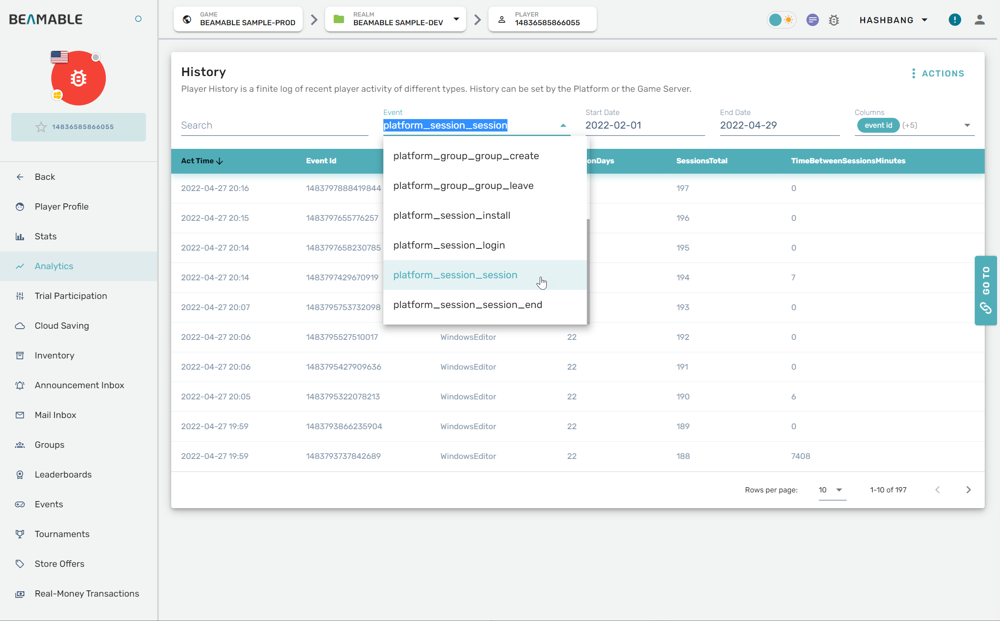

# Analytics

## Why Analytics?

Beamable's Analytics solution provides the most control and access to your data. There are important reports that are needed in order to measure the success of your game and, as a game maker, you want to know:

- How many unique total players you have per month (MAU)
- How many active players you have per day (DAU) 
- How many of those users are returning users that have played previously (Retention)

These examples are among a select few necessities to measure the success of your game, and Beamable empowers you as a game maker by giving you full control over your data so you can gain the most value from writing Telemetry.

!!! info "To get setup to query Analytic Events, you will need to Contact Us."

    With your Analytics events captured and stored, queries may be performed against them, but you will need to get setup by the Beamable team to do so. There are two options on acquiring your data.

    **Options**

    - Direct access to Beamable's Athena database.
    - Forwarding from Beamable's Pipeline Service. Support includes Amazon S3, Amplitude, MixPanel, & Swrve.com.

    If you change technology along the way, Beamable will be able to back-fill the data.

    To get set up for querying Beamable analytics, please [contact us](https://www.beamable.com/contact-us).

## System Telemetry

Beamable also writes some default telemetry data just from using features of the service. There are several KPI's (Key points of interest) that Beamable already knows that you will need.

These KPI's, defined below, are meant to help you in the following ways:

- Help determine the success of the game
- Give an understanding of core player behavior
- Show advancement towards key monetization goals

| KPI | Detail |
|-----|--------|
| `platform_session_install` | detect when a player is first created |
| `platform_session_daily` | detect daily activity of the player, good for measuring retention |
| `platform_session_session` | provides you with session data |
| `platform_session_session_end` | provides you with end of session data |
| `platform_ua_attribution` | provides you with user acquisition data related to campaigns |
| `platform_cohort_join` | data to identify when a player joins a cohort (segment) |
| `platform_commerce_external_revenue` | data to identify when a player makes real money purchases from an external source |
| `platform_commerce_hard_purchase` | data to identify when a player makes real money purchases (Hard Currency) |
| `platform_commerce_virtual_purchase` | data to identify when a player spends virtual currency |
| `platform_commerce_failed_purchase` | data to identify when purchases have failed |
| `platform_entitlement_entitlement` | Player has been granted an entitlement |
| `platform_stats_stats` | player stat has been modified |
| `platform_group_group_create` | group has been created |
| `platform_group_group_invite` | player has been invited to a group |
| `platform_group_group_join` | player has joined a group |
| `platform_group_group_leave` | player has left a group |
| `platform_group_group_application` | player has applied to join a group |
| `platform_administration_change_email` | player has changed their email |
| `platform_administration_reset_password` | player has reset their password |

## Game Maker User Experience

The Portal allows the game maker to view and download player analytics. Individual player analytics can be found within the player profile page.

{width="600px"}

## Schema

Analytics events are namespaced by the source to limit name collision (Ex: `Client.GAME_START` vs `Platform.GAME_START`).

The payload may include custom data set by the game maker. This is a flat set of key/value pairs.

{width="600px"}

The source value is set automatically for each Analytics event and [Stats](../profile-storage/stats.md).

| Name | Detail | Secure | Available |
|------|--------|--------|-----------|
| Client | Analytics event came directly from front-end (game client) | Custom Telemetry written by the client is generally less secure and has no server authority | Yes |
| Platform | Analytics event came from back-end | Yes | Yes |
| Game Server | Analytics event came from the multiplayer server | Yes | Upon Request |

## Analytics Events vs Stats

Beamable supports both analytics events and [Stats](../profile-storage/stats.md). Each use case is unique.

| Type | Database | Detail |
|------|----------|--------|
| Analytics Event | Analytics Database | • Events take some time to appear<br>• Holds deep history<br>• Answers queries like "When did player X purchase item Y?"<br>_Example: Amazon's [Athena](https://aws.amazon.com/athena/)_ |
| Stat | Transactional Database | • Very fast reads/writes<br>• Does not keep history<br>_Example: [Mongo DB](https://www.mongodb.com/)_ |

## Analytics - Code

It will take some time to learn what queries to write for your game. You'll have to learn and understand the schema, and you'll have to get a firm understanding of what data is being stored and what it means to you and your reporting needs.

This section is designed to provide you with some **out-of-the-box** queries that you can write that will give you a head start. These queries are designed to give you the following.

- MAU, DAU, Average Session Length
- Players Spending, Players Spending over time
- Daily Retention Report that you can use for a cohort chart

### MAU, DAU & Average Session Length

MAU (Monthly Active Users), DAU (Daily Active Users) & Average Session Length are great metrics to measure the engagement of your player base. These are critical metrics needed to see if you are acquiring users and if they are staying in your game and potentially enjoying it.

For example, If you find that your average session length is decreasing over time but you are gaining plenty of users per month / day. Then you probably have something in your game that is making players not want to play any more.

!!! info "Query Notes"

    When using PopSQL you can put **-30** in the variable field. If not using PopSQL you can replace {{days}} with **-30** for MAU. For DAU put **0**.

MAU & DAU
```sql
--MAU DAU
select 
    count(event_id) METRIC 
from platform_session_session 
where 
    "e.firstDailySession"='true'
    and act_time >= date_add('day', {{days}}, CURRENT_TIMESTAMP);
```

Average Session Length
```sql
--Average Session Length    
select 
    round(avg(cast("e.session_length_minutes" as integer)),2) average_session_length 
from platform_session_session_end 
where 
 act_time >= date_add('day', {{days}}, CURRENT_TIMESTAMP);
```

### 30 Day Retention Cohort

Now that you have engaged players, you will want to ensure they they are sticky. This means that they will come back and play your game and this report data shows you how often they come back. This also shows you if players are churning out from your game. Churn is when a player stops playing your game and you've likely lost them for good. Churn is bad, and if you want to prevent it you need to understand how well you are retaining your players.

!!! info "Query Notes"

    When using PopSQL, you'll need the PID realm ID and a start and end date. If not using PopSQL, replace the {{pid}} field and the {{start_date}} and {{end_date}} fields with correct values.

```sql
WITH 
activities as (
 select DATE(act_date) as start, gamer_tag 
 from {{pid}}.platform_session_session
 where DATE(act_date) BETWEEN DATE('{{start_date}}') AND DATE('{{end_date}}')
 AND gamer_tag NOT IN (
   SELECT DISTINCT gamer_tag FROM {{pid}}.platform_session_install
   WHERE act_date < '{{start_date}}'
 )
),
new_users as (
  SELECT gamer_tag, date_trunc('day', MIN(DATE(act_date))) as start_time
  FROM {{pid}}.platform_session_install
  GROUP BY gamer_tag
  ORDER BY 1, 2
),
user_activities as (
  SELECT A.gamer_tag, date_diff('day', C.start_time, date_trunc('day', A.start)) AS period_number
  FROM activities A
  LEFT JOIN new_users C ON A.gamer_tag = C.gamer_tag
  GROUP BY 1, 2
  HAVING date_diff('day', C.start_time, date_trunc('day', A.start)) < 10
  ORDER BY 1, 2
),
cohort_size as (
  SELECT start_time, COUNT(1) AS num_users
  FROM new_users
  GROUP BY 1
  ORDER BY 1
),
retention_table as (
  SELECT C.start_time, A.period_number, COUNT(1) AS num_users
  FROM user_activities A
  LEFT JOIN new_users C ON A.gamer_tag = C.gamer_tag
  GROUP BY 1, 2
)
SELECT B.start_time as act_date, B.period_number, S.num_users as new_users, B.num_users as retained_users, (B.num_users/cast(S.num_users as double) * 100) as retention
FROM retention_table B
LEFT JOIN cohort_size S ON B.start_time = S.start_time
WHERE B.start_time IS NOT NULL AND B.period_number != 0
ORDER BY 1, 3
```

### Monthly Players Spending (Total Revenue Per Month)

When you have an engaged & retained player base and you offer any sort of IAP (in app purchases) then this report will be important for you to understand how much money players are spending and how much money you are making per month. This query will show you how much your players are spending each month as an aggregated total.

!!! info "Query Notes"

    This is a very simple way to get the total dollar amount spent across all players and all sessions during a 30 day period. When using PopSQL you can put **-30** in the variable field. If not using PopSQL you can replace {{days}} with **-30**.

Monthly Spending
```sql
select 
    sum(cast("e.spendTotal" as integer)) SpendTotal
from platform_session_session
where 
 act_time >= date_add('day', {{days}}, CURRENT_TIMESTAMP);
```

### 30 Day - Daily Spending Report

Knowing how much money your game is making from IAP each day is highly valuable. If you monitor this over time and you start seeing a dip, this could be a sign that something is wrong in your game. It is also a great success metric to show that your game monetizes well.

!!! info "Query Notes"

    The below query will give you any spending that was done across all sessions on a particular date. If no spending was done and there were sessions there will be a record with 0. When using PopSQL you can put **-30** in the variable field. If not using PopSQL you can replace {{days}} with **-30**.

30 Day Daily Spending
```sql
select 
    date(act_time) SessionDate, sum(cast("e.spendTotal" as integer)) SpendTotal
from platform_session_session
where 
 act_time >= date_add('day', {{days}}, CURRENT_TIMESTAMP)
group by date(act_time)
order by date(act_time);
```

## Getting Started

In this guide we will cover how to get setup to query your Athena Database and how to write some simple queries to see that it is working.

!!! info "For this guide we will be using PopSQL"

    PopSQL is a delightful tool that makes querying the Athena Database a breeze. There are many other options out there to query Athena, but we like PopSQL for a few reasons.

    1. Both a thick & web client so you can access your Athena database from anywhere. Both are identical in every way.
    2. Very simple to setup
    3. There are both free & paid versions available.
    4. If you are using PopSQL with a Team, you can save, store & share queries across your entire team.

    [Signup for PopSQL to follow along with this guide!](https://popsql.com/users/sign_up)

    **Beamable developers and studios also get a discount on PopSQL subscriptions!**

    - 50% off Premium or Business for Indie teams (less than 2 years old, and fewer than 10 employees) for up to 1 year
    - 25% off Premium or Business for everyone else for up to 1 year

    All you have to do is email [support@popsql.com](mailto:support@popsql.com) or open up a ticket through our intercom chat widget and provide your Beamable CID.

### Get Access

In order to access the Athena Database you will need 3 key pieces of information. The following can only be provided to you from the Beamable team and we are eager to get you setup! NOTE: You must have a REPORT tier subscription to get access to custom analytics queries. You can find out more at <https://beamable.com/pricing>. We will then provide you with the following:

- AWS Access Key ID
- AWS Secret Access Key
- AWS Region ( in most cases `us-west-2` )
- S3 Output Location ( should look like s3://myBucket )

_Note: AWS configuration image not available_

### Configure PopSQL

Once you have downloaded PopSQL or have signed up and are using the web interface, and you have received your credentials from the Beamable team you are ready to configure PopSQL.

_Note: PopSQL settings interface image not available_

1. Navigate to your accounts menu and click **manage connections**
2. Click **Add new Connection** button. It is located in the top right corner.
3. Select **Amazon Athena**
4. The database value is a lowercase version of the project ID (PID) of your title. You can find this in the Beamable portal and generally looks like **DE_1418422019508251**. Note that when you populate it here in the database that the **de_** needs to be lower case.
5. Put the provided S3 Output Location, AWS Access Key ID & AWS Secret Access Key. You can leave everything else blank or default. ( for example, AWS Session Token is not needed for this type of connection )
6. Click Save and Connect

!!! info "Note"

    You may want to Test your connection before Saving & Connecting.

### Your First Query

I like to start off fairly simple and just get a general list of events to see that things are working properly.

Be sure to set your connection if it is not already set. Do not pick a database if any are available. Those would be test databases and do not have your data in them.

The schemas and tables in PopSQL should show (0). You can query them, but you cannot browse them for permission reasons.

_Note: PopSQL connection setup image not available_

Here we are going to get the last 10 events from the **platform_session_session** table.

```sql
select * from platform_session_session limit 10;
```

As you can see you already get some very interesting data about your player. Let's take a moment to explore the schema of this table.

### Getting the Table Schema

```sql
SELECT * FROM information_schema.columns WHERE table_schema = '[your de_ID goes here]' and table_name = 'platform_session_session'
```

The above query will yield the following results. And as you can see the information provided in this table is immensely valuable. Beamable by default calculates a bunch of information for you making it easy to extract MAU, DAU, Session Length, Spending habits and more.

| Column Name                    | Data Type    | Detail                                                                                |
| :----------------------------- | :----------- | :------------------------------------------------------------------------------------ |
| `event_id`                     | bigint       | Id of the event                                                                       |
| `act_date`                     | varchar(256) | Date of the event as a string                                                         |
| `act_time`                     | timestamp    | timestamp of the event                                                                |
| `gamer_tag`                    | bigint       | PlayerId of the player                                                                |
| `e.spend3d`                    | varchar(256) | How much the player has spent in the last 3 days                                      |
| `e.sessions14d`                | varchar(256) | how many sessions the player has had in the last 14 days                              |
| `e.corrid`                     | varchar(256) | a correlation id which can be used across tables                                      |
| `e.sessiondays`                | varchar(256) | has played a session at least once for a total of N days.  These are not consecutive. |
| `e.spendtotal`                 | varchar(256) | total amount spent                                                                    |
| `e.sessions28d`                | varchar(256) | how many session the player has had in the last 28 days                               |
| `e.device.platform`            | varchar(256) | what platform they were using when this event was written                             |
| `e.sessionstotal`              | varchar(256) | total number of sessions                                                              |
| `e.purchasestotal`             | varchar(256) | total purchases                                                                       |
| `e.spend7d`                    | varchar(256) | total amount spent in the last 7 days                                                 |
| `e.timebetweensessionsminutes` | varchar(256) | average time between sessions in minutes                                              |
| `e.firstdailysession`          | varchar(256) | was this event the first daily session?                                               |
| `e.sessions3d`                 | varchar(256) | how many sessions in the last 3 days                                                  |
| `e.purchases7d`                | varchar(256) | how many purchases in the last 7 days                                                 |
| `e.dayssinceinstall`           | varchar(256) | how many days since the player installed                                              |
| `e.sessions7d`                 | varchar(256) | how many session in the last 7 days                                                   |
| `e.spend28d`                   | varchar(256) | how much have they spent in the last 28 days                                          |
| `e.ip`                         | varchar(256) | the ip address of the player for this session event                                   |
| `e.purchases14d`               | varchar(256) | total purchases in the last 14 days                                                   |
| `e.purchases28d`               | varchar(256) | total purchases in the last 28 days                                                   |
| `e.purchases3d`                | varchar(256) | total purchases in the last 3 days                                                    |
| `e.spend14`                    | varchar(256) | total spend in the last 14 days                                                       |

### What Tables are available?

As you use Beamable, more and more data will be available. That means more tables will also be available. By default there are a select few tables available.

- `platform`
- `platform_session_session`
- `platform_session_session_end`
- `platform_session_install`

But as you use Beamable features and as you write custom Telemetry events more data and tables will automatically be available. So it's important that you query to see what tables are available from time to time. The following query will provide you with a list of tables that are available to you at any given point in time.

```sql
SELECT distinct table_name FROM information_schema.columns WHERE table_schema = 'your de_ID goes here'
```

### Conclusion

Now you have the basics you need in order to query your Athena database, see what tables are available and see which fields are available within those tables. The power is now in your hands to ask the questions you want to know about your players and query your data to find out the answers!
