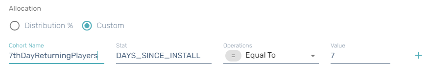
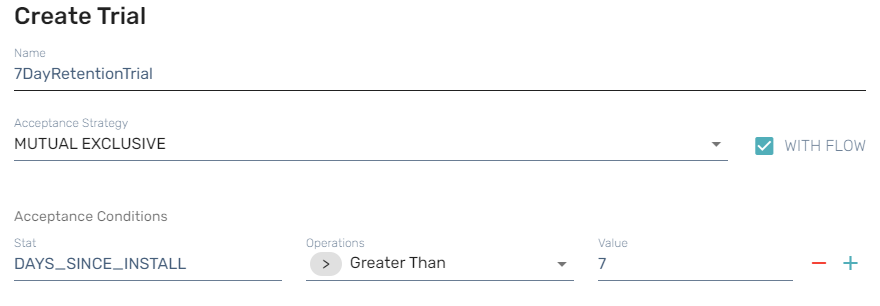
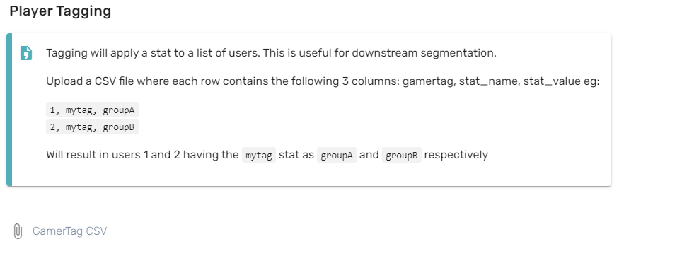

# Segmentation

Segmentation is extremely important when running a live game. In order to tailor content or run experiments on players you need to have the ability to group players into cohorts. Here at Beamable we also call these grouped players Cohorts. In addition, you need the ability to run actions across these segmented players and manipulate bits of information about the players. This enables you to deliver new content to specific groups of players. A/B Testing is one of the ways that you can run experiments on players, however through using other services from Beamable you can also deliver new store content and or work with players in a cohort from Microservices.

In this section you will find out exactly how to segment your players. How players sometimes automatically get segmented by Beamable and learn more about what you can do with segmentation of your players.

You will find the following topics here:

- How to segment players and create cohorts
- How does Beamable create cohorts of players for you
- What can you do with cohorts of players
- Guides to show you some examples of creating cohorts of players

## Getting Started

In this guide we will walk you through segmenting players into cohorts. We'll show you a couple of ways to do that including using the Portal to define rules.

### Creating a Cohort by Stats

Most of the segmentation in Beamable is to create a cohort by a _stat_. You can learn more about stats in the [Stats](../profile-storage/stats.md) page. However, in this guide we are going to show you how to use a default stat `DAYS_SINCE_INSTALL` to create a cohort that is going to be used in a trial. Trials are [A/B testing](ab-testing-overview.md), which you will learn more about in that section. But this guide will just focus on the part where we create a cohort.

- Navigate to the [Portal](https://portal.beamable.com) and login.
- Go To **Operate → Trials**
- Create a new Trial by clicking on the **+ Add Trial** button
- Select **Custom**, and give your cohort a name — we used **7thDayReturningPlayers** as our example cohort name.
- Specify `DAYS_SINCE_INSTALL` as the stat and set it _Equal To_ the value of 7.



In this trial, we also added these values to complete and save the trial.



What this is doing is creating a trial that can be joined by a cohort. As you will learn in the A/B Testing area, that trials can be used in various places to run experiments. The above will create a cohort called "7thDayReturningPlayers" and all actions can be performed on this cohort from various other parts of Beamable.

### Upload CSV to Create a Cohort

Since we now know that you can create a cohort from stats, Beamable provides you with a built in tool to get players into a cohort by creating stat attribution.

This is interesting in a couple of ways. Firstly, it allows you the developer to write queries against your own telemetry and create stats where you can segment your players and create cohorts. This is known in Beamable as **Tagging**. Secondly, it allows you to very granular with your data and find those cohorts of players that you really want to target.



Navigating in the Portal to **Operate → Tagging** will take you to the above screen.

```text
1437311035933697, LEVEL, 123
1437311035933697, FOO, bar
1437311035933697, BAZ, 3.14159
```

This is the format your CSV should be in. The first column is a **Gamer_Tag** or PlayerId of the player. The second column is your **Stat_Name**. The third column is your **State_Value**.

!!! warning "Gotcha: Space the comma"

    Please note that if you do not put a space between the comma and the key or value, the parser will trim that character. So be sure that your properly format the CSV.

### Custom Segmentation Cohort

Sometimes you might want to create a cohort from custom telemetry in your game. You will want to run a query against your Athena Database (See [Analytics - Overview](analytics-overview.md)) and then create a CSV from that data to where you can put those users into a cohort.

```sql
select distinct gamer_tag, stat_name, stat_value from (

    select distinct 
        gamer_tag, 
    '   sessions7d' as "stat_name",
        round(avg(cast("e.sessions7d" as integer))) stat_value
    from 
        platform_session_session 
    group by 
        gamer_tag
) 
where 
stat_value > 7
```

In this query, we are creating a customized set of data based on sessions. You can do this type of aggregation on your own custom telemetry that you write.

```text
1440808287256577, sessions7d, 11
1433550959091713, sessions7d, 25
1428983089015809, sessions7d, 12
```

This becomes our result, and now we can upload this and have a cohort of users that have more than 7 sessions played.
