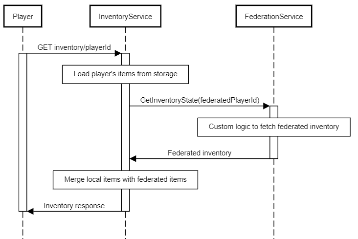
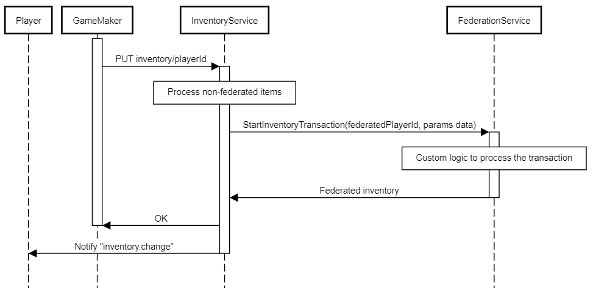

# Inventory federation

## Overview

Beamable supports custom inventory federation using managed [microservices](../../cloud-services/microservices/microservice-framework.md). You can use this service to extend
the Inventory system with items that are managed externally, such as off-chain inventory records, platform-owned assets,
or NFT-backed items.

Some use cases:

- Blockchain assets - use NFTs as inventory items and auto-mint new items
- Generative AI - grant players AI-generated items

**Requirements:**

- Federated Inventory depends on the implementation of [Federated Identity](../identity/federated-identity.md), that means that every player first
needs to have a federated identity with the same microservice that federates inventory
- Inventory items are content-driven. To enable federation, content items must be marked as federated to a specific microservice

The diagrams below illustrate the flows for retrieving and granting the Inventory Items with Federation enabled

{: style="height:auto;width:400px"}


{: style="height:auto;width:400px"}

### `IFederatedInventory<T>` interface

To use the Federated Inventory you should start by implementing the `IFederatedInventory<T>` interface in your microservice.
Note that this interface also implements `IFederatedLogin<T>` because federated authentication is a prerequisite.
`T` must be your implementation of the `IThirdPartyCloudIdentity` - a basic interface that
requires you to define a unique name/namespace for your federation. This enables you to have multiple federation
implementations in a single microservice.

```csharp
public class MyFederationIdentity : IThirdPartyCloudIdentity
{
	public string UniqueName => "my-cool-federation";
}

[Microservice("MyFederation")]
public class MyFederationService : Microservice, IFederatedInventory<MyFederationIdentity>
{
   
}
```

### `GetInventoryState` implementation

You can perform any custom logic here. For example, you could AI generate some items, load items from a smart contract,
use microstorage, or perform anything that satisfies your specific requirements.
Here is a dummy example that will return some static items and currency, just to showcase the response structure:

```csharp
public Promise<FederatedInventoryProxyState> GetInventoryState(string id)
{
    return Promise<FederatedInventoryProxyState>.Successful(
        new FederatedInventoryProxyState
        {
            currencies = new Dictionary<string, long>
            {
                { "currency.federated-gold", 1000 },
                { "currency.federated-silver", 5000 }
            },
            items = new Dictionary<string, List<FederatedItemProxy>>
            {
                {
                    "items.avatar", new List<FederatedItemProxy>
                    {
                        new()
                        {
                            proxyId = "externalAvatarId1",
                            properties = new List<ItemProperty>
                            {
                                new() { name = "level", value = "20" },
                                new() { name = "color", value = "blue" }
                            }
                        },
                        new()
                        {
                            proxyId = "externalAvatarId2",
                            properties = new List<ItemProperty>
                            {
                                new() { name = "level", value = "30" },
                                new() { name = "color", value = "red" }
                            }
                        }
                    }
                }
            }
        }
    );
}
```

The important thing to emphasize here is the `id` argument. It is the same external account id that you return from the
`Authenticate` method. If you want to access the player's id in the Beamable system, you can use `this.Context.UserId`
As an example, you can use the wallet address as an external user identifier when implementing blockchain federation.

### `StartInventoryTransaction` implementation

The Inventory service will forward all the changes against federated currency and items. This method has the same return type as the previous one.

```csharp
public async Promise<FederatedInventoryProxyState> StartInventoryTransaction(string id, string transaction, Dictionary<string, long>
        currencies, List<FederatedItemCreateRequest> newItems, List<FederatedItemDeleteRequest> deleteItems, List<FederatedItemUpdateRequest> updateItems)
{
    await _myFederation.ApplyCurrency(currencies);
    await _myFederation.AddItems(newItems);
    await _myFederation.UpdateItems(updateItems);
    await _myFederation.DeleteItems(deleteItems);
    return await GetInventoryState(id);
}
```

The `transaction` argument is a unique transaction id generated in the Beamable Inventory service, and you can use it to guard against multiple submissions.

This synchronous approach is the default path: apply the change to the external system before `StartInventoryTransaction`
returns, then return the new proxy state.

If transaction processing is too slow to return a timely response, use an asynchronous approach. In that case,
`StartInventoryTransaction` still returns a `FederatedInventoryProxyState`; there is no special "pending" value that
tells Beamable to wait for a later callback. Return the current proxy state immediately, process the transaction in the
background, and then notify Beamable after the external system commits the change.

Use `proxy/reload` after the external commit when `GetInventoryState` can read the updated state from the external
system. Beamable calls back into your federation and refreshes its cached proxy inventory from the returned state.

```csharp
await Requester.Request<CommonResponse>(
    Method.PUT,
    $"/object/inventory/{_userContext.UserId}/proxy/reload");
```

Use `proxy/state` when you already have a complete snapshot and want to replace Beamable's cached proxy inventory
directly. The payload has the same shape as `FederatedInventoryProxyState`.

```csharp
var newState = new FederatedInventoryProxyState
{
    currencies = new Dictionary<string, long>
    {
        { "currency.federated-gold", 1250 }
    },
    items = new Dictionary<string, List<FederatedItemProxy>>
    {
        {
            "items.avatar", new List<FederatedItemProxy>
            {
                new()
                {
                    proxyId = "externalAvatarId1",
                    properties = new List<ItemProperty>
                    {
                        new() { name = "level", value = "31" },
                        new() { name = "color", value = "blue" }
                    }
                }
            }
        }
    }
};

await Requester.Request<CommonResponse>(
    Method.PUT,
    $"/object/inventory/{_userContext.UserId}/proxy/state",
    newState);
```

Keep each callback scoped to one inventory federation. If one gameplay result touches assets owned by multiple external
systems, send one callback per federation.
