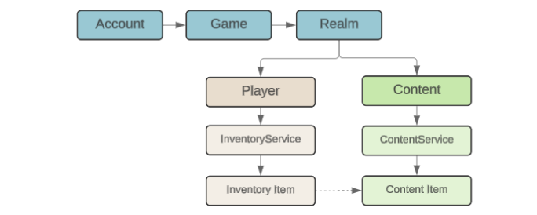
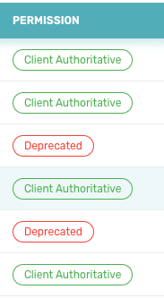
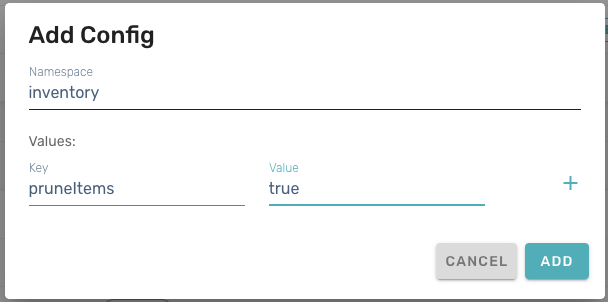
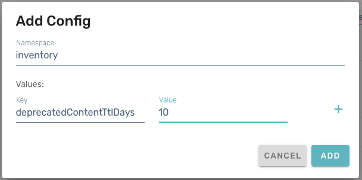
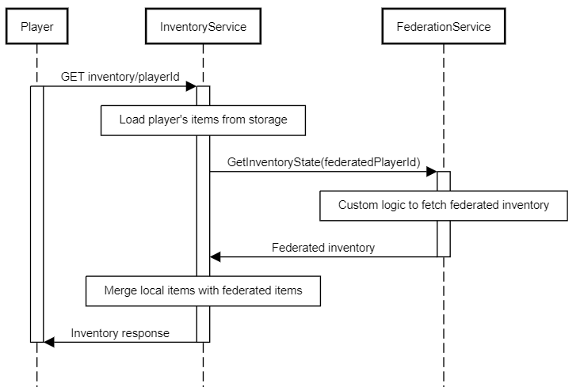
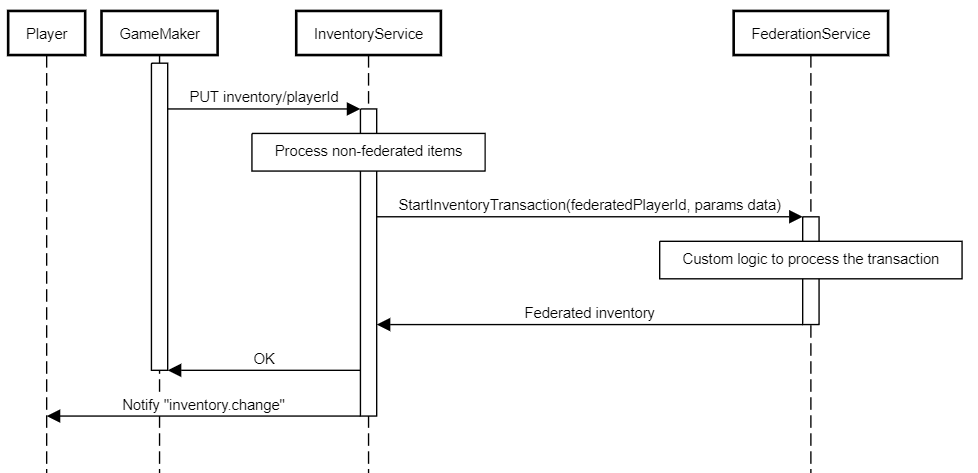
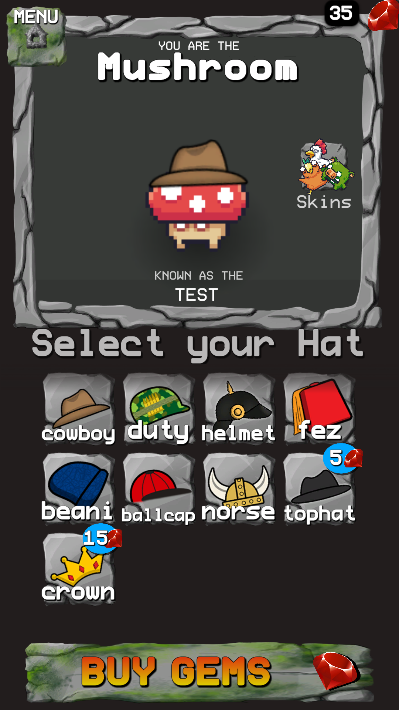

# Inventory - Overview

The Beamable **Inventory** feature allows game makers to manage owned items per player within the game.

Beamable's Inventory system is built on the Content feature. This means that content can be created and published via the [Content Manager](../profile-storage/content/content-unity.md#content-manager-editor), then granted to players through various workflows:

- Add/Remove inventory items to the active player during the course of gameplay. Ex. the player earns a new "Sword" inventory item based on in-game progress
- Add inventory items to the active player via the Beamable [Store](stores-overview.md). Ex. the player pays real-world currency to buy a new "Sword" inventory item

## Data Concepts

The [`InventoryService`](https://csharp.cdocs.beamable.com/latest/classBeamable_1_1Api_1_1Inventory_1_1InventoryService.html#details) manages items owned by the active player. Whereas the [`ContentService`](https://csharp.cdocs.beamable.com/latest/classBeamable_1_1Content_1_1ContentService.html#details) manages all items available in the game, regardless if owned or not. Each **Inventory Item** owned by the active player relates to a specific **Content Item**.




## Portal

Player inventories can be viewed/edited on the Portal. More information can be found in the [Portal - Inventory](https://docs.beamable.com/docs/portal-inventory) guide.

{: style="height:auto;width:500px"}


### Pruning Deprecated Items

Normally inventory item types are meant to be long-lasting, and the corresponding items may be owned by players indefinitely. However, in some styles of game, there are item types that are only meaningful for a limited time period, and it makes sense to remove the content definitions when the relevant time period ends. This can lead to **Deprecated Items**, described below. To prevent deprecated items from building up, you can enable **Inventory Pruning** on your realm.

#### Deprecated Items

When a player owns an item but the content entry defining that item type has been deleted, the item stays in the player's inventory but is considered to be "deprecated". In the Beamable Portal, items' deprecated status will appear in the _Permission_ section of the inventory view.

{: style="height:auto;width:200px"}

Items that are deprecated cannot be used effectively in game code, since the Beamable SDK has no way of knowing what their fields should be. Without the content definition, the SDK cannot determine the schema for those items.

#### Inventory Pruning

When you know that you will be causing items to become deprecated, you can enable Beamable's optional inventory pruning feature. This feature is enabled by a setting in your realm's configuration, and lazily performs pruning logic when a player's inventory is loaded into memory.

To enable inventory pruning, go to the _Operate_ > _Config_ section of the Beamable Portal and add two entries in the "inventory" namespace using the _Add +_ button. The two configuration values to add are `pruneItems` and `deprecatedContentTtlDays`. Item pruning is turned off by default (that is, the default value for `pruneItems` is false), and the default time-to-live (TTL) is 10 days.

{: style="height:auto;width:400px"}

{: style="height:auto;width:400px"}

Note that pruning is "lazy": the criteria for inventory pruning will only be evaluated by Beamable services when the player's inventory is loaded into memory. As such, pruning will _NOT_ occur for players who have not played recently.

## Federated Inventory

Beamable supports custom inventory federation using managed [microservices](../../cloud-services/microservices/microservice-framework.md). You can use this feature to extend the Inventory system with items that are managed externally.

Some use cases:

- Crypto assets - use NFTs as inventory items and auto-mint new items
- Generative AI - add support for granting players AI-generated items

**Requirements:**

- Federated Inventory depends on the implementation of [Federated Identity](../identity/federated-identity.md). That means that every player first needs to have a federated identity with the same microservice that federates inventory.
- Inventory items are content-driven. To enable federation, content items must be marked as federated to a specific microservice.

You can see below the flows when getting and granting the Inventory Items with Federation enabled

{: style="height:auto;width:400px"}


{: style="height:auto;width:400px"}

### `IFederatedInventory<T>` interface

To use the Federated Inventory you should start by implementing the `IFederatedInventory<T>` interface in your microservice. Be aware that this interface also implements `IFederatedLogin<T>` because federated authentication is a prerequisite, as mentioned earlier. `T` must be your implementation of the `IThirdPartyCloudIdentity` - a very simple interface that requires you to define a unique name/namespace for your federation. This enables you to have multiple federation implementations in a single microservice.

```csharp
public class MyFederationIdentity : IThirdPartyCloudIdentity
{
	public string UniqueName => "my-cool-federation";
}

[Microservice("MyFederation")]
public class MyFederationService : Microservice, IFederatedInventory<MyFederationIdentity>
{
    public Promise<FederatedAuthenticationResponse> Authenticate(string token, string challenge, string solution)
    {
        throw new System.NotImplementedException();
    }

    public Promise<FederatedInventoryProxyState> GetInventoryState(string id)
    {
        throw new System.NotImplementedException();
    }

    public Promise<FederatedInventoryProxyState> StartInventoryTransaction(string id, string transaction, Dictionary<string, long> currencies, List<FederatedItemCreateRequest> newItems, List<FederatedItemDeleteRequest> deleteItems, List<FederatedItemUpdateRequest> updateItems)
    {
        throw new System.NotImplementedException();
    }
}
```

### `GetInventoryState` implementation

You can do any custom logic here. For example, you could AI generate some items, load items from a smart contract, use microstorage, or do anything that satisfies your specific requirements.
Here's a dummy example that will return some static items and currency, just to showcase the response structure:

```csharp
public Promise<FederatedInventoryProxyState> GetInventoryState(string id)
{
    return Promise<FederatedInventoryProxyState>.Successful(
        new FederatedInventoryProxyState
        {
            currencies = new Dictionary<string, long>
            {
                { "currency.federated-gold", 1000 },
                { "currency.federated-silver", 5000 }
            },
            items = new Dictionary<string, List<FederatedItemProxy>>
            {
                {
                    "items.avatar", new List<FederatedItemProxy>
                    {
                        new()
                        {
                            proxyId = "externalAvatarId1",
                            properties = new List<ItemProperty>
                            {
                                new()
                                {
                                    name = "level",
                                    value = "20"
                                },
                                new()
                                {
                                    name = "color",
                                    value = "blue"
                                }
                            }
                        },
                        new()
                        {
                            proxyId = "externalAvatarId2",
                            properties = new List<ItemProperty>
                            {
                                new()
                                {
                                    name = "level",
                                    value = "30"
                                },
                                new()
                                {
                                    name = "color",
                                    value = "red"
                                }
                            }
                        }
                    }
                }
            }
        }
    );
}
```

The important thing to emphasize here is the `id` argument. It's the same external account id that you return from the `Authenticate` method. If you want to access the player's id in the Beamable system, you can use `this.Context.UserId`
As an example, you can use the wallet address as an external user identifier when implementing blockchain federation.

### `StartInventoryTransaction` implementation

The Inventory service will forward all the changes against federated currency and items. This method has the same return type as the previous one.

```csharp
public Promise<FederatedInventoryProxyState> StartInventoryTransaction(string id, string transaction, Dictionary<string, long> currencies, List<FederatedItemCreateRequest> newItems, List<FederatedItemDeleteRequest> deleteItems, List<FederatedItemUpdateRequest> updateItems)
{
    await _myFederation.ApplyCurrency(currencies);
    await _myFederation.AddItems(newItems);
    await _myFederation.UpdateItems(updateItems);
    await _myFederation.DeleteItems(deleteItems);
    return await GetInventoryState(id);
}
```

The `transaction` argument is a unique transaction id generated in our Inventory service, and you can use it to guard against multiple submissions.

If your transaction processing is to slow to return a timely response, you can implement the async approach. Process the transaction in the background and just return the current state. Once the transaction finishes processing, you can report back the new state like this:

```csharp
await Requester.Request<CommonResponse>(Method.PUT, $"/object/inventory/{_userContext.UserId}/proxy/state", newState);
```

The Inventory service will notify the game client to refresh the inventory content if there's a diff.

## Samples

If your game allows the user to purchase items from the store in the form of armor or accessories for the character. We can achieve this by creating the items in the [Content Manager](../profile-storage/content/content-unity.md#content-manager-editor), then setting up an in-game [Store](stores-overview.md), and finally allowing the player to access their inventory. There are various APIs available to retrieve the user's Inventory, and the content stored in the inventory supports custom data to suit the specific implementation.

This is demonstrated in Beamable's [HATS Sample](https://docs.beamable.com/docs/multiplayer-hats-overview) project.

{: style="height:auto;width:200px"}

You can also check those other samples:

- [Genamon - a game that uses Generative AI and blockchain with federated authentication and inventory](https://github.com/beamable/genamon-polygon)
- [Polygon/Ethereum authentication and inventory federation](https://github.com/beamable/polygon-example)
- [Solana/Phantom authentication and inventory federation](https://github.com/beamable/solana-example)
