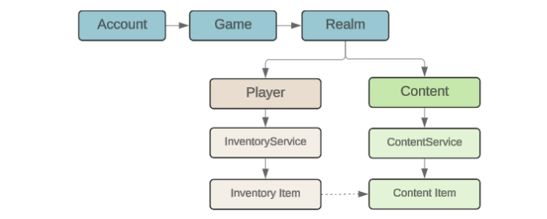
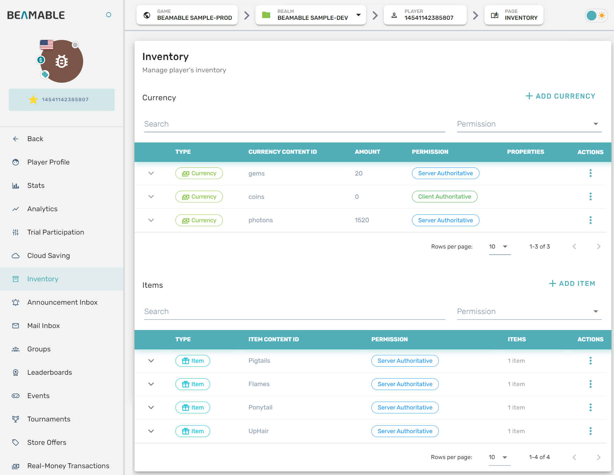
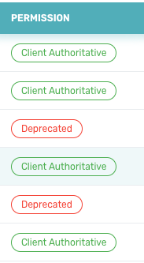
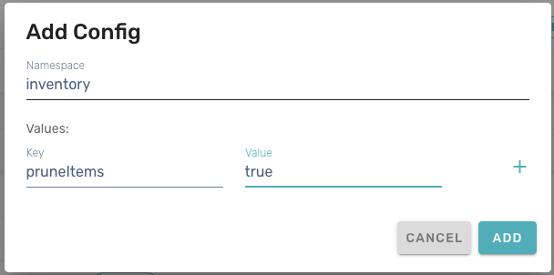
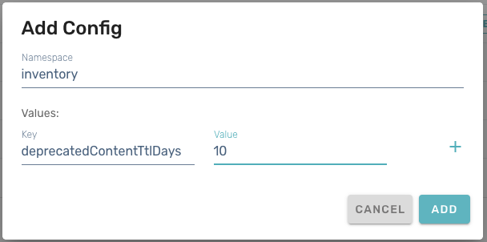
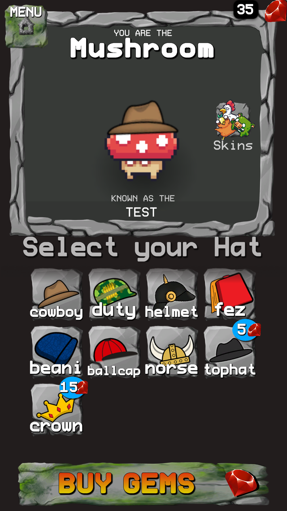

# Inventory overview

The Beamable **Inventory** service allows game makers to manage owned items per player within the game.


Beamable's Inventory system is built on the Content feature. This means you can create and publish content via the [Content Manager](../profile-storage/content/content-unity.md#content-manager-editor), then grant it to players through various workflows:
- Add/Remove inventory items to the active player during gameplay. For Example, the player earns a new "Sword" inventory item based on in-game progress
- Add inventory items to the active player via the Beamable [Store](stores-overview.md). For example, the player pays real money to buy a new "Sword" inventory item

## Data concepts

The [`InventoryService`](https://csharp.cdocs.beamable.com/latest/classBeamable_1_1Api_1_1Inventory_1_1InventoryService.html#details) manages items owned by the active player. Whereas the [`ContentService`](https://csharp.cdocs.beamable.com/latest/classBeamable_1_1Content_1_1ContentService.html#details) manages all items available in the game, regardless if owned or not. Each **Inventory Item** owned by the active player relates to a specific **Content Item**.




## Portal

You can view or edit player inventories on the Portal. More information can be found in the [Portal - Inventory](https://docs.beamable.com/docs/portal-inventory) guide.

{: style="height:auto;width:500px"}

----------------------------------------------------------------------

## Example Code

### Add Item
Give the active player a new Inventory Item.
```csharp
public async Task AddOneItem()
{
  	// acquire a context
  	var ctx = await BeamContext.Default.Instance;
  
    // grant an item
    await ctx.Inventory.Update(builder => builder.AddItem("item.hat"));
}
```

### Get Items
Get a list for the active player of all owned Inventory Items.
```csharp
public async Task GetItems()
{
    // acquire a context
    var ctx = await BeamContext.Default.Instance;
    
    // GetItems() allows a ItemRef to specify which type of items to get
    var items = ctx.Inventory.GetItems(); 
    
    // wait for the items to be updated
    await items.Refresh();
    foreach (var item in items)
    {
      Debug.Log($"item id=[{item.ItemId}] type=[{item.ContentId}]");
    }
}
```

### Subscribe to Inventory Refresh
Subscribe to events that occur on the Inventory. This includes when items are added, removed, or updated.
```csharp
public async void Start()
{
    var ctx = await BeamContext.Default.Instance;
    ctx.Api.InventoryService.Subscribe(InventoryRefreshed);
}

public void InventoryRefreshed(InventoryView inventoryView)
{
    //Act on the received inventory
}
```

### Delete Item
Remove from the active player an Inventory Item.
```csharp
public async Task DeleteOneItem()
{
    var ctx = await BeamContext.Default.Instance;
    var items = ctx.Inventory.GetItems();
    await items.Refresh();
    
    var itemToDelete = items[0];
    await ctx.Inventory.Update(builder => builder.DeleteItem(itemToDelete.ContentId, itemToDelete.ItemId));
}
```

### Delayed Updates
Every time the Update method is called, a network request will be sent to Beamable. In some circumstances this will 
produce too much network traffic. In the Unity SDK, the UpdateDelayed function can be used to batch requests made in 
quick succession.

```csharp

public async Task PerformDelayedUpdates()
{
    var ctx = await BeamContext.Default.Instance;
    
    ctx.Inventory.UpdateDelayed(b => b.CurrencyChange("currency.gems", 3));
    ctx.Inventory.UpdateDelayed(b => b.CurrencyChange("currency.coins", 3));
    ctx.Inventory.UpdateDelayed(b => b.CurrencyChange("currency.dollars", 3));
    
    await ctx.Inventory.WaitForDelayedUpdate();
}
```
### Subscribe
Observe changes (ex. add/remove) for the active player of all owned Inventory Items.

```csharp
private async Task ListenForInventory()
{
    var ctx = await BeamContext.Default.Instance;
    
    var items = ctx.Inventory.GetItems();
    await items.Refresh();
    
    foreach (var item in items)
    {
      item.OnUpdated += () =>
      {
        Debug.Log($"Item updated {item.ItemId}");
      };
    }
    
    items.OnUpdated += () =>
    {
      Debug.Log("Inventory updated");
    };
    
    items.OnElementsAdded += newItems =>
    {
      Debug.Log("Added items");
      foreach (var item in newItems)
      {
        item.OnUpdated += () =>
        {
          Debug.Log($"Item updated {item.ItemId}");
        };
      }
    };
    
    items.OnElementRemoved += removedItems =>
    {
      Debug.Log($"Removed {removedItems.Count()} items");
    };
}
```
----------------------------------------------------------------------

### Pruning deprecated items

Normally inventory item types are meant to be long-lasting, and the corresponding items may be owned by players indefinitely. However, in some styles of game, there are item types that are only meaningful for a limited time, and it makes sense to remove the content definitions when the relevant period ends. This can lead to **Deprecated Items**, described below. To prevent deprecated items from building up, you can enable **Inventory Pruning** on your realm.

#### Deprecated items

When a player owns an item but the content entry defining that item type has been deleted, the item stays in the player's inventory but is considered to be "deprecated". In the Beamable Portal, items' deprecated status will appear in the _Permission_ section of the inventory view.

{: style="height:auto;width:200px"}

Items that are deprecated cannot be used effectively in game code, since the Beamable SDK has no way of knowing what their fields should be. Without the content definition, the SDK cannot determine the schema for those items.

#### Inventory pruning

When you know that you will be causing items to become deprecated, you can enable Beamable's optional inventory pruning feature. This feature is enabled by a setting in your realm's configuration, and lazily performs pruning logic when a player's inventory is loaded into memory.

To enable inventory pruning, go to the _Operate_ > _Config_ section of the Beamable Portal and add two entries in the "inventory" namespace using the _Add +_ button. The two configuration values to add are `pruneItems` and `deprecatedContentTtlDays`. Item pruning is turned off by default (that is, the default value for `pruneItems` is false), and the default time-to-live (TTL) is 10 days.

{: style="height:auto;width:400px"}

{: style="height:auto;width:400px"}

_Note_: Pruning is "lazy": the criteria for inventory pruning will only be evaluated by Beamable services when the player's inventory is loaded into memory. Thus, pruning will _NOT_ occur for players who have not played recently.

## Samples

If your game allows the user to purchase items from the store in the form of armor or accessories for the character. We can achieve this by creating the items in the [Content Manager](../profile-storage/content/content-unity.md#content-manager-editor), then setting up an in-game [Store](stores-overview.md), and finally allowing the player to access their inventory. There are various APIs available to retrieve the user's Inventory, and the content stored in the inventory supports custom data to suit the specific implementation.

This is demonstrated in Beamable's [HATS Sample](https://docs.beamable.com/docs/multiplayer-hats-overview) project.

{: style="height:auto;width:200px"}

You can also check those other samples:

- [Genamon - a game that uses Generative AI and blockchain with federated authentication and inventory](https://github.com/beamable/genamon-polygon)
- [Polygon/Ethereum authentication and inventory federation](https://github.com/beamable/polygon-example)
- [Solana/Phantom authentication and inventory federation](https://github.com/beamable/solana-example)
