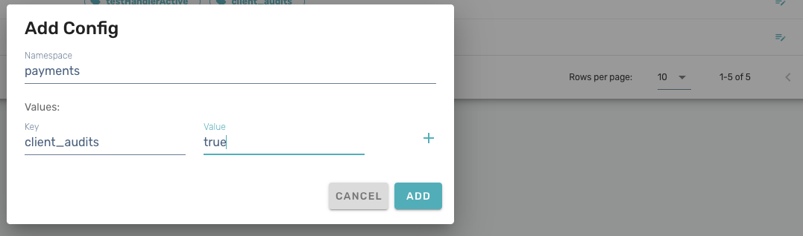
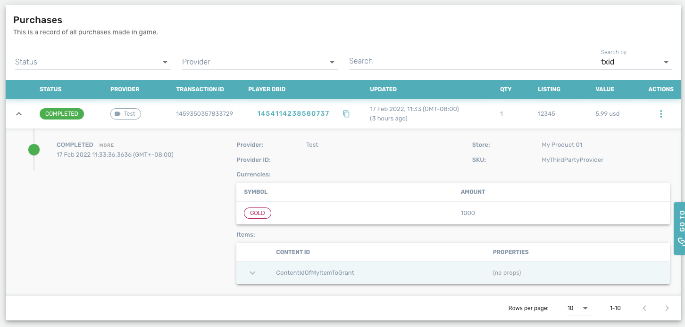
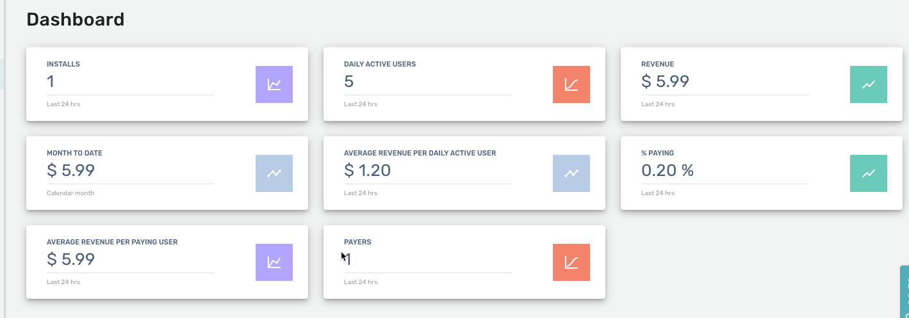

# Stores - Overview

Beamable's Store feature allows the game maker to create a storefront in their application. Users can purchase items with real money or virtual currency. These can be attached to third-party purchasing methods (Apple, Google, etc.), or Unity's built-in IAP system.

The setup for Stores uses the [Content Manager](../profile-storage/content/content-overview.md#content-management), and relies on at least one valid [Virtual Currency](virtual-currency-overview.md), so it is recommended to review those features before implementation.

Beamable supports purchasing using both virtual currency and real money (IAP) to purchase in-game items.

## Stores API

Beamable offers various APIs to allow the game maker to set up purchasing with various configurations. [Virtual Currency](virtual-currency-overview.md) or real money can be used to purchase items, as well as support for Unity IAP or a variety of third-party or custom purchasers.

!!! info "Prerequisites"

    Before items can be purchased be the user, you must set up at least one valid currency, a store item, and store listing.


### Making a Purchase

The function to purchase an item is in the CommerceService. The function call requires a Store ID and an Item ID. For ease of use, it is recommended to create a `StoreRef` and `ListingRef`, which will create a drop-down in the Inspector to select a valid store and item.

StoreTest.cs
```csharp
[SerializeField] private StoreRef storeRef;
[SerializeField] private ListingRef listingRef;

private async Task<bool> MakePurchase()
{
    var success = true;
        
  	//Errors are simply logged to the console here,
 	  //but the user should also be notified in the UI or otherwise.
    await _beamContext.Api.CommerceService.Purchase(storeRef.Id, listingRef.Id)
        .Error((error)=>
        {
            Debug.LogError(error);
            success = false;
        });
        
    return success;
}
```

To validate if the purchase was successful, we can also use the InventoryService to print out the inventory before and after the purchase. See the [Inventory](inventory-overview.md) feature for more details.

StoreTest.cs
```csharp
private async Task PurchaseItem()
{
    await PrintInventory();
    var success = await MakePurchase();
    if (success)
    {
        Debug.Log("Purchase was successful!");
    }
    await PrintInventory();
}

private async Task PrintInventory()
{
    var inventory = await _beamContext.Api.InventoryService.GetCurrent();

    foreach (var kvp in inventory.items)
    {
        var inventoryItemName = $"{kvp.Key} x {kvp.Value.Count}";
        Debug.Log(inventoryItemName);
    }
}
```

### Unity IAP

If you want to leverage Unity IAP, you can use a [Custom Purchase Reporting](stores-overview.md#custom-purchase-reporting) to integrate directly with Unity IAP. Beamable already has a custom purchaser to do this, and all you need to do is register it, like below.

```csharp
[BeamContextSystem]
public class Registrations
{
	[RegisterBeamableDependencies()]
	public static void Register(IDependencyBuilder builder)
	{
		builder.AddSingleton<IBeamablePurchaser, UnityBeamablePurchaser>();
	}
}
```

### Custom Purchaser

The Beamable **Custom Purchaser** feature allows game makers to implement custom purchasing solutions for in-app purchases, bypassing Unity's built-in IAP system for complete control over the payment flow.

Consider implementing a custom purchaser when you need:

- **Third-party payment providers** (Stripe, PayPal, custom billing systems)
- **Platform-specific integrations** not supported by Unity IAP
- **Custom receipt validation** logic
- **Specialized purchase flows** for enterprise or B2B applications
- **Integration with existing payment infrastructure**

**Prerequisites:**

- No dependency on Unity's [UnityIAP](https://docs.unity3d.com/Manual/UnityIAP.html) solution
- Custom receipt validation implementation
- Platform-specific payment provider integration
- Thorough testing across all target platforms

#### Implementation Overview

A custom purchaser implementation involves two main components:

1. **IBeamablePurchaser Implementation** - Handles the purchase flow
2. **PaymentService Integration** - Communicates with Beamable's backend

#### IBeamablePurchaser Interface

Your custom purchaser class **must implement** the [`IBeamablePurchaser`](https://github.com/beamable/BeamableProduct/blob/main/client/Packages/com.beamable/Runtime/Core/Platform/SDK/Payments/IBeamablePurchaser.cs) interface:

| Method Name       | Purpose                                                   | When Called |
| :---------------- | :-------------------------------------------------------- | :---------- |
| Initialize        | Setup your chosen IAP implementation and dependencies     | Once at startup |
| GetLocalizedPrice | Fetch localized price strings from your payment provider  | When displaying prices |
| StartPurchase     | Initiate purchase flow through your payment provider      | When user starts purchase |

#### PaymentService Integration

Your custom purchaser **must interact** with Beamable's [`PaymentService`](https://csharp.cdocs.beamable.com/latest/classBeamable_1_1Api_1_1Payments_1_1PaymentService.html) to ensure proper purchase tracking and fulfillment:

| Method Name      | Purpose                                                   | When to Call |
| :--------------- | :-------------------------------------------------------- | :----------- |
| GetSKUs          | Retrieve available products from Beamable                | During initialization |
| BeginPurchase    | Notify Beamable that a purchase is starting              | Before payment provider call |
| CompletePurchase | Verify receipt and fulfill items after successful payment | After payment confirmed |
| CancelPurchase   | Handle user-cancelled purchases                           | When user cancels |
| FailPurchase     | Handle failed purchase attempts                           | When payment fails |

#### Creating a Custom Purchaser Class
Implement the `IBeamablePurchaser` interface. The following snippet shows the required structure:

```csharp
public class CustomPurchaser : IBeamablePurchaser
{
    private PaymentService _paymentService;
    private YourPaymentProvider _paymentProvider; // Your payment provider SDK
    
    public async Promise<Unit> Initialize(IDependencyProvider provider = null)
    {
        // Initialize your payment provider
        _paymentProvider = new YourPaymentProvider();
        await _paymentProvider.Initialize();
        
        // Get reference to Beamable's payment service
        var context = await BeamContext.Default.Instance;
        _paymentService = context.Api.PaymentService;
        
        return new Unit();
    }
    
    public string GetLocalizedPrice(string skuSymbol)
    {
        // Query your payment provider for localized price
        return _paymentProvider.GetLocalizedPrice(skuSymbol);
    }
    
    public async Promise<CompletedTransaction> StartPurchase(string listingSymbol, string skuSymbol)
    {
        try
        {
            // 1. Notify Beamable that purchase is starting
            await _paymentService.BeginPurchase(listingSymbol);
            
            // 2. Start purchase with your payment provider
            var result = await _paymentProvider.ProcessPayment(skuSymbol);
            
            if (result.Success)
            {
                // 3. Complete purchase with Beamable for fulfillment
                await _paymentService.CompletePurchase(listingSymbol, result.Receipt);
                return new CompletedTransaction { Receipt = result.Receipt };
            }
            else
            {
                // 4. Handle failure
                await _paymentService.FailPurchase(listingSymbol, result.ErrorMessage);
                throw new Exception($"Purchase failed: {result.ErrorMessage}");
            }
        }
        catch (UserCancelledException)
        {
            // Handle user cancellation
            await _paymentService.CancelPurchase(listingSymbol);
            throw;
        }
        catch (Exception ex)
        {
            // Handle other errors
            await _paymentService.FailPurchase(listingSymbol, ex.Message);
            throw;
        }
    }
}
```

#### Registering Custom Purchaser

Register your implementation with Beamable's Dependency Injection system:

```csharp
[BeamContextSystem]
public class Registrations
{
    [RegisterBeamableDependencies()]
    public static void Register(IDependencyBuilder builder)
    {
        builder.AddSingleton<IBeamablePurchaser, CustomPurchaser>();
    }
}
```

### Custom Stores
The Beamable **CommerceService** feature allows game makers to create custom storefronts with flexible purchasing options. 

```csharp
await _beamContext.Api.CommerceService.Purchase(storeSymbol, listingSymbol);
```

There are 3 major parts to the Store setup process. The workflow involves configuring Unity IAP, setting up platform integrations, and creating Beamable content.
The following code examples demonstrate how to implement a custom store experience.

CommerceServiceExample.cs
```csharp
using System.Collections.Generic;
using Beamable.Examples.Shared;
using UnityEngine;
using UnityEngine.Events;
using Beamable.Api.Payments;
using Beamable.Common.Api.Inventory;
using Beamable.Common.Inventory;
using Beamable.Common.Shop;

namespace Beamable.Examples.Services.CommerceService
{
    [System.Serializable]
    public class RefreshedUnityEvent : UnityEvent<CommerceServiceExampleData> { }
    
    /// <summary>
    /// Demonstrates <see cref="CommerceService"/>.
    /// </summary>
    public class CommerceServiceExample : MonoBehaviour
    {
        //  Events  ---------------------------------------
        [HideInInspector]
        public RefreshedUnityEvent OnRefreshed = new RefreshedUnityEvent();
        
        //  Fields  ---------------------------------------
        private const string ItemContentType = "items";
        private const string CurrencyContentType = "currency";
        private const string CurrencyType = "currency.Coin";
        private const string EmptyDisplayName = "[Empty]";
        private const string CurrencyDisplayName = "Coin";
        
        [SerializeField]
        private StoreRef _storeRef = null;
        private StoreContent _storeContent = null;
        private BeamContext _beamContext;
  
        private CommerceServiceExampleData _data = new CommerceServiceExampleData();
    
        //  Unity Methods  --------------------------------
        protected void Start()
        {
            Debug.Log($"Start() Instructions...\n\n" +
                      " * Ensure Computer's Internet Is Active\n" +
                      " * Run The Scene\n" +
                      " * See Onscreen UI Show HasInternet = true\n" +
                      " * Ensure Computer's Internet Is NOT Active\n" +
                      " * See Onscreen UI Show HasInternet = false\n");

            SetupBeamable();
        }
        
        //  Methods  --------------------------------------
        private async void SetupBeamable()
        {
            _beamContext = BeamContext.Default;
            await _beamContext.OnReady;

            Debug.Log($"beamContext.PlayerId = {_beamContext.PlayerId}");

            _storeContent = await _storeRef.Resolve();

            // Observe Changes
            _beamContext.Api.InventoryService.Subscribe(ItemContentType, Inventory_OnChanged);
            _beamContext.Api.InventoryService.Subscribe(CurrencyContentType, Currency_OnChanged);
            _beamContext.Api.CommerceService.Subscribe(_storeContent.Id, CommerceService_OnChanged);
            
            // Update UI Immediately
            Refresh();
        }
        
        public async void Buy()
        {
            if (_data.SelectedItemData == null)
            {
                Debug.LogError($"BuySelectedStoreItem() failed because _selectedItemData = 
                 {_data.SelectedItemData}.");
                return;
            }

            if (!_data.CanAffordSelectedStoreItemData)
            {
                Debug.LogError($"BuySelectedStoreItem() failed because CanAffordSelectedStoreItemData = 
                 {_data.CanAffordSelectedStoreItemData}.");
                return;
            }

            // Buy!
            string storeSymbol = _storeContent.Id;
            string listingSymbol = _data.SelectedItemData.PlayerListingView.symbol;
            await _beamContext.Api.CommerceService.Purchase(storeSymbol, listingSymbol);
            
        }

        public void Refresh()
        {
            string refreshLog = $"Refresh() ..." +
                                $"\n * StoreItemDatas.Count = {_data.StoreItemDatas.Count}\n\n" +
                                $"\n * InventoryItemDatas.Count = {_data.InventoryItemDatas.Count}\n\n" +
                                $"\n * CurrencyAmount.Count = {_data.CurrencyAmount}\n\n";
            
            _data.InstructionLogs.Clear();
            _data.InstructionLogs.Add("Click `Buy` to add 1 item to Inventory");
            _data.InstructionLogs.Add("or Click `Reset` to delete and create a new player");
                               
            //Debug.Log(refreshLog);
            
            // Send relevant data to the UI for rendering
            OnRefreshed?.Invoke(_data);
        }
        
        //  Event Handlers  -------------------------------
        private async void Inventory_OnChanged(InventoryView inventoryView)
        {
            _data.InventoryItemDatas.Clear();
            foreach (KeyValuePair<string, List<ItemView>> kvp in inventoryView.items)
            {
                string itemName = ExampleProjectHelper.GetDisplayNameFromContentId(kvp.Key);
                
                ItemContent itemContent = await 
                    ExampleProjectHelper.GetItemContentById(_beamContext, kvp.Key);

                string title = $"{itemName} x {kvp.Value.Count}";
                ItemData itemData = new ItemData(title, itemContent, null);
                
                _data.InventoryItemDatas.Add(itemData);
            }

            if (_data.InventoryItemDatas.Count == 0)
            {
                // Show "Empty"
                _data.InventoryItemDatas.Add(new ItemData(EmptyDisplayName, null, null));
            }

            Refresh();
        }

        private async void Currency_OnChanged(InventoryView inventoryViewForCurrencies)
        {
            _data.CurrencyAmount = 0;
            _data.CurrencyLogs.Clear();
            foreach (KeyValuePair<string, long> kvp in inventoryViewForCurrencies.currencies)
            {
                if (kvp.Key == CurrencyType)
                {
                    _data.CurrencyAmount = (int)kvp.Value;
                }
                else
                {
                    continue;
                }

                string itemName = ExampleProjectHelper.GetDisplayNameFromContentId(kvp.Key);
                
                CurrencyContent currencyContent = 
                    await ExampleProjectHelper.GetCurrencyContentById(_beamContext, kvp.Key);
                
                _data.CurrencyContent = currencyContent;
                _data.CurrencyLogs.Add($"{itemName} x {kvp.Value}");
            }
            
            Debug.Log("_data.CurrencyAmount: " + _data.CurrencyAmount);
            if (_data.CurrencyLogs.Count == 0)
            {
                _data.CurrencyLogs.Add(EmptyDisplayName);
            }
            
            Refresh();
        }

        private async void CommerceService_OnChanged(PlayerStoreView playerStoreView)
        {
            _data.StoreItemDatas.Clear();

            foreach (PlayerListingView playerListingView in playerStoreView.listings)
            {
                int price = playerListingView.offer.price.amount;   
                string contentId = playerListingView.offer.obtainItems[0].contentId;
                string itemName = ExampleProjectHelper.GetDisplayNameFromContentId(contentId);
                ItemContent itemContent = await ExampleProjectHelper.GetItemContentById(_beamContext, 
                 contentId);

                string title = $"{itemName} ({price} {CurrencyDisplayName})";
                ItemData itemData = new ItemData(title, itemContent, playerListingView);
                _data.StoreItemDatas.Add(itemData);
            }
            
            if (_data.StoreItemDatas.Count == 0)
            {
                // Show "Empty"
                _data.StoreItemDatas.Add(new ItemData(EmptyDisplayName, null, null));
            }
            
            Refresh();
        }
    }
}
```
## Custom Purchase Reporting

As a game maker you will find that in some cases you need to be able to report purchases from outside the Beamable store flow. Beamable provides you with a way to do this through a small configuration change in Portal and some client side tracking code.



As shown in the above example, you will need to set a key in your Realm configuration to override purchase reporting to enable this functionality. Without this configuration change the API will error and not report anything.

Here we are setting the namespace to **payments** and then the key is **client_audits** and we will set the value to **true**.

!!! danger "Security Warning"

    This feature is not secure unless you track this from within a MicroService and validate the purchase. It is highly advisable to do so in order to not allow a customer to spoof or falsely track a purchase.

Once your configuration has been setup to allow this API to function, then you can use the `.Api.PaymentService.Track` API to track the purchase. The various fields of the tracking request may be arbitrary strings of your choice, but for the sake of consistency you may want to match the patterns used by the Beamable Commerce Service.

| Property             | Details                                                                                                                    |
| :------------------- | :------------------------------------------------------------------------------------------------------------------------- |
| purchaseId           | The identifier of the thing that was purchased; usually a `listings`content ID.                                            |
| store                | The store ID through which the purchase was made; usually a `stores` content ID.                                           |
| skuName              | The stock keeping unit (SKU); usually a `skus` content ID.                                                                 |
| skuProductId         | The product ID referenced by the internal SKU; usually a provider-specific ID such as `com.example.mygame.bundle10`.       |
| priceInLocalCurrency | Purchase amount, including decimals. For example 9.99 would represent $9.99 if the currency symbol is USD.                 |
| isoCurrencySymbol    | Currency symbol such as "USD", "EUR", and so on.                                                                           |
| obtainCurrency       | [Optional] Currency changes that were part of this purchase. This does NOT perform the fulfillment; it is merely a record. |
| obtainItem           | [Optional] Item grants that were part of this purchase. This does NOT perform the fulfillment; it is merely a record.      |

Code example:

```csharp
private async Task TrackSomePurchase()
{
    var ctx = await BeamContext.Default.Instance;
    var random = new Random();

    var purchaseId = "listings.ten_bucks_for_some_coins";
    var skuName = "skus.ten_dollar_pack";
    var productId = "com.beamable.example.d10";
    var store = "stores.default";
    var price = 9.99;
    var isoCurrency = "USD";
    var obtainCurrencies = new List<ObtainCurrency>
    {
        new() { amount = random.Next(10), symbol = "currency.coins" }
    };
    var obtainItems = new List<ObtainItem>
    {
        new()
        {
            contentId = "items.diamond_1",
            properties = new List<ItemProperty> { new() { name = "color", value = "blue" } }
        }
    };
    var trackRequest = new TrackPurchaseRequest(
      purchaseId,
      skuName,
      productId,
      store,
      price,
      isoCurrency,
      obtainCurrencies,
      obtainItems
    );
    await ctx.Api.PaymentService.Track(trackRequest);
    Debug.Log("Request tracked.");
}
```

Once you do the above tracking, you can view the results by going to the Portal and clicking on _Real Money Transactions_ under the Monetization section. Within a few minutes at most, the tracking that was posted should appear there and you can view the details of your transactions.

{: style="height:auto;width:500px"}

In addition, the dashboards on the Realm should reflect the purchase as well.

{: style="height:auto;width:500px"}
