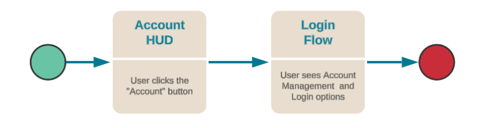

# Apple Sign-In

The purpose of this guide is for game makers to use Apple Sign-In with the Beamable Accounts feature.

Beamable integrates with Apple Sign-In to make it easy for users to sign in to your apps and websites using their Apple ID. Instead of filling out forms, verifying email addresses, and choosing new passwords, they can use Sign in with Apple to set up an account and start using your app right away. All accounts are protected with two-factor authentication for superior security, and Apple will not track users' activity in your app or website.

When set up properly, the user experience in the game project will be as follows:



!!! info "Prerequisites"
    Before Apple Sign-In will work properly, the Unity project must be configured to support Apple as a third-party authentication provider.

    - [Prerequisites](apple-sign-in-guide#prerequisites)
    - [Configure Beamable](apple-sign-in-guide#configure-beamable)
    - [Configure Xcode Project](apple-sign-in-guide#configure-xcode-project)

## Apple Sign-In Integration

The recommended solution for implementing Apple Sign-In is to build a wrapper on top of SignInWithApple, a Unity package that is installed with Beamable.

!!! warning "Preprocessor Directives"
    Since Apple Sign-In is only supported on Apple devices, it is recommended to wrap your core functionality in `#if UNITY_IOS` and a matching `#endif` to prevent compilation on non-iOS devices.

The first step is to initialize a new instance of SignInWithApple:

```csharp
private SignInWithApple signInWithApple;

private void Start()
{
    signInWithApple = new SignInWithApple();
}
```

The next function should be called from a UI button or interface, where the user intends to start the sign-in process. Similar to the other third party login code, we just need to retrieve the token for the user then add a third party credential to a new or existing user.

```csharp
public void StartAppleLogin()
{
    #if UNITY_IOS
    signInWithApple.Login(callbackArgs =>
    {
        if (!string.IsNullOrEmpty(callbackArgs.error))
        {
            //An error happened, notify user
        }
        else
        {
            var token = callbackArgs.userInfo.idToken;
            //We have the token, see below functions
        }
    });
    #else
    // We aren't on an Apple device, so don't do anything
    #endif
}
```

## Handle Various Flow Scenarios

Depending on the state of the currently logged in user, we may need to attach the credentials to the current user, switch to a different user, or create a new one entirely. The following code covers all 3 cases.

```csharp
//Specify the third party auth provider
var thirdParty = AuthThirdParty.Apple;
//Get information about the user's third party credential
var available = await _beamContext.Api.AuthService.IsThirdPartyAvailable(thirdParty, token);
var userHasCredentials = _beamContext.Api.User.HasThirdPartyAssociation(thirdParty);

//Should we switch to a user that's not currently logged in?
var shouldSwitchUsers = !available;
//Should we create a brand new user with these credentials?
var shouldCreateUser = available && userHasCredentials;
//Should we attach the credentials to an existing user?
var shouldAttachToCurrentUser = available && !userHasCredentials;
```

### Should Switch Users

Here we are authenticating the third party (Apple) with Beamable by logging them in using the LoginThirdParty API.

```csharp
if(shouldSwitchUsers)
{
    await _beamContext.Api.AuthService.LoginThirdParty(thirdParty, token, false);
}
```

### Should Create User

Here we create a new user, apply the current token to that user, then register the third party login (Apple) using the RegisterThirdPartyCredentials API. We take the user returned and then update the user data.

```csharp
if(shouldCreateUser)
{
    var tokenResponse = await _beamContext.Api.AuthService.CreateUser();
    _beamContext.Api.ApplyToken(tokenResponse);
  	var user = await _beamContext.Api.AuthService.RegisterThirdPartyCredentials(thirdParty, token);
  	_beamContext.Api.UpdateUserData(user);
}
```

### Should Update Current User

Here we are attaching to the current user with the Apple token. This scenario is essentially "auto-login". The Apple user has already been linked with the current Beamable user and we can safely apply the token.

```csharp
if(shouldAttachToCurrentUser)
{
    var user = await _beamContext.Api.AuthService.RegisterThirdPartyCredentials(thirdParty, token);
    _beamContext.Api.UpdateUserData(user);
}
```
## Apple's App Privacy Questionnaire

Any developer that wants to submit a new application or app update to the Apple App Store is required to submit an application privacy questionnaire specifying which data is collected by their app and the data collected by any SDKs integrated into their app. [More information.](https://developer.apple.com/app-store/app-privacy-details/)

If you are using Beamable, and are attempting to fill out the Apple privacy questionnaire, please refer to the details below that explain what forms of data are collected by the Beamable SDK.

| Contact Info            | Collected? | Used for tracking? | Data linked to the user? | Purpose |
| :---------------------- | :--------- | :----------------- | :----------------------- | :------ |
| Name                    | No         |                    |                          |         |
| Email Address           | No         |                    |                          |         |
| Phone Number            | No         |                    |                          |         |
| Physical Address        | No         |                    |                          |         |
| Other User Contact Info | No         |                    |                          |         |

| Health and Fitness | Collected? | Used for tracking? | Data linked to the user? | Purpose |
| :----------------- | :--------- | :----------------- | :----------------------- | :------ |
| Health             | No         |                    |                          |         |
| Fitness            | No         |                    |                          |         |

| Financial Info       | Collected? | Used for tracking? | Data linked to the user? | Purpose |
| :------------------- | :--------- | :----------------- | :----------------------- | :------ |
| Payment Info         | No         |                    |                          |         |
| Credit Info          | No         |                    |                          |         |
| Other Financial Info | No         |                    |                          |         |

| Location                                                   | Collected? | Used for tracking? | Data linked to the user? | Purpose   |
| :--------------------------------------------------------- | :--------- | :----------------- | :----------------------- | :-------- |
| Precise Location                                           | No         |                    |                          |           |
| Coarse Location (location is inferred based on IP address) | Yes        | No                 | Yes                      | Analytics |

| Sensitive Info | Collected? | Used for tracking? | Data linked to the user? | Purpose |
| :------------- | :--------- | :----------------- | :----------------------- | :------ |
| Sensitive Info | No         |                    |                          |         |

| Contacts | Collected? | Used for tracking? | Data linked to the user? | Purpose |
| :------- | :--------- | :----------------- | :----------------------- | :------ |
| Contacts | No         |                    |                          |         |

| User Content            | Collected? | Used for tracking? | Data linked to the user? | Purpose           |
| :---------------------- | :--------- | :----------------- | :----------------------- | :---------------- |
| Emails or Text Messages | No         |                    |                          |                   |
| Photos or Videos        | No         |                    |                          |                   |
| Audio Data              | No         |                    |                          |                   |
| Gameplay Content        | Yes        | No                 | Yes                      | App Functionality |
| Customer Support        | No         |                    |                          |                   |
| Other User Content      | No         |                    |                          |                   |

| Browsing History | Collected? | Used for tracking? | Data linked to the user? | Purpose |
| :--------------- | :--------- | :----------------- | :----------------------- | :------ |
| Browsing History | No         |                    |                          |         |

| Search History | Collected? | Used for tracking? | Data linked to the user? | Purpose |
| :------------- | :--------- | :----------------- | :----------------------- | :------ |
| Search History | No         |                    |                          |         |

| Identifiers | Collected? | Used for tracking? | Data linked to the user? | Purpose                      |
| :---------- | :--------- | :----------------- | :----------------------- | :--------------------------- |
| User ID     | Yes        | No                 | Yes                      | Analytics, App Functionality |
| Device ID   | Yes        | No                 | Yes                      | Analytics, App Functionality |

| Purchases        | Collected? | Used for tracking? | Data linked to the user? | Purpose                      |
| :--------------- | :--------- | :----------------- | :----------------------- | :--------------------------- |
| Purchase History | Yes        | No                 | Yes                      | Analytics, App Functionality |

| Usage Data                                                                | Collected? | Used for tracking? | Data linked to the user? | Purpose                      |
| :------------------------------------------------------------------------ | :--------- | :----------------- | :----------------------- | :--------------------------- |
| Product Interaction (only if mediation partners actively share such data) | Yes        | No                 | Yes                      | Analytics, App Functionality |
| Advertising Data                                                          | No         |                    |                          |                              |
| Other Usage Data                                                          | No         |                    |                          |                              |

| Diagnostics           | Collected? | Used for tracking? | Data linked to the user? | Purpose   |
| :-------------------- | :--------- | :----------------- | :----------------------- | :-------- |
| Crash Data            | No         |                    |                          |           |
| Performance Data      | Yes        | No                 | Yes                      | Analytics |
| Other Diagnostic Data | No         |                    |                          |           |

| Other Data       | Collected? | Used for tracking? | Data linked to the user? | Purpose |
| :--------------- | :--------- | :----------------- | :----------------------- | :------ |
| Other Data Types | No         |                    |                          |         |
