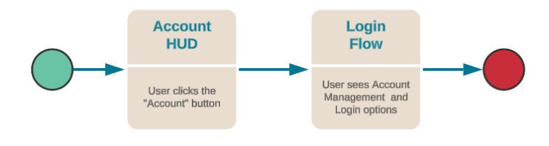

# Google Play Game Services Sign-In

The purpose of this guide is for game makers to use Google Play Games Services with the Beamable Accounts feature.

Beamable integrates with Google Play Games Services to make it easy for users to sign in to your apps using their ID. Instead of filling out forms, verifying email addresses, and choosing new passwords, they can use a simple sign-in method to set up an account and start using your app right away. It makes it easy to use Beamable across different devices using one credential. A user always has the option to revoke access to an application at any time.

This document describes how to complete a basic Google Play Games Services integration. When set up properly, the user experience in the game project will be as follows:

{: style="height:auto;width:500px"}

!!! info "Prerequisites"
    Before Google Sign-In will work properly, the Unity project must be configured to support GPGS as a third-party authentication provider. Make sure that GPGS is working correctly and the user can login to GPGS in-game before using it as third-party provider.
    
    - [Prerequisites](google-play-game-services-sign-in-guide#prerequisites)
    - [Configure Unity Project](google-play-game-services-sign-in-guide#configure-unity-project)

## Google Play Game Services Integration

The Beamable SDK contains a wrapper for GPGS behavior on Android (iOS is not supported). The provided class is called SignInWithGPG, which can be initialized after following steps from [Google documentation](https://developers.google.com/games/services/console/enabling). It does contain two Actions that developer can subscribe to: `OnLoginResult` and `OnRequestServerSideAccessResult`. In order to perform login as third party to Beamable both of them must return successfully—first returns info about local login, second one about getting server side access token that is required for Beamable backend.

```csharp
SignInWithGPG _gpg;

/// <summary>
/// Starts Google Login process, then calls `HandleLoginResult` and/or `HandleRequestServerSideAccessResult` with a results.
/// </summary>
public void StartLogin()
{
	_gpg = new SignInWithGPG();
	_gpg.OnLoginResult += HandleLoginResult;
	_gpg.OnRequestServerSideAccessResult += HandleRequestServerSideAccessResult;
	_gpg.Login();
}
```

After the Login process is started, the callback functions (`HandleLoginResult` and `HandleRequestServerSideAccessResult`) will be invoked with results:

```csharp
/// <summary>
/// Callback to be invoked with information about if local login did succeed.
/// </summary>
/// <param name="success">returns bool value that informs about local login success</param>
private void HandleLoginResult(bool success)
{
	if(!success)
	{
        //Login failed or was cancelled
	}
}

private void HandleRequestServerSideAccessResult(bool success, string token)
{
	if(!success)
	{
        // Cannot get server token from GPGS, please check if your configuration is correct.
	}
	else
	{
		//Login successful, see additional functions below
	}
}
```

## Handle Various Flow Scenarios

Now that we have the Google credential (token), we need to account for 3 different scenarios:

- New Player
- Returning Player already linked to Google
- Returning Player linking their account with Google

We can account for this by determining if we need to:

- Switch Player - Player wants to switch credentials to a new Player
- Create New Player - Player wants to Create a new Player account
- Attach To Current Player - Player wants to Attach this 3rd Party Login to an already authenticated Player.

!!! info "Beamable SDK Initialization"
    The following assumes that you have initialized the Beamable SDK and it is stored in _beamContext variable.
    
    ```csharp
    _beamContext = BeamContext.Default;
    await _beamContext.OnReady;
    ```

The following code will establish conditions for various flow scenarios.

```csharp
//Specify the third party auth provider
var thirdParty = AuthThirdParty.GoogleGamesServices;
//Get information about the user's third party credential
var available = await _beamContext.Api.AuthService.IsThirdPartyAvailable(thirdParty, token);
var userHasCredentials = _beamContext.Api.User.HasThirdPartyAssociation(thirdParty);

//Should we switch to a user that's not currently logged in?
var shouldSwitchUsers = !available;
//Should we create a brand new user with these credentials?
var shouldCreateUser = available && userHasCredentials;
//Should we attach the credentials to an existing user?
var shouldAttachToCurrentUser = available && !userHasCredentials;
```
