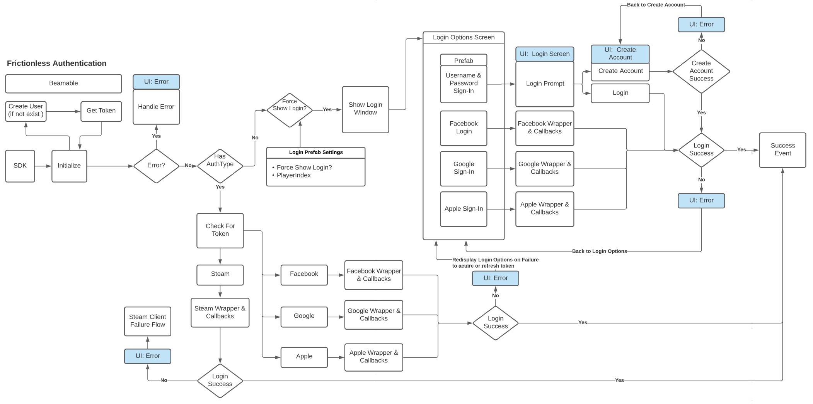

# Identity Overview

Beamable provides a robust identity solution that integrates with 3rd party solutions. This set of features gives you ultimate flexibility about how to authenticate users into your game. Beamable knows that authentication varies from game to game. This is exactly why we provide you with multiple authentication features to suit your needs. 

Authentication is often tricky and has more edge cases than one normally thinks about, you have to factor in what happens when errors occur and how to handle those errors. Below is a diagram of authentication flow that exposes how you can potentially handle these types of scenarios.

**Find the authentication type that best suits your game below and learn how easy it is to integrate into your game.**

{: style="height:auto;width:600px"}

## Login Functions

The aspects at the core of Identity in Beamable are the RecoverAccount functions, often referred to as Login functions. These are used throughout all of the various sign-in methods. `RecoverAccountWithEmail()` is used for email and password verification, and `RecoverAccountWithThirdParty()` is used for third-party authentication providers.

!!! info "Beamable API Access"
    The AuthService can be accessed via BeamContext. For more information on how to access services, see the documentation on the [Player-Centric API](doc:beamable-player-centric-api).

```csharp
BeamContext.Default.Accounts.RecoverAccountWithEmail(email, password)
BeamContext.Default.Accounts.RecoverAccountWithThirdParty(thirdParty, accessToken)
```

Both of these methods work similarly, returning a `PlayerRecoveryOperation`. The `PlayerRecoveryOperation` structure can be used to inspect the account that the user is trying to recover if the correct credentials were supplied. If incorrect credentials were given, the `PlayerRecoveryOperation` will contain an `error`, and its `isSuccess` field will be false. 

However, assuming that the credentials are correct, then the `PlayerRecoveryOperation.SwitchToAccount()` function can be invoked to save the account's access token to the user's device. The next time the user starts the app, the game can check if a token exists for that user, and skip the manual sign-in process (performing a "silent" login).

More info on the various uses for `Login` can be found on the individual sign in method pages.

## Features

| Feature                                                          | Details                                                                                                                                                                                                                                                                                                                                                                                                                             |
| :--------------------------------------------------------------- | :---------------------------------------------------------------------------------------------------------------------------------------------------------------------------------------------------------------------------------------------------------------------------------------------------------------------------------------------------------------------------------------------------------------------------------- |
| [Frictionless Authentication](frictionless-authentication/frictionless-feature-overview.md)    | Frictionless authentication is by far the easiest to implement in your game. However, it is very device specific and thus should not be the only method used if you are going to want cross-platform support.                                                                                                                                                                                                                       |
| [Username / Password](username-password/username-password-feature-overview.md)                      | Authenticate with a Beamable Username & Password. This method allows users to also create cross platform authentication without integrating social features of other platforms.                                                                                                                                                                                                                                                     |
| [Facebook Authentication](facebook-sign-in/facebook-sign-in-feature-overview.md)                   | Provide cross platform support in your game by enabling Facebook integration. Here you will find all the info you need to do an integration between Beamable & Facebook for authentication.                                                                                                                                                                                                                                         |
| [Google Sign-In](google-sign-in/google-sign-in-feature-overview.md)                              | Google's Sign-In manages the OAuth 2.0 flow and token lifecycle, simplifying your integration with Google APIs. A user always has the option to revoke access to an application at any time.                                                                                                                                                                                                                                        |
| [Apple Sign-In](apple-sign-in/apple-sign-in-feature-overview.md)                                | Apple's Sign-In makes it easy for users to sign in to your apps and websites using their Apple ID. Instead of filling out forms, verifying email addresses, and choosing new passwords, they can use Sign in with Apple to set up an account and start using your app right away. All accounts are protected with two-factor authentication for superior security, and Apple will not track users’ activity in your app or website. |
| [Steam Integration](steam-integration/steam-integration-feature-overview.md)                        | Valve's Steamworks is a set of tools and services that help game developers and publishers build their games and get the most out of distributing on Steam. This integration allows you to seamlessly integrate Steam Authentication with Beamable.                                                                                                                                                                                 |
