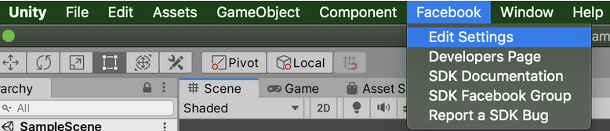
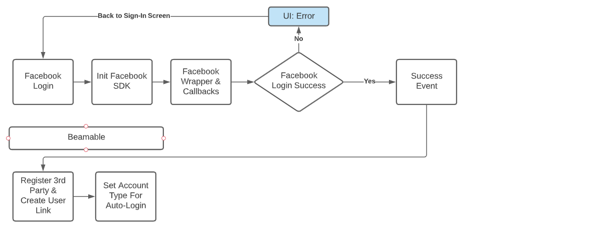

# Facebook Sign-In - Overview

Providing Facebook sign-in is a great, and very common, way to provide cross-platform identity support to your game. Facebook also provides a number of social features that are supported by Beamable and that will help you connect players together and create communities for your game(s).

{: style="height:auto;width:500px"}

Below is a typical Facebook usage pattern. You initiate from your UI that you want to use Facebook to sign-in and then listen for the callbacks from the Facebook SDK. Once the player account has successfully logged into Facebook, then you can use Beamable to link to an existing account or create a new one.

{: style="height:auto;width:500px"}

## Facebook Sign-In

You can use Facebook Sign-In without the prefab Account Management Flow as well. Below are the integration steps that will allow you to implement Facebook Sign-In & Beamable via Code.


While the guide describes a solid implementation of using the Facebook Sign-In feature, this section will describe several API pieces for you to implement your own wrapper.

## Facebook Login & Callbacks

Ultimately you will have to implement the Facebook SDK and listen for the callback with the Login Result. The callback is triggered by the _FB.LogInWithReadPermissions()_ API call.

```csharp
var perms = new List<string>(){"public_profile", "email"};
FB.LogInWithReadPermissions(perms, result => FB_AuthCallback(result));
```

In this example, we are forwarding the result into our own method. In this method you should check for errors from Facebook. In addition, you would check to ensure that login was successful.

```csharp
private void FB_AuthCallback (ILoginResult result) 
{
	if(!string.IsNullOrEmpty(result.Error)){
  	 //There was an error to handle
     return;
	}
  
  if(FB.IsLoggedIn){
		//User is logged into facebook successfully.
    
    // AccessToken class will have session details
    var aToken = Facebook.Unity.AccessToken.CurrentAccessToken;
    
    return;
	}
}
```

## Beamable Login with AccessToken

!!! info "Beamable SDK Initialization"
    The following assumes that you have initialized the Beamable SDK and it is stored in _beamContext variable.
    ```csharp
        _beamContext = BeamContext.Default;
        await _beamContext.OnReady;
    ```

We've passed in an additional helper object that will automate the Beamable login flow process. However, now we will expose what is "under the hood" of that helper.

### Getting the access token string

```csharp
// AccessToken class will have session details
var aToken = Facebook.Unity.AccessToken.CurrentAccessToken;
var tokenString = aToken.TokenString;
```

You will want a reference to the actual TokenString to pass to the Beamable 3rd Party Login Service.

### IsThirdPartyAvailable

With the access token, we need to check if this third party provider is available to the logged in user. It will return a boolean.

```csharp
var thirdParty = AuthThirdParty.Facebook;
var available = _beamContext.Api.AuthService.IsThirdPartyAvailable(thirdParty, tokenString);
```

## Handle Various Flow Scenarios

Now that we have the Facebook token, we need to account for 3 different scenarios:

- Switch Player - Player wants to switch credentials to a new Player
- Create New Player - Player wants to Create a new Player account
- Attach To Current Player - Player wants to Attach this 3rd Party Login to an already authenticated Player.

```csharp
//Specify the third party auth provider
var thirdParty = AuthThirdParty.Facebook;
//Get information about the user's third party credential
var available = await _beamContext.Api.AuthService.IsThirdPartyAvailable(thirdParty, token);
var userHasCredentials = _beamContext.Api.User.HasThirdPartyAssociation(thirdParty);

//Should we switch to a user that's not currently logged in?
var shouldSwitchUsers = !available;
//Should we create a brand new user with these credentials?
var shouldCreateUser = available && userHasCredentials;
//Should we attach the credentials to an existing user?
var shouldAttachToCurrentUser = available && !userHasCredentials;
```

## Facebook's Data Protection Assessment

If you implement Facebook sign-in, you might be asked to submit an annual Data Protection Assessment through your Facebook Developer account. The following answers can be used if you have implemented Facebook authentication through Beamable.

!!! warning "By Default, Beamable Does Not Store Facebook Platform Data"

    If you are using Facebook auth through Beamable, no Facebook Platform Data is stored of any kind (email, password, graph data, etc). The Beamable authentication flow retrieves a revokable, transient auth token. Should the game developer choose to call and store other data, that is outside the standard implementation and the answers to these questions would be invalid.

    If the game developer chooses to call and store Facebook Platform Data, you do so at your own risk.

## Answers to the Data Protection Assessment

If you have implemented a default Facebook authentication flow using Beamable, you can answer the Data Protection Assessment using the following answers:

### Data Use

| Question | Answer |
|----------|--------|
| Does the application use Platform data to disadvantage certain people | NO |
| Does the application use Platform data to make decisions about housing/employment, etc. | NO |
| Does the application use Platform data for surveillance (law or national security) | NO |
| How does your software use Platform Data? | Beamable Sign-In transmits the user's access token to backend services via HTTP request secured by industry standard SSL/TLS, in order to associate a Beamable account with a Facebook/Meta account. The token only exists in memory for the duration of the request and is never stored. The platform-specific account id is stored in order to resolve the player account in the future in case they reinstall the app, or login from a different device |

### Data Sharing

| Question | Answer |
|----------|--------|
| Do you share platform data you receive through this app for any reasons | CHECK "I am not sharing platform data that is received through this app." |

### Data Deletion

| Question | Answer |
|----------|--------|
| Would you delete Platform Data in ALL the following circumstances | YES |
| Do you take steps to delete platform data as soon as reasonably possible | YES |
| How do you determine when Platform Data is no longer necessary to provide an app experience or service to users? | We only store platform data that is strictly required to deliver feature functionality, and then only upon player opt-in. For instance, a player may opt-into (but is not required to) using Facebook or another social login mechanism to access their player account across devices. In such cases, we may need to store the platform-specific account id in order to locate the player account upon login. A player may either, in a self-service manner, remove this login mechanism or request that the developer do this for them. In such a case, we determine that Platform Data is no longer necessary when the player expresses as much, or the feature is deprecated. |
| How can users request their data to be deleted? | Users can contact the developer or Beamable via email, expressing that their data be deleted. Upon receipt of such a request, and verification that the player does indeed own the account, deletion of platform data is a one-click operation via the administrative web portal of the developer. |

### Data Security

| Question | Answer |
|----------|--------|
| Meta requires that you maintain administrative, physical, and technical safeguards that are designed to prevent any unauthorized access, etc. | CHECK "I Understand" |
| To answer the following questions, you will need to comprehensively understand how Meta Platform Data related to this app is transmitted, stored, and processed in your software and systems. | CHECK "I Understand" |
| Do you have a security certification that meets these criteria (The certification type must be SOC 2, ISO 27001, ISO 27018, or an equivalent) | NO |
| Do you store any Meta Platform Data? | CHECK "No, we do not store any Platform Data in either of the cases listed above" |
| Do you transmit Meta Platform Data over the internet | NO |
| Do you test your app and systems for vulnerabilities and security issues at least every 12 months | YES |
| Are Meta API access tokens and app secrets protected? | YES |
| Do you test the systems and processes you would use to response to a security incident every 12 months | YES |
| Do you require multi-factor authentication for remote access to every account that can connect to your cloud or server environment | YES |
| Do you have a system for maintaining accounts | YES |
| Do you have a system for keeping system code and environments updated | YES |
| Do you have a system in place for logging access to Platform Data and tracing where Platform Data was sent and stored? | YES |
| Do you monitor transfers of Platform Data and key points where Platform Data can leave the system (e.g., third parties, public endpoints)? | YES |
| Do you have an automated system for monitoring logs and other security events, and to generate alerts for abnormal or security-related events? | YES |
| Do you have a publicly available way for people to report security vulnerabilities in this app to you? | YES |
| How do you prevent Platform Data from being stored on an organizational or personal device? | All platform data is encrypted in transit and at rest, with the database hosting the data only accessible to the relevant application services. This data is not stored on device, and is only accessible to authorized personnel for the purposes of servicing a customer support request. |

### Questions?

If you have questions about these answers or filling our the Data Protection Survey, please email [support@beamable.com](mailto:support@beamable.com).