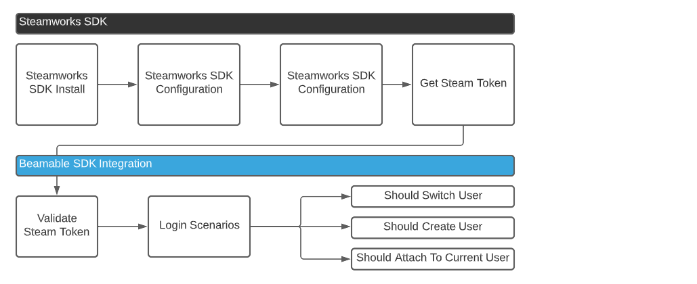
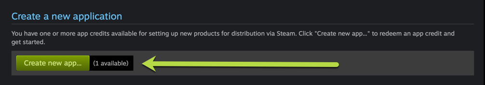
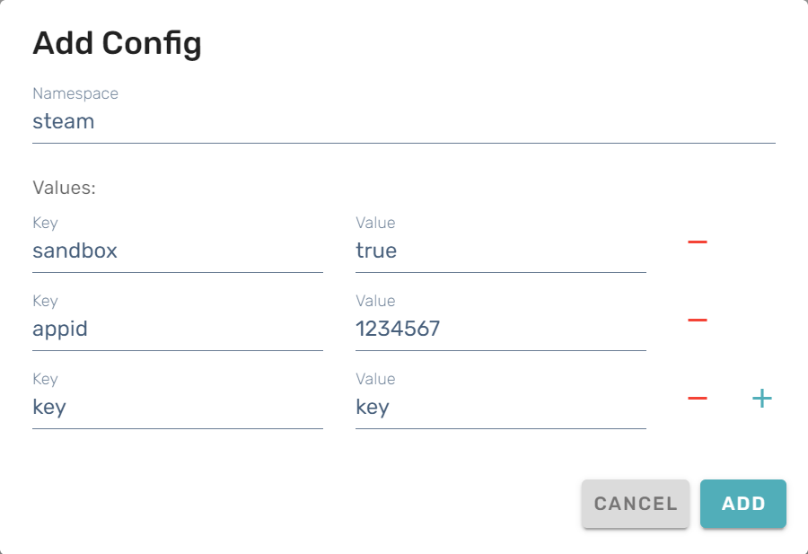

# Steam Sign-In

In order to integrate Steam into any game you have to use the Steamworks SDK and the Steamworks API. This section will show you how to properly integrate the Steamworks SDK into a Unity Game. However, the implementations of Steamworks are relatively the same across various languages.


!!! info "Install the Steamworks.NET SDK into your project."
    The Steamworks.NET SDK is a wrapper around the Steamworks SDK provided from Steam (Valve). You'll need to download the [Latest SDK](https://github.com/rlabrecque/Steamworks.NET/releases/latest) and install it into your project. Thankfully, it's only a Unity package and you can just import it into Unity like any other package.

In this guide, you will learn the key components to integrating Steam and Beamable.

## Authentication

Primarily we use the Steamworks SDK to acquire the Steam Token for Authentication. This same token is also used for purchases through steam. For Authentication as shown below, we use the token to validate it with Beamable, and once that has been accomplished we use the token result to then Login, Create or Attach the User in Steam to Beamable.



## Steam AppID Setup

You'll need an AppID, which you can acquire from Steam. If you do not have one, you will need to create a new app in the [Steam Partner Portal](https://partner.steamgames.com). Once you've created your app, you can find its AppID, which will be a numeric value after the name of your Steam app.

`Example: MyAppName (1234567)`



You then need to place this AppID in a file that was installed in the root of your project folder. This file is called **steam_appid.txt**. The root of your project is located in the folder above your _Assets_ folder. It should look like the following, with only the AppID present in the file steam_appid.txt: `1234567`

## Setup In Portal

There are some additional steps in order to configure Beamable for Steam Integration. You'll need to register your Web API key and AppID in the Beamable portal at <https://portal.beamable.com/>

Once you have done this, you can verify that the Steamworks SDK is working by creating any MonoBehaviour and outputting the Steam User ID to the console.

Log in to [Steam Partner Portal] and use the dropdown option to Manage Groups. In your main group, you will need to create a Web API Key if you have not created one yet. It will be located as an option in the right-hand side bar. If you have already created one, then it will be displayed in the side bar as well.


Follow these steps in the Beamable Portal:

| Step | Action |
|------|--------|
| 1 | Log in to Beamable Portal |
| 2 | Navigate to the _Realm Configuration_ page |
| 3 | Create a new Key in the configuration by clicking on +Config and name it "steam" (all lower-case) in the namespace field |
| 4 | Create 3 KVP values: **sandbox**, **appid**, **key** |
| 5 | Enter "true" for the **sandbox** value |
| 6 | Use your Steam AppID for the **appid** value |
| 7 | Enter your WebAPI key for the **key** value |



While the above steps are not needed to test that the Steamworks SDK is working, they are critical in order for the Beamable Steam integration to work properly. Note that you will also need to have a GameObject with the SteamManager script (from the [Steamworks.NET Example repository](https://github.com/rlabrecque/Steamworks.NET-Example/blob/master/Assets/Scripts/Steamworks.NET/SteamManager.cs)) attached.

```csharp
void Start(){
	var steamUserID = SteamUser.GetSteamID().ToString();
	Debug.Log($"SteamUserID: {steamUserID}");
}
```

You should see that your Steam ID is printed to the console.

!!! info "Using Steamworks"
    Be sure to include the Steamworks.NET SDK in the files you are working with.  
    `using Steamworks;`

## Getting Steam Session Ticket

You'll need to acquire a Steam Session Ticket to validate. In the example below, we are using the `SteamUser.GetAuthSessionTicket()` function of the Steamworks SDK to accomplish this. You can copy and paste the following into your code as-is to get your Steam Session Ticket:

```csharp
/// <summary>
/// Get the Auth ticket for the current Steam User
/// </summary>
/// <param name="hAuthTicket"></param>
/// <returns>an string auth ticket provided from steam</returns>
private Promise<string> GetSteamAuthTicket()
{
    var promise = new Promise<string>();
    var steamAuthTicketBuffer = new byte[1024];
    uint steamAuthTicketBufferSize = 1024;

    Callback<GetAuthSessionTicketResponse_t>.Create(_ =>
    {
        var usedBytes = new List<byte>(steamAuthTicketBuffer).GetRange(0, (int) steamAuthTicketBufferSize).ToArray();
        var ticket = BitConverter.ToString(usedBytes).Replace("-", string.Empty);
        promise.CompleteSuccess(ticket);
    });

    SteamUser.GetAuthSessionTicket(steamAuthTicketBuffer, (int) steamAuthTicketBufferSize, out steamAuthTicketBufferSize);

    return promise;
}
```

You can then call this promise as an async/await task:

```csharp
var ticket = await GetSteamAuthTicket();
```

## Using the Steam Auth Session Ticket with Beamable

One next step you can take is to validate the Session Ticket with Beamable. Beamable will return whether that ticket is valid or not. You can use the function below as-is:

```csharp
/// <summary>
/// Validate a Steam ticket with the Beamable service
/// </summary>
/// <param name="ticket"></param>
/// <returns>True if Valid, False if error or failed validation</returns>
private Promise<bool> BeamableValidateSteamTicket(string ticket)
{
    var promise = new Promise<bool>();
    
    _beamContext.Requester.Request<Beamable.Common.Api.EmptyResponse>(
        Beamable.Common.Api.Method.POST,
        $"/basic/payments/steam/auth",
        new SteamTicketRequest(ticket))
    .Then(f =>
    {
        promise.CompleteSuccess(true);
    })
    .Error(ex=>{
        Debug.LogError(ex);
        promise.CompleteSuccess(false);
    });
    
    return promise;
}
```

You can call this promise using async/await:

```csharp
var isSteamTicketValid = await BeamableValidateSteamTicket(ticket);
```

## Login to Beamable with 3rd Party (Steam)

Much like our other 3rd Party authentication methods, you will use the three main functions in the Beamable SDK: `LoginThirdParty`, `RegisterThirdPartyCredentials`, `CreateUser`.

To use these services, you must convert the Steam Auth Ticket to the proper format in order for Beamable to recognize it.

```csharp
var request = new AuthenticateUserRequest(SteamUser.GetSteamID().ToString(), ticket);
var steamRequest = JsonUtility.ToJson(request);
var encodedRequest = Encoding.UTF8.GetBytes(steamRequest);
var token = Convert.ToBase64String(encodedRequest);
```

In the following sections, you will see that we use the above code to convert the ticket to a Beamable token.

## Handle Various Flow Scenarios

Now that we have the Steam Session Token, we need to account for 3 different scenarios:

New Player  
Returning Player already linked to Steam  
Returning Player linking their account with Steam

We can tell which of these scenarios to follow by checking two pieces of information: whether the Steam ID is already attached to a Beamable account and whether the current, local account has a Steam 3rd party association.

- If the Steam ID is already associated with a Beamable account, the game should log into that account (which may or may not be the current Beamable account).
- Otherwise, if the Steam ID has never been used with Beamable before, there are two possibilities:
    - If the local account has a Steam association, then the current Steam ID must be different and thus a new Beamable account should be made.
    - If the local account has no Steam association, this must be their first time logging in with Steam; the Steam ID should be associated with the current Beamable account.

```csharp
/// <summary>
/// Initiate Steam sign-in, making appropriate account changes as needed
/// depending on whether the Beamable account or the Steam account already
/// have associations.
/// </summary>
/// <param name="steamId">The player's Steam ID as a string.</param>
/// <param name="ticket">Steam authentication session ticket.</param>
private async Promise SignInWithSteam(string steamId, string ticket)
{
	var beamable = BeamContext.Default;
	await beamable.OnReady;

	var request = new AuthenticateUserRequest(steamId, ticket);
	var jsonRequest = JsonUtility.ToJson(request);
	var encodedRequest = Encoding.UTF8.GetBytes(jsonRequest);
	var token = Convert.ToBase64String(encodedRequest);

	var available = await beamable.Api.AuthService.IsThirdPartyAvailable(AuthThirdParty.Steam, token);
	if (available)
	{
		var hasSteam = beamable.Api.User.HasThirdPartyAssociation(AuthThirdParty.Steam);
		if (hasSteam)
		{
			await CreateNewBeamableUser();
		}

		await RegisterSteamToCurrentUser(token);
	}
	else
	{
		await LoginUsingSteam(token);
	}
}
```

Below you will find the three helper functions: `LoginUsingSteam`, `CreateNewBeamableUser`, and `RegisterSteamToCurrentUser`

```csharp
/// <summary>
/// Log into an existing Beamable account using Steam credentials. It may be
/// the case that that is the same account as the current account, in which
/// case the player ID will stay the same. Otherwise, it will switch to the
/// Beamable account associated with the Steam credentials.
/// </summary>
/// <param name="token">Steam authentication request token.</param>
private static async Task LoginUsingSteam(string token)
{
	var beamable = BeamContext.Default;
	var tokenResponse = await beamable.Api.AuthService.LoginThirdParty(
		AuthThirdParty.Steam,
		token,
		includeAuthHeader: false
	);
	await beamable.Api.ApplyToken(tokenResponse);
}
```

```csharp
/// <summary>
/// Create a new Beamable user and immediately make that user the current user.
/// </summary>
private static async Task CreateNewBeamableUser()
{
	var beamable = BeamContext.Default;
	var tokenResponse = await beamable.Api.AuthService.CreateUser();
	await beamable.Api.ApplyToken(tokenResponse);
}
```

```csharp
/// <summary>
/// Register Steam credentials to the current Beamable user.
/// </summary>
/// <param name="token">Steam authentication request token.</param>
private static async Task RegisterSteamToCurrentUser(string token)
{
	var beamable = BeamContext.Default;
	var user = await beamable.Api.AuthService.RegisterThirdPartyCredentials(
		AuthThirdParty.Steam,
		token
	);
	if (user.id != beamable.PlayerId)
	{
		beamable.Api.UpdateUserData(user);
	}
}
```

## Putting it all together

In the Start method of your MonoBehaviour, you can do something like the following:

```csharp
async void Start()
{
    _beamContext = BeamContext.Default;
    await _beamContext.OnReady;
    Debug.Log($"Beamable User ID: {_beamContext.PlayerId}");
    if (!SteamManager.Initialized)
    {
      Debug.Log("SteamManager not initialized.");
      // This may happen if the player is not logged into Steam on their machine.
      return;
    }
    var steamUserID = SteamUser.GetSteamID().ToString();
    Debug.Log($"SteamUserID:{steamUserID}");
    
    var ticket = await GetSteamAuthTicket();
    Debug.Log($"Current Steam Ticket: {ticket}");

    await SignInWithSteam(steamUserID, ticket);
}
```
## Purchasing & Payments

Beamable also has integrated Purchasing and Payments with Steam. You can issue a request to purchase an item and then pay for that item on the Steam platform. Once the purchase has completed the content is granted to the player from Beamable.
